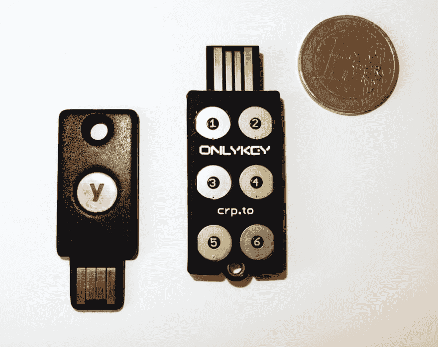
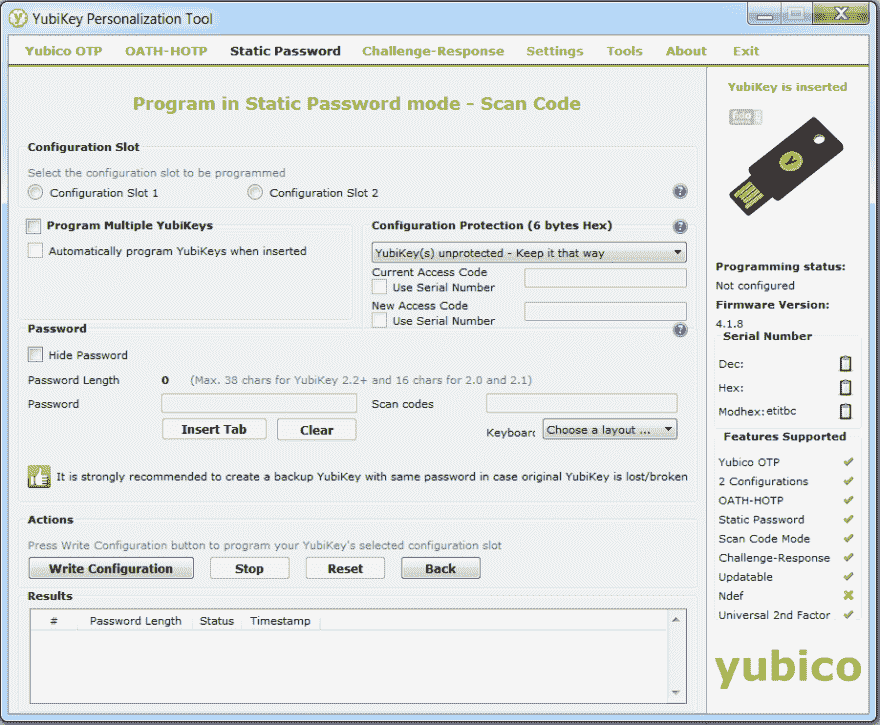
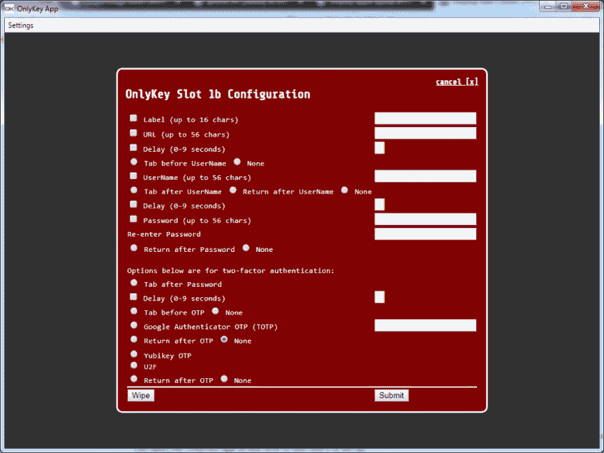

# 密码保存设备。YubiKey 与 OnlyKey 的比较

> 原文：<https://dev.to/targeted/password-keeping-devices-comparison-of-yubikey-vs-onlykey-4gpi>

密码有几个问题。

首先，我们需要他们坚强。大约 12 个随机字符或更多。无论你使用密码管理器，信任一家小公司将你所有的密码存储在云中，还是信任一家大公司跟踪你所有的登录，你仍然需要一个主密码，而且最好是双倍安全的。您可以使用生物识别作为笔记本电脑上主密码的替代，但这实际上是将您与它绑定在一起。

第二，在某些情况下，您必须手动输入密码。基本上，桌面之外的一切。其中一种情况是在引导加载程序提示符下进行全磁盘加密。或者重要控制台上的登录。这正是你需要最强密码的时候。

但是您能记住一个真正强的密码吗？我不能。

在本文中，我将分析和比较两种能够记住您的密码并为您输入密码的硬件设备。

具体来说， [YubiKey](https://www.yubico.com/) 和 [OnlyKey](https://onlykey.io/) 。

YubiKey 是一家认证设备的施乐公司，他们的产品有各种形状和大小，可以通过不同的端口连接，也有无线支持。从现在起，我将把我拥有的一个设备称为 YubiKey，即 [YubiKey Edge](https://support.yubico.com/support/solutions/articles/15000006492-yubikey-edge) 。这是一个简单的全尺寸 USB 加密狗，没有 NFC。OnlyKey 是一个新的竞争者，他们只有一个产品，也是一个全尺寸的 USB 加密狗。

我还将专门讨论在“第一要素静态密码”模式下使用这两者。尽管两者都支持多个第二因素模式，但我发现将它们用作第二因素是不切实际的。智能手机或专用的 5 美元加密狗是更好的选择。

那好吧，我们开始吧。

在概念上，这两种设备是相同的，其背后的想法是简单而美丽的。它们本质上是 USB 加密狗形式的外部键盘。你按下加密狗上的一个按钮，它就会吐出密码，就像有人在键盘上输入密码一样。就是这样。

它们并排在这里:

房间里的大象当然是按钮的数量。YubiKey 有一个，OnlyKey 有六个。我将在“特性”下讨论它。

### 第一印象与人体工程学

两款设备的制造质量都无可挑剔。

YubiKey 感觉更像是一种消费实用工具，它是一块非常坚固的塑料，你可以忘记它放在正在清洗的牛仔裤口袋里，但它仍然可以工作。

OnlyKey 感觉更像一个严肃的安全设备，它是从一块 PCB 上切割下来的，你可以看到所有的电路都层压在透明的环氧树脂中，并且有一个单独的橡胶套，你应该在看完它后戴上它。它也更大更厚。

两个设备上的按钮都不是真正的按钮。它们是你触摸的铜板，不是推的。没有触觉反馈，但它们很持久。

### 特性

YubiKey 极其简单。它可以存储两个密码。由于只有一个按钮，您可以通过触摸按钮一会儿或超过两秒钟来选择要键入的密码。

OnlyKey 要复杂得多。它有一个很大的 LED，可以根据设备的功能改变颜色和闪烁。它有六个按钮，可以存储 24 个密码。给你六个按钮和和 YubiKey 一样的两秒钟技巧，你可以得到 12 个密码。并且有两种不同的用户配置文件，总共 24 个。

但两者之间的关键区别在于，OnlyKey 本身是受密码保护的。插上插头后，你需要输入正确的密码。LED 变为绿色，设备可以使用了。这是一项重要的安全优势。您可以把唯一一把钥匙放在任何地方，而不用担心谁会碰它。你需要时刻盯着 YubiKey。

OnlyKey 的另一大优势是它更具可配置性。24 个条目中的每一个都可以以这样的方式设置，例如，输入 URL、回车、3 秒钟暂停、用户名、制表符、密码和最后回车。不仅仅是密码。

还有其他一些关键特征表明，它的制造商确实想要一种安全设备，而不是一种消费工具。因此，举例来说，你可以设置一个假的 PIN 码，在胁迫下输入，设备就会自动删除。

### 领域可用性

YubiKey 只是工作。这非常简单，没什么好说的。你插上电源，三秒钟就好了，按下按钮，它就走了。

OnlyKey 需要同样的三秒钟来启动，但是你也需要输入你的 PIN 码，这又需要四秒钟，然后在它变绿之前又需要三秒钟来解密。感觉很慢，但不是特别慢。

当您将 OnlyKey 插入笔记本电脑的侧端口时，OnlyKey 上的按钮离键盘边缘太近。虽然不经常发生，但我还是会不小心用手掌碰到一个按钮，然后它意外地输入了密码。这是一个令人讨厌的问题，可能会成为非常严重的安全漏洞。您可能每次都需要拔掉设备的插头，或者将其插入不容易接触到的端口。

这类设备还有一个问题，那就是它们发送的不是字符，而是扫描码，这意味着它们模仿位于键盘特定位置的按键。有什么区别？当一个国际布局被激活时，比如俄语或德语，你在密码中得到的是西里尔字母的序列，或者有一些字母(Z 与 Y)被交换。当你将设备插入手机时，这尤其令人讨厌，它被识别为外部键盘，屏幕键盘消失，无法切换布局。

### 配置

两款器件均可利用配套应用进行编程。应用程序完成了工作，但是就可用性而言，它只是一列复选框。

### 平台兼容性

不可避免的问题是——有没有可能在不同的平台上使用这样的设备？我拥有的这两个设备都可以很好地与 Windows 和 Linux 兼容，在引导加载程序提示符下也是如此。他们还通过 Lightning-to-USB 适配器为我在苹果设备上工作。

移动，对 YubiKey 来说不是很乐观。YubiKey 设备似乎只支持 NFC 上的 second factor，而不是静态密码，我的 Android 智能手机在插入时不识别 YubiKey 为外部键盘。它能识别的只是一个键，而且绝对可以在 Android 上使用。

### 结论

这两款设备我都强烈推荐。撇开外表不谈，这里是外卖:

*   YubiKey 比较好，因为比较好用。制造商提供不同的设备，可能适用于你的情况。更糟糕的是，因为它只记住了两个密码，并且它们没有受到设备的保护。

*   OnlyKey 更好，因为它不仅能记住很多密码，还能记住所有任意的登录场景，而且它们都被安全地存储起来。更糟糕的是，因为它不太容易使用。

非常感谢您的阅读！