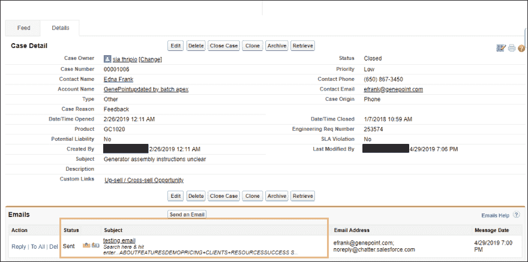
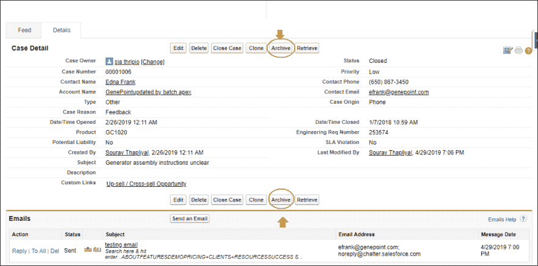
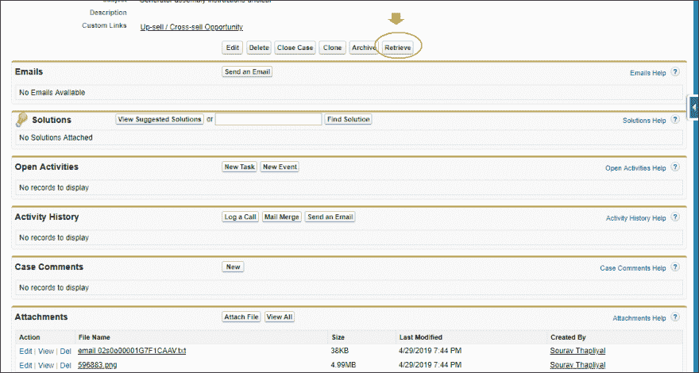
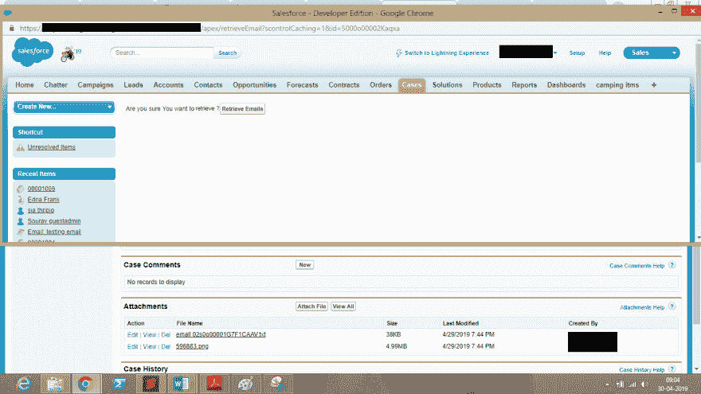

# 管理您的 Salesforce 组织中的文件存储

> 原文：<https://dev.to/girikon/managing-file-storage-in-your-salesforce-org-4d50>

Salesforce 是全球领先的 CRM 平台之一。根据 Girikon 的**[sales force Consultants](https://www.girikon.com.au/salesforce-consultant/)**的说法，它是市场上最大、最广泛使用的 CRM 软件之一。Salesforce 有两种类型的存储，即数据存储和文件存储。文件存储包括附件、用户上传到“文档”选项卡的项目以及 Salesforce CRM Content。联系人管理器、组、专业、企业、性能和无限版本为每个组织分配了 10 GB 的文件存储空间。Essentials edition 为每个组织分配了 1 GB 的文件存储空间。包括活动在内的所有其他数据都被视为记录，并计入您的数据存储分配。每个 Contact Manager、Group、Enterprise、Professional 以及 Performance 版本的数据存储限制按 1 GB 计算，或按每个用户的限制(每个用户 20 MB)计算，视生产组织的要求而定。对于一个企业来说，控制开支、关注存储限制是其主要目标。

我们都同意 Salesforce 是一个很好的 CRM，但是当涉及到许可定价时，当您考虑到每用户许可等时，它会变得非常昂贵。如果组织关心的是存储成本，并且用户以惊人的速度持续上传数据，那么应用 Girikon 的策略来管理组织数据就很重要。电子邮件和案例是非常重要的信息，它们会占用很多空间。每封电子邮件需要大约 2Kb 到 10Kb 的数据(根据电子邮件内容的不同而有所不同),随电子邮件一起发送的每个附件可能高达 20Mb。通过归档管理，然后在需要时恢复电子邮件，可以更有效地管理组织数据。

归档策略非常简单，而且已经证明非常有效。我们的 Salesforce 咨询服务团队经常建议用户使用两个自定义按钮“归档”和“检索”,这两个按钮会为用户完成所有工作。点击存档时，相关列表中的电子邮件会被存档或存储为附件。

*   **在**发送或接收电子邮件之前。
    T3T5】

*   **在**发送完邮件之后。电子邮件显示在电子邮件相关列表中，数据存储量增加。
    [T8】](https://www.girikon.com/wp-content/uploads/2019/05/Salesforce-Orgs-storage3.png)

*   单击存档按钮时。
    [T3】](https://www.girikon.com/wp-content/uploads/2019/05/Salesforce-Orgs-storage4.png)

会弹出一个 visual force 页面，询问您“您确定要归档吗？”

*   **在**存档后，电子邮件进入附件，数据存储量减少。[T3](https://www.girikon.com/wp-content/uploads/2019/05/Salesforce-Orgs-storage6.png)T5T7】

让我们探索一下存储背后的后端逻辑。当发送或接收电子邮件时，它会在 salesforce 中的 **emailMessage 对象**中创建一个记录，该电子邮件的附件会在**附件对象**中创建一个记录。创建的记录的**父 Id** 等于**案例 Id** ，随该电子邮件发送的附件的**父 Id** 等于**电子邮件记录 Id** 。因此，当我们点击存档按钮时，代码在后台运行，创建一个新的记录或文件，即电子邮件(emailId)。附件对象中的 txt，其中包含电子邮件及其详细信息，例如:–bccAddress，cc address，TextBody/HTML body 等。对于随电子邮件一起发送的附件，**这些附件的父 Id** 被**重新父化**，现在等于 **caseId** 。此后，emailMessage 对象中的电子邮件记录被删除，从而减少了数据存储量。

在用户按照上述步骤存档以便将来查看之后，也有必要检索电子邮件。用户也有机会删除电子邮件。

*   点击检索按钮。
*   弹出一个视觉力页面，询问“确定要检索吗？”

——邮件被取回。并且增加了数据存储量。

 

让我们来看看检索电子邮件时存储背后的后端逻辑。代码的编写方式是读取**电子邮件的正文(emailId)。txt** ，然后从它在 **emailMessage 对象**中创建新记录。对于电子邮件附件，在系统在 emailMessage 对象中创建的用于检索附件的**自定义字段**的帮助下，它们会被**重新设置为**电子邮件。自定义字段包含未存档时**电子邮件的**旧 Id** 。所有这些完成后，代码**删除**电子邮件(emailId)。txt** 文件来自附件。

Girikon 的 Salesforce Consultant 一文在管理您的 Salesforce 组织的存储方面提供了正确的建议首先出现在 [Salesforce 咨询公司|美国|亚利桑那州凤凰城](https://www.girikon.com/)。