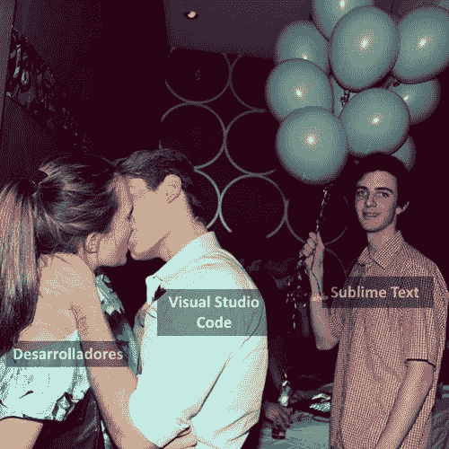
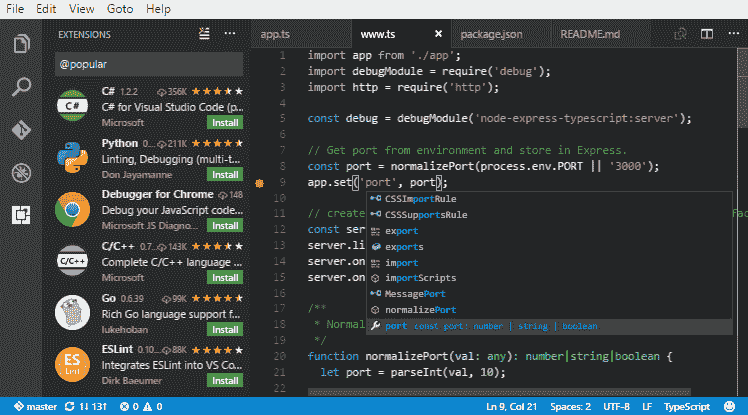
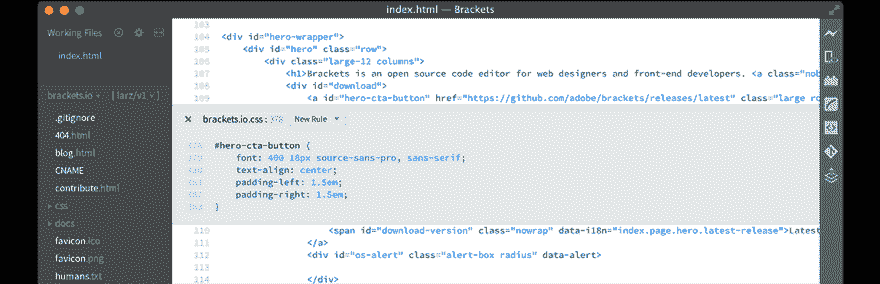
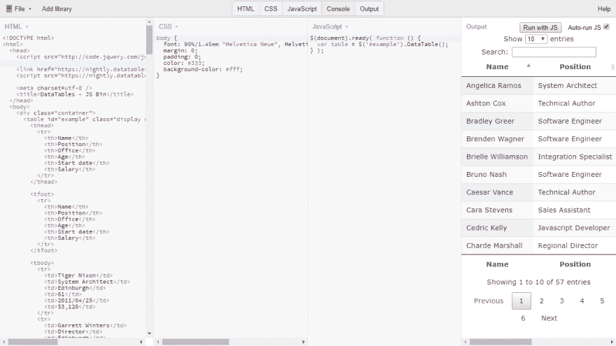

# 最佳免费 HTML、CSS 和 JavaScript 编辑器(2019 年)

> [https://dev . to/campus MVP/los 最佳免费 html-CSS-y-JavaScript-2019-21 ln](https://dev.to/campusmvp/los-mejores-editores-gratuitos-de-html-css-y-javascript-2019-21ln)编辑

5 年前，2014 年 5 月，我写了一篇文章，很快成为我们校园 MVP 博客中最受欢迎的一篇，也是网络上最受欢迎的一篇。标题是[，“HTML、CSS 和 JavaScript 的前 10 名(或接近前 10 名)免费编辑”](https://www.campusmvp.es/recursos/post/Los-10-mejores-editores-gratuitos-de-HTML-CSS-y-JavaScript.aspx)，并如其名称所示，向我们展示了可供我们免费使用的网页代码编辑的精选。

从那时起**事情发生了很大变化**。早在 2013 年，杂志**就判定这是[回应网络设计的一年](https://mashable.com/2012/12/11/responsive-web-design/?europe=true)，尽管在 2014 年西班牙，我写这篇文章时就开始了。当前的现实是**[【rwd 是网页设计中固有的】](https://www.campusmvp.es/recursos/catalogo/Product-Dise%C3%B1o-Web-Responsive-con-HTML5,-Flexbox,-CSS-Grid-y-Bootstrap_212.aspx)** ，如今，不使用就设计网页是不可想象的。**

 **这和出版商有什么关系？因为 5 年前，特别是如果你是新手的话，你可以负担得起‘t0’的奢侈用某种视觉设计者来创建你的‘t1’网页或 web 应用程序。**如今不宜**。来吧，你可以做到，事实上，我放在那篇文章里的大多数编辑仍然在工作，**但他们不会对你有多大帮助**。

## 告别视觉设计

当前的 web 布局是以这样的方式进行的:**元素的分布完全不同，具体取决于它们在其上查看的设备的[*视口*的宽度。这意味着我们不能通过分布元素并使其保持固定位置来进行“可视化”设计，而设计通常是最小(移动)屏幕大小的一部分，并且随着屏幕大小的增长而变化:](https://dev.to/campusmvp/desarrollo-web-mvil-qu-diferencia-existe-entre-el-viewport-y-la-resolucin-de-pantalla-de-un-dispositivo-1aog)**

**响应性网页设计**(和自适应网页设计】**要求在编辑器中同时键入代码**，HTML 和 CSS 以及相应的*媒体欲望*，然后在实际浏览器中查看每次更改的效果蜡垀酕腔湮嗣杅都岆妏蚚銡拟羲楷埜驮捡勤 CSS 扽俶辆俴妗奀党蜊ㄗ幸好ㄛ绞銡拟采勍蜡蔚涴虳驮捡蝈诿善埻宎恅璃奀ㄛ蜡珩褫眕婓涴虳恅璃笢艘善涴虳载蜊ㄛ眕晞婓晤怃笢艘善涴虳载蜊ㄘ﹝。

> 今天，网络设计/开发比以往任何时候都更是一门技术学科，它要求[编写代码](https://www.campusmvp.es/recursos/catalogo/Product-HTML5-y-CSS3-a-fondo-para-desarrolladores_185.aspx)，而不是拖放或实时查看事物的遗留情况。

这是目前这份清单过时的主要原因，它当时提出的选择有一半以上，特别是那些强调视觉设计的选择，如**【komp ozer】**(其网页不再工作)或**【blue Griffin】**(即

此外，由于开发人员感兴趣的新产品的出现，当时处于顶峰的一些产品也有所下降。在我看来，这方面的大赢家一直是**visual studio code，而失败者**和**atom。******

 ******

有鉴于此，我将在下面按三个类别列出我最喜欢的 HTML/CSS 和 JavaScript 免费代码编辑器(一般用途、学习和*云*。以我卑微的看法，他们是**在每种情况下最好的**，在**免费编辑**之内。有一些付款，主要是 Jetbrains 的**[【websorm】](https://www.jetbrains.com/webstorm/)**，也许 Adobe 的仅用于 web 设计，它们很不错，但却摆脱了这种免费的前提。

> **注**:在你告诉我这个或那个你如此喜欢的编辑不在名单上之前，请注意一件事:是**我的**名单，是**我的**我喜欢的编辑出于各种原因，可能不认识他们全部，也可能不认识不过，我很高兴你在下面留下一个评论，提到你最喜欢的编辑，他不在名单上，你为什么认为他应该在名单上。∞天啊！

走吧！

## 一般用途:**[【visual studio code】](https://code.visualstudio.com/)**—每天做的最好，做的最好

我不得不承认，当他出来的时候，我几乎没有为他下注，我以为他会是微软这么多失败产品中的另一个，试图“酷”。这是我最大的错误。随着 VSCode 逐渐成为**编辑器**，已经是各种开发人员使用最多的。

它是免费的、开源的、跨平台的(Windows、Linux、macOS、ARM 和现在的 Web)，灵活、快速和超级强大。此外，它还具有无限的扩展能力，使您能够扩展功能，同时又不会失去其轻便性，并集成了对最常用工具(从 Git 或嵌入式命令行到 docker)的支持。

它不仅可以用于编程 HTML、CSS 和 JavaScript，而且对于多种语言(本机或带有扩展名)具有广泛的支持:[和 C#](https://dev.to/campusmvp/visual-studio-code-cmo-preparar-un-entorno-de-trabajo-para-net-core-6fh-temp-slug-30306) 平台、Node.js、PHP、Java、Python、C++、Go-我...。除了很好地支持诸如 [Angular](https://dev.to/campusmvp/visual-studio-code--angular-cmo-montar-un-entorno-de-desarrollo-productivo-para-este-framework-1mdl-temp-slug-3333534) 之类的 JavaScript 库，vue . js 或 React，而不仅仅是用于编程。例如，本文是使用 Visual Studio 代码在 Markdown 中编写的。我现在几乎用在所有的东西上，而且我在所有的团队之间同步它。他们对 [Live Share](https://code.visualstudio.com/blogs/2017/11/15/live-share) 的支持甚至允许你在同一代码中与其他开发者实时合作。

具体而言，HTML、CSS 和 JavaScript 提供了许多功能，包括自动代码完成、emmet/zencoding 支持、编写时上下文相关帮助、颜色选择器、代码重构、不退出工具的调试、Live Server 支持(自动服务和重新加载太多了，无法一一列举。

因此，今天 Visual Studio 代码是我的主要编辑，几乎在任何情况下我都会推荐给任何人。

## **[括号](http://brackets.io/)**——理想的对位原则

虽然这个由 Adobe 建立的编辑器并不像其他编辑器那么有名，但我通常会建议我的学生从 HTML 和 CSS 开始，因为它是一个非常专注于这些语言的编辑器，另外还有 JavaScript 和一些特别有趣的工具，可以让您在开始时专注于这些语言。

除了常规功能(写作上下文相关帮助、标签自动关闭等-我...。)有三个特性使其与此启动配置文件特别相关:

*   **即时预览**:整合按键组合`CTRL+E`，即当您在标签或 JavaScript 函数中的 CSS 类别上按一下时，会直接在线上显示，而不会变更编辑器，您也可以编辑其定义:

他们是这方面的先驱之一，虽然看起来稍小一些，但在您刚开始的时候，它的集成带来了极大的便利和帮助(在 VScode 中，您也可以通过扩展名“[CSS peek](https://marketplace.visualstudio.com/items?itemName=pranaygp.vscode-css-peek)”来实现这一点，尽管它并不那么成功，而且对于 JavaScript 来说是本地的)。

*   实时预览更改。只需单击一个按钮，即可打开浏览器并开始为页面提供服务，页面将链接到编辑器。这样，每次进行更改(即使未保存)时，它都会实时反映在浏览器中，而无需刷新。其他编辑器(如 VSCode)也可以做到这一点，但需要扩展，而且更复杂。又是初学者的“胜利”。
*   **对 CSS 预处理程序(SASS 和 Less)的串行支持**:如果除了 CSS 你正在学习如何利用这些强大的工具，它将非常适合你，并且再次无需外部扩展或工具。

它还具有 JavaScript 代码重构的潜力，并具有相当大的扩展(虽然并不远离 VScode)，但除去两三个扩展(例如 Emmet、Git 或 Beautify)是不值得安装的，因为它的优点正是它给初学者带来的系列。

## 云:**[【jsbin】](https://jsbin.com/)**在线编辑器用于测试、实验和分享实例

如今，编写代码几乎和共享代码一样重要。这就是为什么越来越多地使用“云”编辑的原因。您不会使用它们来创建完整的项目(尽管理论上您可以)，而是可以从任何位置使用它们进行快速测试、实验并与其他开发者共享代码。后一个在你开始的时候特别有用。

虽然我最喜欢的一般是**[【repl . it】](https://repl.it/)**，因为它还支持许多不同的语言，但在这种情况下，我必须重点关注一些专门为 HTML、CSS 和 JavaScript 编写的前端代码。这一类里面有很多，也许最有名的是**[【jsfiddle】](https://jsfiddle.net/)**和，但是，今天我推荐你的是**[【jsbin】](https://jsbin.com/)**，这是一个知名度要低得多的，看起来更像斯巴达人。但是，虽然三者都很好，但我认为它一定能提供整体上最好的特点:

*   允许使用多种预处理程序，包括 HTML (Markdown、Jade)、CSS (Sass、Less、Myth、Stylus)、JavaScript (TypeScript、Babel、LiveScript、cofeescript)。
*   您只需从列表中选择几十个常用的 JavaScript 库(如 jQuery、Bootstrap、QUnit、Angular、reaction、vue . js)即可添加它们-我...。比别人多(尽管总是可以手动添加更多)。
*   蜡褫眕斐膘植笢羲宎腔耀衔ㄛ奥祥岆诺恅紫﹝。也可以直接从磁盘拖动文件。
*   共享非常容易，因为它的[URL【可发音】](https://jsbin.com/help/pronounceable-urls/)
*   他有能力做到[【代码铸造】](https://remysharp.com/2013/11/14/what-is-codecasting/)，也就是说，一边写自己的代码，一边让别人实时订阅和观看，一边通过 Skype 或类似方式聊天，一边开始“广播”你在编辑器中所做的一切。
*   你可以下载并在本地安装，如果你不想在线使用(只)的话。

也许 JSFiddle 更出名更漂亮，有一些很酷的特点，但 jsfiddle 征服了我，因为它简单，而且因为它有一些特点使它独一无二。你选择的两者中的任何一个都会是一个伟大的决定。

* * *

在这个富足的时代，**少就是多**。这是我在免费 HTML、CSS 和 JavaScript 编辑器中的小首选项列表。很少，但很好，更重要的是要现实地看待你今天应该如何为网络开发。不要拖拖拉拉的，还有很多来自[的了解你做什么](https://www.campusmvp.es/recursos/catalogo/Product-HTML5-y-CSS3-a-fondo-para-desarrolladores_185.aspx)，使用[框架或现代网络创作技术](https://www.campusmvp.es/recursos/catalogo/Product-Dise%C3%B1o-Web-Responsive-con-HTML5,-Flexbox,-CSS-Grid-y-Bootstrap_212.aspx)。

你认为哪一类编辑应该提及或更喜欢？那就在下面的评论中给我一些论据(不仅仅是名字)

愿他们对你有用！********