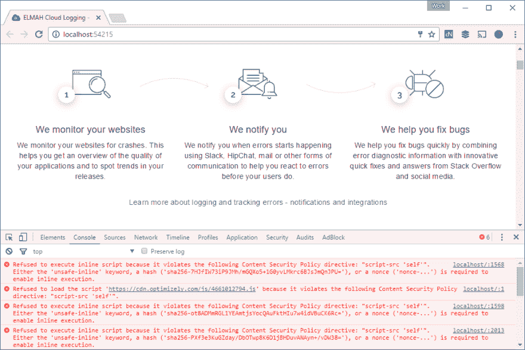

# ASP.NET MVC 中的内容安全策略

> 原文：<https://dev.to/thomasardal/content-security-policy-in-asp-net-mvc-192i>

在上一篇文章中，[使用自定义头文件](https://blog.elmah.io/improving-security-in-asp-net-mvc-using-custom-headers/)提高 ASP.NET MVC 的安全性，我完全跳过了对`Content-Security-Policy`头文件的讨论。实现起来并不困难，但是因为它需要更多的解释来理解，header 现在有了自己的 post。作为一个小玩笑，我将在下一篇文章中向你展示一个使用 elmah.io 实现`Content-Security-Policy`头的简单方法。

`Content-Security-Policy`头是一个 HTTP 响应头，很像前一篇文章中的头。标头通过告诉浏览器允许加载哪些动态资源，有助于防止代码注入攻击，如跨站脚本和点击劫持。

先说一个简单的例子:

```
<system.webServer>
  <httpProtocol>
    <customHeaders>
      <add name="Content-Security-Policy" value="default-src 'self'" />
    </customHeaders>
  </httpProtocol>
</system.webServer> 
```

`Content-Security-Policy`报头的`value`由分号分隔的 x 段组成。在上面的例子中，我们只指定了一个段，说“只从自己加载资源”。`self`翻译成与 HTML 资源相同的来源。有了这个最低配置，您的 HTML 就可以获取 JavaScripts、样式表等。来自为引用资源的 HTML 提供服务的同一个域。您将无法包含来自 cdn 和类似内容的外部脚本。

假设您自己托管所有内容，但是希望包含来自 cdnjs 的 jQuery。您需要以下值来允许浏览器在您的源之外发出请求:

```
<add name="Content-Security-Policy" value="default-src 'self' https://cdnjs.cloudflare.com" /> 
```

还记得我讲过的片段吗？您可以使用一系列不同的`*-src`键来配置哪些域加载不同种类的资源，例如:

```
<add name="Content-Security-Policy" value="default-src 'self'; script-src 'self' https://cdnjs.cloudflare.com; style-src 'self' https://maxcdn.bootstrapcdn.com" /> 
```

这种配置允许您的 web 应用程序从自己的域加载资源，从`cdnjs.cloudflare.com`加载脚本，从`maxcdn.bootstrapcdn.com`加载样式表。组合是无穷无尽的，所以查看 Mozilla.org 上的[文档](https://developer.mozilla.org/en-US/docs/Web/HTTP/Headers/Content-Security-Policy)了解详情。

很有可能，你没有一个记录下你的网站的所有依赖的文档。因此，实施`Content-Security-Policy`割台需要时间和挖掘。最好的方法是开始将资源限制在`self`上，并测试整个 web 应用程序，看看它是否工作。如果在 Chrome 或任何您喜欢的浏览器中运行开发者工具，当您的 web 应用程序试图获取或执行标题中不允许的代码时，控制台会告诉您:

[](https://res.cloudinary.com/practicaldev/image/fetch/s--siwgOutl--/c_limit%2Cf_auto%2Cfl_progressive%2Cq_auto%2Cw_880/https://blog.elmah.io/conteimg/old/content-security-policy-report.png)

捕获所有需要的配置的另一种方法是从使用一个名为`Content-Security-Policy-Report-Only` :
的替代头开始

```
<add name="Content-Security-Policy-Report-Only" value="default-src 'self'" /> 
```

通过添加这个头而不是`Content-Security-Policy`，浏览器会一直告诉你什么时候不允许，但还是允许。这样，当你在生产中运行你的网站时，你可以一直盯着控制台。当控制台中的所有错误消息都消失后，您切换回原来的标题。

## 你的用户会喜欢更少的错误吗？

elmah.io 是一个简单的错误记录和正常运行时间监控服务。NET web 和日志框架。

➡️ [错误监控。NET 网络应用](https://elmah.io/?utm_source=devto&utm_medium=social&utm_campaign=devtoposts) ⬅️

本文首次出现在 elmah.io 博客上，网址为[https://blog . elmah . io/content-security-policy-in-ASP-net-MVC/](https://blog.elmah.io/content-security-policy-in-asp-net-mvc/)