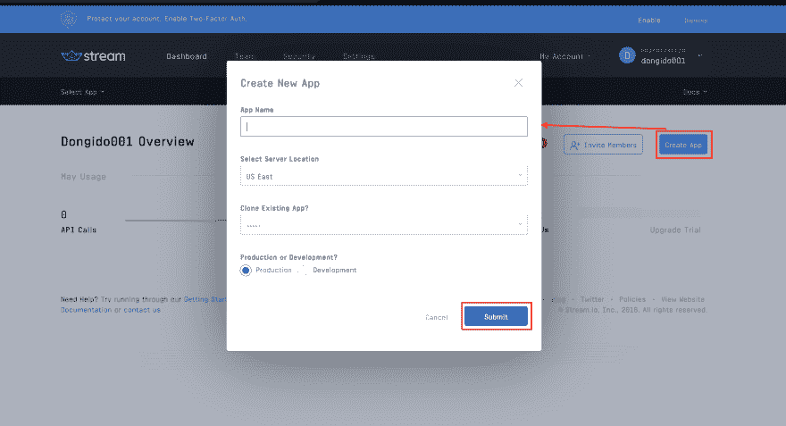
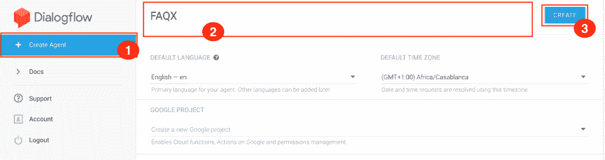
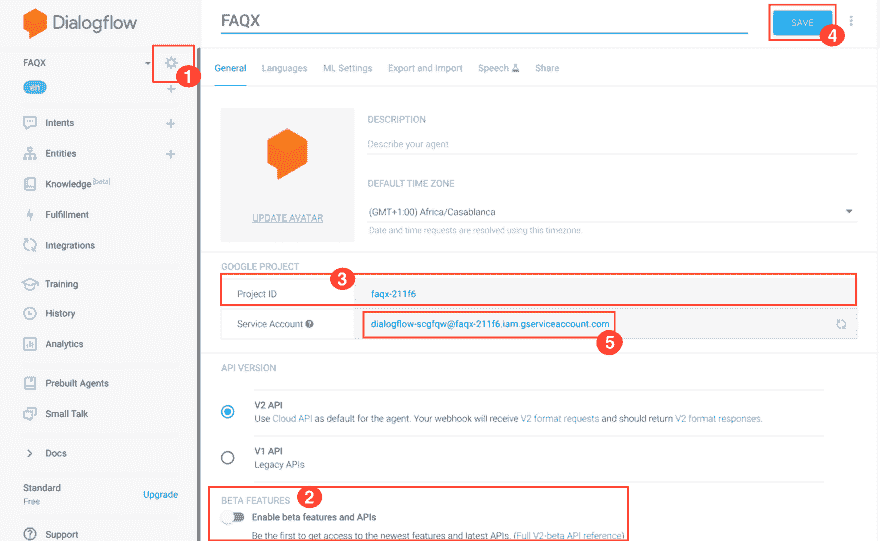
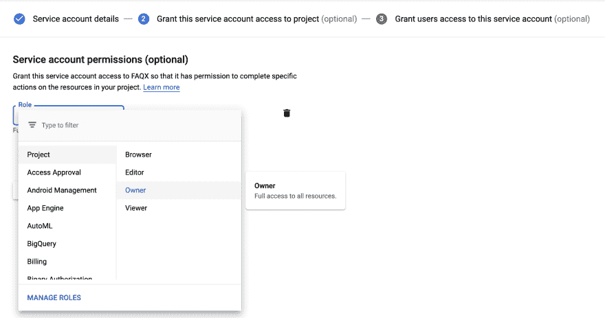
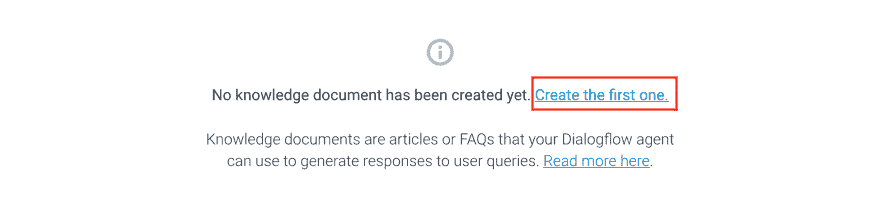
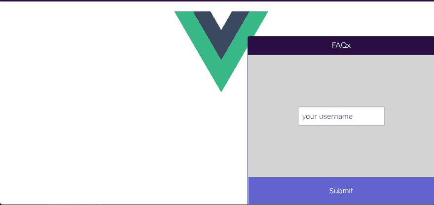
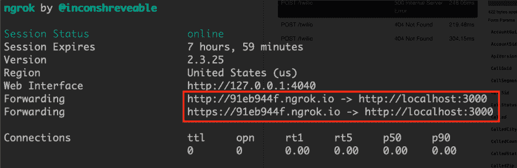
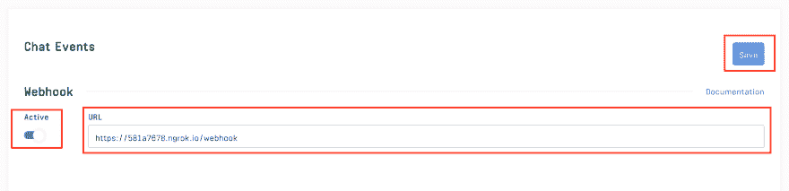

# 使用 Google 的 Dialogflow 将聊天机器人添加到您的流聊天应用程序中

> 原文：<https://dev.to/dongido/adding-chatbots-to-your-stream-chat-app-using-google-s-dialogflow-1b46>

# 使用 Google 的 Dialogflow 向您的流聊天应用程序添加聊天机器人

*最初发布于 [https://getstream.io](https://getstream.io/blog/adding-chatbots-to-your-stream-chat-app-using-googles-dialogflow/) 。*

大多数任务都是重复且耗时的。如果我们可以使用机器人来帮助完成这些任务会怎么样？这将极大地提高生产率。聊天机器人在这方面非常棒。

在本教程中，我将向您介绍使用 Dialogflow 和 Vue 向您的流聊天应用程序添加聊天机器人的步骤。在本教程结束时，您将构建一个常见问题(FAQ)bot，更加熟悉 Stream Chat API，以及 Stream 提供的 webhook 系统。

这是我们将要构建的预览:

[](https://res.cloudinary.com/practicaldev/image/fetch/s--oGgsHsuf--/c_limit%2Cf_auto%2Cfl_progressive%2Cq_66%2Cw_880/https://paper-attachments.dropbox.com/s_BC3401DD7DD2340BE6F9C669BE5C841F9F4C705937943E31239A7EE029F285F1_1558082207354_getsreamChat.gif)

## 先决条件

为了更好地学习本教程，我们希望您能够做到以下几点:

*   对 JavaScript 的基本理解
*   对 [Vue.js](https://vuejs.org/) 的基本了解
*   您还应该在系统上安装[节点](http://Node.js)(8.9 或更高版本——最好是最新的 12.x)
*   您应该在系统上安装 npm 或 yarn
*   在您的系统上安装 [ngrok](https://ngrok.com/)

如果以上你都准备好了，那就开始吧！

## 设置客户端应用–创建新的 Vue 应用

Vue 提供了一个 [CLI](https://cli.vuejs.org/guide/creating-a-project.html#installation) 来搭建一个新的 Vue 项目。首先，您需要在系统上全局安装 Vue CLI(如果您还没有安装的话)。之后，我们将使用 CLI 命令创建一个新的 Vue 项目。

接下来，通过在系统上任何方便的位置运行以下命令来创建一个新的 Vue 项目:

```
 # Install Vue CLI globally on your system
    $ yarn global add @vue/cli

    # Create a new Vue project (for the prompt that appears, press enter to select the default preset.)
    $ vue create faqx

    # Change your directory to the project directory
    $ cd faqx

    # Install Stream Chat client SDK
    $ yarn add stream-chat

    # Install axios - a library for making request
    $ yarn add axios

    # Run the app!
    $ yarn serve 
```

访问显示在您终端上的 [URL](http://localhost:8080) 会将您带到 Vue 默认页面。

## 获取您的流聊天密钥

要开始使用流聊天 API，您需要有一个 API 密钥。

在这里创建一个账户[或者](https://getstream.io/accounts/signup/)[登录](https://getstream.io/accounts/login/)如果你已经有一个账户。

然后，从您的[仪表盘](https://getstream.io/dashboard)中:

*   使用任何方便的名称创建新应用程序。我会把我的叫做“常见问题”
*   将**应用名称**填写为“FAQx”或任何您想要的名称
*   最后，点击**提交**按钮提交表单，创建应用程序

[](https://res.cloudinary.com/practicaldev/image/fetch/s--Nib8CW5u--/c_limit%2Cf_auto%2Cfl_progressive%2Cq_auto%2Cw_880/https://paper-attachments.dropbox.com/s_BC3401DD7DD2340BE6F9C669BE5C841F9F4C705937943E31239A7EE029F285F1_1558025079426_Screenshot%2B2019-05-16%2Bat%2B5.36.10%2BPM.png)

创建应用程序后，您的仪表盘上会显示一些选项。选择**聊天**进入流聊天仪表盘。

[](https://res.cloudinary.com/practicaldev/image/fetch/s--6x2W12Sx--/c_limit%2Cf_auto%2Cfl_progressive%2Cq_auto%2Cw_880/https://paper-attachments.dropbox.com/s_BC3401DD7DD2340BE6F9C669BE5C841F9F4C705937943E31239A7EE029F285F1_1558025492908_Screenshot%2B2019-05-16%2Bat%2B5.50.06%2BPM.png)

接下来，勾选**禁用权限检查**然后点击**保存**按钮。

然后，滚动到页面底部，记下你的应用访问键–**键**和**密码。**

[](https://res.cloudinary.com/practicaldev/image/fetch/s--dZhK4Sx0--/c_limit%2Cf_auto%2Cfl_progressive%2Cq_auto%2Cw_880/https://paper-attachments.dropbox.com/s_BC3401DD7DD2340BE6F9C669BE5C841F9F4C705937943E31239A7EE029F285F1_1558025727418_Screenshot%2B2019-05-16%2Bat%2B5.52.26%2BPM.png)

接下来，在项目的根目录下创建一个`.env`文件，并将您的流密钥更新到这个文件中:

```
 VUE_APP_PORT=3000
    VUE_APP_SERVER=http://localhost:3000

    VUE_APP_KEY=<YOUR KEY>
    APP_SECRET=<YOUR SECRET>

    DIALOGFLOW_PROJECT_ID=<YOUR DIALOGFLOW PROJECT ID>
    GOOGLE_APPLICATION_CREDENTIALS=<GOOGLE SERVICE FILE> 
```

记得用您在上面记下的正确应用键替换`<YOUR KEY>`和`<YOUR SECRET>`。

## 设置服务器

接下来，在项目的根目录下创建一个名为`server`的新目录。然后打开一个新的终端，然后将当前目录更改为`server`目录。然后安装服务器所需的以下依赖项:

```
 $ yarn add express cors body-parser dialogflow path uuid dotenv 
```

上述依赖关系包括:

*   `express`–我们用来构建服务器的节点框架
*   `dialogflow`–dialog flow 的节点 SDK
*   `dotenv`–用于解析来自`.env`文件的配置的 npm 包
*   [cors](https://www.npmjs.com/package/cors) 、 [body-parser](https://www.npmjs.com/package/body-parser) 、 [uuid](https://www.npmjs.com/package/uuid) 和 [dotenv](https://www.npmjs.com/package/dotenv) (都是优秀的 npm 包)

接下来，通过在`server`目录下创建一个名为`app.js`的新文件来创建一个 Express 应用程序，然后向其中添加以下代码:

```
 // ./server/app.js

    const express = require("express");
    const cors = require("cors");
    const bodyParser = require("body-parser");
    const StreamChat = require('stream-chat').StreamChat;
    const dialogflow = require('dialogflow').v2beta1;
    const uuid = require('uuid');

    require('dotenv').config({path:  "../.env"})

    const app = express();
    const port = process.env.VUE_APP_PORT || 3000

    app.use(cors());
    app.use(bodyParser.json());
    app.use(bodyParser.urlencoded({ extended: true }));

    // Initialize Stream Chat SDK
    const serverSideClient = new StreamChat(
        process.env.VUE_APP_KEY, 
        process.env.APP_SECRET
    );

    app.get("/", async (req, res) => {
        res.send({ hello: "World!" });
    });

    app.listen(port, () => {
        console.log(`Node app listening on port ${port}!`)
    }); 
```

在上面的代码中，在导入我们已经安装的包之后，

*   我们使用`const app = express();`创建了一个[快递](https://expressjs.com/)应用
*   接下来，我们初始化流聊天 SDK
*   最后，我们创建了一个端点- `/` ( `app.get('/',…`)来测试这个应用程序是否工作。所以，如果你访问`http://localhost:3000/`，你会得到一个消息——`{ hello: 'World!'}`

接下来，创建一个用于创建令牌的新端点。

```
 // ./server/app.js

    app.post('/login', async (req, res) => {
        const userId = req.body.userId

        if (!userId) {
            return res.status(400).send({
                status: "error",
                message: "username and name is required"
            })
        } 

        return res.status(200).send({
            status: "success",
            token: serverSideClient.createToken(userId)
        })
    }); 
```

初始化流聊天 SDK 需要令牌。

最后，启动服务器:

```
 node app.js 
```

如果它成功启动，您将看到一条消息打印到终端——“节点应用程序在端口 3000 上侦听！”

## 设置对话流

Dialogflow 是谷歌旗下基于自然语言对话的人机交互技术开发商。在开始使用 Dialogflow 服务之前，您需要拥有他们的帐户。

现在去 Dialogflow 的网站创建一个免费的[账户](https://console.dialogflow.com/api-client/#/login)，如果你还没有的话。你需要一个谷歌帐户才能创建一个帐户。一旦你进入页面，点击用**谷歌**按钮登录。

从您的仪表板上，

*   通过选择**创建代理来创建代理。**
*   键入代理名称作为 **FAQX。**
*   点击**创建**按钮处理表单。

[](https://res.cloudinary.com/practicaldev/image/fetch/s--mwB7EsrS--/c_limit%2Cf_auto%2Cfl_progressive%2Cq_auto%2Cw_880/https://paper-attachments.dropbox.com/s_BC3401DD7DD2340BE6F9C669BE5C841F9F4C705937943E31239A7EE029F285F1_1558051874504_Screenshot%2B2019-05-17%2Bat%2B1.05.48%2BAM.png)

接下来，

1.  单击代理名称右侧的齿轮图标。
2.  启用测试版功能和 API。
3.  复制您的项目 ID 并更新。包含它的 env 文件:DIALOGFLOW_PROJECT_ID=
4.  点击**保存**按钮保存您的更改
5.  在**谷歌项目**部分，点击**服务账户**的名称。

[](https://res.cloudinary.com/practicaldev/image/fetch/s--gcS7Gu1K--/c_limit%2Cf_auto%2Cfl_progressive%2Cq_auto%2Cw_880/https://paper-attachments.dropbox.com/s_BC3401DD7DD2340BE6F9C669BE5C841F9F4C705937943E31239A7EE029F285F1_1558079212528_Screenshot%2B2019-05-17%2Bat%2B1.18.00%2BAM.png)

这将带您进入 Google 云平台服务帐户页面，但您首先需要更新服务帐户的角色。

页面加载完成后:

1.  点击左上角的菜单按钮，然后点击 **IAM & admin** 。
2.  点击左侧菜单中的**服务账户**。
3.  点击页面顶部的**创建服务帐户**按钮。
4.  在下一页中，输入服务帐户的名称，然后单击 **CREATE** 按钮提交表单。
5.  点击**角色**，选择**所有者**作为角色。

[](https://res.cloudinary.com/practicaldev/image/fetch/s--wNtBbuRr--/c_limit%2Cf_auto%2Cfl_progressive%2Cq_auto%2Cw_880/https://paper-attachments.dropbox.com/s_BC3401DD7DD2340BE6F9C669BE5C841F9F4C705937943E31239A7EE029F285F1_1558054021559_Screenshot%2B2019-05-17%2Bat%2B1.45.23%2BAM.png)

然后点击**继续**按钮。

1.  点击 **+创建密钥**按钮。点击**创建**下载您的服务密钥。

将开始下载 JSON 文件。将下载文件复制到项目的`server`目录下。

然后更新`.env`文件，以反映您刚刚下载的 JSON 文件的名称:

```
 GOOGLE_APPLICATION_CREDENTIALS=<GOOGLE SERVICE FILE> 
```

**准备您的常见问题数据**

这里是我们准备常见问题的地方。在系统的任意位置创建一个新文件，名为`faq.csv`。然后，将下面的常见问题示例复制到它并保存。

```
How can I place orders?, "There are two ways to place orders for our services:"
What does an order cost?, "The costs are calculated according to the amount of time involved and the quality requirements. These vary from project to project. Therefore, per project, you will receive an individual offer on demand." 
```

以上只是我们测试的一个例子。请随意用你的替换。第一栏是问题，第二栏是答案。数据是用逗号分隔的，不应该有空行，否则，你会得到一个错误。

下面是一个简单的格式示例:

```
 An example question 1, An answer 1
    An example auestion 2, An answer 2 
```

从`faq.csv`文件上的数据来看，当用户以- " **的形式发送查询时，我如何下订单？**”。Dialogflow 的预期输出将是- " **这里有两种方式来订购我们的服务:**"等等。

接下来，回到您的 Dialogflow 仪表板，

1.  点击页面左侧的**知识**标签
2.  点击**创建知识库**按钮
3.  键入 **FAQ** 作为知识的名称
4.  点击**创建第一个**链接

[](https://res.cloudinary.com/practicaldev/image/fetch/s--qWSsNAw9--/c_limit%2Cf_auto%2Cfl_progressive%2Cq_auto%2Cw_880/https://paper-attachments.dropbox.com/s_BC3401DD7DD2340BE6F9C669BE5C841F9F4C705937943E31239A7EE029F285F1_1558055148291_Screenshot%2B2019-05-17%2Bat%2B2.03.54%2BAM.png)

在出现的弹出窗口中，

1.  输入**文档名**作为“常见问题”
2.  选择“FAQ”作为**知识类型**
3.  选择`txt/csv`作为**哑剧类型**
4.  选择**从您的计算机**上传文件作为**数据源**
5.  点击**选择文件**按钮，浏览到上面创建的 CSV 文件并上传
6.  然后，点击**创建**按钮
7.  点击**添加响应**
8.  最后，点击**保存**按钮来注册您的更改

## 构建 App 界面

现在我们已经运行了客户端和服务器应用程序，接下来我们要做的是创建一个简单的聊天界面，这样我们就可以集成 Dialogflow 了。

Vue 使我们能够构建可重复使用的组件，这些组件构成了我们的应用程序用户界面。我们将把应用程序 UI 分割成更小的组件，以便我们可以单独构建它们:

为了简洁起见，我们将应用程序分为两个部分:

*   `Messages.vue`***-*-****用于清单信息和表格输入
*   `Login.vue` -显示登录表单

在`src/components`目录下创建`Messages.vue`和`Login.vue`文件。

为了使组件文件尽可能的小，我将所有组件的 CSS 都添加到一个 CSS 文件中。在项目的`src`目录下创建 CSS 文件`App.css`，然后添加以下样式:

```
 /* ./App.css */

    html,body{
        width: 100%;
        height: 99vh;
        overflow: hidden;
    }
    #app {
        font-family: 'Avenir', Helvetica, Arial, sans-serif;
        -webkit-font-smoothing: antialiased;
        -moz-osx-font-smoothing: grayscale;
        text-align: center;
        color: #2c3e50;
    }
    .login-container {
        display: grid; 
        grid-template-rows: 4fr 1fr;
        max-height: 320px;
        min-height: 320px;
    }
    input[type="text"] {
        padding: 10px 8px;
        margin-top: 10px;
        border-radius: 2px;
        border: 1px solid darkgray;
        font-size: 16px;
        box-sizing: border-box;
        display: block;
    }
    .inputs {
        text-align: center;
        align-self: center;
        justify-self: center;
    }
    .submit {
        margin-top: 9px;
        padding: 20px;
        background: rgb(99, 99, 212);
        color: white;
        font-size: 16px;
    }
    .chat-message {
        width: 70%;
        margin-top: 4px;
        padding: 4px;
        text-align: left;
        word-wrap: break-word;
        margin: 5px;
    }
    .from-admin {
        background: rgb(150, 178, 183);
        color: rgb(39, 37, 37);
        float: left;
    }
    .from-client {
        background: rgb(48, 13, 79);
        color: white;
        float: right;
    }
    .input-container {
        margin: 0px;
    }
    .chat-input {
        width: 99%; 
        margin-bottom: 0px;
    }
    .client-messages {
        overflow-y: scroll; 
        height: 320px;
    }
    .chat-container {
        position: fixed; 
        right: 0px; 
        bottom: 0px; 
        width: 400px; 
        z-index: 100000; 
        box-sizing: border-box;
    }
    .head {
        padding: 9px; 
        display: grid; 
        background-color: rgb(48, 13, 79); 
        color: white; 
        border-top-left-radius: 5px; 
        border-top-right-radius: 5px;
    }
    .chat-box {
        border-left: 1px solid rgb(48, 13, 79);
        border-right: 1px solid rgb(48, 13, 79);
        background: lightgray;
    } 
```

**登录组件**

我们将对组件使用[单文件组件](https://vuejs.org/v2/guide/single-file-components.html)结构。

添加登录组件的标记:

```
 <!-- ./src/components/Login.vue -->

    <template>
        <div class="login-container chat-box">
            <div class="inputs">
                <input type="text" placeholder="your username" v-model="username">
            </div>
            <button type="submit" class="submit" v-on:click="login"> Submit </button>
        </div>
    </template> 
```

在前面的代码中，我们添加了一个捕获用户用户名的输入表单。此外，我们还添加了一个 click 事件，在提交表单时调用`login`函数。

接下来，为登录组件添加脚本部分。

```
 <!-- ./src/components/Login.vue -->

    <script>
    export default {
        data: function () {
            return {
                username: "",
            }
        },
        methods: {
            login() {
                this.$emit("authenticated", this.username);
            }
        }
    }
    </script> 
```

这里，我们定义了将在标记文件上调用的登录函数。在这个函数中，我们向父组件发出一个名为`authenticated`的定制事件，同时传递用户名。

**消息组件**

定义消息组件，该组件列出消息并保存用于添加新消息的表单输入:

```
 <!-- ./src/components/Messages.vue -->

    <template> 
        <div class="chat-box">
            <div class="client-messages ">
                <div
                    class="chat-message" 
                    v-for="message in messages" 
                    v-bind:key="message.id"
                    v-bind:class="[(message.user.id == userId) ? 'from-client' : 'from-admin']"
                >
                    {{ message.text }}
                </div>
            </div>
            <div class="input-container">
                <input
                    class="chat-input" 
                    type="text" 
                    placeholder="enter message..." 
                    v-model="message"
                    v-on:keyup.enter="addMessage"
                >
            </div>
        </div>
    </template> 
```

然后为消息组件添加脚本部分:

```
 <!-- ./src/components/Messages.vue -->

    <script>
    export default {
        props: ['messages', 'userId'],
        data() {
            return {
                message: ""
            }
        },
        methods: {
            addMessage() {
                this.$emit('new-message', this.message);
                this.message = "";
            }
        }
    }
    </script> 
```

## **App 组件**

现在，让我们将所有其他组件合并成一个组件来构建界面。用以下标记替换`src/App.vue`文件中的代码:

```
 <!-- ./src/App.vue -->

    <template>
      <div id="app">
        <div>
          
        </div>
        <div class="chat-container">
          <div class="head" @click="displayChatArea=!displayChatArea">
            <div style="justify-self: center;"> FAQx </div>
          </div>
          <div v-if="displayChatArea">
            <login
              v-if="!authenticated" 
              v-on:authenticated="setAuthenticated" 
            />
            <messages 
              v-else 
              v-on:new-message="sendMessage"
              :messages="messages"
              :userId="userId"
            />
          </div>
        </div>
      </div>
    </template> 
```

然后将脚本部分添加到`src/App.vue`文件:

```
 <!-- ./src/App.vue -->

    <script>
    import { StreamChat } from 'stream-chat';
    import axios from 'axios';

    import Messages from '@/components/Messages.vue';
    import Login from '@/components/Login.vue';

    import './App.css';

    export default {
      name: 'app',
      components: {
        Messages,
        Login
      },
      data: function () {
        return {
          authenticated: false,
          roomId: "",
          messages: [],
          userId: "",
          displayChatArea: false,
          channel: null,
          token: null,
          client: null
        }
      },
      methods: {
      },
    }
    </script> 
```

此时，Vue 应用程序应该如下所示:

[](https://res.cloudinary.com/practicaldev/image/fetch/s--alOHIOYf--/c_limit%2Cf_auto%2Cfl_progressive%2Cq_auto%2Cw_880/https://paper-attachments.dropbox.com/s_BC3401DD7DD2340BE6F9C669BE5C841F9F4C705937943E31239A7EE029F285F1_1558079976925_Screenshot%2B2019-05-17%2Bat%2B8.58.52%2BAM.png)

## 使聊天起作用

到目前为止，我们已经准备好了我们的聊天界面，但我们仍然不能交谈，因为我们还没有将应用程序连接到流聊天。我们接下来会这样做。

要开始使用 SDK，我们首先需要初始化它。通过在`App.vue`文件的`methods: {…}`块中添加以下函数来实现:

```
 // ./src/App.vue

    // [...]
        async initializeClient () {
          // Initialize the StreamChat SDK
          const client = new StreamChat(process.env.VUE_APP_KEY);

          await client.setUser(
            {
              id: this.userId,
              name: this.userId,
            },
            this.token,
          );

          this.client = client
        },
    // [...] 
```

接下来，添加一个为刚刚登录到`App.vue` :
的`methods: {…}`块的用户创建新频道的功能

```
 // ./src/App.vue

    // [...]
        async initializeChannel () {
          const channel = this.client.channel('commerce', this.userId, {
            name: 'Customer Support',
          });

          this.channel = channel

          // fetch the channel state, subscribe to future updates
          let state = await channel.watch();

          this.messages = state.messages

          // Listen for new messages
          channel.on('message.new', event => {
            this.messages.push(event.message)
          });
        },
    // [...] 
```

在这里，我们为每个登录的用户创建了一个新的通道，这样他们的消息就可以与其他用户分开。然后，我们开始使用- `channel.on('message.new...'`监听该频道上的新消息。

接下来，添加一个让用户登录到`App.vue`的`methods: {…}`块的功能:

```
 // ./src/App.vue

    // [...]  
       async setAuthenticated(userId) {
          const response = await axios.post(`${process.env.VUE_APP_SERVER}/login`, {userId})

          if (response.data.status === 'success') {
            this.authenticated = true
            this.token = response.data.token
            this.userId = userId

            await this.initializeClient()

            await this.initializeChannel()
          }
        },
    // [...] 
```

在前面的代码中，我们向服务器上的`/login`端点发出 post 请求，为用户生成一个令牌。初始化 StreamChat SDK 需要令牌。

最后，在`App.vue`的`methods: {…}`块中添加一个发送消息的函数:

```
 // ./src/App.vue

    // [...] 
       async sendMessage (message) {
          this.channel && await this.channel.sendMessage({
            text: message
          });
        },
    // [...] 
```

当用户提交消息表单时，我们将调用该函数向通道发送消息。

## 设置 Webhook

现在，我们可以从向渠道发送消息，但我们没有得到回复，因为在另一端没有人回复。我们现在将使用聊天机器人的服务来回复这些消息。

接下来，创建一个函数来查询 Dialogflow 以获得给定输入的答案:

```
 // ./server/app.js

    // [...]
    async function getAnswer (question) {
        const sessionId = uuid.v4();

        // Create a new session
        const sessionClient = new dialogflow.SessionsClient();
        const sessionPath = sessionClient.sessionPath(
            process.env.DIALOGFLOW_PROJECT_ID, 
            sessionId
        );

        // The text query request.
        const request = {
          session: sessionPath,
          queryInput: {
            text: {
              // The query to send to the dialogflow agent
              text: question,
              // The language used by the client (en-US)
              languageCode: 'en-US',
            },
          },
        };

        // Send request and log result
        const responses = await sessionClient.detectIntent(request);

        return responses[0].queryResult.fulfillmentText;
    }
    // [...] 
```

通过使用 [webhooks](https://getstream.io/chat/docs/#webhooks) ，您可以接收应用程序中的所有事件。配置后，Stream Chat 上发生的每个事件都将通过 HTTP POST 请求传播到您的 webhook 端点。对于我们的用例，我们最感兴趣的是`"message.new"`事件。

接下来，为我们的 [webhook](https://getstream.io/chat/docs/#webhooks) 创建一个端点。对于发送到通道的每个新消息，流都会向该端点发出请求。

将以下代码添加到`server/app.js`文件:

```
 // ./server/app.js

    // [...]
    app.post('/webhook', async (req, res) => {
        // extract data from the POST payload
        const { cid, type, message, user } = req.body
       // Get the organization and channel from the cid param
        const [org, chan] = cid.split(':')

        res.status(200).send({
            status: "success"
        })

        // Make sure the new message is not comming form the bot
        // We are using 'bandit' as a username for our bot
        if (type === "message.new" && user.id !== 'bendit') {
            const channel = serverSideClient.channel(org, chan);

            const messagePayload = {
                text: await getAnswer(message.text),
                user: {id: 'bendit'},
            }

            try {
                await channel.sendMessage(messagePayload);
            } catch(e) {
                console.log(e.message)
            }
        }
    });
    // [...] 
```

在前面的代码中:

*   从 POST 请求中提取数据后，我们检查事件的类型是否是“ **message.new** 事件。此外，我们要确保消息不是来自机器人“bendit”。“土匪”只是一个普通的用户名，我们想用它作为我们的机器人。它可以是你喜欢的任何名字。
*   接下来，我们调用 getAnswer 函数来查询 Dialogflow，以获得对刚进来的新消息的回答。
*   最后，我们调用`channel.sendMessage(…`函数将 Dialogflow 的结果发送到通道，以便用户可以看到回复。

**启用 Webhook**

尽管我们现在已经准备好了可以从[http://localhost:3000/webhook](http://localhost:3000/webhook)访问的 web hook。它只能从您的本地系统访问。我们需要公开 URL，这样就可以通过流来访问它，我们可以使用 ngrok 来实现。

打开 ngrok 并显示网址:

```
 ./ngrok http 3000 
```

[](https://res.cloudinary.com/practicaldev/image/fetch/s--SphGyRGG--/c_limit%2Cf_auto%2Cfl_progressive%2Cq_auto%2Cw_880/https://paper-attachments.dropbox.com/s_F0CE8A6AF29682CF11AEC325A5576A989C8113A90BEDEF3E681135BEE78087B8_1557343069346_image_preview9.png)

现在请注意现在可以从任何地方访问的任何转发 URL。

前往您的 Stream [仪表盘](https://getstream.io/dashboard)并启用 webhook 选项:

*   向下滚动到**聊天事件**部分
*   通过选择**激活的**选项启用 webhook
*   在 **URL** 输入表单中输入 ngrok 生成的 URL
*   点击**保存**按钮保存您的更改

## 测试聊天

干得好！您已经成功构建了一个 FAQ 机器人。现在让我们测试一下这个应用程序，看看它是否能工作:

*   重新启动节点服务器终端
*   在浏览器上打开 Vue 应用程序
*   现在，向用户询问一个给定的问题，并查看机器人的响应

## 最后的想法

在本教程中，您已经成功构建了一个 FAQ 机器人。我们探索了一种方法，您可以使用流聊天基础架构提供的 webhook 功能将机器人添加到您的流应用程序中。

天空是你在这里所能建造的极限。就你可以用机器人做什么而言，我们所建立的只是冰山一角。你可以通过添加更多的[意图](https://dialogflow.com/docs/intents)和[对话流](https://dialogflow.com/)来扩展机器人的功能。

你可以在 [GitHub](https://github.com/dongido001/getstream-chat-dialogflow-faq-bot.git) 上找到本教程的完整代码。更多关于流聊天的信息，请看[这里](https://getstream.io/chat/)。