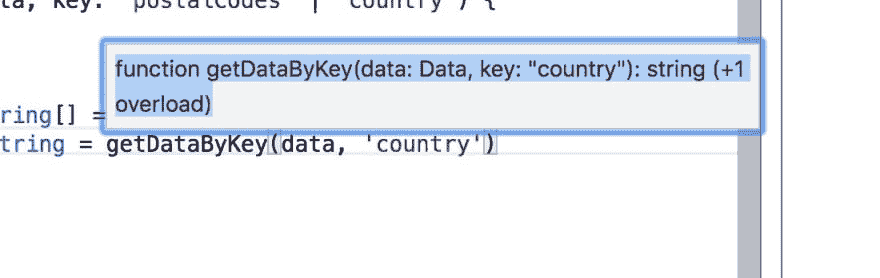

# TypeScript 函数重载

> 原文：<https://dev.to/krzysztofzuraw/typescript-function-overloads-1iff>

**注:这是来自** [我的简讯](https://krzysztofzuraw.com/newsletter)的交叉帖子。**每封邮件发出后，我都会公布。** [订阅](https://buttondown.email/krzysztof_zuraw) **以便在您的收件箱中更早获得更多类似内容！📧。**

**你好**👋🏻
今天我想写一点关于 TypeScript 中的函数重载。我将解释什么是函数重载以及如何实现。在下一节中，我将介绍为什么您可能想要重载您的函数，以及怎样做才是正确的方法。

在这篇文章中，我假设您至少对 TypeScript 有基本的了解。

**目录**

*   [什么](##what)
*   [为什么&如何](##why--how)
    *   [箭头函数中的函数重载](#function-overloads-in-arrow-function)
    *   [类方法中的函数重载](#function-overloads-in-class-methods)
*   [总结&TL；博士](##summary--tldr)

## 什么

函数重载是告诉 TypeScript 该函数可以接受不同参数的一种方式。
让我们跳到一个例子:

```
interface Data {
    postalCodes: string[];
    country: string;
}

const data: Data = {
    postalCodes: ['123', '422'],
    country: 'PL'
} 
```

Enter fullscreen mode Exit fullscreen mode

这是一个有点做作的例子，但它说明了这一点。我有一个实现接口`Data`的对象`data`。该对象有两把钥匙`postalCodes` & `country`，分别是`string[]`和`string`类型。

下面我有`getDataByKey`，它是获得`postalCodes`或`country`的助手。

```
function getDataByKey(data: Data, key: 'postalCodes' | 'country') {
    return data[key];
}

const postalCodesRetrieved: string[] = getDataByKey(data, 'postalCodes') 
```

Enter fullscreen mode Exit fullscreen mode

到目前为止，一切看起来都很好，但是在最后一行，我希望我的`postalCodesRetrieved`是一个字符串数组。然而编译器将返回错误:

```
Type 'string | string[]' is not assignable to type 'string[]'.
  Type 'string' is not assignable to type 'string[]'. 
```

Enter fullscreen mode Exit fullscreen mode

你可以在这个[链接](http://bit.ly/functionProblem)下找到有这个问题的游乐场。

## 为什么&如何

怎么修？可以使用函数重载:

```
function getDataByKey(data: Data, key: 'postalCodes'): string[]
function getDataByKey(data: Data, key: 'country') : string
function getDataByKey(data: Data, key: 'postalCodes' | 'country') {
    return data[key];
} 
```

Enter fullscreen mode Exit fullscreen mode

我为`getDataByKey`写两个重载:一个是把`country`作为`key`，返回`string`。另一个带`postalCodes`返回`string[]`。由于这个原因，我可以同时使用`getDataByKey`和

```
const postalCodesRetrieved: string[] = getDataByKey(data, 'postalCodes')
const countryCodesRetrieved: string = getDataByKey(data, 'country') 
```

Enter fullscreen mode Exit fullscreen mode

你甚至可以看到这个函数被悬停过载:
[](https://res.cloudinary.com/practicaldev/image/fetch/s--42As3d7h--/c_limit%2Cf_auto%2Cfl_progressive%2Cq_auto%2Cw_880/https://i.imgur.com/RrQOA0a.jpg)

[用上面的代码将](http://bit.ly/functionOverload)链接到 TypeScript playground。

### [箭头函数中的](#function-overloads-in-an-arrow-function)函数重载

```
interface GetData {
    (data: Data, key: 'postalCodes'): string[];
    (data: Data, key: 'country'): string
}

const getData: GetData = (data, key) => {
    return data[key];
}

const postalCodesRetrieved: string[] = getData(data, 'postalCodes');
const counryRetrieved: string = getData(data, 'country'); 
```

Enter fullscreen mode Exit fullscreen mode

这是通过发生过载的`GetData`接口工作的。幸亏我不再需要输入`data` & `key`的参数了。[游乐场链接](http://bit.ly/arrowOverload)

### 类方法中的函数重载

```
class DataGetter {
    getData(data: Data, key: 'country'): string;
    getData(data: Data, key: 'postalCodes'): string[];
    getData(data: Data, key: 'postalCodes' | 'country') {
        return data[key];
    };
}

const dataGetter = new DataGetter();

const postalCodesRetrieved: string[] = dataGetter.getData(data, 'postalCodes')
const counryRetrieved: string = dataGetter.getData(data, 'country') 
```

Enter fullscreen mode Exit fullscreen mode

它看起来和普通函数几乎一样，但是这里的`getData`方法被重载了。[游乐场链接](http://bit.ly/methodOverload)

## 总结&TL；速度三角形定位法(dead reckoning)

在这篇文章中，我介绍了一种告诉 TypeScript 相同的函数可以用不同的参数调用或者返回不同的结果的方法。这是一个函数重载。你也可以重载类方法。在最简单的例子中，你需要在函数定义的顶部写一个覆盖函数的声明。

你用它吗？如果有，在哪里？在下面留言。

你可以在这里找到所有游乐场的链接:

*   [问题](http://bit.ly/functionProblem)
*   [功能过载](http://bit.ly/functionOverload)
*   [箭头功能过载](http://bit.ly/arrowOverload)
*   [类方法重载](http://bit.ly/methodOverload)