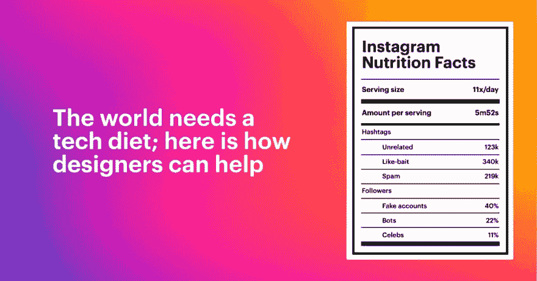

# 设计师如何帮助打破为上瘾而设计的怪圈？

> 原文：<https://dev.to/uxcollective/how-can-designers-help-break-the-cycle-of-designing-for-addiction-5djm>

#### 我们是时候在感觉良好的设计&道德委员会和我们作为数码产品设计师的日常工作之间架起一座桥梁了。

如果你每天都在使用数码产品，你可能已经经历过[设计模式](https://www.darkpatterns.org/)的扩散，它们试图操纵你更深入、更深入或更长久地参与。

渴望点击和浏览的技术平台总是在寻找新的方式来利用人类的基本本能，如羞耻、懒惰和恐惧。从社交网络应用到流媒体平台，数字垃圾食品向用户承诺短期快感，但随之而来的是压抑的存在性平静。

结果呢？我们与技术的关系变得越来越依赖、后悔和失控。

虽然我们每天构建的产品都在发展，但自拨号上网时代以来，我们思考用户参与的方式几乎没有改变。我们假设度量标准越高，企业就越成功，因此产品设计师就越聪明。

> 在过去的几十年里，我们帮助建立了一种企业文化，系统地将短期收益置于长期产品健康之上。

### 作为设计师，我们如何打破为上瘾的参与而设计的循环？

改变必须从某处开始。看到我们的想法/意图和我们每天做的工作之间的差距，我们决定创建一个更实用的指南来激发变化。

我们的第三篇也是最新的 UX 文章提供了一个起点，即我们可以应用于我们的设计、我们的流程、我们的公司、我们的社区和我们的个人生活的**实用想法**,开始打破为上瘾而设计的常规循环。

希望你喜欢阅读:
[https://essays.uxdesign.cc/tech-diet/](https://essays.uxdesign.cc/tech-diet/)

* * *