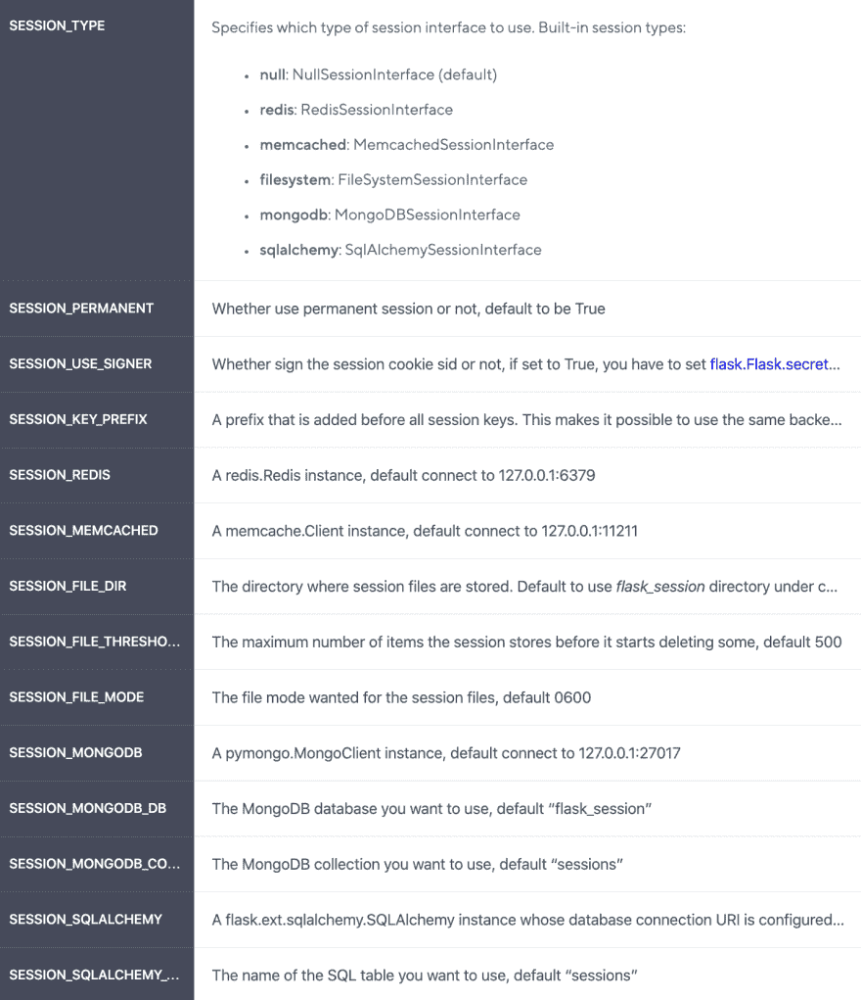
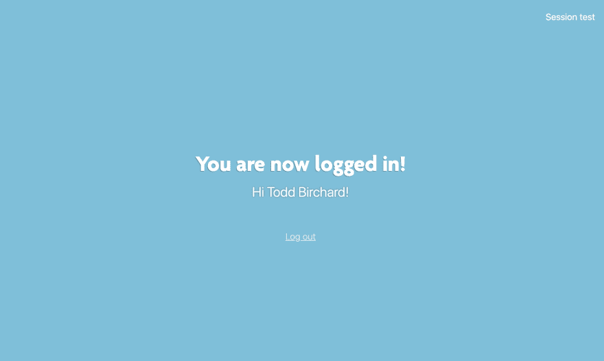
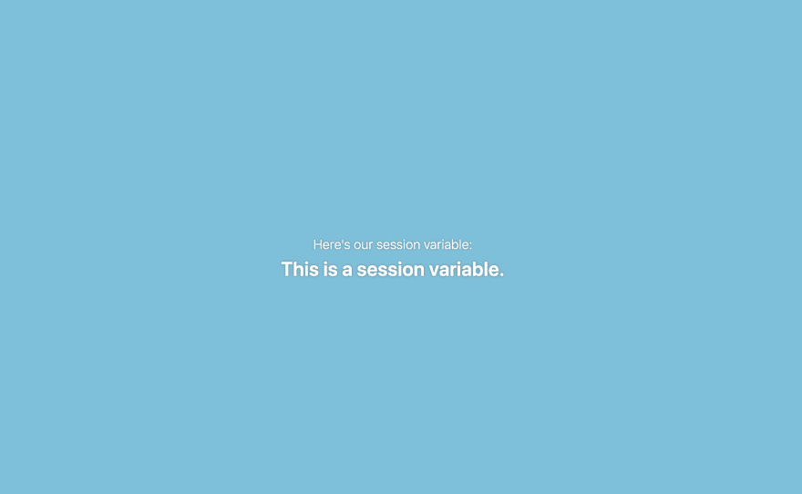
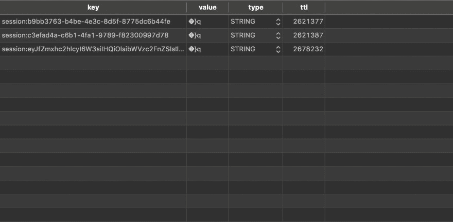

# 使用 Flask-Session & Redis 管理会话数据

> 原文：<https://dev.to/hackersandslackers/managing-session-data-with-flask-session-redis-360n>

[](https://res.cloudinary.com/practicaldev/image/fetch/s--XJ1KIWYS--/c_limit%2Cf_auto%2Cfl_progressive%2Cq_auto%2Cw_880/https://res-1.cloudinary.com/hackers/image/upload/q_auto/v1/2019/12/flask-session2%402x.jpg)

当我们构建处理用户的应用程序时，很多功能依赖于为用户存储会话变量。考虑一个典型的收银推车:在任何电子商务网站上，一个被废弃的推车在用户放弃后很久还会保留它的内容。购物车有时甚至可以跨设备保存其内容！要构建这样的功能，我们不能依赖 Flask 存储会话变量的默认方法，它是通过本地存储的浏览器 cookies 来实现的。相反，我们可以使用云键/值存储，如 [Redis](https://redis.io/) ，并利用一个名为 [Flask-Session](https://pythonhosted.org/Flask-Session/) 的插件。

Flask-Session 是一个 Flask 插件，它能够利用诸如 **Redis** 、 **Memcached** 、 **MongoDB** 、**关系数据库**等方法来实现服务器端缓存的简单集成。在这些选择中，Redis 是一个特别有吸引力的选择。

Redis 是用 C 编写的 NoSQL 数据存储库，目的是当用户盲目浏览你的站点时，在内存中临时保存数据。Redis 就是为了这个目的而设计的，速度极快，在 [Redis 实验室](https://redislabs.com/)上创建一个免费实例时可以免费使用。

## 熟悉烧瓶-会话

要了解 Flask-Session 的产品，最好从 Flask-Session 接受的设置开始:

[](https://res.cloudinary.com/practicaldev/image/fetch/s--hn1FRfv9--/c_limit%2Cf_auto%2Cfl_progressive%2Cq_auto%2Cw_880/https://i.imgur.com/5jTkG6N.png)

即使乍一看，也很容易理解我们的选择是什么。

### 安装

首先，我们需要安装两个库:`Flask-Session`和`Redis`:

```
$ pip3 install flask-session redis 
```

### 配置

接下来，我们需要配置我们的应用程序。在我们的 **config.py** 文件中，我们需要用`import redis`导入 Redis 库(我们一会儿就会讲到)。接下来，我们需要在 **config.py** 中设置以下变量:

*   **SECRET_KEY** :没有密钥，Flask-Session 无法工作；将它设置为一个随机的字符串是很重要的(和往常一样，确保这是安全的)。
*   **SESSION_TYPE** :为了我们的目的，将被设置为`SESSION_TYPE=redis`。
*   **SESSION_REDIS** :我们云托管的 REDIS 实例的 URI。Redis URIs 的结构有点独特:`redis://:[password]@[host_url]:[port]`。

使用 URI 的 Redis 实例的完整配置如下所示:

```
SESSION_REDIS = redis.from_url(environ.get('SESSION_REDIS')) 
```

如果你的配置有问题，请随意借用我的(这会从**中提取值)。env)** :

```
"""App configuration."""
from os import environ
import redis

class Config:
    """Set Flask configuration vars from .env file."""

    # General Config
    SECRET_KEY = environ.get('SECRET_KEY')
    FLASK_APP = environ.get('FLASK_APP')
    FLASK_ENV = environ.get('FLASK_ENV')

    # Flask-Session
    SESSION_TYPE = environ.get('SESSION_TYPE')
    SESSION_REDIS = redis.from_url(environ.get('SESSION_REDIS')) 
```

### 初始化烧瓶会话应用程序

我们已经知道了很多关于 [Flask 应用工厂](https://hackersandslackers.com/demystifying-flask-application-factory/)以及如何初始化其他 Flask 插件，比如 Flask-SQLAlchemy 和 Flask-Login。Flask-Session 的初始化方式相同:我们先设置一个全局变量，然后用`sess.init_app(app)`初始化插件。这是一个 **__init__ 的例子。py** 文件初始化 Flask-Session、Flask-SQLAlchemy 和 Flask-Login(这建立在我们用来实现 Flask-Login 的[源代码之上):](https://hackersandslackers.com/series/building-flask-apps/)

```
"""Initialize application."""
from flask import Flask
from flask_sqlalchemy import SQLAlchemy
from flask_login import LoginManager
from flask_session import Session

db = SQLAlchemy()
login_manager = LoginManager()
sess = Session()

def create_app():
    """Construct the core application."""
    app = Flask( __name__ , instance_relative_config=False)

    # Application Configuration
    app.config.from_object('config.Config')

    # Initialize Plugins
    db.init_app(app)
    login_manager.init_app(app)
    sess.init_app(app)

    with app.app_context():
        # Import parts of our application
        from . import routes
        from . import auth
        app.register_blueprint(routes.main_bp)
        app.register_blueprint(auth.auth_bp)

        # Create Database Models
        db.create_all()

        return app 
```

初始化 Flask-Session 后，我们就可以看到它是如何工作的了！

## 让我们弄点变数

Flask-Session 的酷之处在于它扩展了 Flask native `session`对象。一旦我们将 Flask 应用程序配置为使用 Flask-Session(就像我们已经做的那样)，我们就可以使用 Flask session 变量，就像我们仍然使用 cookies 一样。首先，我们简单地用下面的代码行从`flask`导入`session`:`from flask import session`。让我们回顾一下在 Flask 会话中管理值的基础知识:

### 设定一个值

在会话中设置变量看起来很像为任何旧的 Python 字典对象设置值:

```
session['key'] = 'value' 
```

### 检索一个值

将一个值保存到我们的会话中，我们可以使用`.get()`来检索和重用它:

```
session_var_value = session.get('key') 
```

### 删除一个值

如果我们保存的值已经被使用并且不再需要，我们可以使用`.pop()`从我们的会话中删除变量:

```
session.pop('key', None) 
```

## 演示环节

为了查看会话的运行情况，我们将创建几个路由，用于创建和显示保存到会话中的值。首先，我们将在应用程序主页的 route 中设置一个会话变量。接下来，我们将为显示此变量的特定目的创建一条路线:

```
"""Routes for logged-in application."""
from flask import Blueprint, render_template, session
from flask_login import current_user
from flask import current_app as app
from .assets import compile_auth_assets
from flask_login import login_required

# Blueprint Configuration main_bp = Blueprint('main_bp', __name__ ,
                    template_folder='templates',
                    static_folder='static')
compile_auth_assets(app)

@main_bp.route('/', methods=['GET'])
@login_required
def dashboard():
    """Serve logged in Dashboard."""
    session['redis_test'] = 'This is a session variable.'
    return render_template('dashboard.html',
                           title='Flask-Session Tutorial.',
                           template='dashboard-template',
                           current_user=current_user,
                           body="You are now logged in!")

@main_bp.route('/session', methods=['GET'])
@login_required
def session_view():
    """Route which displays session variable value."""
    return render_template('session.html',
                           title='Flask-Session Tutorial.',
                           template='dashboard-template',
                           session_variable=str(session['redis_test'])) 
```

乍一看，我们的应用主页上似乎没有发生任何事情:

<figure>[](https://res.cloudinary.com/practicaldev/image/fetch/s--7TsWB-t6--/c_limit%2Cf_auto%2Cfl_progressive%2Cq_auto%2Cw_880/https://storage.googleapis.com/hackersandslackers-cdn/2019/07/homepage.png) 

<figcaption>我们 Flask app 的登录首页。</figcaption>

</figure>

在幕后，我们设置了一个名为`redis_test`的会话变量。当我们导航到[http://127 . 0 . 0 . 1:5000/session](http://127.0.0.1:5000/session)时，我们可以看到这样的显示:

<figure>[](https://res.cloudinary.com/practicaldev/image/fetch/s--OfqZl7zA--/c_limit%2Cf_auto%2Cfl_progressive%2Cq_auto%2Cw_880/https://storage.googleapis.com/hackersandslackers-cdn/2019/07/variable.png) 

<figcaption>显示烧瓶会话变量的值。</figcaption>

</figure>

我们不仅创建了一个可以跨视图持久化的值，而且因为我们已经将这个值存储在 cloud Redis 实例中，所以它也应该跨设备持久化。我使用 GUI 连接到我的 Redis 实例，这是返回的结果:

<figure>[](https://res.cloudinary.com/practicaldev/image/fetch/s--pXrJs8tK--/c_limit%2Cf_auto%2Cfl_progressive%2Cq_auto%2Cw_880/https://storage.googleapis.com/hackersandslackers-cdn/2019/07/table.png) 

<figcaption>对我们 Redis 实例的看法。</figcaption>

</figure>

啊，我们存储的密钥和值都被加密了！这就是为什么尽早设置我们的密钥如此重要。然而，我们可以看到我们的会话变量被成功地解耦了。不依赖于用户的浏览器或我们的应用程序的本地服务器，用户会话变量在云中很好也很舒适。

## 弄脏你的手

当然，最好的学习方法是实践。对于任何感兴趣的人来说，我已经把这个教程的源代码上传到 Github 这里:[https://github.com/hackersandslackers/flasksession-tutorial](https://github.com/hackersandslackers/flasksession-tutorial)。

这是构建 Flask 应用程序的又一集！加入我们下次当我们...嗯，我还不确定。无论如何加入我们吧！和平家庭。