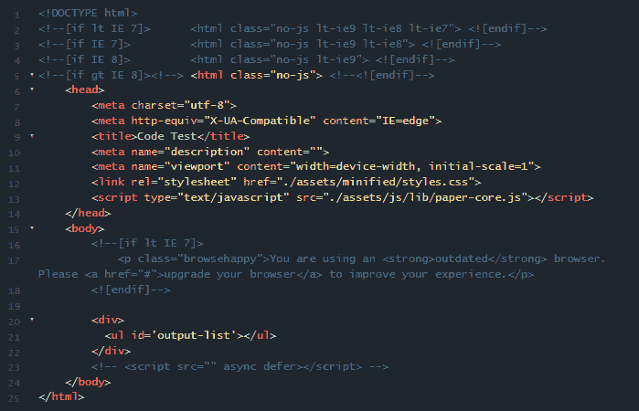
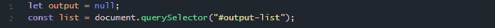
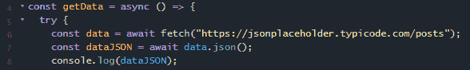
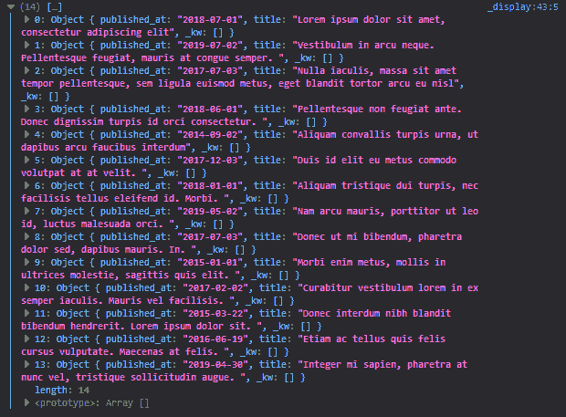
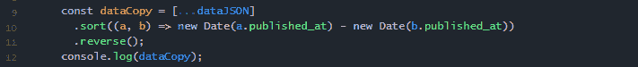
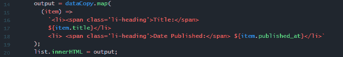
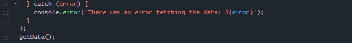
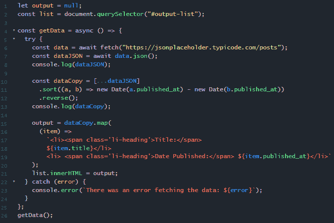
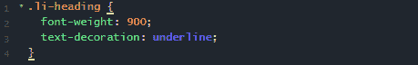
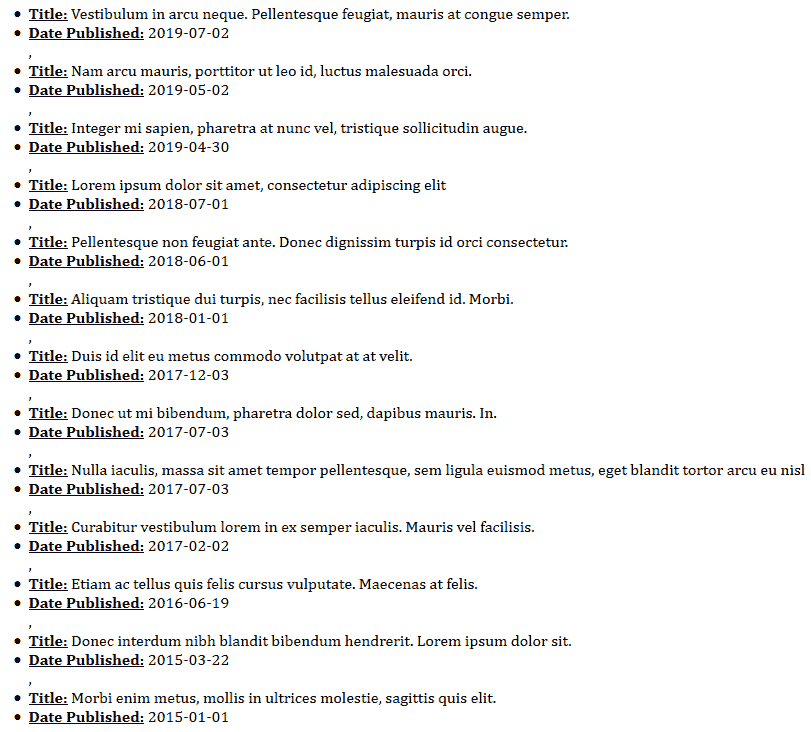

# 征服工作面试代码挑战 1.0 版

> 原文：<https://dev.to/jsgoose/conquering-job-interview-code-challenges-v1-0-2mh>

<figure> 

<figcaption>照片由[读取](https://unsplash.com/photos/nsexDkLGC-c?utm_source=unsplash&utm_medium=referral&utm_content=creditCopyText)【on】[【un flash】](https://unsplash.com/?utm_source=unsplash&utm_medium=referral&utm_content=creditCopyText)</figcaption>

</figure>

正如你们中的许多人所知，我已经申请了几周的 web 开发工作，我认为分享一些我遇到的编码挑战是一个好主意。(*补充说明，如果你知道或者有任何可用的网络开发人员职位，如果你能在这里的评论中或者在 [Twitter](https://twitter.com/jj_goose) :D* 上与我分享，我将不胜感激

不仅如此，我还会分享我解决这些挑战的方法。诚然，有许多方法可以解决这些挑战，但这些是我的方法。如果你有不同的方法，那太好了，我希望你能和我分享！

我不会分享任何关于该公司的身份信息或该公司面试过程的细节，以保持过程的完整性。

好吧，那我们开始吧。

## 挑战

这是我最近接到的一个挑战，我觉得很有把握解决:

***任务:从一个端点按时间倒序返回一个基本样式的帖子列表***

为了保护公司和他们的信息，我不会分享我返回信息的 URL，而是在下面的代码中有一个来自 [JSONPlaceholder](https://jsonplaceholder.typicode.com/) 的通用链接(当您需要获取一些通用外部数据时，这是一个非常棒的免费开源 API)。

这是我开始使用的 HTML，这样我们就有东西来显示我们的结果了:

<figure> 

<figcaption>基本 HTML 样板</figcaption>

</figure>

*< ul >* 标签有一个 id，因此我们可以在稍后的过程中对其进行样式化。

## 从端点获取数据

好了，让我们深入研究一下这个挑战的 JavaScript 部分。首先，我喜欢设置我的输出和显示变量:

<figure> 

<figcaption>显示返回代码时使用的变量</figcaption>

</figure>

我使用 *let* 作为 *输出* 变量，并将其设置为 *null* ，因为我们稍后将在代码中更改它的值。 *列表* 变量用*常量*声明，因为它的值不会改变g。

<figure> 

<figcaption>从端点</figcaption>

</figure>

获取数据

在上面的例子中，我们声明了一个名为 *getData* 的[箭头函数](https://developer.mozilla.org/en-US/docs/Web/JavaScript/Reference/Functions/Arrow_functions)包装在一个 [try 中...catch](https://developer.mozilla.org/en-US/docs/Web/JavaScript/Reference/Statements/try...catch) 块(这是一个更干净/更容易使用/读取的语法，它使用了*[Promises](https://developer.mozilla.org/en-US/docs/Web/JavaScript/Guide/Using_promises)*——你也可以在下面看到 *catch* 部分)。因为我们是异步获取数据，所以我们还需要利用 *[async/await](https://developer.mozilla.org/en-US/docs/Web/JavaScript/Reference/Operators/await)* 来获取数据。这是我最喜欢的方法，但我知道还有许多其他方法可以从终端获取数据，所以请随意分享您的:D

一旦我们声明了我们的*数据*变量，接下来的事情就是设置一个变量来将返回的数据转换成一个 JSON 对象，这样我们就可以以一种可用的形式获得它。我们用*和[来做。](https://developer.mozilla.org/en-US/docs/Web/API/Body/json)JSON()*法。我们也在等待数据，因为如果我们省略了 *await* 关键字，JavaScript 会尝试将*数据*变量转换成 JSON，但是数据还没有出现，因为它来自异步 API。

<figure> 

<figcaption>我们辉煌的数据！</figcaption>

</figure>

作为本节的最后一行，我们 *console.log* 我们从 API 端点获取的数据，只是为了确保我们得到了我们想要的一切。我们有一个装满对象的数组。您还会注意到键 *published_at* 保存了我们的日期，它们没有任何类型的顺序。它们的格式也不是简单的代表年份的四位数，这使得将它们过滤成 ***倒序*** 很容易。我们会处理好的。

## 操纵我们的数据

<figure> 

<figcaption>制作数据变量的副本</figcaption>

</figure>

这里我们声明变量 *dataCopy* ，它指向通过 *[扩展运算符(...)](https://developer.mozilla.org/en-US/docs/Web/JavaScript/Reference/Operators/Spread_syntax)T7】。本质上，我们复制我们返回的 JSON 数据，这样我们就不会操纵原始数据(不好的做法),同时把它变成一个数组，这样我们就可以迭代它。*

之后，我们对这个数组进行排序。Sort 是一个非常有用的数组方法，它会根据我们传递给 *sort 的函数将数组索引放入我们选择的顺序中。*

通常，我们可能希望根据值(从最大到最小)对数据进行排序，因此我们从参数***【b】***中减去参数**。但是因为我们需要以**倒序显示我们的结果，所以我决定生成一个新的日期(通过 *[new](https://developer.mozilla.org/en-US/docs/Web/JavaScript/Reference/Operators/new)* 操作符和 JavaScript 内置方法 *[Date](https://developer.mozilla.org/en-US/docs/Web/JavaScript/Reference/Global_Objects/Date)* 实现，该方法创建了一个新的独立于平台的格式化日期实例。现在，因为 ***a*** 和 ***b*** 表示位于数组索引中的对象，所以我们可以访问这些对象中的键/值对。因此，我们从 *a.published_at* 中减去 *b.published_at* ，这将给出我们在 ***中的日期，倒序为*** 。****

 ****## 展示我们的劳动成果

还记得我们在程序顶部将 *输出* 变量设置为*空值*吗？现在是时候闪耀了！

<figure> 

<figcaption>那个输出变量现在是赚它的养！</figcaption>

</figure>

这里有几件事。首先，我们通过使用 *[map](https://developer.mozilla.org/en-US/docs/Web/JavaScript/Reference/Global_Objects/Array/map)* 方法映射我们的 *dataCopy* 变量，将我们的 *输出* 变量设置为一个新值。此方法返回一个新数组，该数组包含为每个索引调用一次所提供的函数的结果。 *item* 参数表示从端点返回的数组中的对象，因此可以访问它们的所有属性，如 *title* 和 *published_at* 。

我们返回两个列表元素，每个元素内部都有一个*<>*(用于样式目的)，还有一个字符串用于标题**标题**和标题**出版日期**。其中，我们有使用[模板文字](https://developer.mozilla.org/en-US/docs/Web/JavaScript/Reference/Template_literals)来设置每篇文章的标题和日期的变量。

然后，我们设置我们的 *列表* 变量的 *[innerHTML](https://developer.mozilla.org/en-US/docs/Web/API/Element/innerHTML)* 等于我们的 *输出* 变量。

最后，我们有我们的*尝试的结束括号和错误处理...catch* 块以及我们的函数调用:

<figure> 

<figcaption>这段代码将处理任何错误并将它们显示在控制台
</figcaption>

</figure>

## 最终代码

下面是我们的完整代码体现在的样子:

<figure> 

<figcaption>我们的全部代码库</figcaption>

</figure>

这是我们基本的 CSS 样式:

<figure> 

<figcaption>我说基本造型了吗？我指的是基本的:D</figcaption>

</figure>

这是我们对它最基本的造型的研究结果:

<figure> 

<figcaption>是不是很美？</figcaption>

</figure>

正如你所看到的，我们完成了我们计划要做的事情，事实上清单是按照**的倒序排列的。耶！**

 *** * *

我希望你喜欢我的思考过程和我是如何解决这个挑战的。当然，有很多方法可以完成这个，所以请和我分享你的方法吧！我很高兴继续这个系列，并会在我经历了另一个挑战后发布另一个！

这篇文章最初发表在我的博客上。既然你在那里，为什么不订阅我的每月**时事通讯**——我保证我不会给你的收件箱发垃圾邮件，你的信息也不会与任何人/网站分享。我喜欢偶尔发送我发现的有趣资源、关于 web 开发的文章以及我的最新帖子列表。

此外，我在[媒体](https://medium.com/@joncsexton)上交叉发布了我的大部分文章，所以你也可以在那里找到我的作品！

祝你有一个充满爱、快乐和编码的美好的一天！******