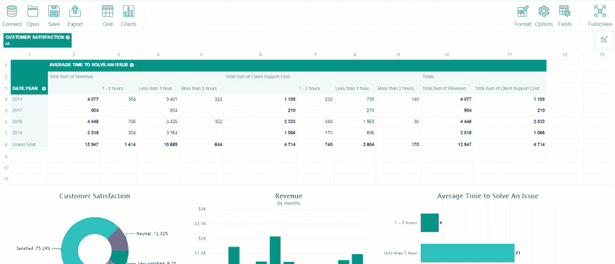
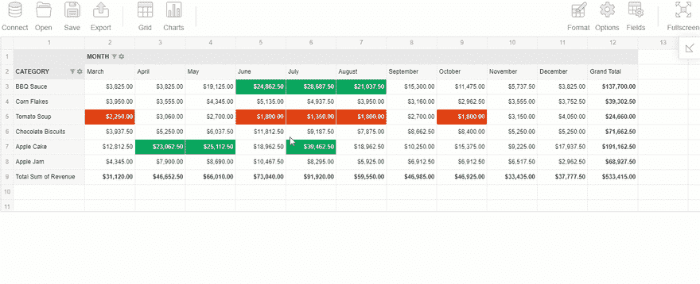
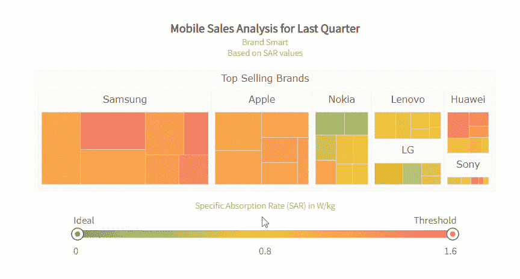
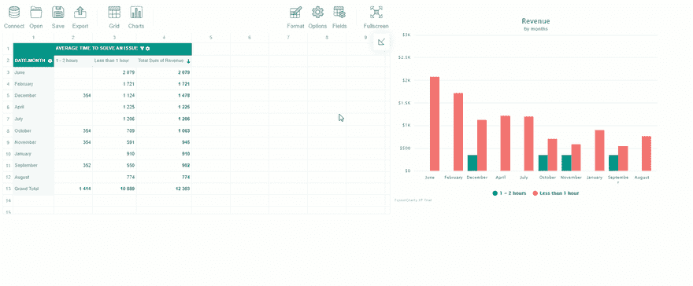

# 如何在 React 中创建业务数据仪表板

> 原文：<https://dev.to/veronikaro/how-to-create-a-business-data-dashboard-in-react-1gjb>

[](https://res.cloudinary.com/practicaldev/image/fetch/s--tlcD_g20--/c_limit%2Cf_auto%2Cfl_progressive%2Cq_auto%2Cw_880/https://www.webdatarocks.com/wd_uploads/2019/05/Copy-of-Pivot-Table-with-chart.js-5.png)

您是否尝试过在 React 应用程序中创建并嵌入数据仪表板？如果是这样，您可能知道找到符合特定项目需求的正确的数据可视化工具是一项挑战。让我概述一下主要要求:

*   *性能高于一切*。仪表板应该可以在任何浏览器和设备上流畅运行。
*   易于与应用程序的底层基础设施集成。
*   大量支持数据分析的数据源(CSV、JSON、数据库)。
*   仪表板应提供基本的报告功能，例如:

1.  ***聚合*** 原始数字。
2.  交互式 ***按日期和值过滤***
3.  ***排序*** 升序&降序以及定义自定义排序规则的能力。
4.  ***分组*** 单独维度下的数据。
5.  钻取数据。

*   重要的数据可视化功能包括:

1.  大量图表可用于*比较值*，显示数据的*成分*或*分布*，分析一段时间内的*趋势*或表达变量之间的*关系*。
2.  ***交互性*** 。最终用户应该能够与图表上的元素进行交互。

*   *定制选项*如款式&主题。
*   将结果导出到 PDF 和 Excel。
*   事件系统。要定义与组件交互的自定义场景，应该支持事件。

今天我想和你们分享我对使用满足上述需求的工具的想法，并像魔咒一样一起工作。

作为本文的第二部分，我将带您完成在 **React** 应用程序中创建仪表板的过程。您只需要使用两个 JavaScript 库和一点想象力:)

## 你会得到什么

仪表板由两部分组成——分析部分和可视化部分。第一个是**数据透视表**，负责执行*聚合*和*过滤*我从 [MongoDB](https://www.mongodb.com/?r=dt2) 数据库中提取的原始数据，第二个是**图表库**，用于以*吸引人的图表*的形式显示这些数据。

在我看来，这两个组件是任何仪表板不可避免的部分。虽然数据透视表本身承担了所有必要的数据转换，但图表使这些数据更容易为受众所理解。

完成本教程后，您将看到一个仪表盘预览:

[](https://res.cloudinary.com/practicaldev/image/fetch/s--vkj9SQMI--/c_limit%2Cf_auto%2Cfl_progressive%2Cq_66%2Cw_880/https://www.webdatarocks.com/wd_uploads/2019/05/ResultingDashboardTealTheme.gif)

值得一提的是，您可以在事后保存您的结果:数据透视表允许[生成 PDF、Excel、CSV、HTML 和 PNG](https://www.flexmonster.com/doc/export-and-print/?r=dt2) 格式的报告，图表可以[导出为 PDF 或图像](https://www.fusioncharts.com/dev/exporting-charts/using-fc-export-server/exporting-charts-as-image-and-pdf/?r=dt2)。

*没时间看完整本教程*？直接跳到最后一段，找到 CodePen 演示的链接来玩。

让我们从介绍库开始。

### 透视表

[Flexmonster 数据透视表&图表](https://www.flexmonster.com/?r=dt2)是一个客户端数据透视表组件，我强烈推荐将其作为嵌入式 BI 解决方案的一部分。它可以与 React 和其他 JavaScript 框架顺利集成。但是，首先，它有丰富的数据来源: **CSV** 、 **JSON** 、 **SQL** 和 **NoSQL** 数据库，以及 **Elasticsearch** 。第二个伟大的事情是一个交互式功能，可从其用户界面*访问。可以在运行时轻松地聚合、过滤和排序数据:*

[](https://res.cloudinary.com/practicaldev/image/fetch/s---Io1QKQY--/c_limit%2Cf_auto%2Cfl_progressive%2Cq_66%2Cw_880/https://www.webdatarocks.com/wd_uploads/2019/05/AggregationChangeFiltering.gif)

此外，它广泛的 API 允许定义交互行为和改变组件的外观。我特别喜欢的是 [customizeCell](https://www.flexmonster.com/demos/cell-renderer-demo/?r=dt2) API 调用——它有助于重新设计特定单元格的内容。另一个定制特性是类似于 Excel 中的*条件*和*数字格式*。此外，可以选择一个具有不同*聚合函数*的字段，或者创建自定义计算值。当您需要跟踪重要的销售和营销指标时，后一种功能非常有用。

### 图表库

FusionCharts 是一个图表库，可以与多个 JavaScript 框架一起工作，React 是其中之一。它受到全球众多开发者的喜爱，这是有原因的。我最喜欢的是使用的便利性。您可以毫不费力地在壮观的图表中显示任何数据——[演示](https://www.fusioncharts.com/fusiontime/examples/?r=dt2)已经准备好帮助您开始数据可视化世界的旅程。另一个显著的特性是能够通过配置属性来改变图表的主题、标签、工具提示和图例。

了解如何在树形图中可视化分层数据:

[](https://res.cloudinary.com/practicaldev/image/fetch/s--YKrKmQhO--/c_limit%2Cf_auto%2Cfl_progressive%2Cq_66%2Cw_880/https://www.webdatarocks.com/wd_uploads/2019/05/FusionTreemap.gif)

## 集成 Flexmonster 和 FusionCharts

要让两个组件一起工作，您需要初始化它们，然后进行集成。整个过程非常简单:

1.  安装 Flexmonster 依赖项。
2.  安装 FusionCharts 依赖项。
3.  初始化数据透视表并将数据输入其中。
4.  基于这些数据创建您的报告。
5.  一旦数据透视表准备好提供数据，就初始化图表。

稍后，您将看到您可以随时返回到第 4 步，以便更改报告、将更新的数据传递到图表并获得新的见解。

由于每一点都需要更多的解释，所以让我们更深入地了解细节。

### 安装透视表

在创建了一个单页 [React 应用](https://facebook.github.io/create-react-app/docs/getting-started/?r=dt2)之后，你需要安装 Flexmonster 作为一个 *npm 包*，并把一个透视表渲染到一个 HTML 容器:

```
<script src="https://cdn.flexmonster.com/flexmonster.js"></script>
<div id="fm-component"></div> 
```

Enter fullscreen mode Exit fullscreen mode

```
 ReactDOM.render( <
    FlexmonsterReact.Pivot toolbar = {
        true
    }
    width = {
        "100%"
    }
    componentFolder = "https://cdn.flexmonster.com/"
    report = {
        {
            "dataSource": {
                dataSourceType: "ocsv",
                filename: "http://localhost:3000/data"
            }
        }
    }
    />,
    document.getElementById("fm-component"))
); 
```

Enter fullscreen mode Exit fullscreen mode

### 连接你的数据源

现在是时候将数据加载到组件中了。使用 MongoDB 的连接器，我设法建立了与 MongoDB 数据库的连接，并从中提取数据。使用[本教程](https://www.flexmonster.com/doc/mongodb-connector/?r=dt2)也可以这样做。

### 根据数据创建报表

首先，定义需要在网格上显示的数据部分。报告的这个子集称为切片。在这里，您可以将层次结构分为行、列、度量，并设置所有的过滤器和/或排序。

我试着按月过滤数据，以显示两个月的收入。

这是可以作为报告一部分的切片示例:

```
"slice": {
    "rows": [{
        "uniqueName": "Date.Month"
    }],
    "columns": [{
        "uniqueName": "[Measures]"
    }],
    "measures": [{
        "uniqueName": "Revenue",
        "aggregation": "sum"
    }]
} 
```

Enter fullscreen mode Exit fullscreen mode

现在，您的数据透视表呈现出来，并填充了您想要关注的数据。

### 安装制图库

设置 FusionCharts 也不是问题——遵循与 React 指南的[集成可以成功地将组件嵌入到您的项目中。在安装了它的 *npm 包*之后，创建一个`<div>`容器，图表应该呈现在这个容器中:](https://www.fusioncharts.com/react-charts/?r=dt2) 

```
<script src="https://cdn.fusioncharts.com/code/latest/react-fusioncharts.js"></script>
<script type="text/javascript" src="https://unpkg.com/react-fusioncharts@2.0.1/dist/react-fusioncharts.min.js"></script>
<div id="chart-container"></div> 
```

Enter fullscreen mode Exit fullscreen mode

为了能够应用不同的主题，导入必要的脚本:

```
<script src="https://static.fusioncharts.com/code/latest/themes/fusioncharts.theme.gammel.js"></script>
<script src="https://static.fusioncharts.com/code/latest/themes/fusioncharts.theme.candy.js"></script> 
```

Enter fullscreen mode Exit fullscreen mode

### 以图表形式显示表格中的数据

FusionCharts 库的每个图表都接受不同格式的 JSON 数据。因此，您需要预处理从数据透视表中请求的数据，并将其提供给图表。有一个简单的方法——只需添加 Flexmonster 的连接器来处理适当类型图表的数据。
下面是要导入的脚本:

```
<script src="https://cdn.flexmonster.com/flexmonster.fusioncharts.js"></script> 
```

Enter fullscreen mode Exit fullscreen mode

现在，来自该连接器的方法在您的应用程序中可用了。

接下来，您需要实现以下逻辑:

*   等到数据透视表呈现并准备好提供数据(为此，您可以监听`reportcomplete`事件)。
*   通过使用`flexmonster.fusioncharts.getData()` API 调用从报告中请求数据。
*   准备这些数据，并将其传递给`callbackHandler`和`updateHandler`，在这里首次创建图表并相应更新。

下面是一个定义`createChart()`函数的例子:

```
function createChart() {
    flexmonster.fusioncharts.getData({
        type: "doughnut2d",
        "slice": {
            "rows": [{
                "uniqueName": "Customer Satisfaction"
            }],
            "columns": [{
                "uniqueName": "[Measures]"
            }],
            "measures": [{
                "uniqueName": "Requests",
                "aggregation": "sum"
            }]
        }
    }, drawChart, updateChart);
}

function drawChart(data) {
    var chartConfigs = {
        type: 'doughnut2d',
        width: '500',
        height: '350',
        dataFormat: 'json'
    };
    data.chart.caption = "Customer Satisfaction";
    chartConfigs.dataSource = data;
    ReactDOM.render( <
        ReactFC {
            ...chartConfigs
        }
        />,
        document.getElementById('chart-container')
    );
}

function updateChart(data) {
    var chartConfigs = {
        type: 'doughnut2d',
        width: '500',
        height: '350',
        dataFormat: 'json'
    };
    data.chart.caption = "Customer Satisfaction";
    chartConfigs.dataSource = data;
    ReactDOM.render( <
        ReactFC {
            ...chartConfigs
        }
        />,
        document.getElementById('chart-container')
    );
} 
```

Enter fullscreen mode Exit fullscreen mode

并将`createChart()`函数附加到`reportcomplete`作为事件处理程序:

```
reportcomplete = {
    createChart
} 
```

Enter fullscreen mode Exit fullscreen mode

这些片段显示了如何在页面上创建单个图表，但是您可以用类似的方式定义任意多个图表。

### 增加额外的视觉功能

需要*个性化您仪表板的外观*？您可以更改图表/数据透视表的特定元素的颜色，也可以对它们应用预设的主题。或者两者都有:)

就我个人而言，我认为 Flexmonster 的蓝绿色主题是最引人注目的主题之一。为了使图表适合数据透视表的调色板，我为数据绘图指定了调色板。您可以通过[属性](https://www.fusioncharts.com/dev/chart-attributes/?r=dt2)配置图表。

## 结果

保存您的结果，并查看图表如何与您应用于报告的更改进行交互:

[](https://res.cloudinary.com/practicaldev/image/fetch/s--NNV_1ALd--/c_limit%2Cf_auto%2Cfl_progressive%2Cq_66%2Cw_880/https://www.webdatarocks.com/wd_uploads/2019/05/LightFusionFM.gif)

### 汇集一切

今天，您已经学习了如何使用分析业务仪表板增强 React 应用程序。

在我看来，这两个数据可视化工具(数据透视表和图表库)完全是互补的。在他们的帮助下，您可以在几分钟内创建一个非常棒的仪表板。我鼓励你试验你的数据，并尝试多种方式来呈现数据。

请分享你的结果-我会很高兴看到它们！

感谢您的阅读！

## 演示

在 CodePen 上玩[现场演示👩‍💻👨‍💻](https://codepen.io/ronika/pen/ZNaBxv/?r=dt2)

### 推荐阅读

让我与您分享所有帮助我了解如何在 React 项目中使用 Flexmonster 和 FusionCharts 的有用链接:

*   [如何创建 React 应用](https://github.com/facebook/create-react-app/?r=dt2)
*   [如何将 Flexmonster 与 React 集成](https://www.flexmonster.com/doc/integration-with-react/?r=dt2)
*   [如何将 Flexmonster 与 FusionCharts 集成](https://www.flexmonster.com/demos/integration-fusioncharts/?r=dt2)
*   [对用于融合的成分进行反应](https://www.fusioncharts.com/react-charts/?r=dt2)
*   [FusionCharts 画廊](https://www.fusioncharts.com/charts/?r=dt2)