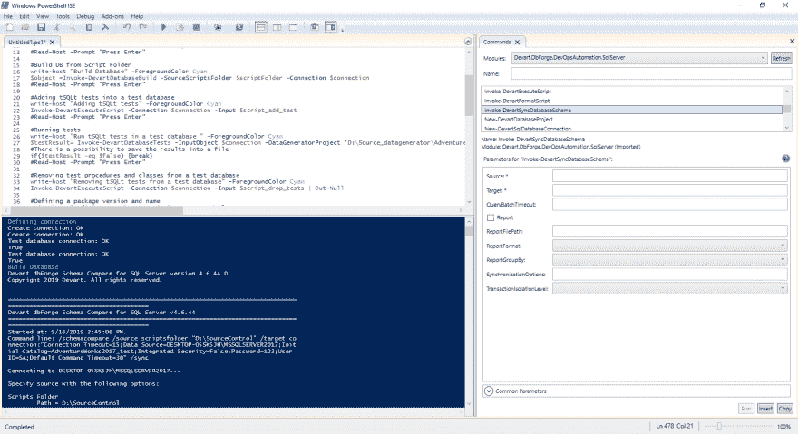

# db forge devo PS Automation for SQL Server—数据库开发的新方法

> 原文：<https://dev.to/devartsoftware/dbforge-devops-automation-for-sql-server-a-new-approach-to-database-development-4251>

数据库工具和数据连接解决方案的捷克软件供应商 Devart 发布了其全新产品—[db forge devo PS Automation for SQL Server](https://www.devart.com/dbforge/sql/database-devops/)。该解决方案由 dbForge Developer Bundle 的工具提供支持，并采用了先进的 DevOps 实践，为传统的数据库开发带来了一种新的方法。该工具极大地降低了总体数据库发布成本，最小化了部署风险，提高了质量&更新频率，使工作流一致和安全。

db forge devo PS Automation for SQL Server 是一款免费产品，作为 db forge Developer Bundle for SQL Server 的一部分独家提供。目前包含两个组件:
**1)**db forge devo PS Automation PowerShell for SQL Server；
**2)**db forge devo PS Automation for SQL Server 插件。

DevOps Automation PowerShell 模块是该团队的骄傲。它能够微调和自动化各种 SQL Server 数据库开发任务:

-**Build**–在 LocalDB 或指定的 SQL Server 上部署数据库，并从源代码控制存储库中生成 NuGet 包。
- **测试**-运行 tSQLt 并生成测试数据。
-**Sync**–部署一个 NuGet 包，并将其与工作数据库同步。
-**Publish**–将一个 NuGet 包放置到一个 NuGet 提要中，以便进一步部署。

与此同时，该解决方案还允许借助开源的**db forge DevOps Automation for SQL Server 插件**在 Jenkins 中设置 devo PS 流程。在不久的将来，该公司计划扩展支持的自动化服务器的范围。你可以通过访问 https://blog.devart.com/devops-automation-release.html 的[来了解更多关于最近发布的内容。](https://blog.devart.com/devops-automation-release.html)

**关于德瓦特**

Devart 是数据库工具和管理软件、ALM 解决方案、各种数据库服务器的数据提供商、数据集成和备份解决方案的领先开发商之一。该公司还实施网络和移动开发项目。
欲了解更多关于德瓦特的信息，请访问[https://www.devart.com/](https://www.devart.com/)