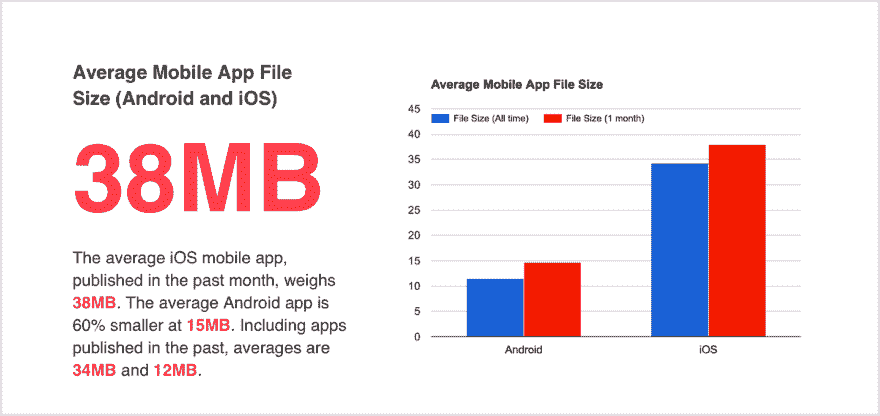
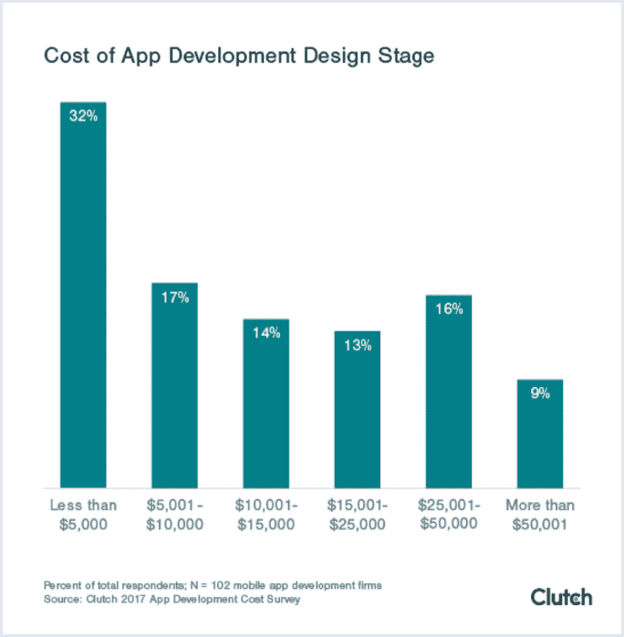

# 渐进式网络应用 vs 本地应用。第二部分

> 原文：<https://dev.to/codicacom/progressive-web-apps-vs-native-apps-part-2-2gdk>

在[文章](https://www.codica.com/blog/progressive-web-apps-vs-native/)的第二(最后)部分，我们想告诉你关于离线工作、设备存储和电源、访问设备功能、应用程序更新和维护等问题。所以，让我们开始吧。

## 5。离线工作

离线模式是原生移动应用的主要特征之一。它目前也可以在 PWA 中使用。那么离线模式是如何工作的呢？

**Native app**
考虑到 Native app 离线模式，我们假设它的工作方式与建立连接的方式相同。关键是，当连接仍然存在时，本地应用程序显示它设法缓存的内容和功能。

**PWA**
在 PWA 中，也为用户提供了离线模式。当您启动应用程序时，它会向您显示预先缓存或上传的内容。它是在服务人员的帮助下提供的。

然而，与原生移动应用相比，PWA 中的离线模式稍慢，因为它的实现方式不同。老实说，这两个选项之间的性能差距并不那么重要。

## 6。设备电源和存储

a)存储
用户的移动设备可用内存可能是最宝贵的资源之一。所以在安装一个 app 的时候，很多用户考虑的就是要占用多少 RAM。

本地应用
Android 应用的平均大小约为 15 MB，而 iOS 应用可能约为 38 MB 甚至更多。

来源: [Sweetpricing](https://sweetpricing.com/blog/2017/02/average-app-file-size/)

当然，你可能会说还有更大的应用，比如游戏应用。但他们一般都是例外，而不是规律。

与原生应用不同，PWA 不会在你的移动设备上占用太多存储空间。因为它仍然是网络，它不需要下载一个 40 MB 或更多的 APK 文件。

b)电池
关于移动原生应用的另一个重要问题是电池消耗。移动用户每天都有相当高的智能手机活动。他们通过信使聊天，浏览脸书等社交媒体。因此，他们需要照看好他们的电池充电，尤其是当他们看不到固定或便携式充电器时。

**原生应用**
几个全天运行的原生应用消耗了相当多的电池电量。卷起模式也会导致电池电量耗尽。因此，整天使用原生应用程序会导致移动设备在一天结束时完全放电。

实际上，电池耗尽是 PWA 的一个缺点。
问题是 pwa 运行高质量的 web 代码，如 HTML5、JavaScript 等。

另见:[2019 年 4 大 JavaScript 发展趋势](https://www.codica.com/blog/4-top-javascript-trends-2019/)

由于它基本上不是为移动环境设计的，设备必须更加努力地解释它。这当然会影响电池的消耗。

总而言之，小型 PWA 看起来是一个更有益的决定，因为越来越多的移动用户倾向于删除原生应用程序，因为它们占用了太多的存储空间。同时，如果你更关心电池消耗，原生手机更实用。

## 7。访问设备功能

当您的应用程序访问您的设备功能(如相机、蓝牙、GPS、麦克风等)时，它会提供更好的用户体验，并创建更方便的交互。在这种访问的帮助下，您的商业应用程序可以接触到选定的目标受众，并选择时间、位置和其他特定功能。

**原生应用**
普通的原生移动应用通常可以访问以下设备功能:

*   照相机
*   蓝牙
*   全球（卫星）定位系统
*   麦克风
*   国家足球联盟

该列表可以根据应用程序类型进行扩展。

与本地应用不同，渐进式网络应用对设备硬件功能的访问受到限制。
对于 Android 设备，PWA 不支持 HTML5 未维护的功能。对于 iOS 用户来说，情况看起来也差不多。

## 8。应用程序更新和维护

企业主自然希望获得更多的客户。因此，他们需要全时保持最新信息。这意味着应用程序更新越多，它将吸引越多的潜在客户，这款应用程序产生的利润也越多。

那么，更新和维护你的应用程序需要什么呢？

原生应用
维护和更新原生移动应用需要大量的资源，包括时间和金钱。根据您的开发团队添加和提供的服务，费用可能会有所不同。

至于 2017 年的[离合器应用开发成本调查，即将推出的服务可能从大约 5000 美元到 25000 美元不等，取决于功能复杂性和编码人员的小时费率。](https://clutch.co/app-developers/resources/cost-build-mobile-app-survey?utm_source=brainhubeu)

来源:[离合器](https://clutch.co/app-developers/resources/cost-build-mobile-app-survey?utm_source=brainhubeu)

考虑到更新的问题，对你的开发团队来说，每年跟踪新操作系统版本的新需求可能会变得很乏味。否则，你可能无法完成在线应用商店的下一个验证过程，如 Play Market 或 App Store。

进步的网络应用不需要那么多维护和更新的工作。由于仍然是网络，您的客户需要更新他们智能手机上的任何内容。渐进式 web 应用程序可以在任何设备上动态运行。

维护也是如此:支持网站虽然是渐进的，但成本比支持原生应用要低得多。

## 什么时候需要创建 PWA 或者原生 app？

比如你有一个电商平台，想获取潜在客户，但不确定结果如何，选择 PWA 就是一个完美的解决方案。

同时，如果你有一个相当复杂的产品，显然需要完整的原生体验，那么选择一个原生移动应用。

在做出结论之前，你需要回答以下问题:

*   目标受众是什么？
*   您准备花几个月的时间来构建应用程序？
*   发展预算是多少？

## PWAs vs 原生移动应用:谁领先？

总而言之，两种选择各有利弊。由于这个原因，胜者或败者可以仅考虑特定的情况和要求来定义。它们中的每一个都满足特定的需求，并适合特定类型的业务。

敬请关注，点击此处阅读全文:[渐进式网络应用 vs 本地应用](https://www.codica.com/blog/progressive-web-apps-vs-native/)。