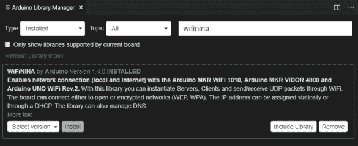

# 将实时传感器数据从 Arduino 传输到 ASP.NET 核心应用

> 原文：<https://dev.to/alistairjevans/streaming-real-time-sensor-data-to-an-asp-net-core-app-from-an-arduino-3ilo>

在我之前关于改装我的划船机的帖子中，[我从 Arduino](https://dev.to/alistairjevans/modding-my-rowing-machine-with-an-arduino-part-1-arduino-basics-21c5) 开始，并开始[收集速度传感器数据](https://dev.to/alistairjevans/modding-my-rowing-machine-with-an-arduino-part-2-reading-the-speed-sensor-b58)。这篇文章的目标是连接到 WiFi 网络，尽可能实时地将传感器数据上传到我在笔记本电脑上运行的服务器应用程序。

## 连接 WiFi

我的 [Arduino Uno WiFi Rev 2](https://store.arduino.cc/arduino-uno-wifi-rev2) 板内置了 WiFi 模块；将所有东西连接起来比我想象的要容易得多。

我首先需要安装必要的库来支持开发板，即 WiFiNINA 库:

然后您可以包含必要的头文件并连接到网络: