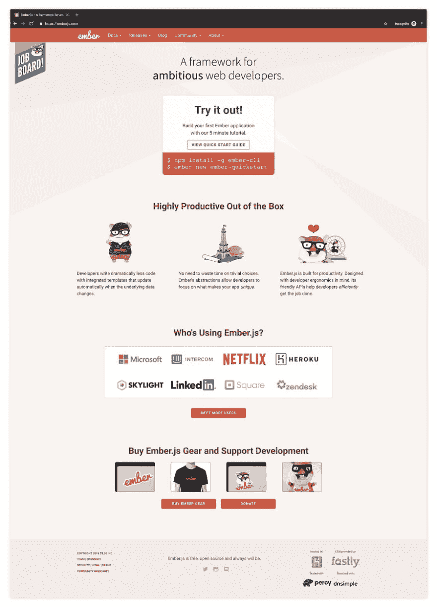
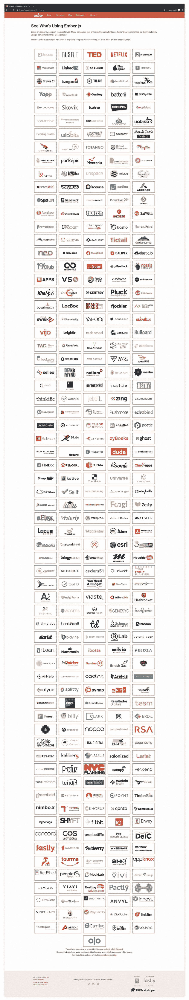
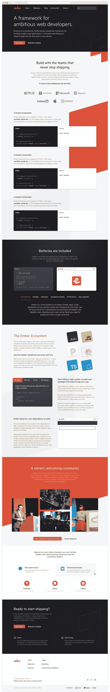
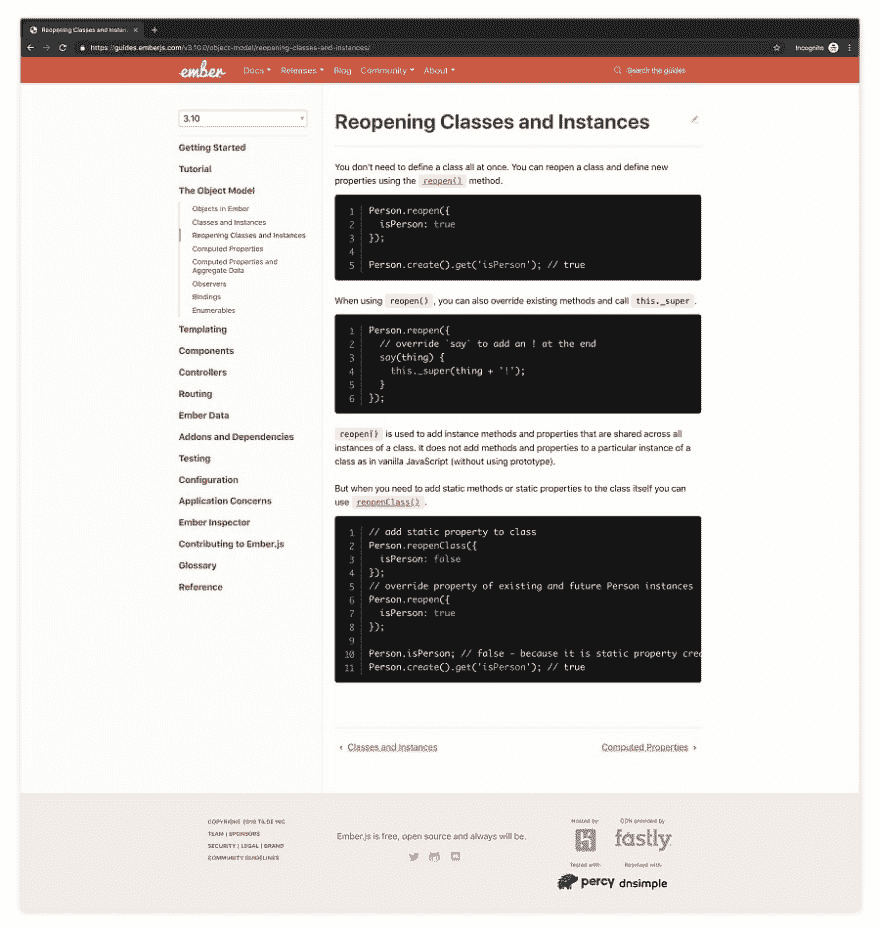
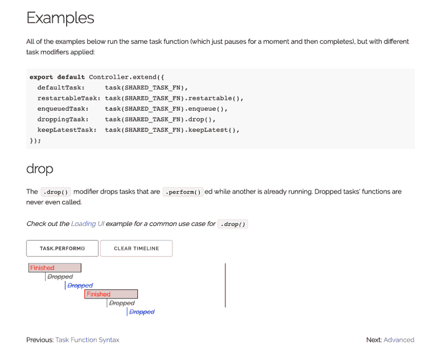
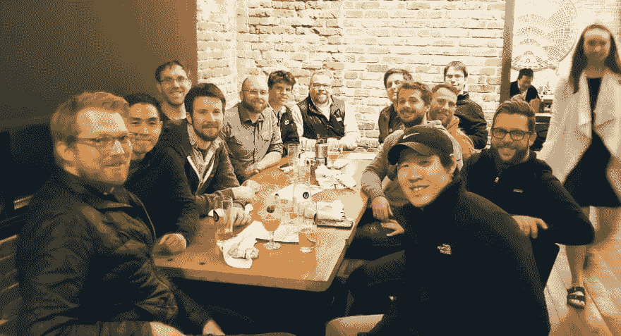

# #EmberJS2019:建立一个更大的社区

> 原文：<https://dev.to/ijlee2/emberjs2019-build-a-larger-community-47h7>

*原贴于[crunching numbers . live](https://crunchingnumbers.live/2019/05/26/emberjs2019-build-a-larger-community/)T3】*

2018 年，Ember 核心团队[要求社区提供意见](https://blog.emberjs.com/2018/05/02/ember-2018-roadmap-call-for-posts.html),以规划我们在未来一年需要实现的愿景。作为回应，他们收到了超过 [50 篇博文和几条直接推文](https://github.com/zinyando/emberjs2018-posts)。在准备这篇文章时，我读了所有的内容，并自始至终面带微笑，因为我们确实实现了以下目标，并且正在积极努力:

*   使用 [Ember Octane](https://emberjs.com/editions/octane/) 的本地 JavaScript 支持
*   使用[成员导入任何 npm 包-自动导入](https://github.com/ef4/ember-auto-import)
*   用[绣](https://github.com/embroider-build/embroider)新建管线和路线分割
*   更好的沟通渠道与[不和](https://discordapp.com/invite/zT3asNS)
*   通过 [Ember.js 进行营销:纪录片](https://www.youtube.com/watch?v=Cvz-9ccflKQ)(和辛烷)

2019 年，除了继续上述项目的工作，我希望看到我们致力于**建立一个更大的社区**。我们的社区虽然[真的很棒，也很支持](https://blog.emberjs.com/2019/04/12/the-ember-times-issue-93.html)，但仍然很小。为了繁荣，我们需要来自不与 Ember daily 合作的开发者的**支持。这些开发人员可能会专业地使用 React、Angular 或 Vue。他们可能是自学或上学，希望进入科技行业，职业生涯风险最小，创建展示项目的时间也最短。**

我相信我们可以做三件事来欢迎这些开发者:

*   发布更好的[网站](https://emberjs.com/)(地址设计和内容)
*   大幅提升[辛烷](https://emberjs.com/editions/octane/)
*   在本地和远程[会议上教授 Ember](https://emberjs.com/community/meetups)

我将解释我的意思，并用粗体突出显示我们的行动项目。

# 1。发布更好的网站

第一印象很重要。作为使用 Ember 多年的开发人员，我们理解 Ember 为什么会成为前端框架的一个很好的技术选择。

*   零配置
*   声明性模板语言
*   高性能组件
*   服务器端渲染的能力
*   轻松管理和模仿数据
*   易于身份验证和授权
*   强大的测试套件
*   清晰、向后兼容的升级路径
*   我们热爱并积极支持的众多插件

从第一天开始，我们就可以专注于创造价值，因为这些共同的难题已经(或将会)为我们解决。

## a .登陆页面

不幸的是，在我们的登陆页面中，我们没有**抓住新开发者的注意力和他们在 Ember** 中能做什么的想象力。我们还可以在**做得更好，向他们保证许多公司确实在使用 Ember，并且可以为他们提供一个优秀的职业生涯**。

<figure>

<figcaption>Our website needs to capture a new developer's attention and imagination of what they can do in Ember.</figcaption>

</figure>

“开箱即用的高生产力”下面的图片虽然可爱，但并不支持我们下面的说法。我认为**交互式代码、数据驱动图或用户故事**会更好地说明我们的主张并说服新的开发者。

当你点击谁在使用 Ember.js 下面的会见更多用户按钮时？，你会惊讶地看到 336 家公司的名单。除了突出显示 8 家最大的公司之外，让我们**提前展示这个数字**。如果我们可以收集并讲述小故事，而不是要求开发人员追踪每家公司以了解他们如何使用 Ember，那就太好了。

<figure>

<figcaption>Our website needs to affirm that there are many companies that use Ember and can provide developers an excellent career.</figcaption>

</figure>

2018 年的几篇博文呼吁采取行动，重新设计和现代化[网站](https://emberjs.com/)和[文档](https://guides.emberjs.com/release/)。据我所知，Ember 学习和指导团队目前正处于[重新设计网站](https://github.com/emberjs/rfcs/blob/master/text/0425-website-redesign.md)的计划阶段。实体模型看起来光滑而神奇。我认为我们的网站有一个光明的未来，并希望看到我们更多的人**帮助这个新设计尽快落地**(可能随着辛烷的推出)。

<figure>

<figcaption>The design of our new website is sleek and fantastic.</figcaption>

</figure>

## b .文档

从最重要的文档页面开始，我希望在 Ember 中看到对初学者友好的、针对问题的想法、例子、最佳实践和可能的陷阱的解释。为了帮助新开发人员，我们必须说明为什么某些东西是重要的，它将帮助他们解决什么问题，以及它如何适应 Ember 应用程序的宏伟计划。

来自 Ember Learning 团队的 Jen Weber 目前正在领导一项重大计划，即[重写 Ember 数据的文档](https://github.com/ember-learn/guides-source/issues/20)，以便新开发人员可以在他们的应用程序中轻松学习和使用 Ember 数据。最近，对于 Ember 3.9 文档，Jen 和其他一些开发人员重写了相关的指南，名为[，指定了路线的模型](https://guides.emberjs.com/v3.9.0/routing/specifying-a-routes-model/)。我钦佩她的工作，并希望看到我们更多人**帮助重写 Ember 数据文档**。

这里有一个[文档页面](https://guides.emberjs.com/v3.10.0/object-model/reopening-classes-and-instances/)的例子，我认为，它解释得很少，并且自 Ember 1.10 以来没有真正改变过。作为一个没用过`reopen`的开发者，很想知道这个为什么有用。第一句提到`reopen`允许我部分定义一个类。假设我知道`class`是什么，我为什么要这么做？有我不应该这样做的情况吗？我不知道从这个文件。

<figure>

<figcaption>An example of a documentation page that explains little and hasn't been updated in a long time.</figcaption>

</figure>

我认为，文档页面中的代码片段常常可以很容易地向有 Ember 或 JavaScript 经验的开发人员传达前面的想法。然而，对于新的开发者来说，我认为我们不能总是这样假设。我希望看到更多的**交互代码**，这样我们就可以欢迎这两个团队加入我们的文档。

为了获得灵感，我将我们引向任务修饰符的 ember-concurrency 可视化。这是我最喜欢的互动(和动画)例子之一。作为一名刚接触并发的开发人员，我可能不完全理解任务修饰符的定义，但我可以看到它们的作用，以及我应该使用哪个修饰符来解决我的并发问题。

<figure>

<figcaption>Ember Concurrency's interactive, animated demos help developers see what task modifiers do and which one to use. I love how the page says to check out the Loading UI example for a common use case.</figcaption>

</figure>

# 2。大幅提升辛烷值

Ember 的 6 周发布周期让开发者可以自由决定何时升级他们的应用。不幸的是，因为 Ember 遵循语义版本(SemVer ),我们将在次要版本中宣布很酷的新功能，并在主要版本中无聊地安全删除反对意见。

辛烷版给了我们第二次营销 Ember 的机会，因为我们可以随意宣布一系列核心新功能。让我们尽力而为吧。我们可以**感到自豪的是，Ember 建立在原生 JavaScript 之上，与 React、Angular 和 Vue 共享功能和最佳实践，在第一天就交付价值，并展望未知和令人兴奋的 web 未来**。

<figure>

<figcaption>I love our mascots Tomster and Zoey.</figcaption>

</figure>

据我所知，Octane 将包含以下[特性](https://github.com/emberjs/ember.js/issues/17234)，其中许多已经登陆并有 polyfills 支持 Ember 2.18+:

*   本地 JavaScript 类
*   默认情况下没有 jQuery
*   装修工
*   尖括号语法
*   命名参数语法
*   跟踪的属性
*   元素修饰符
*   微光元件
*   ember-cli 中的西兰花 2.0

[Chris Garrett](https://github.com/pzuraq) 在 Octane over 7 篇文章中出色地介绍了这些特性:

*   [第一部分:原生类](https://www.pzuraq.com/coming-soon-in-ember-octane-part-1-native-classes/)
*   [第二部分:尖括号和命名参数](https://www.pzuraq.com/coming-soon-in-ember-octane-part-2-angle-brackets-and-named-arguments/)
*   [第三部分:跟踪属性](https://www.pzuraq.com/coming-soon-in-ember-octane-part-3-tracked-properties/)
*   [第 4 部分:修饰符](https://www.pzuraq.com/coming-soon-in-ember-octane-part-4-modifiers/)
*   [第五部分:微光元件](https://www.pzuraq.com/coming-soon-in-ember-octane-part-5-glimmer-components/)
*   [第六部分:`@action`装饰者，`{{on}}`修饰者，`{{fn}}`助手](https://www.pzuraq.com/ember-octane-update-action/)
*   第七部分:装修工

类似地，Ember 核心团队[记录了每个次要版本](https://blog.emberjs.com/tags/releases.html)的更新。

虽然我很喜欢这些书面作品，但我不认为它们的目标受众是刚接触 Ember 的开发人员。我们不应该期望一个新的开发人员仔细阅读这些，并阅读其中的内容来了解辛烷及其状态。

让我们确保我们**继续提供学习辛烷**的其他方法。导师、不和谐聊天、播客、研讨会、代码样本、项目演示、视频教程、博客帖子( [Medium](https://medium.com/) 、 [freeCodeCamp](https://www.freecodecamp.org/news/) 或 [dev.to](https://dev.to/) 以接触到更广泛的社区)、Meetup 和会议讨论、口碑、推文等等。我相信我们每个人都有这方面的技能。我们都能够发展我们的社区。

# 3。在本地和远程会议上教授 Ember

继续推广 Octane 的想法，我希望看到我们更多的人**参加聚会，并向新开发人员**教授 Ember。

对我来说，教别人是我学到最多的时候。一些现在对我们来说微不足道的事情，一个我们认为不值得谈论的事情——如何创建和重用组件，如何编写上下文组件，如何用 Ember 数据管理状态，如何使用依赖注入，如何编写测试并并行运行它们——仍然给这些开发人员上了宝贵的一课。将我们的知识和经验传递给下一代是一件非常愉快的事情。

作为 ember atx(T1)的联合组织者和 T2 奥斯汀准则导师(T3)的导师，我尽最大努力经常发表演讲。除了上述原因之外，我做演讲是因为我知道寻找演讲者对组织者来说是困难和有压力的，他们自愿为许多人的利益付出时间。

就像远程工作在科技界已经变得可以接受——甚至被要求默认——一样，我认为科技聚会(尤其是 Ember Meetups)的未来在于组织远程会谈。与来自世界各地的开发人员会面并向他们学习的可能性让我兴奋不已。组织者不限于在他们镇上的 Ember 开发者之间骑自行车。演讲者不需要远行来产生积极的影响，并且可以从新的人群中获得即时的反馈。

我希望远程会谈将导致更频繁的 Ember 会议，反过来，这将鼓励更多的新开发人员参加和试用 Ember。

<figure>

<figcaption>Austin + Uruguay + San Francisco at EmberConf 2019</figcaption>

</figure>

# 4。未来在我们手中

总之，在 2019 年，我希望看到我们**建立一个更大的社区**。近 8 年来，我们已经有了一个奇妙的、雄心勃勃的网络解决方案，叫做 Ember。我们需要更多的新开发人员来尝试它，并分享他们的知识和经验。我们可以通过发布一个更好的网站，大力推广 Octane，以及在本地和远程聚会上教授 Ember 来帮助他们。

我想感谢迄今为止我在 Ember 社区遇到的每一个人。是你们所有人激励我写下这篇文章。