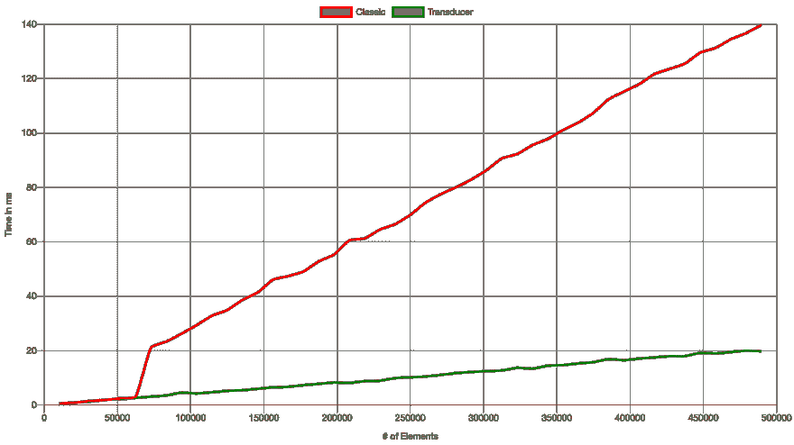
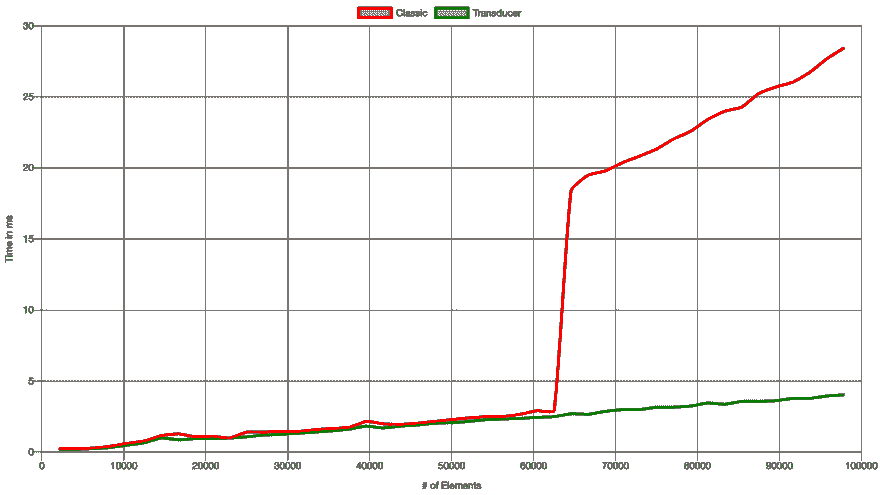
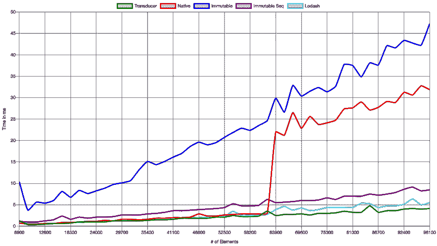

# 传感器——数据转换的一般概念

> 原文：<https://dev.to/misterwhat/transducers-a-generalized-concept-for-data-transformations-33l8>

在开发软件时，我们有时无法避免以某种方式处理数据。不管你是在前端工作(你正在构建的 UI 基本上是数据的函数)，还是在后端工作(后端往往数据量很大)。

处理数据时的典型任务包括(但不限于):

*   过滤掉数据集(比如 facebook 搜索应该只给我匹配的搜索词，或者编辑隐私信息——比如银行账号、电子邮件地址甚至密码)
*   将二进制数据映射到人类可读的格式，反之亦然

*...好吧。脸书可能不是展示应用数据隐私的最佳范例...*

**TL；** *博士如果你不感兴趣或者已经知道基本知识，你可以[跳过](#in-practice)这个理论。*

# 数据和变换理论

## 数据

在处理数据之前，我们需要了解数据的样子。一般来说，该结构可以定义为**项**的**集合**，比如:

*   数据库表中的行——其中表是**集合**,行是**项**
*   集合中的元素——以元素为**项**，集合为**集合**
*   数组中的字段
*   列表中的元素
*   词典中的条目
*   树中的节点

任何**系列**都可以作为**项目**嵌入到另一个**系列**中。让我们形式化这个语句:

```
-- an Item is defined as either:
-- 1\. a Primitive value
-- 2\. a Collection of Items
data Item = Primitive | Collection Item 
```

Enter fullscreen mode Exit fullscreen mode

注意: *我还试图用打字稿符号来表示这一点。但是 Typescripts 类型系统似乎不够强大，不足以描述递归类型*

## 可转换数据

因为我们的数据定义只包含两种类型(**项**和**集合**)，所以我们只能在**集合**级别或**项**级别进行转换。其中*过滤*(为每个元素决定是否将其包含在结果中)是在**集合**级别上的转换。
可以过滤的**集合**称为*可过滤*。

*映射*是从其容器(**集合**)中取出每个项目，对项目应用转换，并将其放回其来源的同类集合的容器中的过程。映射是在**项**级别上的转换。
一个**集合**(或者容器)，你可以映射它的内容，这个集合被称为*仿函数*。

# 在实践中

## 常见的做法

Javascript 附带了用于映射和过滤数组数据的原生数组方法。最值得注意的是:

*   `Array.prototype.map(mapFn)`
*   `Array.prototype.filter(predicateFn)`
*   `Array.prototype.reduce(reducerFn [, init])`

现在让我们举一个简单的例子，看看它们是如何工作的。我们收集了大量的书目数据。每个条目代表一本书或一个出版物，它有一个惟一的 id，一个标题，由一个或多个作者撰写，并且有一个出版日期(以 unix 时间戳的形式),以毫秒为单位。

```
type BookOrArticle = {
  id: string,
  title: string,
  authors: Array<string>,
  publicationDate: number,
}; 
```

Enter fullscreen mode Exit fullscreen mode

我们有一系列(比如说)10，000 本书和文章，我们需要得到标题中包含单词“guide”的所有条目，该条目由 J. Doe 编写并于 2007 年出版。结果项的形式应该是:

```
type Result = {
  title: string,
  author: string,
  date: string
}; 
```

Enter fullscreen mode Exit fullscreen mode

### 1。天真的方法

让我们采取第一种方法:

```
const booksAndArticlesArray = [
  /* our array of books and articles */
];

function getResults(inputArray) {
  return inputArray
    .map(item => ({
      ...item,
      year: new Date(item.publicationDate).getFullYear()
    }))
    .filter(({ year }) => year === 2007)
    .filter(({ title }) => /guide/i.test(title))
    .map(({ title, authors, publicationDate }) => ({
      title,
      author: authors.join(", "),
      date: new Date(publicationDate).toDateString()
    }))
    .filter(({author}) => author.includes("J. Doe"))
} 
```

Enter fullscreen mode Exit fullscreen mode

它可能不会立即可见，但过滤或映射的每个步骤都会创建一个包含结果的中间数组，用作下一个过滤/映射步骤的输入。

### 2。优化方法

为了减少创建的中间数据结构的数量，可以尝试通过压缩连续的映射和过滤操作来减少转换步骤的数量:

```
 // collapse consecutive filter operations

function getResults(inputArray) {
  return inputArray
    .map(item => ({
      ...item,
      year: new Date(item.publicationDate).getFullYear()
    }))
    .filter(
      ({ year, title }) => year === 2007 && /guide/i.test(title)
    )
    .map(({ title, authors, publicationDate }) => ({
      title,
      author: authors.join(", "),
      date: new Date(publicationDate).toDateString()
    }))
    .filter(({ author }) => author.includes("J. Doe"));
} 
```

Enter fullscreen mode Exit fullscreen mode

我们可以通过将映射从第二个 map 操作中的`authors`数组字段移到第一个 map 操作中来进一步优化它。这将允许我们用另一个过滤器:
来折叠最终的过滤器操作

```
 // 1\. move mapping authors array to author string into first map operation
// 2\. collapse final filter operation with previous filter operation

function getResults(inputArray) {
  return inputArray
    .map(({ publicationDate, authors, ...item }) => ({
      ...item,
      author: authors.join(", "),
      year: new Date(publicationDate).getFullYear()
    }))
    .filter(
      ({ year, title, author }) =>
        year === 2007 &&
        /guide/i.test(title) &&
        author.includes("J. Doe")
    )
    .map(({ title, author, publicationDate }) => ({
      title,
      author,
      date: new Date(publicationDate).toDateString()
    }));
} 
```

Enter fullscreen mode Exit fullscreen mode

我们将创建的中间数据结构的数量从 5 个减少到 3 个，但是以可读性为代价。通过将第一个映射操作中的`author`和`year`转换移动到过滤步骤中并删除第一个映射操作，可以进一步减少(这也是以降低可读性为代价的)。

## 通过 Reduce 进行映射和过滤

如果我们能以某种方式表达过滤器和地图，允许我们直接组合它们，那会怎么样。

> **提醒:** *合成*或者函数合成的意思是，你用一个函数的结果调用另一个函数。
> 即:给定函数`f: X -> Y`和`g: Y -> Z`，我们称`g.f(x) := g(f(x))`为`f`与`g`和`g.f: X -> Z`的组合(即`f.g(x)`以`X`的值作为自变量，返回`Z`的值作为结果)。
> 举例:将`f(x) => x + 1`和`g(x) => x * x`合成到`g(f(x)) = h(x)`得到`h(x) => (x + 1) * (x + 1)`。我们通过用`f(x)`的函数体替换`g(x)`中的`x`得到这个结果。

因此，看起来函数组合是一次性表达所有地图和过滤器转换步骤的正确工具。由于`reduce`是数组(或任何其他可迭代结构)上最通用的操作之一，让我们尝试将`map`和`filter`表示为归约器。

> **提醒:** *减速器*是函数，可以在`Array.prototype.reduce()`中作为回调使用。一个 reducer 的第一个参数是*累加器*(最后一个 reducer 调用的返回值)。第二个参数是我们正在查看的元素(就像`filter`和`map`中的第一个参数一样)。因此，一个缩减器具有以下特征:`reducer(acc: A, elem: B) => A`，或者用*辛德雷-米尔纳符号*:`reducer :: A -> B -> A`(*HM 符号*假设每个功能都被执行。所以一个应该带两个参数的函数被表达为一个函数(`A -> B -> C`):
> 
> *   它接受一个参数(`A` ) - >返回一个函数(`B -> C`)
>     *   这需要一个参数(`B` ) - >返回结果(`C`)

让我们试着把`map`和`filter`改造成减速器。对于`map`,我们需要一个函数，它将一个映射函数作为参数，并返回一个 reducer 函数作为结果。对于`filter`，我们需要一个函数，它接受一个过滤谓词，并返回一个 reducer 函数作为结果:

```
const map = mapFn => (acc, elem) => acc.concat(mapFn(elem));

const filter = predicateFn => (acc, elem) => {
  if (predicateFn(elem)) {
    /*
     * append the element
     * if predicate evaluates to a truthy result
     */
    return acc.concat(elem);
  }
  /*
   * don't append anything otherwise
   */
  return acc;
}; 
```

Enter fullscreen mode Exit fullscreen mode

如果你现在想知道*‘一个人该如何作曲？’*，你很纳闷吧。组合两个函数要求外部函数的参数类型与内部函数的返回类型相匹配。在上述函数中，`map(mapFn)`的结果既不适合`map`也不适合`filter`，反之亦然。根本没有办法做到这一点。

我们需要的是`map(mapFn)`(或`filter(predicateFn)`)返回一个函数，该函数需要一个自身类型的函数(我知道这在这里变得非常复杂，但对我来说很简单:解决方法很简单)。

我们通过进一步推广`map`和`filter`来解决这个问题。上面的实现只适合使用数组作为输出。但是可以想象任何类型的数据结构作为输出，允许添加元素(比如树、堆、映射、集合、链表等等)。).所以让我们去掉上面代码中的`acc.concat(x)`调用，代之以`combine(acc, x)`，其中`combine`是通过最初返回的函数
的一个参数提供的

```
const map = mapFn => combine => (acc, elem) => combine(acc, mapFn(elem));

const filter = predicateFn => combine => (acc, elem) => {
  if (predicateFn(elem)) {
    /*
     * add the element to the result data structure
     * if predicate evaluates to a truthy result
     */
    return combine(acc, elem);
  }
  /*
   * don't add anything otherwise
   */
  return acc;
}; 
```

Enter fullscreen mode Exit fullscreen mode

现在仔细看看`combine`是如何被使用的:

*   **第一个参数:**累加器(即结果数据结构)
*   **第二个参数:**应该添加到结果数据结构中的元素
*   **返回值:**结果数据结构，包含元素

这不仅看起来像一个减速器，它**是**一个减速器！

### xform (1)

让我们开始使用新的`map`和`filter`并从上面构建我们的转换示例:

```
const booksAndArticlesArray = [
  /* our array of books and articles */
];

const xform = (acc, elem) =>
  map(item => ({
    ...item,
    year: new Date(item.publicationDate).getFullYear()
  }))(
    filter(({ year }) => year === 2007)(
      filter(({ title }) => /guide/i.test(title))(
        map(({ title, authors, publicationDate }) => ({
          title,
          author: authors.join(", "),
          date: new Date(publicationDate).toDateString()
        }))(
          filter(({ author }) => author.includes("J. Doe"))(
            (acc, elem) => acc.push(elem)
          )
        )
      )
    )
  )(acc, elem);

const result = booksAndArticlesArray.reduce(xform, []); 
```

Enter fullscreen mode Exit fullscreen mode

...我不知道你怎么想，但我觉得这很可怕🤮。我不会批准任何包含像这样的*事情*的公关。
为了简化可读性，我们引入了`compose`的一般概念，它由`n`函数构成:

```
const compose = (...functs) => (...args) =>
  functs.length > 1
    ? compose(...functs.slice(0, -1))(
        functs[functs.length - 1](...args)
      )
    : functs[0](...args); 
```

Enter fullscreen mode Exit fullscreen mode

> **注意:**`compose`上面的实现是尾递归的。所以你可以把递归改写成一个循环。请随意将此作为练习。我很高兴在评论中看到你的解决方案🤓。

我们现在有了一个合适的`compose`实现。让我们从上面的[中重构`xform`，并将其转换成可读形式:](#xform-1)

### xform(2)

```
 const xform = compose(
  map(item => ({
    ...item,
    year: new Date(item.publicationDate).getFullYear()
  })),
  filter(({ year }) => year === 2007),
  filter(({ title }) => /guide/i.test(title)),
  map(({ title, authors, publicationDate }) => ({
    title,
    author: authors.join(", "),
    date: new Date(publicationDate).toDateString()
  })),
  filter(({ author }) => author.includes("J. Doe"))
); 
```

Enter fullscreen mode Exit fullscreen mode

现在我们有了一个干净的`xform`，我们可以定义一个函数，使用它来应用我们的转换。我们把针对数据`xduce`运行 *xforms* 的“框架”称为“框架”。`xduce`引四辩:

*   `xform`
*   一个组合器(`combine`)
*   初始化器(`getInitial`)
*   输入数据(`inputArr`)

```
/*
 * xduce draft
 */
const xduce = (xform, combine, getInitial, inputArr) =>
  inputArr.reduce(xform(combine), getInitial()); 
```

Enter fullscreen mode Exit fullscreen mode

因为我们可能想要重用转换，所以我们使用最后一个参数和默认的`combine`和`getInitial`参数(为了方便起见😇):

```
/*
 * xduce (reworked - curried-data-last)
 */
const xduce = (
  xform,
  combine = (acc, elem) => (acc.push(elem), acc), 
  getInitial = () => []
) => inputArr => inputArr.reduce(xform(combine), getInitial()); 
```

Enter fullscreen mode Exit fullscreen mode

**注:** *以上代码使用`Array.prototype.push`作为合并器。由于`push`是一个变异操作，我们必须确保每次调用`xduce`时都创建一个新的初始集合。否则，后续调用会将结果添加到同一个数组中。这通常不是我们想要的，并且会产生意想不到的结果。或者你可以使用`(acc, elem) => acc.concat(elem)`作为合并器。`Array.prototype.concat`不会改变它的源代码，但是会慢很多(特别是对于大型数组)。*

除了提供的缺省值之外，您可以为您的结果使用任何您喜欢的数据结构。只要确保合并器和你的初始集合匹配就行了(例如，对于 ES 集合，使用`(acc, elem) => acc.add(elem)`作为合并器，使用`() => new Set()`作为你的`getInitial`参数)。

下一步是使用我们的`xform`和`xduce` :

```
/*
 * reminder: xduce(xform) returns a reusable transform
 * that just expects input data
 */
const bookFilterMapTransform = xduce(xform);

/*
 * using bookFilterMapTransform
 */
const result = bookFilterMapTransform(booksAndArticlesArray); 
```

Enter fullscreen mode Exit fullscreen mode

## 概念

这里解释的概念也被称为*传感器*。由于*传感器*是一个发音如此复杂的单词，我为这篇文章选择了一个更具描述性的名字。
clo jure 提供了第一个*转换器*实现。这个概念越来越受欢迎，并被移植到其他语言，如 Javascript、Python、ReasonML/OCaml、Elixir 等等。

有一些值得注意的*传感器*的库实现:

*   [拉姆达](https://ramdajs.com/docs/#transduce)
*   [Transducers.js](https://github.com/cognitect-labs/transducers-js)
*   [thi-ng/传感器](https://www.npmjs.com/package/@thi.ng/transducers)

如果你想了解更多关于传感器的知识，你可以在文章末尾找到一份阅读清单。

## 基准

当使用传感器处理大量数据时，它的真正威力就会显现出来。
我做了一些基准测试，让你了解一下*传感器*方法的性能优势。`xduce`、`map`、`filter`和`compose`实现正是我在本文中提供的。

基准测试使用了以下转换:

**换能器**

```
const benchmarkTransducer = xduce(
  compose(
    map(function(x) {
      return x + 10;
    }),
    map(function(x) {
      return x * 2;
    }),
    filter(function(x) {
      return x % 5 === 0;
    }),
    filter(function(x) {
      return x % 2 === 0;
    })
  )
); 
```

Enter fullscreen mode Exit fullscreen mode

**原生/经典转换**

```
const classicTransform = arr =>
  arr
    .map(function(x) {
      return x + 10;
    })
    .map(function(x) {
      return x * 2;
    })
    .filter(function(x) {
      return x % 5 === 0;
    })
    .filter(function(x) {
      return x % 2 === 0;
    }); 
```

Enter fullscreen mode Exit fullscreen mode

对于每个数组长度的时间值，我取了每个实现运行 16 次的平均时间(都在完全相同的数组上)。我创建了 64 个等距的步骤。最小的数组长度为`10417`，最大的数组长度为`489583`项。

[](https://res.cloudinary.com/practicaldev/image/fetch/s--BQddoC-W--/c_limit%2Cf_auto%2Cfl_progressive%2Cq_auto%2Cw_880/https://thepracticaldev.s3.amazonaws.com/i/b0ephyg7q3zv8ruzoij5.png)

这两种实现在低于 60k 值的数组大小时的运行时特性非常相似(转换器*仅比传统的转换链稍微快一点)。在 60k 到 70k 之间，我们看到传统方法的运行时间几乎立即增加。我不知道这种跳跃的确切原因(如果有人有想法，请在评论中告诉我🙃).
这是该地区更详细的图像:*

[](https://res.cloudinary.com/practicaldev/image/fetch/s--I7DIyTDj--/c_limit%2Cf_auto%2Cfl_progressive%2Cq_auto%2Cw_880/https://thepracticaldev.s3.amazonaws.com/i/2peolj3loimeohpy8ga7.png)

与其他库(例如 Immutable.js)相比，转换器的性能也很好:

[](https://res.cloudinary.com/practicaldev/image/fetch/s--YsDd6SDV--/c_limit%2Cf_auto%2Cfl_progressive%2Cq_auto%2Cw_880/https://thepracticaldev.s3.amazonaws.com/i/pyuh6a37wqb7ugns4qx9.png)

# 进一步阅读

*   [https://code burst . io/simpler-transducers-for-JavaScript-4d 02a 0926648](https://codeburst.io/simpler-transducers-for-javascript-4d02a0926648)
*   [https://tgvashworth.com/2014/08/31/csp-and-transducers.html](https://tgvashworth.com/2014/08/31/csp-and-transducers.html)
*   [https://medium . freecodecamp . org/efficient-data-transformations-using-transducers-c 779043 ba 655](https://medium.freecodecamp.org/efficient-data-transformations-using-transducers-c779043ba655)
*   [https://jlongster.com/Transducers.js 数据转换 JavaScript 库](https://jlongster.com/Transducers.js--A-JavaScript-Library-for-Transformation-of-Data)