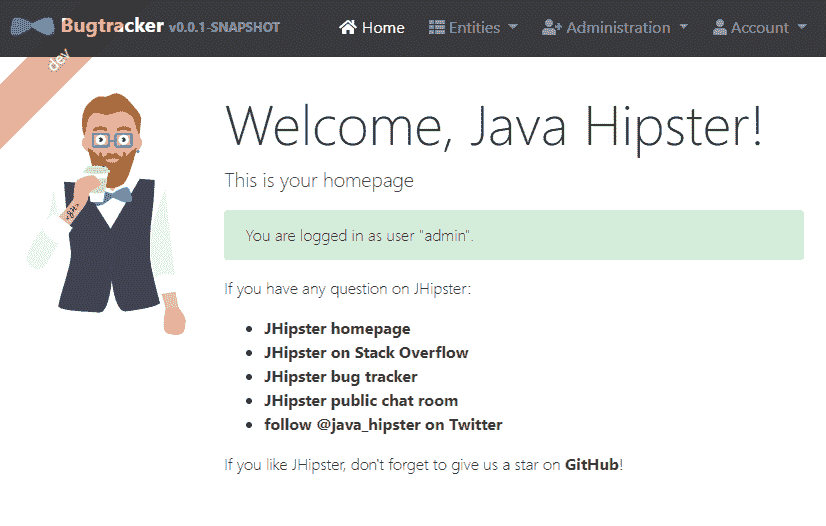

# 为 Azure 创建 Spring Boot 和角度应用程序(1/7)

> 原文：<https://dev.to/azure/creating-a-spring-boot-and-angular-application-for-azure-1-7-2mb8>

在这一系列博客文章中，我们将向 Azure 部署一个全栈应用程序，并学习如何以一种有成本意识的方式高效地设置许多组件。

我们将讨论 Spring Boot 和 Angular，以及 Azure 管道和 Azure Web 应用的部署自动化、Azure Insights 的监控和性能调优。我们不会在钱的问题上有所顾忌:我们会讨论预算和成本，并尝试拥有一个非常便宜的设置，可以在需要时进行扩展。

以下是这个系列的部分内容:

*   为 Azure 创建 Spring Boot 和角度应用程序(1/7)
*   [创建和配置 Azure Web App 和 MySQL 来托管 Spring Boot 应用程序(2/7)](https://dev.to/jdubois/creating-and-configuring-azure-web-app-and-mysql-to-host-a-spring-boot-application-2-7-1n13)
*   [使用 Azure Pipelines 构建、测试和部署 Spring Boot 和 Angular 应用程序(3/7)](https://dev.to/jdubois/using-azure-pipelines-to-build-test-and-deploy-a-spring-boot-and-angular-application-3-7-593j)
*   [与 Spring Boot 一起使用 Azure Application Insights(4/7)](https://dev.to/azure/using-azure-application-insights-with-spring-boot-4-7-263i)
*   [使用 Azure Application Insights 和 Angular (5/7)](https://dev.to/azure/using-azure-application-insights-with-angular-5-7-4kej)
*   [配置 Azure CDN 以提升角度性能(6/7)](https://dev.to/azure/configuring-azure-cdn-to-boost-angular-performance-6-7-5ebe)
*   [配置 Azure Redis 缓存以提升 Spring Boot 性能(7/7)](https://dev.to/azure/configuring-azure-redis-cache-to-boost-spring-boot-performance-7-7-52dl)

## 生成申请

作为 JHipster 的创建者和首席开发者，我将使用 JHipster 生成一个同时使用 Spring Boot 和 Angular 的“全栈”应用。请注意，这一系列的文章并没有链接到 JHispter:我们在这里要做的应该是以一种通用的方式为所有的 Spring Boot 和角度的应用。我们只使用 JHipster 来加速开发过程，还因为它为我们生成了一个重要的应用程序，所以我们展示的不是一个简单的“Hello，world”应用程序，而是一个接近您在现实生活场景中所期望的应用程序。

你可以去[https://www.jhipster.tech/](https://www.jhipster.tech/)安装 JHipster，或者使用 [JHipster Online](https://start.jhipster.tech) 以图形化方式生成一个全栈应用。对于这一系列的帖子，我们将使用目前可用的最新版本，6.0.1。我们在这里为 Azure 选择了几个有趣的选项:

*   我们使用 MySQL，更确切地说是用于 MySQL 的 [Azure 数据库，因为它是 Azure 的一个非常便宜的选项。](https://azure.microsoft.com/fr-fr/services/mysql/?WT.mc_id=devto-blog-judubois)
*   我们不使用任何 Hibernate 二级缓存。对于 Hibernate，如果你想扩展，你需要有一个分布式缓存，设置起来有点复杂，所以我们暂时禁用它。我们将在本系列的第 7 部分看到如何使用 Azure Redis 缓存来实现这一点。
*   我们已经用量角器配置了端到端测试，所以我们将能够轻松地测试我们的完整应用程序

生成的应用已经推送到[https://github.com/jdubois/spring-on-azure](https://github.com/jdubois/spring-on-azure)上，这里可以看到这个部分[对应的初始提交。](https://github.com/jdubois/spring-on-azure/commit/25839fbbf903e9a32dde21dd9e98b91ccca394c7)

## 向应用程序添加一些业务逻辑

既然已经创建了一个基本的应用程序，我们将向它添加一些业务逻辑，以便拥有一个更“真实”的产品。为此，JHipster 提出了它的“jhi pster 领域语言”，我们将使用提供的样本之一，[“Bug Tracker”](https://github.com/jhipster/jdl-samples/blob/master/bug-tracker.jh)。这将生成一个看起来有点像 GitHub bug tracker 的应用程序:它只是生成的代码，如果你真的想要一个工作的应用程序，你仍然需要编码一些业务逻辑，但对于这一系列的博客帖子，这给了我们一个完整的应用程序来玩。

这些实体既可以使用 JHipster 命令行创建，也可以使用 [JHipster Online](https://start.jhipster.tech) 图形化地创建，甚至可以通过这些更改向 GitHub 项目发出 pull 请求。

对应于那些新实体的提交在这里是可用的[。](https://github.com/jdubois/spring-on-azure/commit/dfbaf7147cb621b350b22b53a6dc87fa7c30dddc)

## 在本地测试和运行应用程序

现在我们已经准备好了完整的应用程序，我们可以运行它的测试，看看是否一切正常。您可以运行`mvnw test`来运行 Java 测试，运行`npm run test`来运行前端测试。

我们现在可以通过键入`mvnw -Pdev,webpack spring-boot:run`，在 [http://localhost:8080/](http://localhost:8080/) 打开浏览器，在本地运行应用程序。

最后，让我们通过在另一个控制台`npm run e2e`中运行量角器来运行端到端测试。这将启动一个浏览器，在 [http://localhost:8080/](http://localhost:8080/) 上运行集成测试，证明整个应用程序运行良好。

下面是最终应用程序的截图:[在本系列的下一篇文章](https://dev.to/jdubois/creating-and-configuring-azure-web-app-and-mysql-to-host-a-spring-boot-application-2-7-1n13)中，我们将创建一个 Azure 基础设施，以便我们可以将其部署到生产中。

