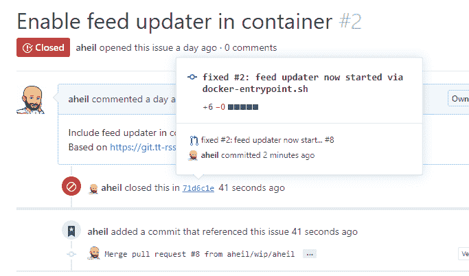

# 自动关闭 GitHub 问题

> 原文：<https://dev.to/aheil/automatically-close-github-issues-4oa4>

正如你现在可能知道的，我目前正在做一个小型 Docker 项目，将 ttrss 容器化。

我使用 GitHub 和 Docker 只是为了了解这两个平台的最新特性。

虽然这可能是一个老特性，在 Git 和/或 GitHub 社区中众所周知，但是我“不小心”写了一个 commit message _**fixed # 2:…**_

嗯，GitHub 在创建 pull 请求并将其合并到 master 的过程中自动关闭了这个问题。多棒的功能啊，尤其是这样发现的时候！

