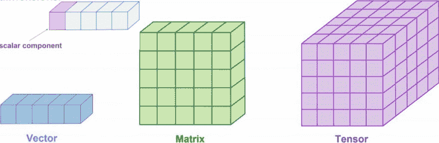
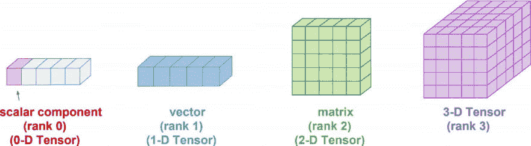
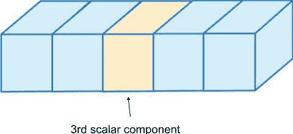
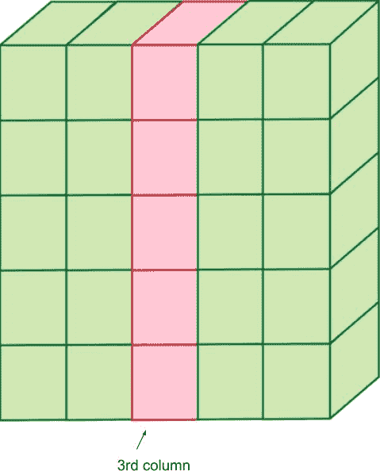
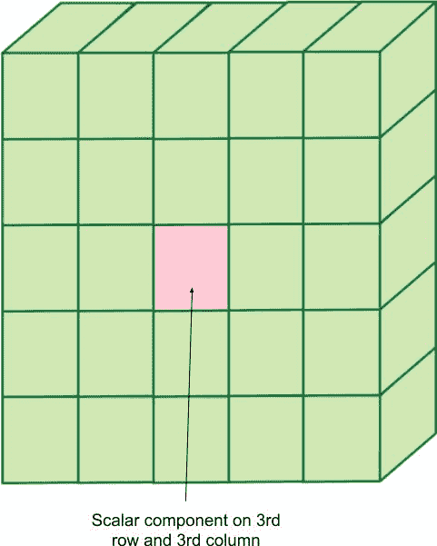
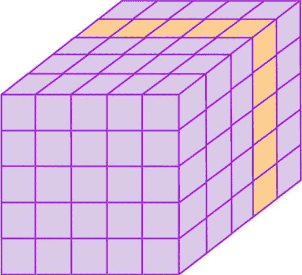
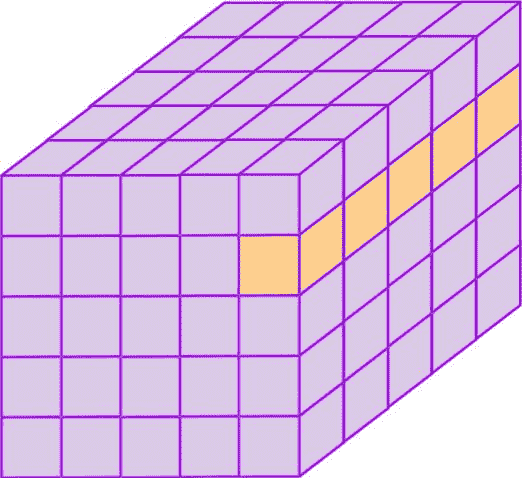
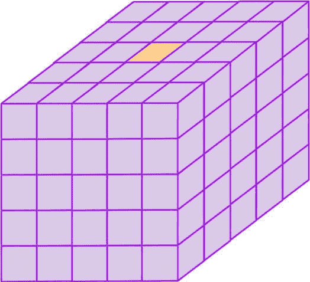

# 为忙碌的人准备的张量

> 原文：<https://dev.to/juancarlospaco/tensors-for-busy-people-315k>

# Wat?

*   什么是标量？。
*   什么是矢量？。
*   什么是矩阵？。
*   什么是张量？。

这是为忙碌的人准备的关于张量的快速而简短的介绍...
*我会保持它[之吻](https://en.wikipedia.org/wiki/KISS_principle)并且尽可能的小以便于阅读。*

[](https://res.cloudinary.com/practicaldev/image/fetch/s--hU2bZ5n5--/c_limit%2Cf_auto%2Cfl_progressive%2Cq_auto%2Cw_880/https://thepracticaldev.s3.amazonaws.com/i/0ot9j9oqg6p0vih8gtwp.jpg)

标量是我们正在处理的最小可能单位，就像整数一样。

Vector 是特定轴上的一串标量，可以画成一行框或项，比方说是一个列表或数组项的集合。

矩阵是一个二维数组，通常表示为一个表格。

张量是一个多维数组，通常可以图形化地表示为一个立方体。

# 等级&维度

*   什么是等级？。
*   维度是什么？。

[](https://res.cloudinary.com/practicaldev/image/fetch/s--VaxrSdrA--/c_limit%2Cf_auto%2Cfl_progressive%2Cq_auto%2Cw_880/https://thepracticaldev.s3.amazonaws.com/i/bp6ux6ppf5t5amwkxklq.jpg)

你可以想象整数的列表，容纳在不同的布局中，在 3D 空间，或者 2D 空间，等等，这就是秩。

在代码上看起来如何？。

# 标量

```
let myscalar = 42 
```

Enter fullscreen mode Exit fullscreen mode

标量可以是各种各样的东西，通常是数值，为了让事情简单易懂我们这里就用一个整数，`42`就是我们的标量。

# 向量

```
let myvector = [1, 2, 3] 
```

Enter fullscreen mode Exit fullscreen mode

向量是项的集合，我们继续使用整数，它可以在代码上被看作一个数组或列表，你可以把它画成秩为 1 的向量。

# 矩阵

```
let mymatrix = [
                 [1, 2, 3],
                 [4, 5, 6],
               ] 
```

Enter fullscreen mode Exit fullscreen mode

我们继续增加维度，然后我们得到矩阵，一个 2D 张量，可以在代码中简化为一个包含列表的列表。

# 张量

```
let mytensor = [
                 [
                   [1, 2, 3],
                   [4, 5, 6],
                 ],
                 [
                   [7,   8,  9],
                   [10, 11, 12],
                 ],
               ] 
```

Enter fullscreen mode Exit fullscreen mode

哇，我们到达了疯狂的立方体，一个多维整数数组，
我们需要将这一堆列表转换成一个`Tensor`对象！。

# 张量阵列伪影

```
import arraymancer

let mytensor = [
                 [
                   [1, 2, 3],
                   [4, 5, 6],
                 ],
                 [
                   [7,   8,  9],
                   [10, 11, 12],
                 ],
               ].toTensor 
```

Enter fullscreen mode Exit fullscreen mode

完成，恭喜你编写了你的第一个`Tensor`！。

# 玩弄张量

我能用它做什么？。

```
echo mytensor is Tensor  # Is really a Tensor type?
echo sizeOf(mytensor)    # Whats the Size of it?
echo mytensor.rank       # Whats the Rank? 
echo mytensor.shape      # Whats the Shape of my Tensor?
echo mytensor.strides    # Strides?
echo mytensor.offset     # Offset? (if any) 
```

Enter fullscreen mode Exit fullscreen mode

# 人类可读的表示

使用
打印人类可读的表示

```
echo mytensor 
```

Enter fullscreen mode Exit fullscreen mode

这应该打印在标准输出或 REPL 上:

```
Tensor[int] of shape [2, 2, 3] of type "int" on backend "CPU":
| |     1       2       3 |     7       8       9 |
| |     4       5       6 |     10      11      12| 
```

Enter fullscreen mode Exit fullscreen mode

在这个基本的例子中，我使用`CPU`作为后端，为了兼容，
你的也可以说`CUDA`或`OpenCL`或`OpenMP`(如果你有硬件)，因为 GPU 是舒适的按摩数字。

# 张量切片

您可以从张量中读取或写入值:

(添加的注释只是为了解释索引，但不是必需的)

[](https://res.cloudinary.com/practicaldev/image/fetch/s--MQpnNgnr--/c_limit%2Cf_auto%2Cfl_progressive%2Cq_auto%2Cw_880/https://thepracticaldev.s3.amazonaws.com/i/map0jj8vaek7l8h0bxl1.jpg)T3】

```
import arraymancer

var mytensor = [
    [1, 2, 3, 4, 5] # 0
    #0  1  2  3  4
  ].toTensor

echo mytensor[0, 2]  # Read the value "3"
mytensor[0, 2] = 42  # Write the value "42" 
```

Enter fullscreen mode Exit fullscreen mode

记住用`var`声明的东西是可变的，`let`是不可变的，
张量也可以在编译时预先计算，用`const`声明。

我们可以覆盖标量值，让我们看看是否可以得到整个列？。

(注释是为了解释索引而添加的，不是必需的，我们很快就会取消)

[](https://res.cloudinary.com/practicaldev/image/fetch/s--ZQ0u35aa--/c_limit%2Cf_auto%2Cfl_progressive%2Cq_auto%2Cw_880/https://thepracticaldev.s3.amazonaws.com/i/ijblg9wdw6neyexie3p8.jpg)T3】

```
import arraymancer

var mytensor = [
    [1,   2,  3,  4,  5],   # 0
    [6,   7,  8,  9, 10],   # 1
    [11, 12, 13, 14, 15],   # 2
    [16, 17, 18, 19, 20],   # 3
    [21, 22, 23, 24, 25],   # 4
    # 0   1   2   3   4
  ].toTensor

echo mytensor[_, 2] 
```

Enter fullscreen mode Exit fullscreen mode

唯一的变化是索引上的`_`选择整个**列**。

现在让我们试着获取一个完整的**行**,这次不带注释...

[](https://res.cloudinary.com/practicaldev/image/fetch/s--tSA48i1P--/c_limit%2Cf_auto%2Cfl_progressive%2Cq_auto%2Cw_880/https://thepracticaldev.s3.amazonaws.com/i/vrxiui4215ui6ep7t015.jpg)T3】

```
import arraymancer

var mytensor = [
    [1,   2,  3,  4,  5], 
    [6,   7,  8,  9, 10],  
    [11, 12, 13, 14, 15],  
    [16, 17, 18, 19, 20], 
    [21, 22, 23, 24, 25],  
  ].toTensor

echo mytensor[3, _] 
```

Enter fullscreen mode Exit fullscreen mode

我希望不是太复杂，只是第**排**的`_`。

现在让我们只抓住中间部分，不要碰到其他部分。

[](https://res.cloudinary.com/practicaldev/image/fetch/s--EzjlfZf5--/c_limit%2Cf_auto%2Cfl_progressive%2Cq_auto%2Cw_880/https://thepracticaldev.s3.amazonaws.com/i/8js58xj7901adngb8tqv.jpg)T3】

```
import arraymancer

var mytensor = [
    [1,   2,  3,  4,  5],  
    [6,   7,  8,  9, 10],  
    [11, 12, 13, 14, 15],  
    [16, 17, 18, 19, 20],  
    [21, 22, 23, 24, 25],  
  ].toTensor

echo mytensor[2, 2] 
```

Enter fullscreen mode Exit fullscreen mode

# 进行 3D

让我们切下一块馅饼...

[](https://res.cloudinary.com/practicaldev/image/fetch/s--wNUdGERR--/c_limit%2Cf_auto%2Cfl_progressive%2Cq_auto%2Cw_880/https://thepracticaldev.s3.amazonaws.com/i/wr7d9cvr08nquietjnr9.jpg)T3】

```
import arraymancer

var mytensor = [
    [
      [ 1,  2,  3,  4,  5],      # 1st Matrix.
      [ 6,  7,  8,  9, 10],
      [11, 12, 13, 14, 15],
      [16, 17, 18, 19, 20],
      [21, 22, 23, 24, 25],
    ],
    [
      [26, 27, 28, 29, 30],      # 2nd Matrix.
      [31, 32, 33, 34, 35],
      [36, 37, 38, 39, 40],
      [41, 42, 43, 44, 45],
      [46, 47, 48, 49, 50],
    ],
    [
      [51, 52, 53, 54, 55],      # 3rd Matrix.
      [56, 57, 58, 59, 60],
      [61, 62, 63, 64, 65],
      [66, 67, 68, 69, 70],
      [71, 72, 73, 74, 75],
    ],
    [
      [76, 77, 78, 79,  80],     # 4th Matrix.
      [81, 82, 83, 84,  85],
      [86, 87, 88, 89,  90],
      [91, 92, 93, 94,  95],
      [96, 97, 98, 99, 100],
    ],
    [
      [101, 102, 103, 104, 105], # 5th Matrix.
      [106, 107, 108, 109, 110],
      [111, 112, 113, 114, 115],
      [116, 117, 118, 119, 120],
      [121, 122, 123, 124, 125],
    ]
  ].toTensor

echo mytensor[3, _, _] 
```

Enter fullscreen mode Exit fullscreen mode

如果我们想要角片呢？。

[](https://res.cloudinary.com/practicaldev/image/fetch/s--etfKMsdk--/c_limit%2Cf_auto%2Cfl_progressive%2Cq_auto%2Cw_880/https://thepracticaldev.s3.amazonaws.com/i/uvouj2twedexuk26czsf.jpg)T3】

```
import arraymancer

var mytensor = [
    [
      [ 1,  2,  3,  4,  5],      # 1st Matrix.
      [ 6,  7,  8,  9, 10],
      [11, 12, 13, 14, 15],
      [16, 17, 18, 19, 20],
      [21, 22, 23, 24, 25],
    ],
    [
      [26, 27, 28, 29, 30],      # 2nd Matrix.
      [31, 32, 33, 34, 35],
      [36, 37, 38, 39, 40],
      [41, 42, 43, 44, 45],
      [46, 47, 48, 49, 50],
    ],
    [
      [51, 52, 53, 54, 55],      # 3rd Matrix.
      [56, 57, 58, 59, 60],
      [61, 62, 63, 64, 65],
      [66, 67, 68, 69, 70],
      [71, 72, 73, 74, 75],
    ],
    [
      [76, 77, 78, 79,  80],     # 4th Matrix.
      [81, 82, 83, 84,  85],
      [86, 87, 88, 89,  90],
      [91, 92, 93, 94,  95],
      [96, 97, 98, 99, 100],
    ],
    [
      [101, 102, 103, 104, 105], # 5th Matrix.
      [106, 107, 108, 109, 110],
      [111, 112, 113, 114, 115],
      [116, 117, 118, 119, 120],
      [121, 122, 123, 124, 125],
    ]
  ].toTensor

echo mytensor[_, 1, 4] 
```

Enter fullscreen mode Exit fullscreen mode

最后一片切片...

[](https://res.cloudinary.com/practicaldev/image/fetch/s--J6TE3QEo--/c_limit%2Cf_auto%2Cfl_progressive%2Cq_auto%2Cw_880/https://thepracticaldev.s3.amazonaws.com/i/p5wge2vzewvzkr2khvpr.jpg)T3】

```
import arraymancer

var mytensor = [
    [
      [ 1,  2,  3,  4,  5],      # 1st Matrix.
      [ 6,  7,  8,  9, 10],
      [11, 12, 13, 14, 15],
      [16, 17, 18, 19, 20],
      [21, 22, 23, 24, 25],
    ],
    [
      [26, 27, 28, 29, 30],      # 2nd Matrix.
      [31, 32, 33, 34, 35],
      [36, 37, 38, 39, 40],
      [41, 42, 43, 44, 45],
      [46, 47, 48, 49, 50],
    ],
    [
      [51, 52, 53, 54, 55],      # 3rd Matrix.
      [56, 57, 58, 59, 60],
      [61, 62, 63, 64, 65],
      [66, 67, 68, 69, 70],
      [71, 72, 73, 74, 75],
    ],
    [
      [76, 77, 78, 79,  80],     # 4th Matrix.
      [81, 82, 83, 84,  85],
      [86, 87, 88, 89,  90],
      [91, 92, 93, 94,  95],
      [96, 97, 98, 99, 100],
    ],
    [
      [101, 102, 103, 104, 105], # 5th Matrix.
      [106, 107, 108, 109, 110],
      [111, 112, 113, 114, 115],
      [116, 117, 118, 119, 120],
      [121, 122, 123, 124, 125],
    ]
  ].toTensor

echo mytensor[2, 0, 2] 
```

Enter fullscreen mode Exit fullscreen mode

# 张量练习题

为了减少重复，让我们假设这个基本张量:

```
import arraymancer

var mytensor = [
    [1, 2],
    [3, 4],
  ].toTensor 
```

Enter fullscreen mode Exit fullscreen mode

# 张量加法

```
echo mytensor + mytensor 
```

Enter fullscreen mode Exit fullscreen mode

# 张量相减

```
echo mytensor - mytensor 
```

Enter fullscreen mode Exit fullscreen mode

*   乘法留给读者作为练习。

# 张量迭代器

```
# Values only.
for value in mytensor:
  echo value   

# Coordinates and Values.
for coordinates, value in mytensor:
  echo coordinates
  echo value 
```

Enter fullscreen mode Exit fullscreen mode

*   `pairs`和`items`的迭代留给读者作为练习。

# 张量广播

```
# Broadcasting with operations are made beginning with a dot "."
echo mytensor .+ mytensor    # Addition
echo mytensor .- mytensor    # Substraction 
```

Enter fullscreen mode Exit fullscreen mode

*   广播其他操作留给读者作为练习。

# 张量列表

```
# Tensor from vanilla std lib sequence.
let mytensor = toSeq(1..24).toTensor.reshape(2, 3, 4) 
```

Enter fullscreen mode Exit fullscreen mode

*   尝试重塑你的张量到新的形状！

# 为什么要阵列癌？

*   c 速度。
*   Python 喜欢语法，Numpy 喜欢人机工程学。
*   借助 MKL/OpenBLAS/CUDA/OpenCL/OpenMP 加速。
*   无依赖分布。
*   从实验性快速原型到性能关键型产品的整个堆栈都使用 1 种语言。

# 这只是开始，不是结束

这仅仅是构建模块，但是您可以了解更多信息:

*   [https://github . com/mratsim/array mancer # 4-reasons-why-array mancer](https://github.com/mratsim/Arraymancer#4-reasons-why-arraymancer)
*   [https://mratsim . github . io/array mancer](https://mratsim.github.io/Arraymancer)
*   [https://github . com/mratsim/array mancer # installation](https://github.com/mratsim/Arraymancer#installation)中

*开始使用 CPU 真的不需要超过一个`nimble install arraymancer`！。*T3】👑