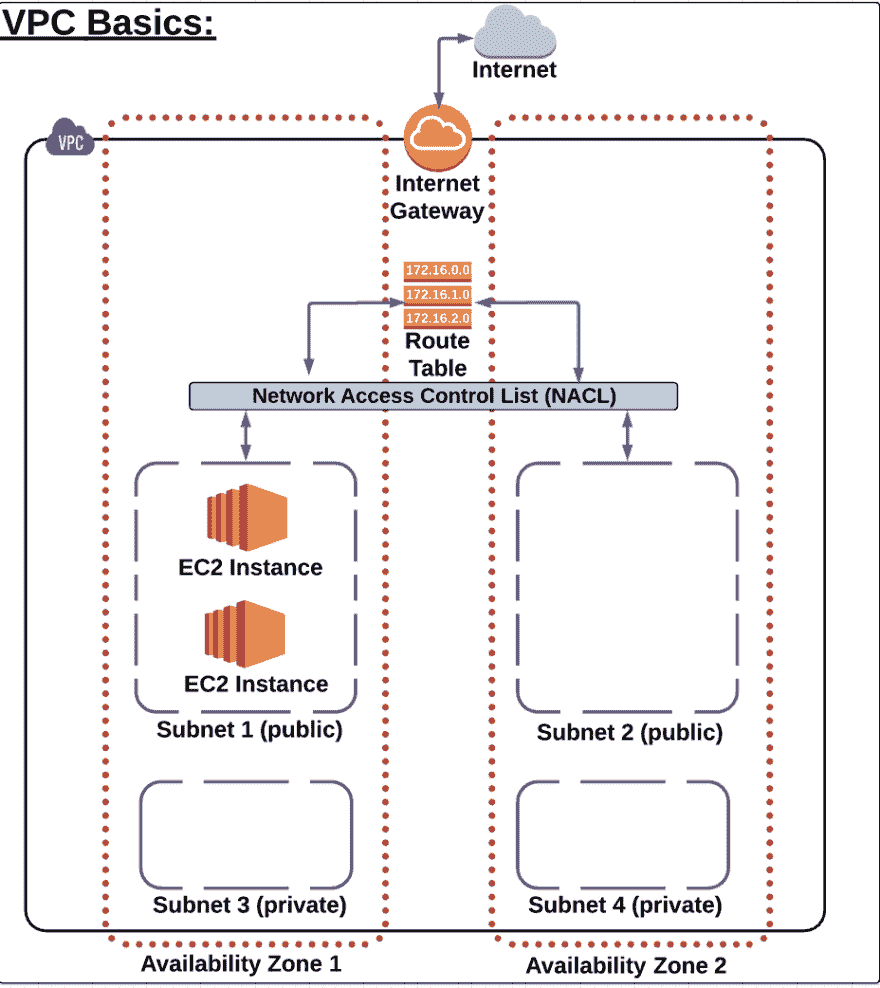
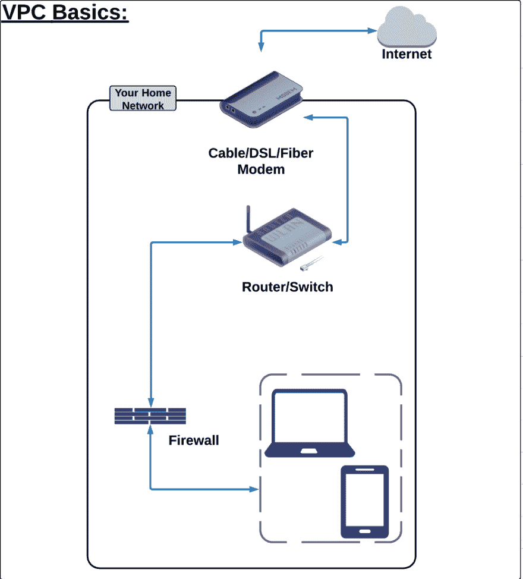

# 30 天 AWS(第 2 天)

> 原文：<https://dev.to/gameoverwill/30-days-of-aws-day-2-50dj>

大家好。今天我学习了一些让我困惑的东西。

基本上，这个话题对我来说很难，因为它与网络、IPs 和连接性有关，老实说，我在这些方面相当糟糕。

今天我没有完成这个话题，因为我需要看两遍视频，做很多笔记，并阅读官方文件，但让我与你分享我所学到的。

**1。AWS 提供的网络服务和全球基础设施概述**:我在这里了解了什么是可用性区域？什么是 AWS 区域？什么是数据中心？

*AWS 区域*:位于特定地理位置的一组 AWS 资源。主要思想是每个客户或用户可以选择离他们最近的位置，防止延迟。

可用性区域(Az) :这是一个地理上隔离的区域，位于拥有 AWS 资源的区域内。基本上，这些是不同的数据中心。每个区域中的多个 Az 为该区域中的 AWS 资源提供冗余。

*数据中心*:它是物理硬件。

**2。VPC 基础知识**:从亚马逊文档“亚马逊虚拟私有云(亚马逊 VPC)使您能够将 AWS 资源启动到您定义的虚拟网络中。这种虚拟网络非常类似于您在自己的数据中心运行的传统网络，具有使用 AWS 的可扩展基础架构的优势。”如果你想了解更多，请点击[这里](https://docs.aws.amazon.com/vpc/latest/userguide/what-is-amazon-vpc.html)。

在课程中提供了一个例子，让我澄清很多，VPC 结构首先让我们看这个图。

他们说 VPC 就像我们家里的互联网连接，这是真的，我以前没见过，见下图:

所以如果你看到，我们的笔记本电脑或手机就像 EC2 实例。防火墙就像网络访问控制列表(NACL)。路由器或交换机类似于 AWS 表路由。我们的调制解调器就像互联网网关(IGW)。这个比较非常好，因为如果你断开一个部分，你就不会有互联网，你也将与世界断开，同样的事情也会发生在你的应用程序上，如果你关闭上述的一个部分。

好了，今天我的进度很慢，但我不在乎，因为我学到了很多。明天我将继续学习 VPC 世界。

感谢阅读。