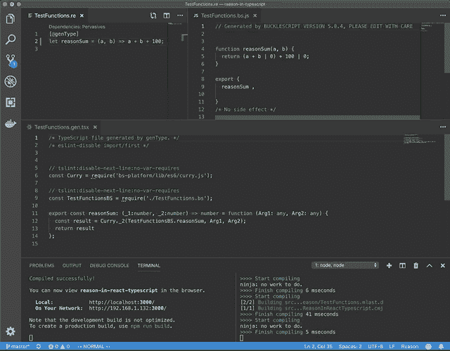

# 向 React TypeScript 代码库添加 ReasonML

> 原文：<https://dev.to/yakimych/adding-reasonml-to-a-react-typescript-codebase-40ok>

将 [ReasonML](https://reasonml.github.io/) 引入现有的 [React](https://reactjs.org/) 代码库的最自然的方式是在 [ReasonReact](https://reasonml.github.io/reason-react/) 中编写一些组件。如今有了 [0.7.0 和对 react hooks](https://reasonml.github.io/reason-react/blog/2019/04/10/react-hooks) 的支持，和用 JavaScript 写组件没那么大区别。然而，在本文中，我们将探索一种进入现有代码库的替代方法——在 Reason 中创建一个 API 调用和解码层。

注意:这是我的迷你系列中关于将 Reason 集成到现有代码库中的第三篇文章。关于所有东西如何结合在一起的更基本的解释，请看第一篇文章:[向现有代码库添加 reason ml](https://dev.to/yakimych/adding-reasonml-to-an-existing-codebase-part-1-3kkg)。对在一个 Vue.js 代码库中使用 Reason 感到好奇？第二篇文章，[向 Vue 应用程序添加 reason ml](https://dev.to/yakimych/adding-reasonml-to-a-vue-application-1j9c)，解释了这一点😃

## 第 0 步:起点

我们的起点是通过 [create-react-app](https://facebook.github.io/create-react-app/) 创建的 React 应用程序。本指南同样适用于纯 JavaScript 代码库，但为了让事情变得更复杂，假设这是一个 [TypeScript](https://www.typescriptlang.org/) 应用程序——这将需要我们的 API 调用函数来生成 TypeScript 类型，而不是普通的 JavaScript。好消息— `genType`与 BuckleScript 5 的集成[变得更加容易](https://twitter.com/BlaineBublitz/status/1109976216969322498)。

> [github.com/cristianoc/gen…](https://t.co/UzqISbzmFy)2019 年 3 月 25 日上午 00:32[](https://twitter.com/intent/retweet?tweet_id=1109976216969322498)16[](https://twitter.com/intent/like?tweet_id=1109976216969322498)65

## 第一步:添加 BuckleScript

我们将需要 [BuckleScript](https://bucklescript.github.io/) 来将 ReasonML 或 OCaml 代码编译成 JavaScript 和 [genType](https://github.com/cristianoc/genType) 来生成类型脚本类型。在迷你系列的[第一部](https://dev.to/yakimych/adding-reasonml-to-an-existing-codebase-part-1-3kkg)中有更多关于这个的内容。

让我们继续安装软件包:

```
npm install --save-dev bs-platform gentype
npm install -g bs-platform 
```

我们需要确保`bucklescript`在巴别塔之前运行，所以让我们将命令添加到`package.json` :
中的`start`和`build`脚本中

```
"scripts":  {  "start":  "bsb -make-world && react-scripts start",  "build":  "bsb -make-world && react-scripts build"  } 
```

在我们开始编写代码之前，剩下的最后一件事是添加 [bsconfig.json](https://bucklescript.github.io/docs/en/build-configuration.html) :

```
{  "name":  "reason-in-react-typescript",  "sources":  [  {  "dir":  "src/reason",  "subdirs":  true  }  ],  "package-specs":  [  {  "module":  "es6-global",  "in-source":  true  }  ],  "suffix":  ".bs.js",  "namespace":  true,  "refmt":  3,  "gentypeconfig":  {  "language":  "typescript"  }  } 
```

## 第二步:在 Reason 中编写函数

注意，`src/reason`被指定为源目录，所以让我们创建它并添加一个`TestFunctions.re`文件，这样我们就可以测试我们的设置:

```
let reasonSum = (a, b) => a + b; 
```

如果你使用的是带有[原因语言服务器](https://github.com/jaredly/reason-language-server)扩展名的 [VS 代码](https://code.visualstudio.com/)，那么在`.re`文件
旁边会立即生成一个`TestFunctions.bs.js`文件

```
function reasonSum(a, b) {
  return (a + b) | 0;
} 
```

用`[@genType]`注释函数会在`TestFunctions.bs.js` :
旁边产生一个`TestFunctions.gen.tsx`文件

```
[@genType]
let reasonSum = (a, b) => a + b; 
```

```
// tslint:disable-next-line:no-var-requires
const Curry = require("bs-platform/lib/es6/curry.js");

// tslint:disable-next-line:no-var-requires
const TestFunctionsBS = require("./TestFunctions.bs");

export const reasonSum: (_1: number, _2: number) => number = function(
  Arg1: any,
  Arg2: any
) {
  const result = Curry._2(TestFunctionsBS.reasonSum, Arg1, Arg2);
  return result;
}; 
```

此时，我们可以从 JavaScript 或 TypeScript 中使用`reasonSum`函数——让我们从 React 组件中调用它:

```
import * as React from "react";
import { reasonSum } from "./reason/TestFunctions.gen";

export const TestComponent = () => (
  <div>Result of a ReasonML function call: {reasonSum(1, 2)}</div> ); 
```

相反，如果我们使用纯 JavaScript 代码库，从`TestFunctions.bs.js`到`import reasonSum`是可能的。在这种情况下，我们不会获得任何类型信息。

请注意，如果您从终端运行，并且希望原因文件中的更改被即时传输和提取，您需要让`bsb -make-world -w`在后台运行:

[](https://res.cloudinary.com/practicaldev/image/fetch/s--ZPKAoRO7--/c_limit%2Cf_auto%2Cfl_progressive%2Cq_66%2Cw_880/https://thepracticaldev.s3.amazonaws.com/i/1ge0irpfdfv6796xivnf.gif)

## 第三步:调用 API，合理解码响应

下一步是添加一个 API 调用，它将从[http://numbersapi.com](http://numbersapi.com)获取一些关于随机数的有趣信息。

对`http://numbersapi.com/random/math?json`的调用将产生以下响应:

```
{  "text":  "880 is the number of 4×4 magic squares.",  "number":  880,  "found":  true,  "type":  "math"  } 
```

我们将使用 [bs-fetch](https://github.com/reasonml-community/bs-fetch) 进行 API 调用，并使用 [bs-json](https://github.com/glennsl/bs-json) :
解码响应

```
npm install --save bs-fetch @glennsl/bs-json 
```

容易忘记的一个重要步骤是将这些依赖项添加到`bsconfig.json` :

```
 "bs-dependencies":  ["@glennsl/bs-json",  "bs-fetch"] 
```

现在我们可以创建一个新文件`NumberFacts.re`，对类型建模并创建一个解码器:

```
[@genType]
type numberFact = {
  number: int,
  text: string,
  isFound: bool,
};

module Decode = {
  let fact = json =>
    Json.Decode.{
      number: json |> field("number", int),
      text: json |> field("text", string),
      isFound: json |> field("found", bool),
    };
}; 
```

这将在 TypeScript:
中生成一个`numberFact`类型

```
export type numberFact = {
  readonly number: number;
  readonly text: string;
  readonly isFound: boolean;
}; 
```

API 调用本身可以这样执行:

```
[@genType]
let fetchNumberFact = () =>
  Js.Promise.(
    Fetch.fetch("http://numbersapi.com/random/math?json")
    |> then_(Fetch.Response.json)
    |> then_(json => json |> Decode.fact |> resolve)
  ); 
```

推理的类型是`unit => Js.Promise.t(numberFact)`，和预期的一样。生成的 TypeScript 函数如下:

```
export const fetchNumberFact: (_1: void) => Promise<numberFact> = function(
  Arg1: any
) {
  const result = NumberFactsBS.fetchNumberFact(Arg1);
  return result.then(function _element($promise: any) {
    return { number: $promise[0], text: $promise[1], isFound: $promise[2] };
  });
}; 
```

我在这个迷你系列的[第一篇文章](https://dev.to/yakimych/adding-reasonml-to-an-existing-codebase-part-1-3kkg)中解释了 BuckleScript 和 genType 生成的代码之间的区别。

## 第四步:把所有东西绑在一起

这就是我们在理性方面所要做的一切。现在是时候从 React 组件调用我们的函数并显示结果:

```
import React, { useState, useEffect } from "react";
import {
  numberFact as NumberFact,
  fetchNumberFact
} from "./reason/NumberFacts.gen";

export const App: React.FC = () => {
  const [numberFact, setNumberFact] = useState<NumberFact | null>(null);

  const fetchNewFact = () =>
    fetchNumberFact()
      .then(newFact => setNumberFact(newFact))
      .catch(e => console.log("Error fetching number fact: ", e));

  useEffect(() => {
    fetchNewFact();
  }, []);

  return (
    <div className="App">
      {numberFact === null ? (
        "Loading initial number fact..."
      ) : (
        <div className="number-fact">
          <div>Number: {numberFact.number}</div>
          <div>Fact: "{numberFact.text}"</div>
          <div>{numberFact.isFound ? "Found" : "Not found!"}</div>
          <button onClick={fetchNewFact}>Fetch new fact</button>
        </div>
      )}
    </div>
  );
}; 
```

组件安装后，将自动加载一个新的事实。单击“获取新事实”按钮将加载一个新的随机数事实——所有这些都通过 ReasonML 代码完成。

## 总结

向现有的 React 代码库添加 ReasonML 可以在几分钟内完成。在这个初始设置之后，就可以用 ReasonML 或 OCaml 编写逻辑，并在现有的 React 组件中使用它。这种方法是直接进入[react](https://reasonml.github.io/reason-react/)的替代方法(以防这一步太大)。源代码可以在 [GitHub](https://github.com/Yakimych/articles/tree/master/react-typescript) 上获得。

同样的方法也可以用于将 ReasonML 添加到一个 [Vue.js 应用程序](https://dev.to/yakimych/adding-reasonml-to-a-vue-application-1j9c)，或者几乎[任何其他 JavaScript 应用程序](https://dev.to/yakimych/adding-reasonml-to-an-existing-codebase-part-1-3kkg)。