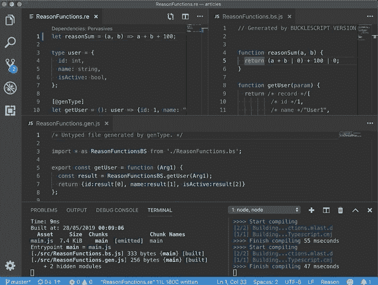

# 向现有代码库添加 ReasonML(第 1 部分)

> 原文：<https://dev.to/yakimych/adding-reasonml-to-an-existing-codebase-part-1-3kkg>

首先，陈述不太明显的事情:**向现有的 JavaScript 应用程序添加 [ReasonML](https://reasonml.github.io/) 非常容易！**其实并没有比加[流量](https://flow.org/)难那么多。因此，如果你听说过 ReasonML，并对尝试它感到好奇，但不知道如何将它集成到现有的代码库中，这是一个好消息，你可以在 10 分钟内启动并运行它😃

这将是一个关于向现有代码库添加 ReasonML 的迷你系列。在这一部分中，我们将通过一个使用 webpack 的普通 JavaScript 设置的例子来了解基础知识:

*   在 ReasonML 中编写代码
*   从 JavaScript 调用它
*   使用 ReasonML 类型作为 JavaScript 记录(通过 [genType](https://github.com/cristianoc/genType)

在[第 2 部分](https://dev.to/yakimych/adding-reasonml-to-a-vue-application-1j9c)中，我们将看看如何给一个 [Vue.js](https://vuejs.org/) 应用程序添加一些用 ReasonML 编写的 API 调用和解码函数。在[第 3 部分](https://dev.to/yakimych/adding-reasonml-to-a-react-typescript-codebase-40ok)中，我们将在 [React](https://reactjs.org/) [TypeScript](https://www.typescriptlang.org/) 应用程序中使用相同的 API 调用者。所以让我们开始吧。

## 第 0 步:起点

起点是一个(几乎)空的应用程序，它是按照 [webpack](https://webpack.js.org/) 指南中的[入门](https://webpack.js.org/guides/getting-started/)部分创建的。`index.js`文件是这样的:

```
function component() {
  const element = document.createElement("div");

  element.innerHTML = `Placeholder content`;

  return element;
}

document.body.appendChild(component()); 
```

我们在`package.json` :
中有 2 个脚本

```
"scripts":  {  "build":  "webpack",  "start":  "webpack-dev-server --open"  } 
```

## 第一步:添加 BuckleScript

[BuckleScript](https://bucklescript.github.io/) 用于将 ReasonML 或 OCaml 代码编译成 JavaScript，而 [genType](https://github.com/cristianoc/genType) 将简化 Reason 和 JS:
之间的互操作

```
npm install --save-dev bs-platform gentype 
```

为了让它工作，我们只需要运行`bsb -make-world`，这将首先把我们的 ReasonML 代码转换成 JavaScript。之后，生成的`*.bs.js`文件将被 webpack 获取，并以与“普通”JavaScript 代码相同的方式处理。让我们将`bsb -make-world`命令添加到`package.json` :
中的`build`和`start`脚本中

```
"scripts":  {  "build":  "bsb -make-world && webpack",  "start":  "bsb -make-world && webpack-dev-server --open"  } 
```

在我们开始编写代码之前，剩下的最后一件事就是添加`bsconfig.json` :

```
{  "name":  "reason-in-javascript",  "sources":  [  {  "dir":  "src",  "subdirs":  true  }  ],  "package-specs":  [  {  "module":  "es6-global",  "in-source":  true  }  ],  "suffix":  ".bs.js",  "namespace":  true,  "refmt":  3  } 
```

*注意*:如果你使用带有 [reason-language-server](https://github.com/jaredly/reason-language-server) 扩展名的 [VS 代码](https://code.visualstudio.com)，IDE 会实时监视文件夹和 transpiles Reason 和 OCaml 文件。否则，我们将不得不在后台的终端窗口中运行一个观察器进程。在这种情况下，我们需要全局安装`bs-platform`:`npm install -g bs-platform`。

## 第二步:从 JavaScript 调用 ReasonML 函数

现在是时候创建一个`TestFunctions.re`文件了，这样我们就可以测试我们的设置:

```
let reasonSum = (a, b) => a + b; 
```

确保在开发过程中将其转换为 JavaScript 的最简单方法是在后台的终端中运行`bsb -make-world -w`。`-w`标志确保 bucklescript 监视在`bsconfig.json`的 sources 部分指定的文件夹中的变化。如前所述， [VS Code](https://code.visualstudio.com) 和 [reason-language-server](https://github.com/jaredly/reason-language-server) 会自动处理这个问题，即使没有后台观察者终端，一切也会顺利进行。在`.re`文件:
的旁边会立即生成一个`TestFunctions.bs.js`文件

```
function reasonSum(a, b) {
  return (a + b) | 0;
} 
```

生成的代码足够简单，所以我们在`index.js`中导入`reasonSum`函数，并调用它:

```
import { reasonSum } from "./TestFunctions.bs";

function component() {
  const element = document.createElement("div");
  element.innerHTML = `The result is ${reasonSum(1, 2)}`;

  return element;
}

document.body.appendChild(component()); 
```

果然——我们现在可以运行`npm start`并在浏览器中看到文本:*“结果是 3”*。如果我们将原因代码更改为`a + b + 1;`并保存，浏览器中的文本将动态更新为*“结果为 4”*。这意味着用 ReasonML 编写的代码现在可以成功地在我们的 JavaScript 代码库中传输、获取和运行了！

[](https://res.cloudinary.com/practicaldev/image/fetch/s--BpaEn7Yu--/c_limit%2Cf_auto%2Cfl_progressive%2Cq_66%2Cw_880/https://thepracticaldev.s3.amazonaws.com/i/vnuq44ze0c3ce9qslc9b.gif)

## 第三步:从 ReasonML 返回一条记录

从 ReasonML 返回一个对象怎么样？让我们用一个简单的`user`对象来尝试一下:

```
type user = {
  id: int,
  name: string,
  isActive: bool,
};

let getUser = (): user =>
  {id: 1, name: "Bob", isActive: true}; 
```

生成的 JavaScript 代码看起来有点可疑，因为 Reason 对象被编译成 JavaScript 数组:

```
function getUser(param) {
  return /* record */[
          /* id */1,
          /* name */"User1",
          /* isActive */true
        ];
} 
```

如果我们试图从我们的`index.js,`中调用这个“原样”，我们将不会得到我们所期望的:

```
const user = getUser();
console.log("User: ", user); 
```

```
// console output shows an array, rather than a JSON object:
User: Array(3)
        0: 1
        1: "User1"
        2: true 
```

这就是`genType`的用武之地。它可以为 TypeScript 和 Flow 生成类型，以及 ReasonML 和 JavaScript 之间的“粘合功能”。[关于它如何工作的更多信息](https://www.javierchavarri.com/adopting-reason-strategies-dual-sources-of-truth-and-why-gentype-is-a-big-deal/#how-does-gentype-work)。

由于 genType 现在在 BuckleScript 5 中得到[的“开箱即用”支持](https://twitter.com/BlaineBublitz/status/1109976216969322498)，我们所要做的就是在`bsconfig.json` :
中添加一个`gentypeconfig`部分

```
"gentypeconfig":  {  "language":  "untyped"  } 
```

现在给`getUser`添加一个`[@genType]`注释会在我们的
文件旁边产生一个新的`ReasonFunctions.gen.js`文件

```
/* ReasonFunctions.re */

[@genType]
let getUser = (): user =>
  {id: 1, name: "User1", isActive: true}; 
```

```
/* ReasonFunctions.gen.js */

import * as ReasonFunctionsBS from "./ReasonFunctions.bs";

export const getUser = function(Arg1) {
  const result = ReasonFunctionsBS.getUser(Arg1);
  return { id: result[0], name: result[1], isActive: result[2] };
}; 
```

现在，在从 JavaScript 调用这个之前，我们需要确保我们从`ReasonFunctions.gen`导入`getUser`，并且从`ReasonFunctions.bs` :
导入**而不是**

```
import { getUser } from "./ReasonFunctions.gen";

const user = getUser();
console.log("User: ", user);
const userGreeting = `Hello, ${user.name}!`;
alert(userGreeting); 
```

现在，这段代码生成了一条令人愉快的“问候”消息，以及控制台中的预期日志:

```
User: Object
        id: 1
        isActive: true
        name: "User1" 
```

## 总结

这是本迷你系列的第一篇文章，它(在相对较低的层次上)演示了用 ReasonML 编写的代码会发生什么，以及它如何最终成为 JavaScript 代码库。源代码可以在 [GitHub](https://github.com/Yakimych/articles/tree/master/basic-javascript) 上获得。

后续文章将展示更多实际例子，说明如何使用这种方法将原因代码包含在现有的 Vue.js 应用程序(T1)和 T2 的 React 类型脚本应用程序(T3)中，而不会丢失类型信息。