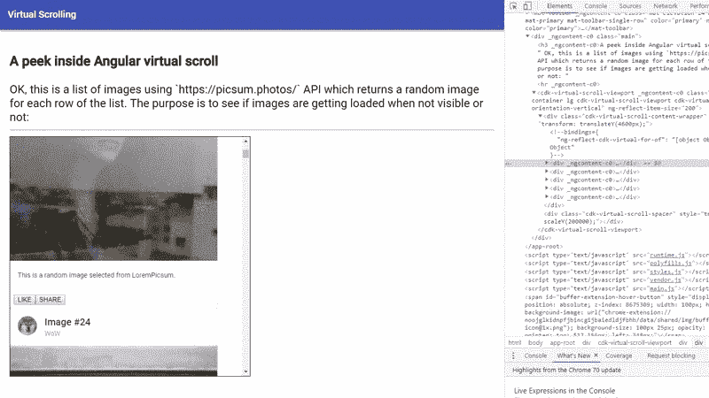
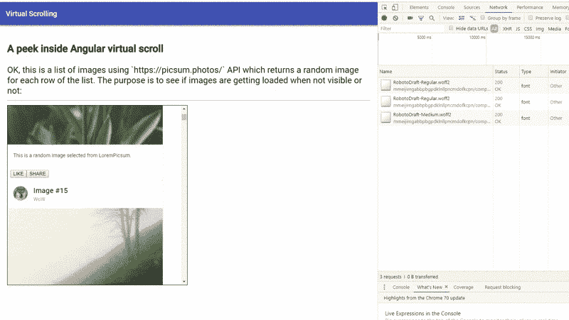

# 带角度的虚拟滚动

> 原文：<https://dev.to/yashints/virtual-scrolling-with-angular-45bm>

如果你已经关注了我的关于[网页性能](https://yashints.dev/blog/2018/09/29/web-perf-1)的系列文章，你会偶然发现我的[图片优化文章](https://yashints.dev/blog/2018/11/12/web-perf-4)，在那里我经历了一系列的步骤来延迟加载图片到你的页面上。

## 问题

当你的页面中有很多条目时，不管它们是什么性质(文本、图像、视频等)，都会极大地降低页面的速度。有很多方法可以解决这个问题，但是你应该花太多的精力去完成它。

当涉及到 Angular 时，情况会变得更糟，因为这会导致滚动速度非常慢，而且您必须对每个节点进行脏检查。

但是不用担心，我有一些好消息要告诉你，自从 Angular V7.0.0 以来，有一个叫做[虚拟滚动](https://material.angular.io/cdk/scrolling/overview)的新特性，它允许你通过只渲染适合屏幕的项目来以表演的方式显示大的元素列表。这可能看起来微不足道，但我在这里证明你错了。

## DOM 节点

为了证明它的好处，我创建了一个应用程序，它有一个包含标题和图片的数千个项目的列表。

然后，我使用虚拟滚动功能来查看每次滚动时创建了多少个`DOM`节点，结果如下:

[](https://res.cloudinary.com/practicaldev/image/fetch/s--HtrHvWkF--/c_limit%2Cf_auto%2Cfl_progressive%2Cq_66%2Cw_880/https://thepracticaldev.s3.amazonaws.com/i/cbes6zhee4zjchg1f4r0.gif)

从图中可以看到，无论我在列表中的哪个位置，它一次只加载 5 个项目。如果你想在手机上实现无限滚动行为，这是非常好的🔥。

## 网络通话

为了让它更好，我使用了网站 [Lorem Picsum](https://picsum.photos/) 给每个项目一个不同的图像(以防止浏览器缓存图像),由于一次只创建五个`DOM`节点，网络调用也相应地完成。

[](https://res.cloudinary.com/practicaldev/image/fetch/s--l0MsMgjW--/c_limit%2Cf_auto%2Cfl_progressive%2Cq_66%2Cw_880/https://thepracticaldev.s3.amazonaws.com/i/90tdpncj3n7wv08ut71f.gif)

请记住，我们必须使用`Intersection API`来实现这一点。它非常方便不是吗？👌

## 怎么做

好了，让我们来看看如何实现它。首先让我们使用[角度命令](https://cli.angular.io/) :
创建一个新项目

```
ng new virtual-scroll 
```

Enter fullscreen mode Exit fullscreen mode

在较新版本的 CLI 中，它会提示您指定是否需要路由模块以及默认的样式文件格式(CSS/SCSS 等)。).

现在你需要添加`CDK`包:

```
npm i -s @angular/cdk 
```

Enter fullscreen mode Exit fullscreen mode

**注意:**您必须首先导航到虚拟滚动文件夹。

一旦完成，用你选择的编辑器 [#VSCode](https://twitter.com/code) 打开创建的文件夹😁，并打开您的`app.module.ts`文件。

从 CDK 导入`ScrollingModule`和`ScrollDispatcher`并添加到你的模块:

```
import {
  ScrollingModule,
  ScrollDispatcher,
} from '@angular/cdk/scrolling';

@NgModule({
  declarations: [AppComponent],
  imports: [
    BrowserModule,
    ScrollingModule,
    MatListModule,
    MatToolbarModule,
    MatCardModule,
  ],
  providers: [ScrollDispatcher],
  bootstrap: [AppComponent],
})
export class AppModule {} 
```

Enter fullscreen mode Exit fullscreen mode

**注意:**我正在使用材料设计，这就是为什么我有更多的进口。

现在打开你的`app.component.ts`文件(如果你喜欢，可以随意创建一个新的组件，我只是在拼凑一些东西🤷‍)并创建一个包含标题和图像的 1000 个项目的数组:

```
import { Component } from '@angular/core';
import { BehaviorSubject } from 'rxjs';

interface IImage {
  title: string;
  src: string;
}

@Component({
  selector: 'app-root',
  templateUrl: './app.component.html',
  styleUrls: ['./app.component.scss'],
})
export class AppComponent {
  images: IImage[] = Array.from(
    new Array(1000),
    (x, i) => ({
      title: `Image #${i}`,
      src: `https://picsum.photos/200/?${i}`,
    })
  );

  observableImages = new BehaviorSubject<
    IImage[]
  >(this.images);
} 
```

Enter fullscreen mode Exit fullscreen mode

我使用来自`RxJs`的 subject 行为只是为了模拟拥有一个可观察对象并从服务器异步加载数据。

现在在`app.component.html`添加中，我们需要添加`cdk-virtual-scroll-viewport`并给它一个有像素单位的`itemSize`。

这基本上是所有东西粘在一起的地方。

当所有物品都是相同的固定尺寸时(在这种情况下，所有卡片都具有相同的高度)，您可以使用`FixedSizeVirtualScrollStrategy`。使用`itemSize`指令可以很容易地将它添加到你的视口中。这种约束的优点是它允许更好的性能，因为项目在呈现时不需要测量。

```
<cdk-virtual-scroll-viewport class="list-container lg" [itemSize]="200">
  <div *cdkVirtualFor="let image of observableImages | async;">
    <mat-card class="example-card">
      <mat-card-header>
        <div
          mat-card-avatar
          class="example-header-image"
        ></div>
        <mat-card-title
          >{{image.title}}</mat-card-title
        >
        <mat-card-subtitle>WoW</mat-card-subtitle>
      </mat-card-header>
      
      <mat-card-content>
        <p>
          This is a random image selected from
          LoremPicsum.
        </p>
      </mat-card-content>
      <mat-card-actions>
        <button mat-button>LIKE</button>
        <button mat-button>SHARE</button>
      </mat-card-actions>
    </mat-card>
  </div>
</cdk-virtual-scroll-viewport> 
```

Enter fullscreen mode Exit fullscreen mode

我这里只有一个`200px`为`itemSize`的容器。在里面，我在一个异步遍历列表的循环中创建了一个`div`，并给了它一个标题和一张图片。

卡片上的`HTML`来自[角材实例](https://material.angular.io/components/card/examples)。

仅此而已。现在在 VS 代码终端中运行`ng serve`，打开浏览器并导航到`localhost:4200`。

## 这是

仅此而已。看看在 Angular 中用新的`Virtual Scroll`特性为列表中的项目实现一个惰性加载策略是多么容易，只需要这么少的代码。

你可以在 [Angular Material 网站](https://material.angular.io/cdk/scrolling/overview)上阅读更多关于这个特性的内容，这个例子的代码可以在上找到。