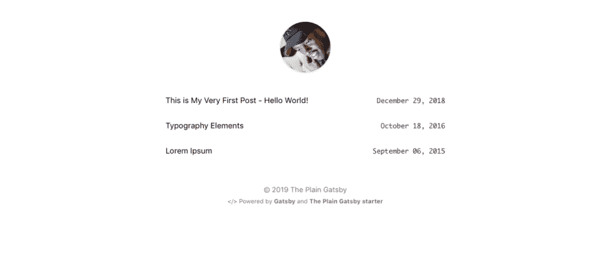
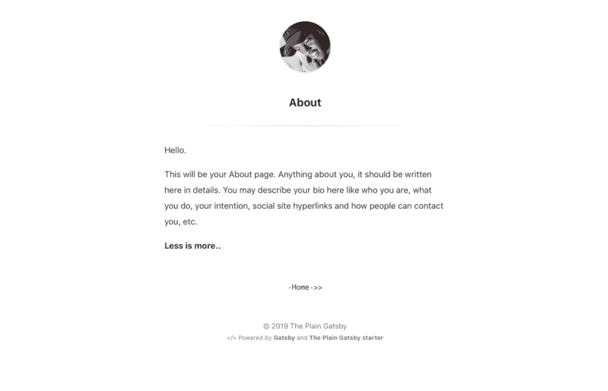
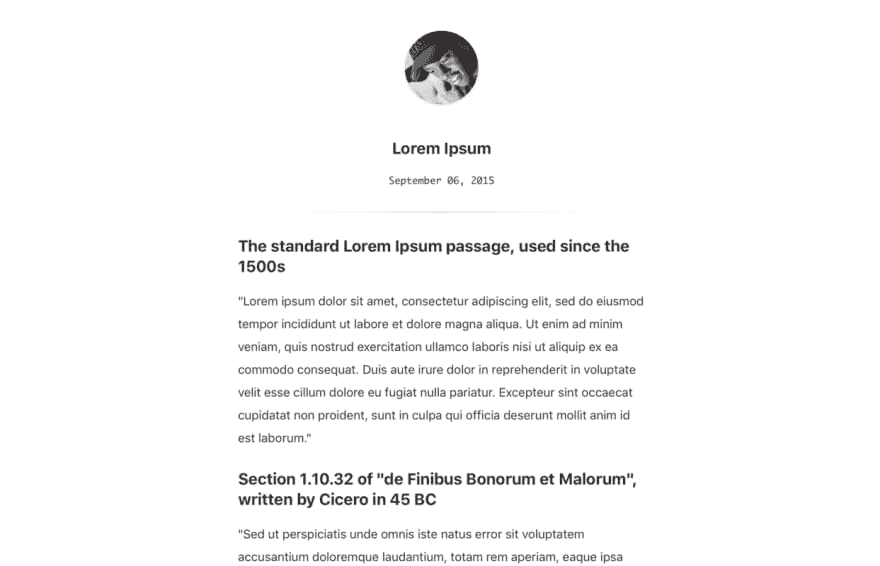

# 简单的盖茨比开胃菜

> 原文：<https://dev.to/wangonya/the-plain-gatsby-starter-4495>

正在为你的盖茨比博客寻找一个极简主义者？看看我做的这个启动器😀

灵感来自[黑斯瓦依第三](https://github.com/heiswayi)的[平原](https://github.com/heiswayi/the-plain)。

[](https://res.cloudinary.com/practicaldev/image/fetch/s--YQTBMUyU--/c_limit%2Cf_auto%2Cfl_progressive%2Cq_auto%2Cw_880/https://i.postimg.cc/7YPxnrJM/Screenshot-2019-05-25-at-18-33-36.png)

[](https://res.cloudinary.com/practicaldev/image/fetch/s--ItZBVgY1--/c_limit%2Cf_auto%2Cfl_progressive%2Cq_auto%2Cw_880/https://i.postimg.cc/SK9qxyHq/Screenshot-2019-05-25-at-18-34-12.png)

[](https://res.cloudinary.com/practicaldev/image/fetch/s--smVvro1K--/c_limit%2Cf_auto%2Cfl_progressive%2Cq_auto%2Cw_880/https://i.postimg.cc/CxzS9CNR/Screenshot-2019-05-25-at-18-34-00.png)

## 快速启动🚀

创建一个盖茨比网站。

使用 Gatsby CLI 创建一个新站点，并指定默认的启动器。

```
# create a new Gatsby site using the-plain-gatsby starter
gatsby new my-blog https://github.com/wangonya/the-plain-gatsby 
```

Enter fullscreen mode Exit fullscreen mode

**开始开发。**

导航到新站点的目录并启动它。

```
cd my-blog/
gatsby develop 
```

Enter fullscreen mode Exit fullscreen mode

**打开源代码，开始编辑！**

您的站点现在运行于`http://localhost:8000`！

注意:你还会看到第二个链接:*`[http://localhost:8000/](http://localhost:8000/)*_*graph QL `*。这是一个可以用来试验数据查询的工具。在 [Gatsby 教程](https://www.gatsbyjs.org/tutorial/part-five/#introducing-graphiql)中了解更多关于使用这个工具的信息。_

在您选择的代码编辑器中打开`my-blog`目录并编辑`src/pages/about.md`。保存您的更改，浏览器将实时更新！

编辑`gatsby.config.js`以更新站点元数据。

在`src/pages/blog/`的 markdown 中添加博客文章。每个博客都应该有一个`title`和`date`封面。已经提供了示例博客帖子。