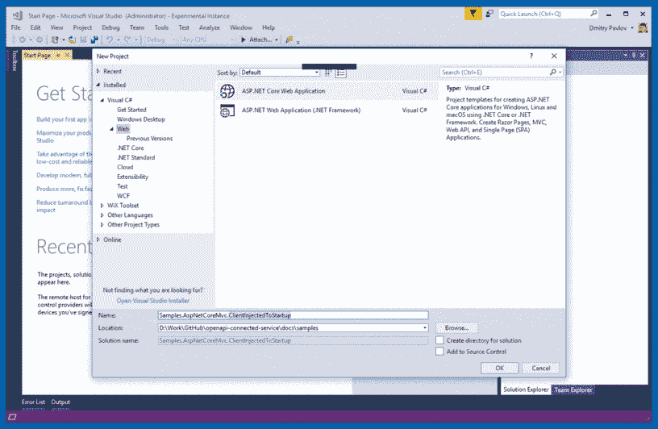

# 如何将生成的 HttpClient 添加到 ASP.NET 核心依赖注入中(正确方法)

> 原文：<https://dev.to/dr_dimaka/how-to-add-generated-httpclient-to-asp-net-core-dependency-injection-right-way-5731>

这篇操作指南描述了如何通过 [OpenAPI (Swagger)连接服务](https://marketplace.visualstudio.com/items?itemName=dmitry-pavlov.OpenAPIConnectedService)到 ASP.NET 核心应用程序，将依赖注入到为 PetStore API 生成的 HttpClient。示例代码可在[这里](https://github.com/dmitry-pavlov/openapi-connected-service/tree/master/docs/samples/Samples.AspNetCoreMvc.ClientInjectedToStartup)获得。

> [OpenAPI (Swagger)连接服务](https://marketplace.visualstudio.com/items?itemName=dmitry-pavlov.OpenAPIConnectedService)是一个 Visual Studio 扩展，用 [NSwag](https://github.com/RSuter/NSwag) 为 [OpenAPI(原 Swagger)](https://swagger.io/docs/specification/about/) web 服务生成 C# HttpClient 代码。简单地说，这就像老式的[为 WCF 添加服务引用](https://docs.microsoft.com/en-us/dotnet/core/additional-tools/wcf-web-service-reference-guide)或者[为 WSDL 添加 Web 引用](https://docs.microsoft.com/en-us/sharepoint/dev/general-development/step-2-adding-a-web-reference)，但是对于我们现在都在处理的 JSON API。

遵循下面的 **5 个步骤**来实现这一点:

**第一步。**使用 [OpenAPI (Swagger)连接服务](https://marketplace.visualstudio.com/items?itemName=dmitry-pavlov.OpenAPIConnectedService)在您的 ASP.NET 核心 MVCweb 应用程序中为 [PetStore API](http://petstore.swagger.io/) 生成 C# HttpClient 类。请参见[入门](https://github.com/dmitry-pavlov/openapi-connected-service/)部分来安装和运行这个 Visual Studio 扩展。

**第二步。**添加新文件 PetStoreClient.cs，并确保该类被标记为 partial，并且与 PetStoreClient.Generated.cs 中生成的公共分部类 Client 具有相同的名称和命名空间，还要定义接口 IPetStoreClient。使用接口背后的想法是将您看到的客户端使用的方法与您不想公开的方法分开。在这个示例中，我们只公开了检索商店出售的宠物数量的方法。因此我们定义了 GetSoldPetsCount 方法，该方法在内部使用为[GET pet/findbetsbystatus](http://petstore.swagger.io/#/pet/findPetsByStatus)端点生成的方法。看起来可能是这样的: