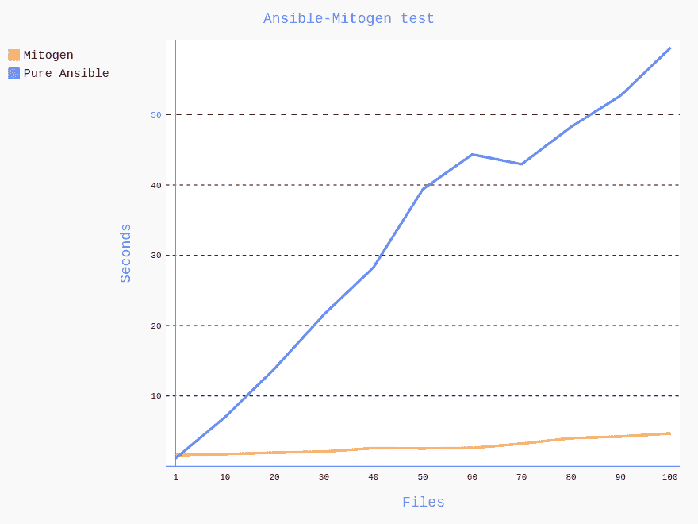
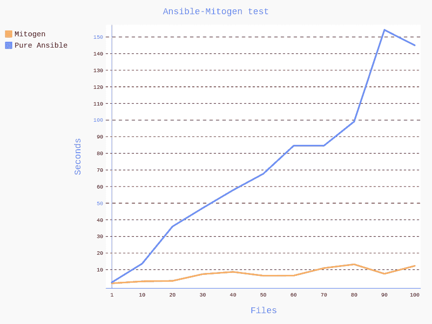

# 用丝裂素加速 Ansible！

> 原文：<https://dev.to/sshnaidm/speed-up-ansible-with-mitogen-2c3j>

## 用丝裂原加速 Ansible！

[Ansible](https://www.ansible.com/) 是当今最受欢迎的[配置管理系统](https://en.wikipedia.org/wiki/Configuration_management#Operating_System_configuration_management)之一，在 2015 年被红帽收购[后，Ansible 已经拥有数以千计的](https://www.redhat.com/en/blog/why-red-hat-acquired-ansible)[贡献者](https://github.com/ansible/ansible/graphs/contributors)，成为可能是最常用的部署和编排工具之一。它的使用案例令人印象深刻。
Ansible 通过 SSH 连接到远程主机来工作。它打开 SSH 会话，登录到 shell，通过网络复制 python 代码，并使用该代码在远程主机上创建一个临时文件。下一步，它用 python 解释器执行当前文件。所有这些工作流程都相当繁重，有多种方法可以让它变得更快更轻。

其中一种方法是使用 [SSH 管道](https://docs.ansible.com/ansible/2.3/intro_configuration.html#pipelining)，它重用一个 SSH 会话来复制多个任务的 python 代码，避免打开多个会话，节省了大量时间。(只是不要忘记在`/etc/sudoers`中禁用远程端 sudo 的`requiretty`设置)

加速 Ansible 的新方法是一个名为 [Mitogen](https://mitogen.networkgenomics.com/) 的伟大 python 库。如果像我这样的人不熟悉它的话——这个库允许在远程主机上快速执行 python 代码，Ansible 只是它的一个例子。Mitogen 在远程机器上使用 UNIX 管道，同时传递用 zlib 压缩的“腌制”python 代码。这使得它运行速度快，没有太多的流量。如果你感兴趣，你可以在它的[“它是如何工作的”](https://mitogen.networkgenomics.com/howitworks.html)页面中阅读关于它如何工作的细节。但是我们今天将集中讨论它的一个可能的相关部分。
有丝分裂原在特定的情况下可以让你的 Ansible 加快几倍，显著降低你的带宽。让我们检查一下最流行的用例，看看它是否对我们有帮助。

对我来说，运行 Ansible 最常见的用例是:在远程主机上创建配置文件、打包安装、从远程主机下载文件以及向远程主机上传文件。也许你想检查其他用例，请给本文留下评论。

让我们开始滚动！为 Ansible 配置有丝分裂原非常简单:
安装有丝分裂原模块:

```
pip install mitogen 
```

然后要么配置环境变量，要么在 ansible.cfg 文件中设置配置选项，两个选项都可以:
我们假设`/usr/lib/python2.7/site-packages/ansible_mitogen/plugins/strategy`是你安装的 Mitogen 库的路径。

```
export ANSIBLE_STRATEGY_PLUGINS=/usr/lib/python2.7/site-packages/ansible_mitogen/plugins/strategy
export ANSIBLE_STRATEGY=mitogen_linear 
```

或者

```
[defaults]
strategy = mitogen_linear
strategy_plugins = /usr/lib/python2.7/site-packages/ansible_mitogen/plugins/strategy 
```

* * *

在 virtualenv 中准备 Ansible，启用和不启用有丝分裂原:

```
virtualenv mitogen_ansible
./mitogen_ansible/bin/pip install ansible==2.7.10 mitogen
virtualenv pure_ansible
./pure_ansible/bin/pip install ansible==2.7.10 
```

*请注意，Mitogen 0.2.7 与 ansi ble 2.8(2019 年 5 月版)不兼容*

创建别名:

```
alias pure-ansible-playbook='$(pwd)/pure_ansible/bin/ansible-playbook'
alias mitogen-ansible-playbook='ANSIBLE_STRATEGY_PLUGINS=/usr/lib/python2.7/site-packages/ansible_mitogen/plugins/strategy:$(pwd)/mitogen_ansible/lib/python3.7/site-packages/ansible_mitogen/plugins/strategy ANSIBLE_STRATEGY=mitogen_linear $(pwd)/mitogen_ansible/bin/ansible-playbook' 
```

现在让我们试试在遥控器上创建文件的剧本:

```
---
- hosts: all
  gather_facts: false
  tasks:
    - name: Create files with copy content module
      copy:
        content: |
          test file {{ item }}
        dest: ~/file_{{item}}
      with_sequence: start=1 end={{ n }} 
```

并在创建 10 个文件时使用和不使用 Mitogen 运行它:

```
time mitogen-ansible-playbook file_creation.yml -i hosts -e n=10 &>/dev/null

real    0m2.603s
user    0m1.152s
sys     0m0.096s

time pure-ansible-playbook file_creation.yml -i hosts -e n=10 &>/dev/null

real    0m5.908s
user    0m1.745s
sys     0m0.643s 
```

现在我们看到了 2 倍的改进。让我们检查一下 20，30，...，100 档:

```
time pure-ansible-playbook file_creation.yml -i hosts -e n=100 &>/dev/null

real    0m51.775s
user    0m8.039s
sys     0m6.305s

time mitogen-ansible-playbook file_creation.yml -i hosts -e n=100 &>/dev/null

real    0m4.331s
user    0m1.903s
sys     0m0.197s 
```

最终，我们将执行时间提高了 10 倍以上！

现在让我们尝试不同的场景，看看它是如何改进的:

*   从本地主机上传文件到远程的场景(带`copy`模块):
    [](https://res.cloudinary.com/practicaldev/image/fetch/s--AkwBp0vL--/c_limit%2Cf_auto%2Cfl_progressive%2Cq_auto%2Cw_880/https://gist.githubusercontent.com/sshnaidm/092ead17ea4b5204586ad3e16a2f3bc3/raw/7a9c9f3bcfda9ec32a45b2f6f39eba3b343c3243/uploading_files.svg%3Fsanitize%3Dtrue)

*   使用`copy`模块在远程主机上创建文件的场景:
    [](https://res.cloudinary.com/practicaldev/image/fetch/s--pyf5V1aY--/c_limit%2Cf_auto%2Cfl_progressive%2Cq_auto%2Cw_880/https://gist.githubusercontent.com/sshnaidm/092ead17ea4b5204586ad3e16a2f3bc3/raw/7a9c9f3bcfda9ec32a45b2f6f39eba3b343c3243/creating_files.svg%3Fsanitize%3Dtrue)

*   从远程主机抓取文件到本地的场景:
    [](https://res.cloudinary.com/practicaldev/image/fetch/s--3x6P-TYD--/c_limit%2Cf_auto%2Cfl_progressive%2Cq_auto%2Cw_880/https://gist.githubusercontent.com/sshnaidm/092ead17ea4b5204586ad3e16a2f3bc3/raw/7a9c9f3bcfda9ec32a45b2f6f39eba3b343c3243/fetching_files.svg%3Fsanitize%3Dtrue)

让我们在几(3)台远程主机上尝试最后一个场景，例如上传文件场景:
[](https://res.cloudinary.com/practicaldev/image/fetch/s--o4nMn4Tm--/c_limit%2Cf_auto%2Cfl_progressive%2Cq_auto%2Cw_880/https://gist.githubusercontent.com/sshnaidm/092ead17ea4b5204586ad3e16a2f3bc3/raw/7a9c9f3bcfda9ec32a45b2f6f39eba3b343c3243/uploading_files_multiple.svg%3Fsanitize%3Dtrue)

正如我们所见，在这些情况下，丝裂原为我们节省了时间和带宽。但是如果瓶颈是不可解决的，例如磁盘或网络的 I/O，或者其他地方，那么当然很难指望 Mitogen 的帮助。
让我们用 yum/dnf 运行示例包安装，用 pip 运行 python 模块安装。
包被预先缓存以避免依赖网络故障:

```
---
- hosts: all
  gather_facts: false
  tasks:
    - name: Install packages
      become: true
      package:
        name:
          - samba
          - httpd
          - nano
          - ruby
        state: present

    - name: Install pip modules
      become: true
      pip:
        name:
          - pytest-split-tests
          - bottle
          - pep8
          - flask
        state: present 
```

使用有丝分裂原需要 12 秒，使用纯 Ansible 也是如此。在 [Mitogen for Ansible 页面](https://mitogen.networkgenomics.com/ansible_detailed.html)中，您可以看到额外的基准
和测量值。正如页面所声明的:

> 一旦一个模块正在执行，丝裂素就不能改进它，它只能保证模块尽可能快地执行

这就是为什么找到你的瓶颈在哪里很重要，如果它们与可行的操作有关，Mitogen 将
帮助你解决它，并大大加快你的剧本。