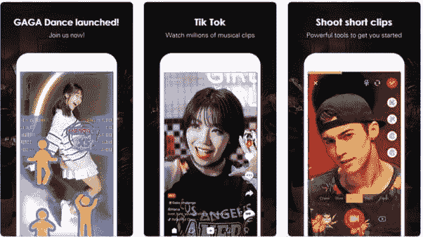
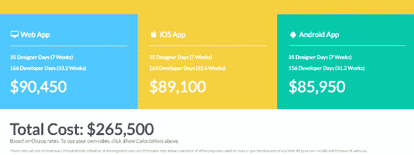

# 创建一个像抖音这样的移动应用程序需要多少成本？

> 原文：<https://dev.to/realabbas/how-much-does-it-cost-to-create-a-mobile-application-like-tiktok-1b2m>

开发移动应用程序的成本取决于几个因素

1)您正在构建什么类型的应用程序？人们必须登录吗？
3)人们会创建个人档案吗？
4)你将如何从你的应用程序中赚钱？
5)人们会对事物进行评级或评论吗？
6)你的应用应该有多好看？
7)你的 app 需要连接你的网站吗？
8)是否支持谷歌/苹果地图
9) OTP 认证/无密码认证
10)服务器成本
11)维护成本

TIKTOK 应用分析

我已经使用这个应用程序一年了，所以我对所有的功能都很了解。

所以要开发一个有这些功能的应用程序，

安卓应用:85950 美元

iOS 应用:8.91 万美元

Web 应用程序、iOS 应用程序和 Android 应用程序的预计价格

