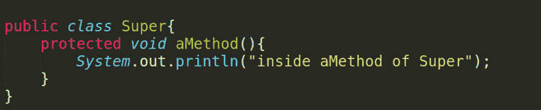
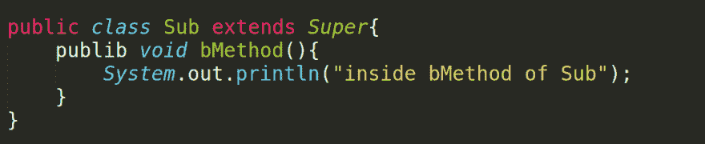
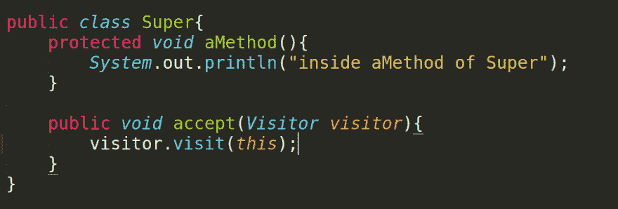
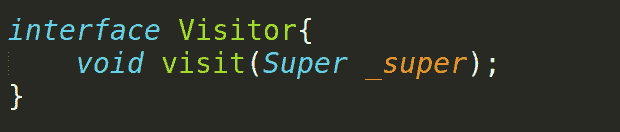
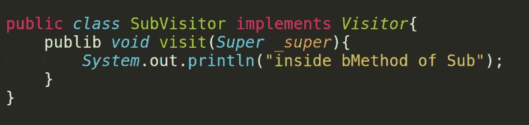
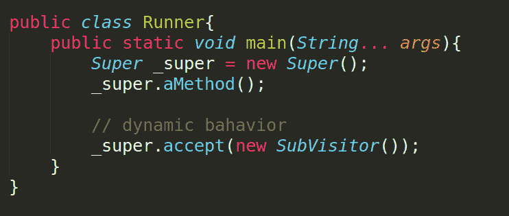
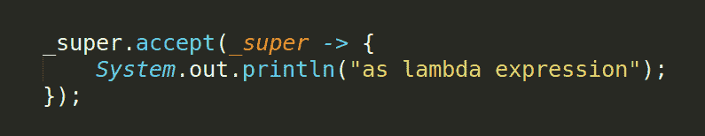
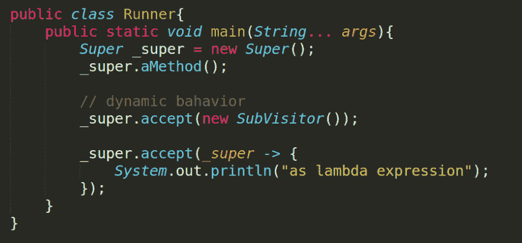

# 没有扩展的继承

> 原文：<https://dev.to/mhddurrah/inheritance-without-extends-22hn>

<figure>

是的，继承意味着通过子类增加或改变一个类的行为传统的继承方式是通过增加新方法来扩展一个类。
让我们以 Java 世界
 为例

<figcaption>Super class</figcaption>

</figure>

<figure>

扩展这个类来添加一个新的行为可以直接简单地完成:

<figcaption>Inherited</figcaption>

</figure>

不错！

<figure>

但是这里的继承是静态的，我需要为每个新功能创建一个新类。
另一种增加功能的方式来自设计模式世界，它就是
访问者模式，它基本上“代表了对一个对象结构的元素执行的操作”而且可以用来定义一个新的操作而不改变类。
这个模式的一个强制性的先决条件是实现它:)，实现就是在类中添加一个行为来接受访问者。
[T6】](https://res.cloudinary.com/practicaldev/image/fetch/s--XKCiD1Fh--/c_limit%2Cf_auto%2Cfl_progressive%2Cq_auto%2Cw_880/https://cdn-images-1.medium.com/max/1200/1%2A8B4Sy1AnNvJJHv-KgsFL9Q.png)

<figcaption>Visitor</figcaption>

</figure>

<figure>

Visitor 是一个具有单个(或多个)方法的接口

<figcaption>Visitor Interface</figcaption>

</figure>

<figure>

让我们实现子类模拟器->

<figcaption>Visitor Implementation</figcaption>

</figure>

<figure>

但是我们必须为新的功能添加一个新的类！是的，但是好的一面是我们可以动态地给类的单个对象添加功能(同样的想法也适用于装饰模式)

<figcaption>Visitor Tester</figcaption>

</figure>

<figure>

用λ表达式
 添加另一个访问者

<figcaption>Using Lambda</figcaption>

</figure>

完整片段

这不会提供传统继承的完全控制和能力，但是有帮助:)

最后一点:尽可能在你的类中支持访问者模式:)

欢迎所有意见。