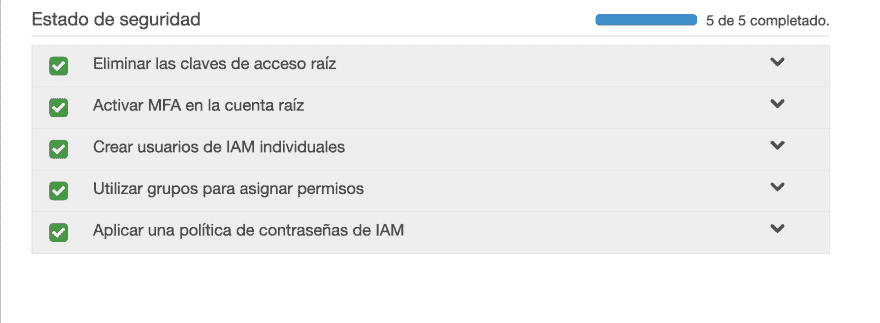
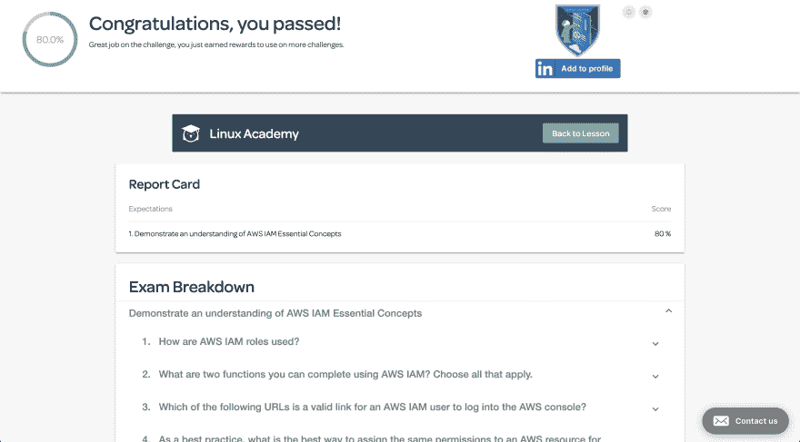

# 30 天 AWS(第 1 天)

> 原文：<https://dev.to/gameoverwill/30-days-of-aws-day-1-f88>

你好，所有关注这场疯狂冒险的人，我真的很感激。

今天我在探索 AWS 中的我是什么。虽然我已经知道重新学习是很棒的事情。除了阅读官方文件，我还看了我在 Linux 学院上的课程中关于这个主题的所有部分。

### 今天我花了一个半小时学习的话题

1.  什么是 IAM 服务(来自官方文档):AWS 身份和访问管理(IAM)是一个 web 服务，可以帮助您安全地控制对 AWS 资源的访问。您使用 IAM 来控制谁被验证(登录)和授权(有权限)使用资源。如果您想了解更多信息，请点击[此处](https://docs.aws.amazon.com/IAM/latest/UserGuide/introduction.html)

2.  IAM 初始设置和配置:这部分我在创建 AWS 帐户时就已经完成了。基本上，我在这里涵盖了 5 个步骤，应该已经完成，以保持您的帐户安全。

3.  创建 IAM 用户和策略:这里我练习了如何创建用户和策略。

4.  创建 IAM 组和策略:所以我在这里练习创建不同的组并向这些组添加策略。

5.  做小测验:在主题的最后，他们有一个小测验，你可以用宝石购买它，我花了 7 个宝石，我得到了 80% / 100%，所以我认为今天是富有成效的一天

今天到此结束，明天我将继续学习这门 AWS 基础课程。

感谢阅读。