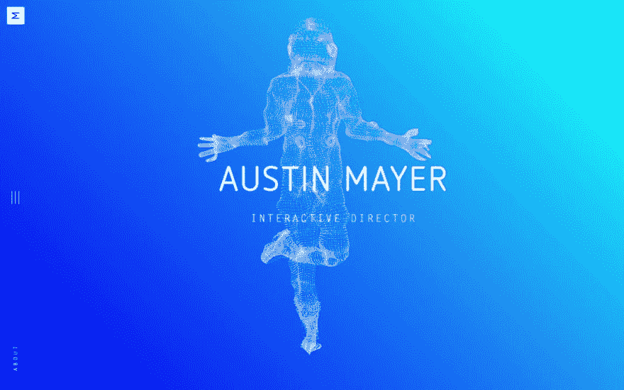

# Three.js 中的点云效果

> 原文：<https://dev.to/maniflames/pointcloud-effect-in-three-js-3eic>

不久前，我建立了一个网站，作为一个小型竞赛的投稿。为了增加趣味，我决定添加一些 Three.js。一个很长时间以来一直困扰我的效果是点云。奥斯汀·梅尔在他的网站上实现了一个非常酷的效果，自从我在他的网站上看到它，我就一直在思考。

> <video loop="" controls=""><source src="https://video.twimg.com/ext_tw_video/1098661856619757569/pu/vid/1152x720/6YobQrXEmGAbEmFl.mp4?tag=6" type="video/mp4"></video>奥斯迈尔@阿玛耶 _新作品集！终于在项目、孩子和睡眠之间找到时间完成了这个。
> T25】👇
> 2019 年 2 月 21 日下午 19:16[](https://twitter.com/intent/tweet?in_reply_to=1098662776929693706)[](https://twitter.com/intent/retweet?tweet_id=1098662776929693706)[](https://twitter.com/intent/like?tweet_id=1098662776929693706)

由于这个网站有更多的内容，我决定实现一个超级基本版本的点云。Three.js 提供了几个函数，可以让你非常快速地创建一个点云。

# 点代替网格

Three.js 中的网格(3d 对象)由几何体和材质组成。但不是显示整个网格，你只是想显示顶点。Three.js 中的 [`Points`](https://threejs.org/docs/index.html#api/en/objects/Points) 类可以接受一个几何图形并显示点，而不是“完整”对象。使用 [`PointsMaterial`](https://threejs.org/docs/index.html#api/en/materials/PointsMaterial) ，您可以控制积分的大小。“点云网格”的代码类似于:

```
 let geometry = new THREE.TorusGeometry(10, 3, 16, 100)
  let material = new THREE.PointsMaterial({ color: 0xFFFFFF, size: 0.25 })
  mesh = new THREE.Points(geometry, material)

  scene.add(mesh) 
```

Enter fullscreen mode Exit fullscreen mode

如需完整代码，请点击/按下示例并查看代码选项卡中的`main.js`！

[https://glitch.com/embed/#!/embed/three-pointcloud-1?previewSize=100&path=index.html](https://glitch.com/embed/#!/embed/three-pointcloud-1?previewSize=100&path=index.html)

# 使用 3D 模型

在 Three.js 中加载 3D 模型是可能的，但是你必须做一些额外的工作。根据 3D 模型的格式，除了主库之外，您还必须加载加载程序。我喜欢用。obj 模型我自己，所以我个人需要`OBJLoader`。

如果你通过一个 HTML 标签来加载这个库，你必须添加一个额外的标签来加载 Three.js 下载中的一个单独的脚本。这个脚本可以在`examples/js/loaders/OBJLoader.js`中找到。

如果你已经载入了整个文件夹，它会有点像:

```
<script src="three/examples/js/loaders/OBJLoader.js"></script> 
```

Enter fullscreen mode Exit fullscreen mode

如果使用 npm，可以通过 jsm 文件夹导入加载程序。如果您喜欢 require 语法，请继续使用 js 文件夹！导入语句看起来像这样:

```
//import syntax
import { OBJLoader } from 'three/examples/jsm/loaders/OBJLoader.js'

//require syntax, require adds OBJLoader directly to THREE
require('three/examples/js/loaders/OBJLoader.js') 
```

Enter fullscreen mode Exit fullscreen mode

加载器的工作有点像没有承诺的扩展“获取”。您插入包含模型的文件的 url，加载程序将执行一个 http 请求。您为成功的请求、仍在进行的请求和不成功的请求提供回调。

通过选择结果的第一个子几何体，可以获得加载的对象的几何体。

```
const loader = new THREE.OBJLoader()
loader.load('https://cdn.glitch.com/fcf3c007-b4eb-4250-ba6b-653fdab94ce3%2Fjapanese_temple.obj?1558792651869',
(obj) => {
    // the request was successfull
    let material = new THREE.PointsMaterial({ color: 0xFFFFFF, size: 0.25 })
    mesh = new THREE.Points(obj.children[0].geometry, material)
    mesh.position.y = -15 //this model is not exactly in the middle by default so I moved it myself
    scene.add(mesh)
},
(xhr) => {
    // the request is in progress
    console.log(xhr)
},
(err) => {
    // something went wrong
    console.error("loading .obj went wrong, ", err)
}) 
```

Enter fullscreen mode Exit fullscreen mode[https://glitch.com/embed/#!/embed/three-pointcloud-2?previewSize=100&path=index.html](https://glitch.com/embed/#!/embed/three-pointcloud-2?previewSize=100&path=index.html)

小免责声明:3D 模型可以在 3D 建模软件中建立，如 Autodesk Maya3D 和 Blender，带有几何体和“修改器”。如果模型的很大一部分是用修改器创建的，那么当你应用点云时，这些点不会以一种你可以“看见”对象的方式显示出来。这就是为什么你总是测试你想要专门用于这个目的的 3D 模型是非常重要的。

# 有点控制不住了

互动总是会让事情变得更有趣。像奥斯汀梅尔的网站上的悬停和变形效果肯定需要努力和时间来创造。但是 three 有一些你可以快速添加的功能，至少可以让用户用`OrbitControls`移动相机。像 3D 模型加载器一样，控件是您必须加载的扩展。轨道控制位于`examples/js/controls/OrbitControls.js`(或使用导入语法的`examples/jsm/controls/OrbitControls.js`)。代码看起来有点像这样:

```
 camera = new THREE.PerspectiveCamera(75, window.innerWidth / window.innerHeight, 0.1, 1000)
  camera.position.z = 40

  const controls = new THREE.OrbitControls(camera)
  controls.enableZoom = false //zoom happens on scroll which can be quite annoying 
```

Enter fullscreen mode Exit fullscreen mode[https://glitch.com/embed/#!/embed/three-pointcloud-3?previewSize=100&path=index.html](https://glitch.com/embed/#!/embed/three-pointcloud-3?previewSize=100&path=index.html)

我希望这有助于“开始”在 Three.js 中创建点云！

# 学分

我从我最好的朋友斯文那里得到了很多道义上的支持，他也提交了一个网站来参赛。我有很多疑问，不确定我是否应该提交任何东西。我很高兴他说服了我，因为今年冬天我们都在上海🎉。如果你想知道更多一点，他不久前写了一篇文章:

[](/sven) [## 为什么我在这里创建一个帐户，为什么我这样做

### 斯文·霍夫曼 2 月 7 日 193 分钟阅读

#writing #beginners #career #meta](/sven/why-i-struggled-with-creating-an-account-here-and-why-i-did-it-5ah)