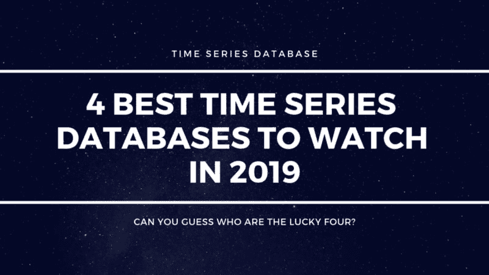
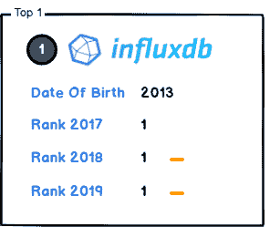
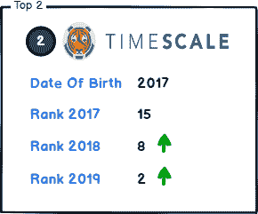
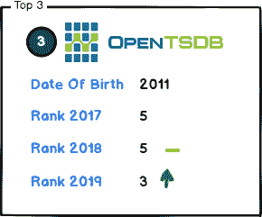

# 2019 年值得关注的 4 个最佳时间序列数据库

> 原文：<https://dev.to/devconnectedcom/4-best-time-series-databases-to-watch-in-2019-4d6m>

在开发**物联网、金融或工业应用**时，选择一个好的时间序列数据库在大多数时候都是一件令人头疼的事情，要在行业中 30 多家(并且还在增长)时间序列供应商之间进行选择。

当选择一个时间序列数据库时，最好知道它们能提供什么，以及它们如何能满足你的需要。

您更喜欢直接编写 SQL，还是更喜欢一种全新的时间序列处理语言？您是否关注基于云的解决方案，或者您是否有自己的集成解决方案？

这篇文章将**帮助你基准**你的不同选择。

下面是 2019 年我用的最好的时间序列数据库**列表。**

## 1。InfluxDB

InfluxDB 是由 InfluxData 在 2013 年建立的，是一个完全**的开源时间序列数据库**，可在当前所有操作系统上运行。InfluxDB 支持大量的编程语言(是的..甚至 Lisp 和 clo jure……)。它针对繁重的编写负载进行了优化，并发性非常好。

InfluxDB 是**无模式的**:它建立在 **NoSQL 风格的**之上，允许快速修改数据库模式。根据你想要建造的东西，这个概念性的选择**可能会也可能不会适应你的需求**。

*为什么要用 InfluxDB？*

*   在 5 分钟内玩它

从你下载到你可以玩它，只需要五分钟。**一份好的技术文档**让安装、配置和启动 InfluxDB 变得超级简单。作为一个类似 NoSQL 的数据库，你不必以任何方式设置你的数据库:**你插入你的数据，你就可以开始了。**

*   集成刻度堆栈

InfluxDB 是 TICK 栈的一部分: **Telegraf、InfluxDB、Chronograf 和 Kapacitor** 。InfluxData 提供了开箱即用的**可视化工具**(可以与 Grafana 相比)，直接与 InfluxDB 绑定的数据处理引擎，以及一组超过 **50 个代理，可以收集许多不同数据源的实时指标。**

现在让我们公平一点。

InfluxDB 大部分时间和 Grafana 一起使用。Chronograf(目前)不如 Grafana，但 InfluxData 正在努力扭转局面。通过构建 **Flux，一种新的处理语言**，并将其与 Chronograf 直接集成，他们可能会在接下来的几个月中为其提供一些非常独特的功能。

(想了解更多关于 Flux 的知识？我写了一篇关于它的文章。)

SQL 已死——向 Flux 致敬:[http://devconnected.com/sql-is-dead-hail-to-flux/](http://devconnected.com/sql-is-dead-hail-to-flux/)

InfluxDB 网站—[https://influxdata.com](https://influxdata.com)

## 2。时标 b

去年排名第 15 位的 TimescaleDB 在今年的排名中取得了巨大的进步。

为什么？

如果你问我，我会说他们提供了一个非常可靠且可扩展的 InfluxDB 替代方案。 TimescaleDB 也是开源的，并且基于 **SQL 前提**。它们还为您的应用程序提供了大量受支持的编程语言(包括 Java 和 Python ),以便直接与之集成。

time scale db**与 PostgreSQL**直接相关，因为它扩展了著名的关系数据库，以提供一组独特的时间序列相关操作(如快速摄取)。

为什么要使用 TimescaleDB？

*   SQL 支持:

TimescaleDB 最大的优点之一是它支持 SQL **语言本身**并且允许开发人员无需学习任何新语言就能快速跟上发展的步伐。这对于开发人员的生产力来说当然是一个非常好的方面，因为您可以确保团队中有 SQL 经验的开发人员可以立即使用 TimescaleDB。

*   PostgresSQL 集成:

《卫报》发表了一篇非常好的文章，解释了他们从 MongoDB 到 PostgresSQL 的转变，这有利于扩展他们的架构和加密他们的静态内容。正如你所知，**大公司依赖 SQL 约束系统**(当然是云架构)来确保系统的可靠性和可访问性。我相信**PostgreSQL 会继续增长，TimescaleDB 也会。**通过加入 PostgresSQL 生态系统，TimescaleDB 将继承这个庞大社区开发的所有工具和插件。

*   有争议的比 InfluxDB 更好的性能

我必须强调，这是一个“有争议的”更好的性能，因为系统对市场来说是相当新的，它们没有在行业提供的所有不同情况下进行测试。

作为一个公正的作家，我必须指出这样一个事实，Matvey Arye 写了一篇非常好的文章，比较了 **Flux 和 SQL** 以及在某种程度上 **InfluxDB 和 TimescaleDB** 。尤其是他关于查询优化的观点应该仔细阅读，它们对**为什么它们可以更有性能**(至少在理论上)提供了一个非常可靠的解释。

*Matvey Arye 文章— SQL 与 Flux*

SQL 与 Flux:为时序数据选择正确的查询语言。
[https://blog . time scale . com/SQL-vs-flux-influx db-query-language-time-series-database-290977 a01a 8 a](https://blog.timescale.com/sql-vs-flux-influxdb-query-language-time-series-database-290977a01a8a)

*TimescaleDB 网站*——【http://timescale.com T2】

## 3。OpenTSDB

OpenTSDB 的运行时间比其竞争对手长得多，是解决大规模存储时间序列数据需求的首批技术之一。OpenTSDB 承诺能够在 TSD 服务器的分布式实例上存储数千亿的数据行。

OpenTSDB 是一个基于 Apache HBase 的无模式数据库。对于那些不知道的人来说， **HBase 是一个非关系管理系统，旨在以优雅而高效的方式处理大表存储。**

*为什么要使用 OpenTSDB？*

*   性能！

ted Dunning(MapR 的首席应用架构师)做了一个非常详细的演讲，讲述了时间序列数据库应该如何构建，以及时间范围的水平排列如何将 DBMS 扩展到每秒 2000 万到 3000 万次写入。考虑到单个 InfluxDB 节点实例每秒可以插入多达一百万次写入，这是一个巨大的插入速率。

如果您正在处理系统中的这种插入率，您可能想尝试一下 OpenTSDB。

*   集成生态系统

阅读文档，OpenTSDB 集成了相当数量的工具，如 **Cassandra、BigTable、CollectD、StatsD、Chef 甚至 Puppet** 用于部署管理。

*时间序列数据库架构上的 Ted Dunning*

[https://youtu.be/SgD3RD2Shg4](https://youtu.be/SgD3RD2Shg4)

*OpenTSDB 网站*——【http://opentsdb.net T2】

## 4。石墨

Graphite 是一个更加成熟和广泛使用的时间序列数据库系统。Graphite 是一个**强大的监控工具，它存储数字时间序列数据**，并通过其 Graphite-web 界面以合理的速度按需显示它们。Graphite 大部分时间被用作系统、网络和应用程序性能指标存储。Booking.com 的**、Reddit 和 GitHub 的**等大公司每天都在使用它，以便能够在他们的架构上轻松检测到**的中断**。

为什么要使用石墨？

*   石墨做一些事情，但它做得很好。

Graphite 是为处理数字数据而构建的。如果您不处理数字数据，这本身就是一个限制，因此 Graphite 提供了一套现成的工具，使开发人员可以轻松入门。Graphite Web 为开发者提供了一个非常好的界面来监控他们的应用。

*   作为 OpenTSDB，Graphite 是一个很好的集成生态系统，它可以与许多工具本地连接，并使开发人员可以轻松地与他们现有的基础设施连接。Graphite 可以轻松连接 CollectD、sensu、Riemann、Windows Server、Logstash 等等。

*石墨网站*——【http://graphiteapp.org T2】

## X —该你分享了！

你对那些时间序列数据库有经验吗？如果是，你会推荐哪一款，为什么？

此外，如果你发现一些 TSMS 应该排名更高或更低，请在评论部分给出你自己的排名。

想多读点？以下是关于 devconnected 的最新文章:

*   2019 年 InfluxDB 权威指南:[http://dev connected . com/the-Definitive-Guide-To-influx db-in-2019/](http://devconnected.com/the-definitive-guide-to-influxdb-in-2019/)
*   2019 年 4 款最佳仪表盘监控工具:[http://dev connected . com/4-best-dashboard-monitoring-tools-in-2019/](http://devconnected.com/4-best-dashboard-monitoring-tools-in-2019/)
*   使用 Prometheus 和 Grafana 监控 Linux 进程:[http://dev connected . com/monitoring-Linux-Processes-using-Prometheus-and-Grafana/](http://devconnected.com/monitoring-linux-processes-using-prometheus-and-grafana/)

玩得开心！