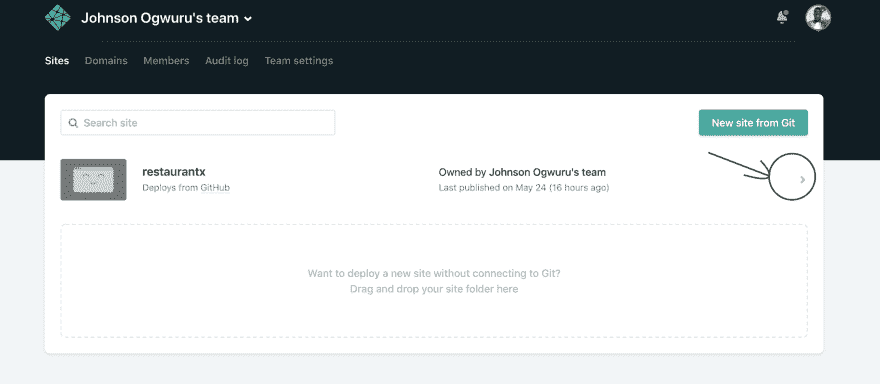
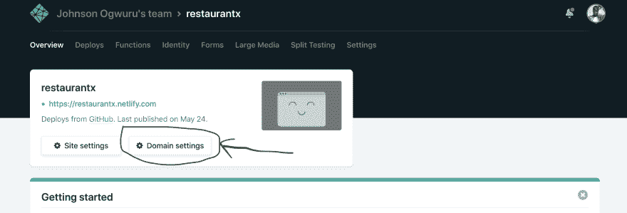
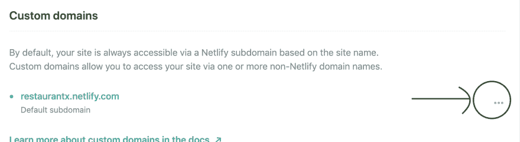

# Netlify Hack 系列-编辑子域名

> 原文：<https://dev.to/ogwurujohnson/netlify-hack-series-editing-sub-domain-name-3eln>

> 声明:本周是我第一次使用 netlify 来部署我在一周内构建的静态应用程序。看起来大多数人要么是在 netlify 上部署的新手，要么根本没有使用过它。为了回答他们可能有的一些问题，我将开始一个系列，讨论你可以用 netlify 实现的一切，因为我学到了更多。

在本系列的第一部分，我们将看看如何更改您的子域名。

当我们发现 netlify 为我们的应用程序生成了一个随机的有趣的子域名时，这真是太棒了，但最终，我们更喜欢有一个指向应用程序名称或用途的子域名。下面的图片将详细描述这一过程。

Step1:
 
点击箭头，高亮显示打开你想要编辑其子域名的站点页面。

Step2:
 
点击按钮，标注为高亮显示的“域设置”

第三步:
 
选择菜单，你会看到`edit site name`。

BOOOOOOM，你有它。现在您已经更改了您的子域名。玩得开心。