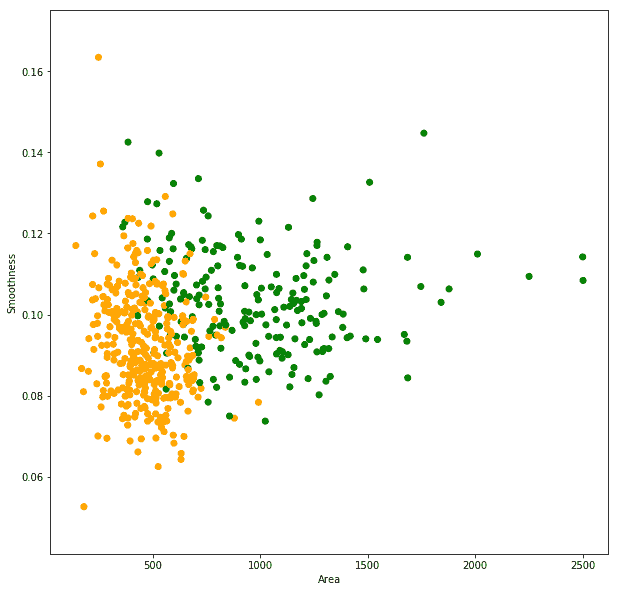
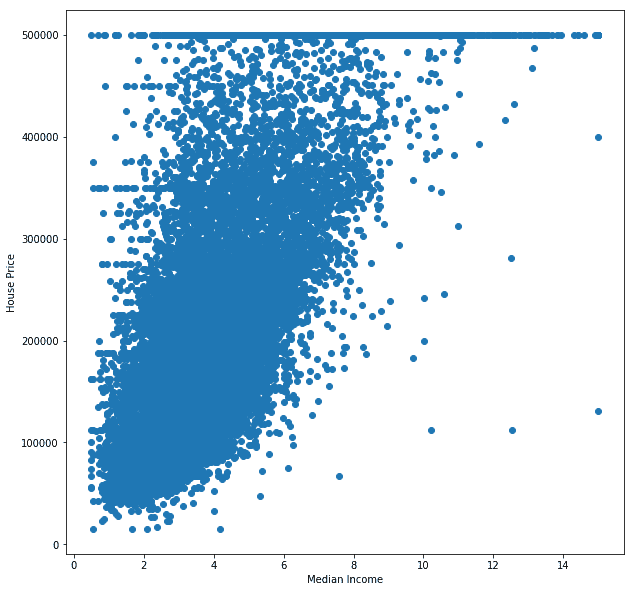
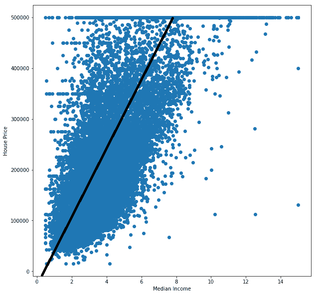
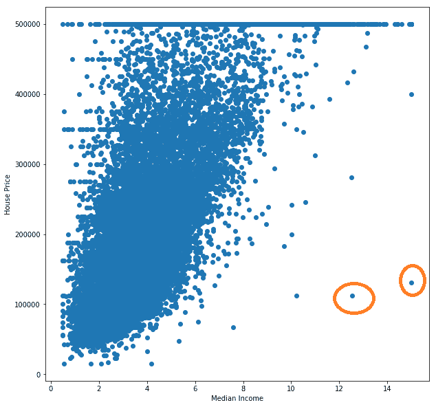

# 机器学习:从零到稍微不那么困惑

> 原文：<https://dev.to/tabz_98/machine-learning-from-zero-to-slightly-less-confused-2bal>

当我三年前开始研究计算机科学时，机器学习似乎是只有杰出的科学家和数学家才能理解的工具之一(更不用说用来解决日常问题了)。每当我听到“机器学习”这几个字的时候，我就想象着一座高塔，上面有乌云，还有一条龙守护着它。我认为这种非理性恐惧的主要原因是，这个领域是我所不了解的许多学科的交汇点(例如，统计学、概率、计算机科学、线性代数、微积分，甚至)。

我知道不只是我。难怪人们害怕机器学习，人们不喜欢数学！尽管理解机器学习背后的一些非常基础的数学知识不仅会让你很好地理解它是如何工作的，而且会让你成为一名机器学习实践者。谁知道呢，也许你会像我一样喜欢数学。

在这篇文章中，我将试图让你更好地理解机器学习到底是什么，并希望消除你对这个主题的恐惧。开始使用机器学习解决现实世界的问题可能比许多人认为的要容易得多。

机器学习(ML)是让机器执行特定任务的科学，而无需明确编写执行任务的算法。另一个定义是让机器*根据经验学习*如何执行某项任务，同时考虑一些性能指标(它执行任务的好坏)。

让我们考虑这两个流行的问题:

*   给出乳腺肿瘤的一些特征(即其面积和平滑度)，预测肿瘤是恶性还是良性。

*   给定加州一所房子的月收入，预测房子的价格。

## 问题 1:肿瘤分类

让我们看看。我们使用肿瘤的两个可变特征来确定它是恶性的还是良性的，我们如何着手解决这个问题？

嗯，我们可以试着想出一些逻辑来决定肿瘤的类别。也许类似于:

```
def tumor_class(tumor):
      area = tumor[0]
      smoothness = tumor[1]
      if area < 110 and smoothness < 0.07: 
        return 'Malignant'
      elif area > 110 and smoothness < 0.07:
        return 'Benign'
      elif area < 110 and smoothness > 0.07:
        return 'Malignant'
      else:
        return 'Benign' 
```

Enter fullscreen mode Exit fullscreen mode

> 你可以在 [Google Colab](https://colab.research.google.com/drive/1YSg5_v0x8Uj77j31D1SHGuAclAv8ThzT) 上找到并试验所有代码。

但是怎么才能知道这些阈值呢(110 和 0.07)？这个算法有多精确？如果我们必须使用两个以上的特征来预测肿瘤的类别会怎么样？如果一个肿瘤可能属于三个或四个类别中的一个呢？这个程序对人类来说将变得很难写或读。

假设我们有一个 569 个乳腺肿瘤的表格，它有三列:面积、光滑度和肿瘤的类别(类型)。表格中的每一行都是一个观察到的肿瘤的例子。该表如下所示:

| 面积 | 平滑 | 班级 |
| --- | --- | --- |
| Five hundred and ninety-four point two | 0.12480 | One |
| One thousand and seven | 0.10010 | Zero |
| Six hundred and eleven point two | 0.08458 | One |
| ... | ... | ... |

> 表中的一行可以称为示例、实例或元组。表中的一列可以称为一个特征。在 ML 中，我们想要预测的特征通常被称为目标或标签。

不要管面积和平滑度的度量，要注意类列。1 类代表“恶性”，0 类代表“良性”。

好了，现在我们有了一些数据，我们可以把它画出来，看看是否对我们有帮助:

[](https://res.cloudinary.com/practicaldev/image/fetch/s---8eL07tD--/c_limit%2Cf_auto%2Cfl_progressive%2Cq_auto%2Cw_880/https://thepracticaldev.s3.amazonaws.com/i/4zxaqy2bnglwf19tj2r0.png)

X 轴代表肿瘤的面积，Y 轴代表其光滑度。如果是恶性肿瘤，每个数据点(肿瘤)用橙色表示，如果是良性肿瘤，则用绿色表示。

注意这两个类是如何大致分开的。也许我们可以画一条线来(大致)区分这两类(线下的任何肿瘤都是恶性的，线上的任何肿瘤都是良性的):

[](https://res.cloudinary.com/practicaldev/image/fetch/s--bewPWioW--/c_limit%2Cf_auto%2Cfl_progressive%2Cq_auto%2Cw_880/https://thepracticaldev.s3.amazonaws.com/i/jgkeraf8l7wp30bcffku.png)

但是那些被错误分类的肿瘤呢？线下面有绿色的点，线上面有橙色的点。如果我们要做的只是画一条直线，那么我们需要修改直线的方程，以最小化误差。

任何直线都具有形式:`y = ax + b`。这意味着我们可以不断修改`a`和`b`，直到错误分类的肿瘤数量达到最小。这被称为*训练*过程。我们正在使用我们的数据(*经验*)来学习预测肿瘤类别的任务，关于我们错误分类肿瘤的频率。

> `a`和`b`称为*权重*。`a`和`x`可以是*向量*，这取决于我们用来预测`y`的特征的数量。在我们的例子中，线的方程可以写成`y = a[1]*x[1] + a[21]*x[2] + b`，其中`a[1]`是第一个特征的权重(`x[1]`，面积)，而`a[2]`是第二个特征的权重(`x[2]`，平滑度)。

训练过程的目标是学习预测目标的训练特征的*函数*。具体地说，从对我们的肿瘤数据的训练中学习的函数是采用两个参数(面积和平滑度)的函数，并且返回肿瘤的类别(0 或 1)。这个功能被称为*模式*。

一旦模型被训练，我们就可以开始对新的(以前未发现的)乳腺肿瘤进行预测。

整个过程可以用 13 行简单的 Python 代码完成:

```
from sklearn.datasets import load_breast_cancer
from sklearn.linear_model import LogisticRegression

cancer_data = load_breast_cancer()

# Despite its name, LogisticRegresssion is actually a classification model classifier = LogisticRegression(solver='lbfgs', max_iter=5000)
classifier.fit(cancer_data.data[:,[3, 4]], cancer_data.target)

def tumor_type(tumors):
  y = classifier.predict(tumors)
  print(['Malignant' if y == 1 else 'Benign' for y in y])

tumor_type([
    [50, 0.06],
    [1500, 0.1], # Prints out: 
    [200, 0.04]  # ['Malignant', 'Benign', 'Malignant'] ]) 
```

Enter fullscreen mode Exit fullscreen mode

> 这个例子使用了 [Scikit-learn](https://scikit-learn.org/stable/) ，一个非常流行的 Python ML 库。但是你并不局限于 Scikit-learn 或者 Python。你可以用任何你喜欢的语言做 ML。 [R](https://www.r-project.org/about.html) 和 [MatLab](https://www.mathworks.com/products/matlab.html) 是相当受欢迎的选择。

* * *

在 ML 中，你的目标是预测一个离散标签(例如垃圾邮件/非垃圾邮件、男性/女性或恶性/良性)的问题被称为*分类*问题。我们的肿瘤分类问题更具体地说是一个*二元*分类问题(输出是仅有的两类之一)。

由于我们使用一条线来分隔这两个类别并预测任何新肿瘤的类别，因此我们的模型被称为*线性*模型。

现在我们来看一个*回归*的问题。

## 问题二:预测房价

假设您有一个包含加利福尼亚州 17，000 条房屋记录的数据集。给定一个街区的月收入中值，你的任务是预测该街区的房价中值。

让我们从绘制现有数据开始:

[](https://res.cloudinary.com/practicaldev/image/fetch/s--Uud47VfU--/c_limit%2Cf_auto%2Cfl_progressive%2Cq_auto%2Cw_880/https://thepracticaldev.s3.amazonaws.com/i/q6kkdqzoajp1h4o5f5fc.png)

X 轴代表以千为单位的街区收入中值，Y 轴代表街区房价中值(以美元为单位)。

请注意，我们可以将收入和价格之间的关系粗略地表示为一条直线:

[](https://res.cloudinary.com/practicaldev/image/fetch/s--8wn1R6Du--/c_limit%2Cf_auto%2Cfl_progressive%2Cq_auto%2Cw_880/https://thepracticaldev.s3.amazonaws.com/i/cwhiqvnnjcn2kntor8pc.png)

我们现在可以做的是修改我们的线的方程，以获得最准确的结果。

同样，我们可以用几行 Python 代码完成所有这些工作:

```
from sklearn.linear_model import LinearRegression
import pandas as pd

house_data = pd.read_csv('sample_data/california_housing_train.csv')
house_target = house_data['median_house_value']
house_data = house_data['median_income'].to_numpy().reshape(-1, 1)

regressor = LinearRegression().fit(house_data , house_target )

def house_price(incomes):
  print(regressor.predict([[i] for i in incomes]).tolist())

house_price([2, 7, 8]) 
# Prints out: [127385.28173581685, 338641.43861720286, 380892.66999348] 
```

Enter fullscreen mode Exit fullscreen mode

现在你可能会说“直线不符合这个数据！”我同意你的观点。我们可以做很多事情来提高该模型的性能，例如消除数据中的一些异常值:

[](https://res.cloudinary.com/practicaldev/image/fetch/s--zO3GrUDZ--/c_limit%2Cf_auto%2Cfl_progressive%2Cq_auto%2Cw_880/https://thepracticaldev.s3.amazonaws.com/i/ig347xaww4i62opt1mxk.png)

这影响了训练过程。我们可以寻找一个与价格更相关的特征，或者使用房屋的多个特征来获得多维线。我们也可以*缩小*数据来加速训练过程。我们甚至可以使用*不同种类的型号*。

甚至在开始训练一个将极大地提高其性能的模型之前，可以采取许多步骤(即*特征工程*和*预处理*)。一个人甚至可能决定他们没有合适的数据，所以他们开始收集数据。

该问题是*回归*问题的一个示例，该问题的预测结果是一个属于连续值范围的值(例如，以美元表示的价格、以年表示的年龄或以米表示的距离)。

* * *

我们看的两个问题是*监督* ML 问题的例子。这实质上是使用的数据被标记为的*的问题，这意味着目标特征的值在训练数据中是已知的(例如，我们的肿瘤数据被标记为恶性/良性，我们的房屋数据被标记为价格)。如果我们的数据没有被标记，我们该怎么办？*

我希望你开始看到大局。ML 又宽又深，会变得很难。但是基本的就是这样:**基本的**。

如果我已经激发了你对这个主题的兴趣，那么我想给你指出几个你可以学到更多东西的地方:

*   [斯坦福大学在 Coursera](https://www.coursera.org/learn/machine-learning) 上的机器学习课程，在 [YouTube](https://www.youtube.com/watch?v=PPLop4L2eGk&list=PLLssT5z_DsK-h9vYZkQkYNWcItqhlRJLN) 上也有
*   [可汗学院](https://www.khanacademy.org/)所有基础数学
*   [谷歌的机器学习速成班](https://developers.google.com/machine-learning/crash-course/ml-intro)
*   [奥雷利:从零开始的数据科学](https://www.oreilly.com/library/view/data-science-from/9781492041122/)
*   [O'Reily:用 Python 介绍机器学习](https://www.oreilly.com/library/view/introduction-to-machine/9781449369880/)
*   谷歌合作实验室:一个完全托管的 [Jupyter](https://jupyter.org/) 环境(你不需要安装或设置任何东西，只需在这里完成)

我发现这些资源非常有用。挑选你觉得舒服的。

我希望这篇文章对你有所帮助，我很乐意在评论中看到你的观点。