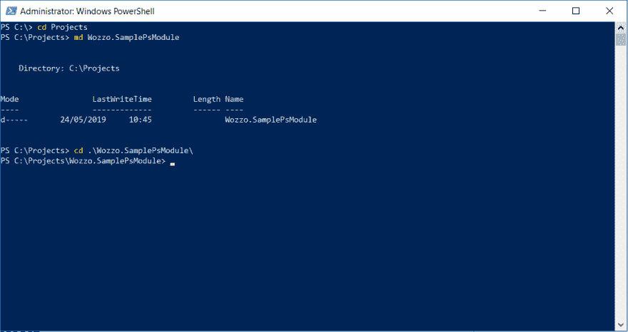

# 创建 PowerShell 二进制模块

> 原文：<https://dev.to/wozzo/creating-a-powershell-binary-module-4e5o>

# 创建 PowerShell 二进制模块

PowerShell 对于任何计算机用户来说都是一个非常好的工具，编写自己的模块是一个很好的方法，可以通过经常运行的命令来提高工作效率。我将介绍如何创建一个新的二进制模块，以及如何包含 nuget 包依赖项，以便可以使用该模块。

## 先决条件

我将假设您熟悉 C#编程，并具备 PowerShell 的工作知识，即您熟悉导航到特定目录和运行命令/脚本。

您需要安装(dot net core SDK)[[https://dotnet.microsoft.com/download](https://dotnet.microsoft.com/download)]，至少版本 2.1.x。我将使用 VSCode 进行开发工作，但是任何文本编辑器都应该足够了。

## 创建项目

在 PowerShell 中，导航到您想要保存项目的位置。我的名字是`C:\Projects\`，我将用我的模块名创建一个 PowerShell 目录。在这种情况下“Wozzo。SamplePsModule”。

[](https://res.cloudinary.com/practicaldev/image/fetch/s--gjoGqEZ---/c_limit%2Cf_auto%2Cfl_progressive%2Cq_auto%2Cw_880/https://thepracticaldev.s3.amazonaws.com/i/r0p20xu16sm5onubyhx6.png)

现在我们将使用`dotnet` cli 为 PowerShell 模块安装一个模板，然后根据该模板
创建一个项目

```
dotnet  new  -i  Microsoft.PowerShell.Standard.Module.Template  dotnet  new  psmodule 
```

Enter fullscreen mode Exit fullscreen mode

这将创建一个新项目，其中包含一个准备运行的示例 Cmdlet。要导入并运行该模块，请使用以下命令。
提示:我建议在一个单独的 powershell 窗口中执行此操作，您可以关闭并重新加载该窗口，因为每当您导入模块时，会话都会锁定 dll 文件，并且您将无法再次构建，直到它被关闭。

```
dotnet  build  Import-Module  ".\bin\Debug\netstandard2.0\Wozzo.SamplePsModule.dll"  Test-SampleCmdlet  7  "Cat" 
```

Enter fullscreen mode Exit fullscreen mode

这将给出以下输出

```
PS  C:\Projects\Wozzo.SamplePsModule>  Test-SampleCmdlet  7  "Cat"  FavoriteNumber  FavoritePet  --------------  -----------  7  Cat  PS  C:\Projects\Wozzo.SamplePsModule> 
```

Enter fullscreen mode Exit fullscreen mode

`TestSampleCmdletCommand.cs`文件包含这个 Cmdlet 的代码。该类必须从`System.Management.Automation.PsCmdlet`继承，然后使用几个属性来控制 powershell 如何描述命令和 for 参数。

| 属性 | 描述 | 例子 |
| --- | --- | --- |
| Cmdlet | 用于指定 Cmdlet 的名称。接受动词和名词部分来构建命令名，例如 Get-Location 使用动词“Get”和名词“Location”。您应该使用由`System.Management.Automation`提供的`Verbs...`类的属性。 | `[Cmdlet (VerbsCommon .Get ,"Location" )]` |
| 输出类型 | 用于指定 Cmdlet 的预期输出类型 | `[OutputType(typeof(int))]` |
| 参数 | 用于指定属性用于存储来自命令行的参数值。 | `[Parameter(Mandatory = true, Position = 0, ValueFromPipeline = true, ValueFromPipelineByPropertyName = true)]` |

还有其他参数，但这些是构建基本 cmdlet 最常用和必需的参数。

注意:请记住，要再次构建项目，您需要关闭 PowerShell 窗口并打开一个新窗口来解锁 dll 文件。

## 添加依赖关系

对于除了最简单的 cmdlet 之外的任何 cmdlet，您可能希望在项目中使用附加的包。我将创建一个 Cmdlet，它从 http 端点检索一些 json 数据。为了帮助我做到这一点，我想使用 nuget 包中的 [Refit](https://github.com/reactiveui/refit) 来创建我的客户端。在项目根中运行以下命令，将 refit 添加为依赖项。

```
dotnet  add  package  refit 
```

Enter fullscreen mode Exit fullscreen mode

然后在项目的新文件中创建以下三项。

### 员工

这个类将存储来自 API 的响应。通常我会整理名称，并使用属性来指定我期望的 json，但我试图保持简单。

```
 public class Employee
    {
        public int id { get; set; }
        public string employee_name { get; set; }
        public int employee_salary { get; set; }
        public int employee_age { get; set; }
        public string profile_image { get; set; }
    } 
```

Enter fullscreen mode Exit fullscreen mode

### IPlaceholderApiClient

今天不打算教改装，但查看项目页面上的[改装自述文件](https://github.com/reactiveui/refit)了解更多细节。Tldr 只需向接口添加方法，就可以从该端点检索数据。

```
 public interface IPlaceholderApiClient {
        [Get("/api/v1/employees")]
        Task<IReadOnlyCollection<Employee>> GetEmployees();
    } 
```

Enter fullscreen mode Exit fullscreen mode

### cmdlet

cmdlet 将使用 refit 创建一个客户端实例，然后从端点检索结果，然后将其输出到 powershell 管道。

```
 [Cmdlet(VerbsCommon.Get, "Employees")]
    [OutputType(typeof(IReadOnlyCollection<Employee>))]
    public class GetEmployeesCmdlet : PSCmdlet
    {
        protected override void ProcessRecord()
        {
            var client = RestService.For<IPlaceholderApiClient>("http://placeholder.restapiexample.com");
            var employees = client.GetEmployees().Result;
            WriteObject(employees);
        }
    } 
```

Enter fullscreen mode Exit fullscreen mode

注意，接口返回任务，因为 PowerShell 对我们使用 async/await 不太满意，所以我们需要使用对`.Result`的调用来获得来自端点的响应。

### 跑步

运行 build 命令，然后再次尝试导入该模块。应该没有错误，`Get-Employee` cmdlet 现在应该可用了。如果我们试着运行它...

```
PS  C:\Projects\Wozzo.SamplePsModule>  Get-Employee  9004  Get-Employee  :  Could  not  load  file  or  assembly  'Refit, Version=4.6.0.0, Culture=neutral, PublicKeyToken=null'  or  one  of  its  dependencies.  The  system  cannot  find  the  file  specified.  At  line:1  char:1  +  Get-Employee  9004  +  ~~~~~~~~~~~~~~~~~  +  CategoryInfo  :  NotSpecified:  (:)  [Get-Employee],  FileNotFoundException  +  FullyQualifiedErrorId  :  System.IO.FileNotFoundException,Wozzo.SamplePsModule.GetEmployeeCmdlet  PS  C:\Projects\Wozzo.SamplePsModule> 
```

Enter fullscreen mode Exit fullscreen mode

这是因为我们的构建不包括 refit.dll，我们的模块在导入时不知道需要加载它。我们需要先解决这些问题，然后才能继续。

编辑`.csproj`文件，并在`<PropertyGroup>`部分添加以下

```
<CopyLocalLockFileAssemblies>true</CopyLocalLockFileAssemblies> 
```

Enter fullscreen mode Exit fullscreen mode

此时，当您构建依赖关系的 dll 时，现在应该包括了。如果您尝试再次运行该命令，输出应该给出一个雇员集合

```
PS  C:\Projects\Wozzo.SamplePsModule>  Get-Employees  id  :  10136  employee_name  :  nick  employee_salary  :  123  employee_age  :  23  profile_image  :  id  :  10137... 
```

Enter fullscreen mode Exit fullscreen mode

## 下一步

此时，您的模块就可以使用了。为生产做好准备的下一步是[创建一个模块清单](https://learn.microsoft.com/en-us/powershell/scripting/developer/module/how-to-write-a-powershell-module-manifest)。之后你可以考虑[在 PSGallery](https://docs.microsoft.com/en-us/powershell/gallery/how-to/publishing-packages/publishing-a-package) 上发布它。快乐的 PoShing