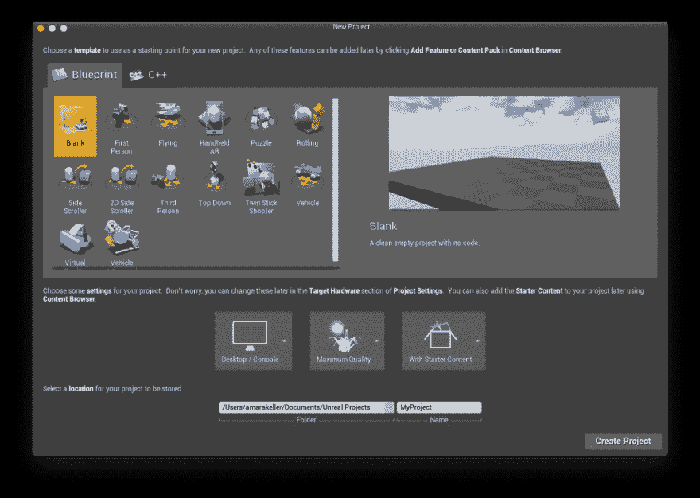
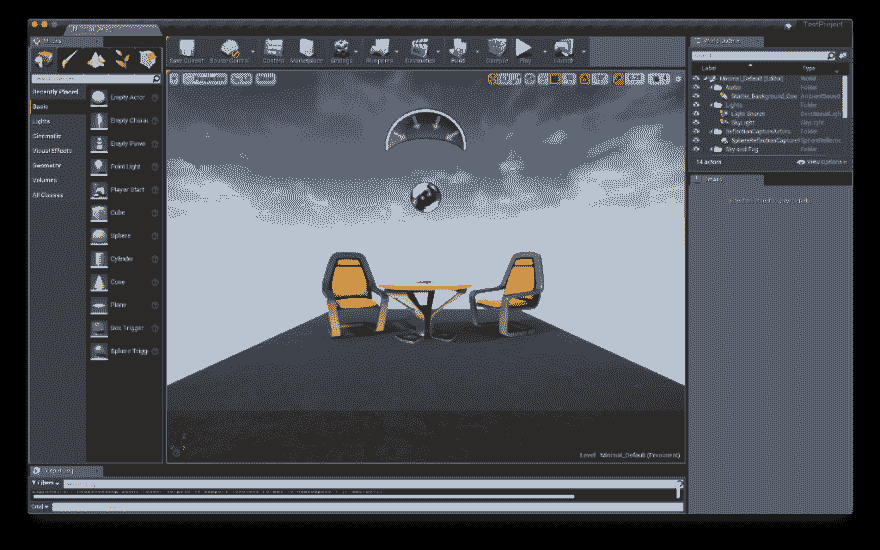
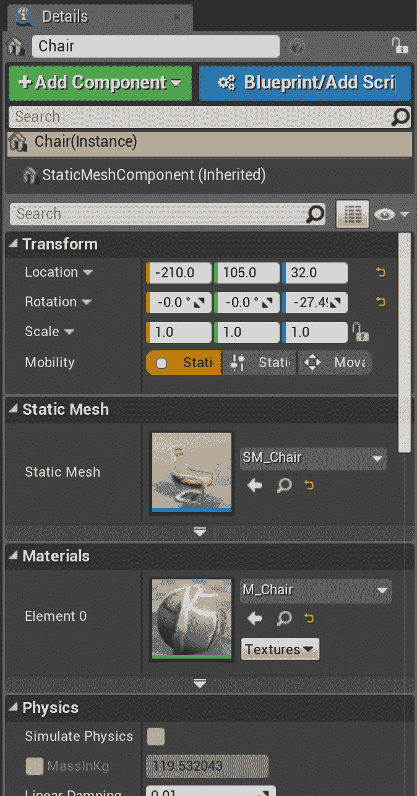
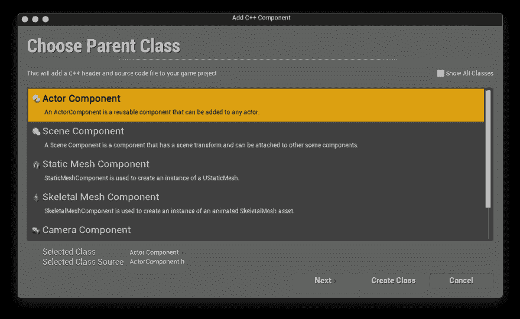
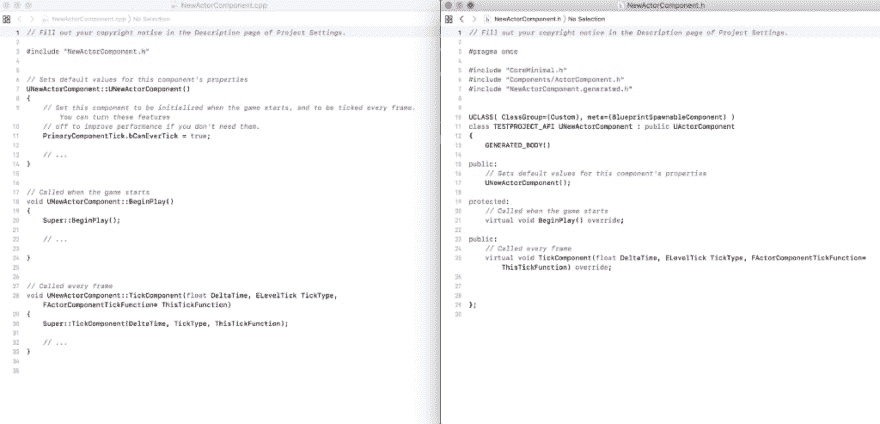
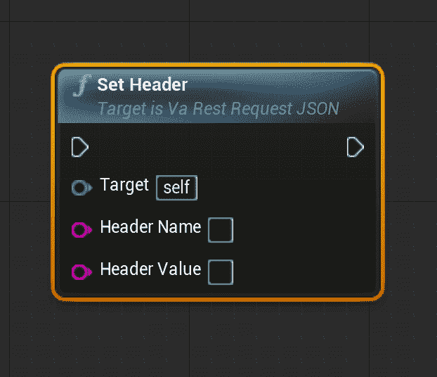
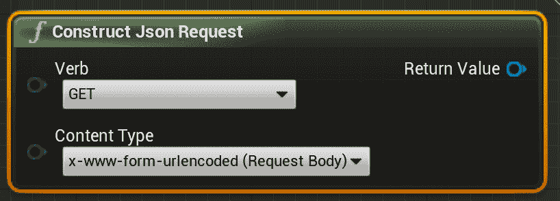
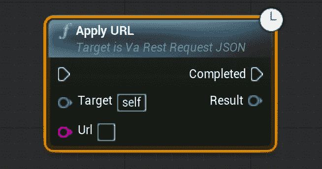
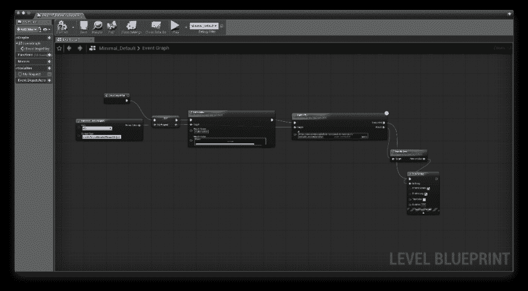
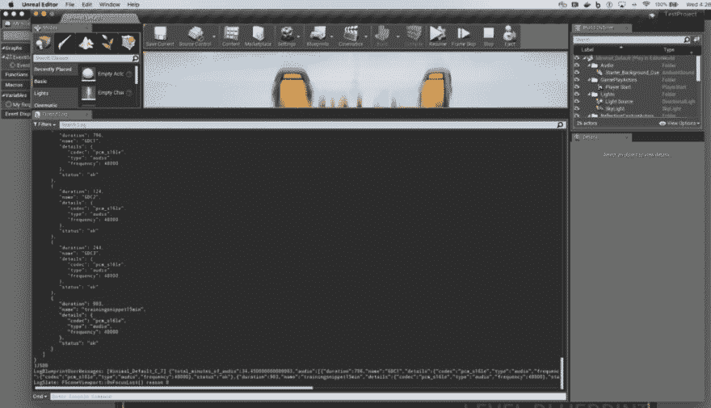

# 在虚幻引擎中调用第三方人工智能服务简介

> 原文：<https://dev.to/missamarakay/intro-to-calling-third-party-ai-services-in-unreal-engine-23kc>

#### 公开学习——使用蓝图插件(无代码！)

<figure>[](https://res.cloudinary.com/practicaldev/image/fetch/s--mazQlP_P--/c_limit%2Cf_auto%2Cfl_progressive%2Cq_auto%2Cw_880/https://cdn-images-1.medium.com/max/1024/1%2Abk_VaKf4WPJFKTEUl421MQ.jpeg) 

<figcaption>堡垒之夜游戏玩家来访——照片由[亚历克斯·哈尼](https://unsplash.com/photos/o4x4sieRzI4?utm_source=unsplash&utm_medium=referral&utm_content=creditCopyText)在 [Unsplash](https://unsplash.com/?utm_source=unsplash&utm_medium=referral&utm_content=creditCopyText)</figcaption>

</figure>

上拍摄

我绝对没有使用过[虚幻引擎(UE4)](https://www.unrealengine.com/en-US/) 的经验，但是因为我在聚会和会议上谈论过我使用 Unity 的工作(直到大约一年半前我也没有使用过),所以最常见的问题是“这在虚幻中能工作吗？”。

到目前为止，答案一直是“我不知道”或者“作为一个社区成员，你总是可以构建一些东西并开源它！”。我知道在某个时候有一个小的、基层的努力来为虚幻建立一个 Watson SDK，就像为 Unity 建立的 Watson SDK 一样，但是没有为虚幻的官方 SDK。

那么，用于 Unity 的 Watson SDK 在 Unreal 中能工作吗？不，但这并不能阻止任何人通过基本的 REST 消费来使用 Watson API 服务。

也许是时候让某些东西发挥作用了。

#### 从哪里开始幻化

虚幻是一个 C++引擎，当然，我已经有*年*没写过一行 C++了。所以我做了任何开发人员都会做的事情，我下载了引擎，并寻找某种示例项目来打开，并找出如何以及在哪里可以编写一些 C++来调用 REST API。

[](https://res.cloudinary.com/practicaldev/image/fetch/s--Nc8oWwQA--/c_limit%2Cf_auto%2Cfl_progressive%2Cq_auto%2Cw_880/https://cdn-images-1.medium.com/max/1024/1%2AuEphqAT4WsAqJJSAoLK0mQ.png)

我开始了一个新的，空白的，(显然)蓝图项目，因为我甚至懒得阅读用户界面，如果我们真的诚实，虚幻感觉非常繁忙。我敢肯定 Unity 一开始也有这种感觉，但这是我看到的第一个屏幕，并被众多的选择所吓倒。感觉我需要对我还没有完全理解的事情做出很多决定——比如最终我想做一个 AR 手持体验，但我还没有做好承诺的准备。

创建新项目并随后加载它，我意识到我至少对游戏引擎如何工作有一些非常基础的知识——它们有一系列随着游戏加载和进展而触发的事件。

了解这一点后，我想知道如何将我的 REST API 调用加载到初始加载/就绪/开始事件中，因为它不依赖于正在加载的场景或任何存在或处于就绪状态的对象。

[](https://res.cloudinary.com/practicaldev/image/fetch/s--7_y5fOO---/c_limit%2Cf_auto%2Cfl_progressive%2Cq_auto%2Cw_880/https://cdn-images-1.medium.com/max/1024/1%2ArTujB52wzOlKZaLUZR1OqA.png)

我很晚才截屏，但这大致是包括样本在内的项目的样子。我有一个场景，一些物体，一些看起来像太阳或重力照射下来的东西，以及一些我的眼球将指向哪里的概念(？).

所以我像其他开发人员一样，开始四处点击，尝试做一些事情。我按下播放按钮来运行场景，我听到外面有一些光鸟啁啾类的噪音。整洁！

#### 代码何去何从？

同样，基于我对游戏引擎如何工作的基本想法，我知道我需要在某处添加某种脚本组件。更重要的是，我需要能够将它添加到某个它实际上会触发的地方，而不是坐在那里等待被触发，一个可能不会发生的触发，导致可能实际上不需要发生的调试。

我单击其中一把椅子，看到一些组件和添加组件的方法。

[](https://res.cloudinary.com/practicaldev/image/fetch/s--8IJL3agh--/c_limit%2Cf_auto%2Cfl_progressive%2Cq_auto%2Cw_880/https://cdn-images-1.medium.com/max/674/1%2A2ASXhKHFbi8ao7vP29i6ZA.png)

我得到两个脚本选项，一个是新的 Blueprint 脚本组件，另一个是新的 C++组件。

我用 C++组件，得到一个关于选择父类的窗口。

[](https://res.cloudinary.com/practicaldev/image/fetch/s--bpE92jMF--/c_limit%2Cf_auto%2Cfl_progressive%2Cq_auto%2Cw_880/https://cdn-images-1.medium.com/max/1024/1%2A2_geNcvbFaMpBTWJaPXW9w.png)

如果我不得不猜测，我也确实这么做了，对于我的特定用例，我可以使用演员或场景组件。我真的不需要将它附加到任何特定的东西上，但基于我的 Unity 示例，我想将代码放在一个演员身上，因为我希望体验像沃森通过一个角色说话，而不是天空或其他场景项目。

所以我为一个演员创建了一个 C++组件，并意识到我不喜欢这个决定，但它让我很好地了解了游戏引擎的功能。

[](https://res.cloudinary.com/practicaldev/image/fetch/s--MO3gLGBD--/c_limit%2Cf_auto%2Cfl_progressive%2Cq_auto%2Cw_880/https://cdn-images-1.medium.com/max/1024/1%2AmB1d7LWcsEk8D8VBNItFlA.png)

我知道我将需要在 BeingPlay()函数中放置任何代码或对我的 REST API 代码的调用，这样一旦游戏开始(如果不是更早的话)我将触发我的代码，它不会只是闲置在那里。

#### 好的，但是怎么调用服务呢？

我想这是我意识到的一点，我不知道如何在 C++中调用 REST 服务。所以我开始搜索，不知何故，无意中发现了一个关于 Blueprint 插件的不真实的论坛帖子。蓝图很熟悉…算是吧。

*   [JSON 查询](https://forums.unrealengine.com/community/released-projects/6382-json-query?7045-PLUGIN-JSON-Query=)
*   [【插件】Http/s REST，blueprintable JSON 和一次解析 REST API 管理器(VaRest)](https://forums.unrealengine.com/development-discussion/engine-source-github/9041-plugin-http-s-rest-blueprintable-json-and-parse-rest-api-manager-at-once-varest?13509=)

我发现了两个很有前途的插件，VaRestPlugin 和 JSONQuery。两者都显示了有希望的截图，但我去了 [VaRestPlugin](https://github.com/ufna/VaRest) 并决定尝试一下。但是我如何描绘蓝图呢？

#### 使用蓝图

接下来的这一点将更多地是蓝图的应用学习，所以如果你正在寻找定义，我可能会推荐[文档](https://docs.unrealengine.com/en-us/Engine/Blueprints)，当然，我没有读它，因为当我想做某件事时，我为什么要花时间去做它。

蓝图列在主项目视图上，并提供了一个下拉菜单。我选择了“开放级别蓝图”，希望它能让我在游戏开始时自动触发(或者至少给我在 C++组件中看到的功能选项，而不是创建一个新的蓝图组件，担心它永远不会被调用。

我在 Blueprint UI 中艰难地尝试添加新节点。在 UI 上单击鼠标右键做了我期望的事情，允许我添加新的节点。但是在上下文相关和非上下文相关的节点之间…我有很多选择。

#### 建筑流动

感觉不知所措，我设法让自己进入 VaRestPlugin 部分。我所要做的就是拉进节点，类似于我看到的构建 GET 的截图。应该是这样的:

```
Fire BeingPlay(?) event > Build GET request (plus auth) > Fire GET request > Print JSON result 
```

Enter fullscreen mode Exit fullscreen mode

VaRestPlugin 提供了我需要的一切，但是我意识到我需要使用基本身份验证进行身份验证，在头中只有一个键/值对的情况。

[](https://res.cloudinary.com/practicaldev/image/fetch/s--dxXKFf3I--/c_limit%2Cf_auto%2Cfl_progressive%2Cq_auto%2Cw_880/https://cdn-images-1.medium.com/max/622/1%2AhycW7ncfRIPEuyKHJXT-yA.png)

真的没问题，我从 Postman 中取出我的散列 auth 头，我用它来测试这个特定的 GET，以确保当我在这里构建它时，服务没有抛出任何奇怪的错误。

我将“Authorization”添加到头名称中，并将我的散列 auth 头放在“Value”中。

在设置头之前，我需要构造请求对象，指定动词。我找到了“构造 JSON 请求”节点。

[](https://res.cloudinary.com/practicaldev/image/fetch/s--4YYIfTQe--/c_limit%2Cf_auto%2Cfl_progressive%2Cq_auto%2Cw_880/https://cdn-images-1.medium.com/max/818/1%2AopiEfrpXNfWCTZevqynOjA.png)

我需要一个地方来放置 URL，所以我开始研究“应用 URL”和“处理 URL”。“应用 URL”似乎实际上返回了一些东西，而“处理 URL”只是发起请求。

[](https://res.cloudinary.com/practicaldev/image/fetch/s--1mkwl4j9--/c_limit%2Cf_auto%2Cfl_progressive%2Cq_auto%2Cw_880/https://cdn-images-1.medium.com/max/654/1%2Aglhto0ph5-R0zhlib04QHQ.png)

这是一个很好的解释，你想点击的网址在网址栏里。但是如何打印请求对象的结果呢？嗯。

#### 令人沮丧的蓝图…

除了最简单、最基本的节点“集合”之外，我把所有的东西都放在一起，我只能假设这是我构建整个请求所需要的。

我放弃了两天。我在 VaRestPlugin 节点部分没有看到“SET ”,我对自己很恼火。

我决定阅读蓝图文档，尤其是[变量](https://docs.unrealengine.com/en-us/Engine/Blueprints/UserGuide/Variables)部分。

我很快意识到我正在创建(并设置)一个对象(变量)。我也意识到我的事件触发器也是错误的。

“我的请求”对象成为所有请求构建节点的目标。但是我仍然不确定是否打印响应，但是我最终找到了一些关于编码 JSON 和打印字符串的信息。

#### 成功有蓝图！

最后，我构建了一个 GET，用于返回定制的声音音频文件，我用这些文件来训练 Watson 语音到文本的定制声音模型。

[](https://res.cloudinary.com/practicaldev/image/fetch/s--vgarqBwD--/c_limit%2Cf_auto%2Cfl_progressive%2Cq_auto%2Cw_880/https://cdn-images-1.medium.com/max/1024/1%2AUMkfR_9J9jkKIy1DtNNXDQ.png)

我交叉手指，保存/编译，然后点击播放按钮。有用！！！我在控制台中看到我的音频文件列表！

[](https://res.cloudinary.com/practicaldev/image/fetch/s--XkW1rFlD--/c_limit%2Cf_auto%2Cfl_progressive%2Cq_auto%2Cw_880/https://cdn-images-1.medium.com/max/1024/1%2Ai7FO0i9nyNA5cpzE51tp_w.png)

#### 现在怎么样了？

我真的不能做太多，但是它确实让我克服了连接到 REST 服务并得到响应的困难。

现在我可以在 Unity 中构建一个类似于我的 [AR 模式的例子。有兴趣看看吗？因为如果你有兴趣的话，我有兴趣建造它！](https://developer.ibm.com/patterns/build-an-ai-powered-ar-character-in-unity-with-arkit/)

你是否在虚幻引擎中构建了一些可以利用人工智能服务的东西？请在评论中告诉我！