# 让我们为您的无框架 SPA 编写一个客户端路由器

> 原文：<https://dev.to/vijitail/let-s-code-a-client-side-router-for-your-frameworkless-spa-2bg>

是的，你没看错标题，无框架 SPA 的客户端路由器，这正是我们在这个故事中要做的。

* * *

在深入研究代码之前，让我们先了解什么是客户端路由。

客户端路由器运行在用户的浏览器上。浏览器不向服务器请求页面，而是查看加载到浏览器上的 JavaScript 代码，以呈现匹配路线的页面。

这是我们的路由器呈现页面的方式—

1.  侦听 hashchange 事件。
2.  当 url 改变时，将 url 匹配并解析到代码中预定义的路由。
3.  查找要为该路线呈现的视图，如果没有找到匹配，则呈现 404 消息。

[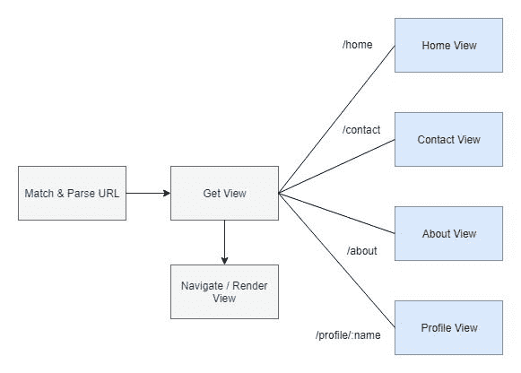](https://res.cloudinary.com/practicaldev/image/fetch/s--QVwWGPCa--/c_limit%2Cf_auto%2Cfl_progressive%2Cq_auto%2Cw_880/https://cdn-images-1.medium.com/max/1000/1%2A9ntD58Eb0tHhvcuOwUC7fQ.jpeg)

**够了理论，已经给我看代码了！**

* * *

下面是我们将要使用的文件夹结构

[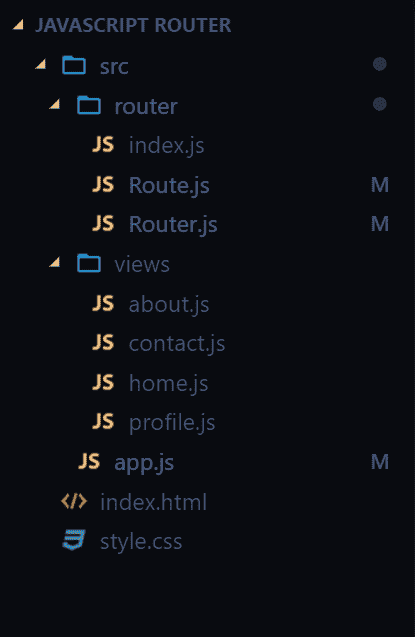](https://res.cloudinary.com/practicaldev/image/fetch/s--BLfpExy6--/c_limit%2Cf_auto%2Cfl_progressive%2Cq_auto%2Cw_880/https://cdn-images-1.medium.com/max/1000/1%2Ahp_m21itclu4CkEgLMj_Ow.png)

让我们定义一个类来表示路由器文件夹中的路由。

[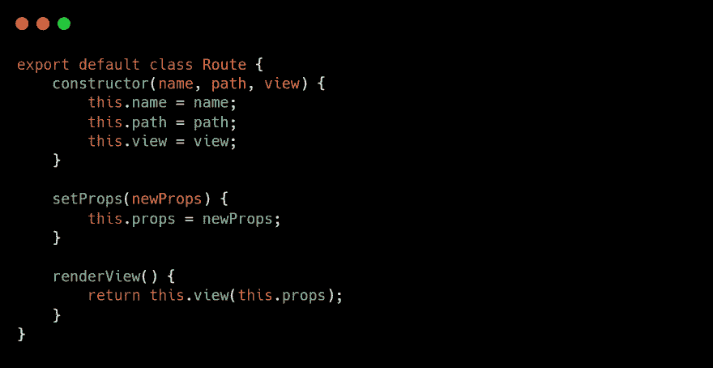](https://res.cloudinary.com/practicaldev/image/fetch/s--DYX4JKc3--/c_limit%2Cf_auto%2Cfl_progressive%2Cq_auto%2Cw_880/https://cdn-images-1.medium.com/max/1500/1%2A7fAYkPLx6KQo4Y1YU4T0Wg.png)

Route 类在实例化时将接受 3 个参数；与路线关联的名称、路径和视图。

setProps()方法将设置从 url 传递给路由的属性或特性，renderView()方法将返回路由的视图。

[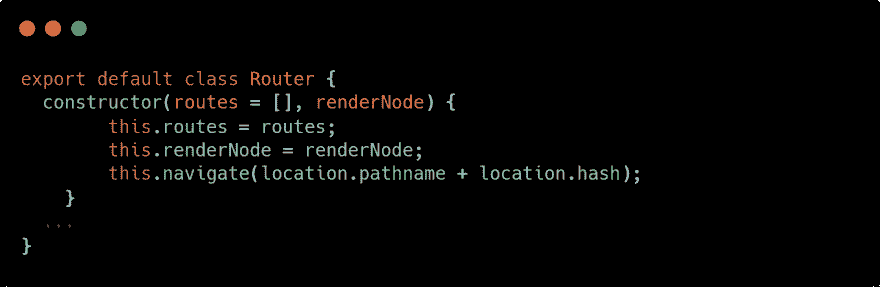](https://res.cloudinary.com/practicaldev/image/fetch/s--Afj8ZJTt--/c_limit%2Cf_auto%2Cfl_progressive%2Cq_auto%2Cw_880/https://cdn-images-1.medium.com/max/1500/1%2Ayeqz__GDjOxGuDeS6wdQVA.png)

路由器类将是我们路由系统的核心。它将把 route 对象的数组作为第一个参数，把视图将被注入的 renderNode 作为第二个参数。

我们的路由器类将有 match()和 navigate()这样的方法来分别匹配路由和导航。让我们看看它们的定义。

[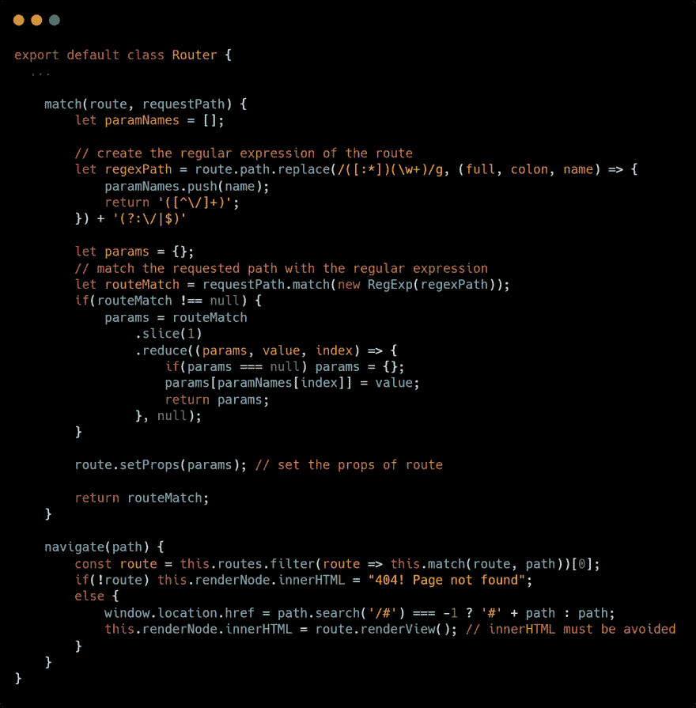](https://res.cloudinary.com/practicaldev/image/fetch/s--73y1Ajtz--/c_limit%2Cf_auto%2Cfl_progressive%2Cq_auto%2Cw_880/https://cdn-images-1.medium.com/max/1500/1%2AknwAYtBoAzPZv0v7tf7o4w.png)

navigate()方法将过滤每条路线，并检查它是否与任何预定义的路线相匹配。如果没有匹配的路由，renderNode 将呈现 404 消息，否则它将呈现匹配路由的视图；
在 match()中，我们正在创建 route 路径的正则表达式，并将其与请求的路径进行匹配。如果匹配，我们还会发现所请求的路由是否有任何路由参数。

你可能已经注意到了 navigation()中的问题，我们实际上是在使用 innerHTML 注入视图，无论如何都要避免使用 innerHTML。主要是因为关于 XSS 的安全原因，以及我在编码时遇到的另一个问题，即注入视图中的任何元素都没有附加的事件侦听器。这意味着你不能在一个视图中有一个按钮来导航到另一条路线，它根本不起作用。为了解决这个问题，我们需要使用 document.createElement()构建视图。为了保持这篇文章的简洁，我把它留给你来解决(我可能以后会探索它)。

我喜欢添加实用功能，所以让我们定义另一种方法来添加路由到路由器。

[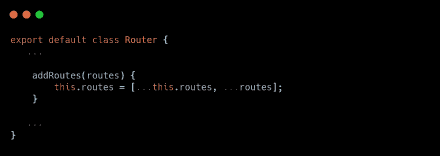](https://res.cloudinary.com/practicaldev/image/fetch/s--sH1ARKoJ--/c_limit%2Cf_auto%2Cfl_progressive%2Cq_auto%2Cw_880/https://cdn-images-1.medium.com/max/1500/1%2A7MKnCbvmD6lrozOFktDohA.png)

我们来看看路由器的 index.js。

[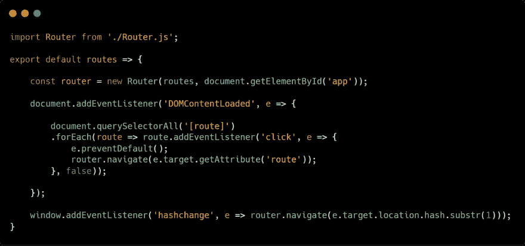](https://res.cloudinary.com/practicaldev/image/fetch/s--vR-0mJ8C--/c_limit%2Cf_auto%2Cfl_progressive%2Cq_auto%2Cw_880/https://cdn-images-1.medium.com/max/1500/1%2AKa8fMeFz1XbKV8p2sFO72Q.png)

这里我们导出一个函数，它以 routes 作为参数，并创建一个 Router 类的实例。renderNode 是一个 id 为 app 的 div。我们将 click 事件侦听器添加到具有 route 属性的按钮中(受其他库的启发)，并侦听 url 上的 hashchange 事件以调用 navigate()方法。

现在，让我们看看应用程序中的所有视图(如果您在跟踪文件时迷路了，请查看标题)

[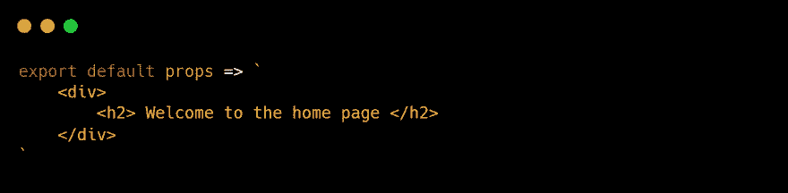](https://res.cloudinary.com/practicaldev/image/fetch/s--9z6LspSE--/c_limit%2Cf_auto%2Cfl_progressive%2Cq_auto%2Cw_880/https://cdn-images-1.medium.com/max/1500/1%2ASIoXdaag6fKEERNjJFm6JQ.png)

[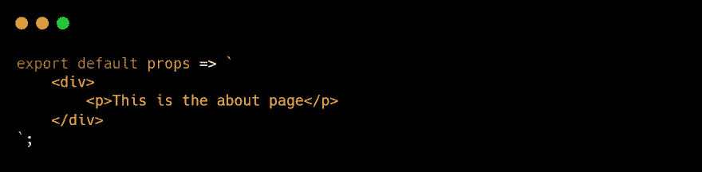](https://res.cloudinary.com/practicaldev/image/fetch/s---4Wwatwx--/c_limit%2Cf_auto%2Cfl_progressive%2Cq_auto%2Cw_880/https://cdn-images-1.medium.com/max/1500/1%2AefpgntCNeD3sAkd86DgiWw.png)

[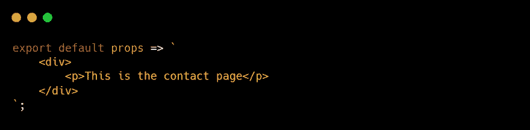](https://res.cloudinary.com/practicaldev/image/fetch/s--uf41r3pv--/c_limit%2Cf_auto%2Cfl_progressive%2Cq_auto%2Cw_880/https://cdn-images-1.medium.com/max/1500/1%2A24Tr_XCNYltCn-Pz_ZrhgA.png)

[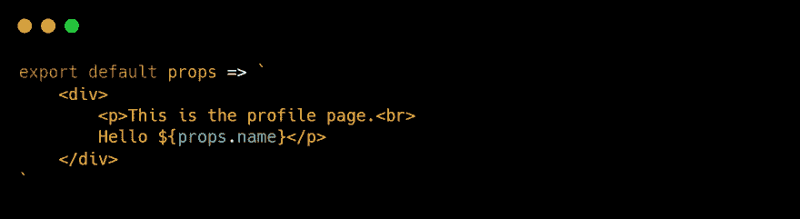](https://res.cloudinary.com/practicaldev/image/fetch/s--r2bdoPgh--/c_limit%2Cf_auto%2Cfl_progressive%2Cq_auto%2Cw_880/https://cdn-images-1.medium.com/max/1500/1%2AvGO31jw1iMUvu-B9HA2-LA.png)

您可以在代码编辑器中安装 html pragmas，以便在模板文本中突出显示 html 的语法。

最后，在我们的 app.js 文件中，让我们定义所有的路由，并将其传递给路由器。

[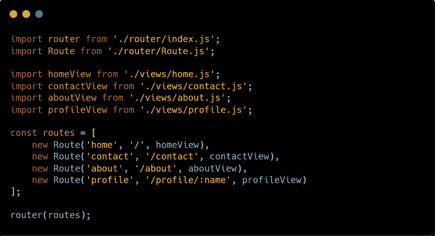](https://res.cloudinary.com/practicaldev/image/fetch/s--8tRWtWyO--/c_limit%2Cf_auto%2Cfl_progressive%2Cq_auto%2Cw_880/https://cdn-images-1.medium.com/max/1500/1%2AXeyYB6XCEhgVqduVr2GsYw.png)

以下代码将放在 index.html 文件的主体中

[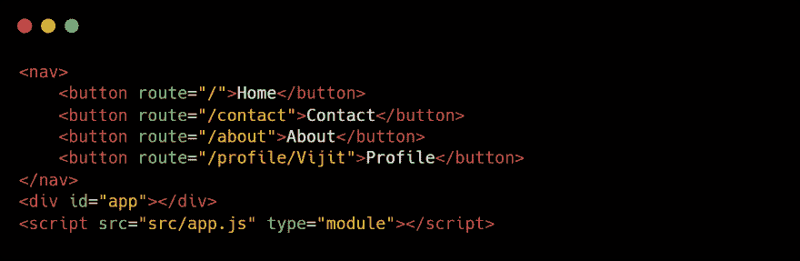](https://res.cloudinary.com/practicaldev/image/fetch/s--xc1jEdcN--/c_limit%2Cf_auto%2Cfl_progressive%2Cq_auto%2Cw_880/https://cdn-images-1.medium.com/max/1500/1%2AZj2wL9El6b9AxNwry0Lx7w.png)

确保在脚本标记中添加 type="module ",以便使用导入/导出 es6 功能，因为这样我们就不必设置任何额外的配置。

最后，让我们添加几行 CSS 代码。

[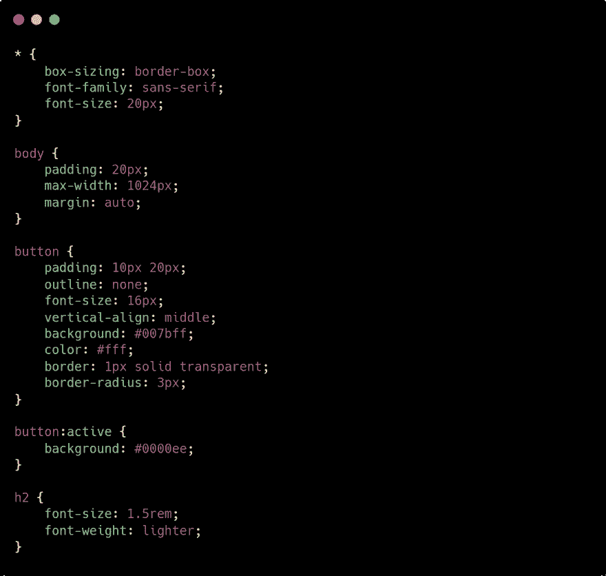](https://res.cloudinary.com/practicaldev/image/fetch/s--j8V7381B--/c_limit%2Cf_auto%2Cfl_progressive%2Cq_auto%2Cw_880/https://cdn-images-1.medium.com/max/1500/1%2AVFmylzBVlVMjurDiBdz6VQ.png)

作为这篇文章的总结，我想说你不需要为小而简单的单页应用程序引入其他库，你可以构建自己的定制解决方案，我只是向你展示了许多方法中的一种，也许你可以做得更多更好。如果你有，一定要让我知道，我很乐意看到你的作品。

我参考了 YouTube 上的这个视频来写这个故事——https://www.youtube.com/watch?v=D1fLaNxd-ZM

* * *

你可以看看我的 github 中的最终回购，如果你在跟随时卡住了。有问题可以在 instagram [@vijit__ail](https://instagram.com/vijit__ail) 上给我发 DM。

干杯，快乐编码🍻😉

*这篇文章最初在 medium 上分享。查看我的媒体简介[@ VI JIT 2 ail](https://medium.com/@vijit2ail)T3】*