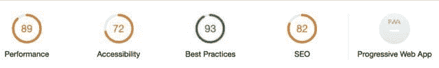
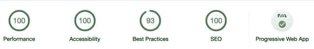

# 构建速度极快的 JAMstack 应用程序

> 原文：<https://dev.to/edezekiel/building-a-blazing-fast-jamstack-app-18c0>

我最近参加了布莱恩·罗宾逊在孟菲斯举办的一次聚会。他是一名出色的 web 开发人员，专注于创建静态网站。

这让我兴奋不已，终于可以使用 JAMstack 架构来构建自己的静态站点了！所以，我用 GatsbyJS 和 Netlify 构建了这个[博客模板(live)](https://zealous-thompson-59a9ca.netlify.com/) 。这里是 [Github 回购](https://github.com/edezekiel/gatsby-netlify-blog)。

### 灯塔审计

我对网站的结果非常满意。我使用 Lighthouse 工具审计了 gatsby 网站和我的博客。chrome 浏览器内置了 Lighthouse。这是一个伟大的自动化工具来执行网页审计。

结果如下:

### 我的 React/Rails 博客的 Lighthouse 评分:

成绩不可怕，但肯定有进步的空间。

### jam stack 站点的灯塔得分:

JAMstack 网站在灯塔指标上几乎获得了满分。在网站中导航反映了这些分数:页面加载速度快得惊人，总体感觉很清爽。

### 资源

如果您有兴趣进一步探索 JAMstack，下面是我在学习这个主题时使用的一些资源:

*   [WTF 是 JAMstack？](https://jamstack.wtf/#getting-started)jam stack 架构的简单入门。
*   盖茨比教程:这将带你完成你的第一个盖茨比应用。网站上有很多“初学者”可以帮助你建立并运行你的第一个网站。我个人用的是[盖茨比默认首发](https://github.com/gatsbyjs/gatsby-starter-default)。
*   [Netlify](https://www.netlify.com/)
*   塔尼亚·拉西亚:又名我的网络开发英雄。