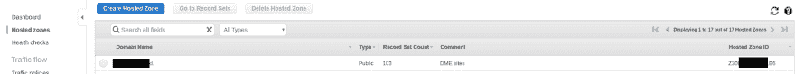
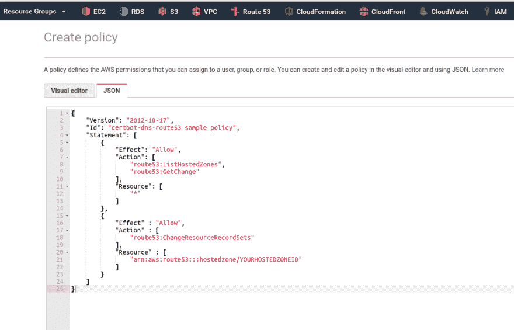
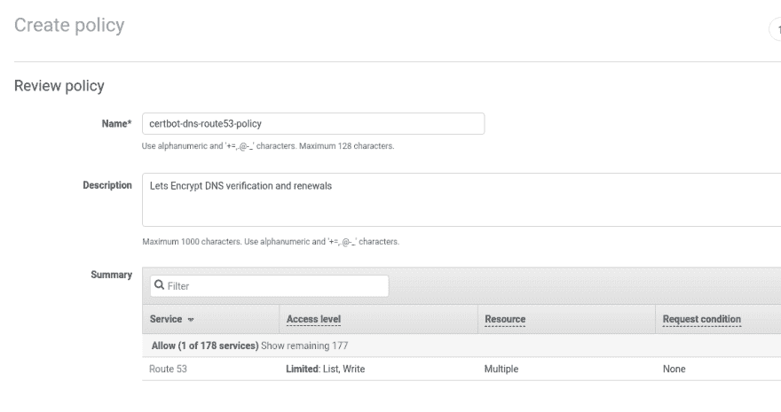
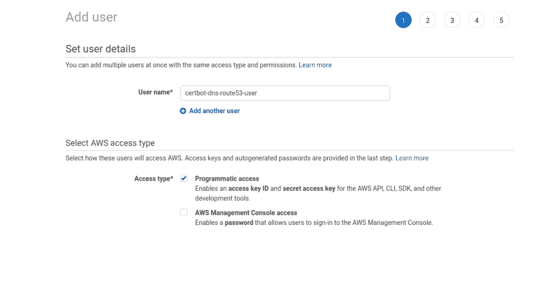
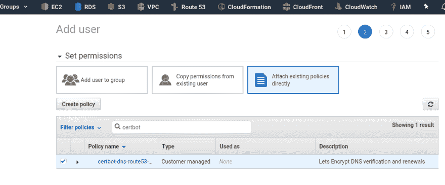
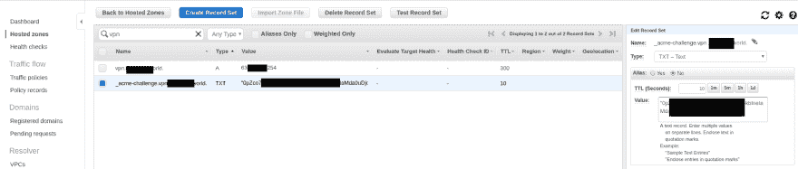
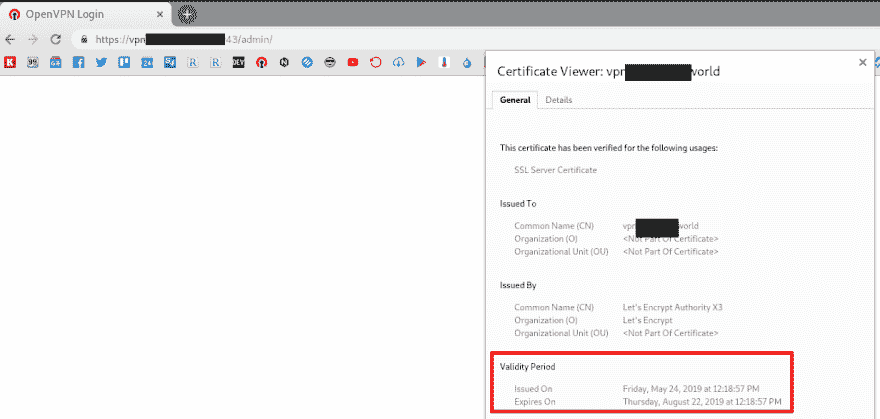

# OpenVPN:让我们在 AWS Route53 和 OpenVPN 访问服务器 SSL 证书自动更新上加密 DNS 验证

> 原文：<https://dev.to/setevoy/openvpn-let-s-encrypt-dns-verification-on-aws-route53-and-openvpn-access-server-ssl-certificate-auto-update-2h81>

[](https://res.cloudinary.com/practicaldev/image/fetch/s--wzHUWC0j--/c_limit%2Cf_auto%2Cfl_progressive%2Cq_auto%2Cw_880/https://rtfm.co.ua/wp-content/uploads/2014/07/openvpn-logo-1.png) 除了 [OpenVPN: SSL 和主机名配置](https://rtfm.co.ua/en/openvpn-ssl-and-hostname-configuration/)关于 OpenVPN 接入服务器的帖子，设置和配置。

因此，三个月过去了，是时候更新让我们加密 SSL 证书(参见。普罗米修斯:警报器经理и黑匣子-出口商—проверкасрокадействияSSLинотификациявslack，Rus)。

我可以对 webroot 使用一个众所周知的方案，但 OpenVPN AS 本身接受连接，没有 NGINX，只为 webroot 安装它，让我们加密续订-不是太好的主意。

最好让我们现在使用 DNS 验证。

### AWS IAM 和 certbot 用户

我们的域由 AWS Route53 提供服务，所以在这里使用 [certbot-dns-route53](https://certbot-dns-route53.readthedocs.io/) 。

获取您的区域 ID:

[](https://rtfm.co.ua/wp-content/uploads/2019/05/Screenshot_20190524_131355.png)

创建 IAM-policy，在`ChangeResourceRecordSets`中设置区域的 ID:

```
{
    "Version": "2012-10-17",
    "Id": "certbot-dns-route53 sample policy",
    "Statement": [
        {
            "Effect": "Allow",
            "Action": [
                "route53:ListHostedZones",
                "route53:GetChange"
            ],
            "Resource": [
                "*"
            ]
        },
        {
            "Effect" : "Allow",
            "Action" : [
                "route53:ChangeResourceRecordSets"
            ],
            "Resource" : [
                "arn:aws:route53:::hostedzone/Z30***LB6"
            ]
        }
    ]
} 
```

[](https://rtfm.co.ua/wp-content/uploads/2019/05/Screenshot_20190524_124141.png)

[ ](https://rtfm.co.ua/wp-content/uploads/2019/05/Screenshot_20190524_124251.png) *(后来我认为在策略或用户名中添加区域名称是个好主意，这样更具描述性，因为区域/用户可以访问这里唯一的一个区域)*

创建一个拥有*编程访问权限*的新用户:

[](https://rtfm.co.ua/wp-content/uploads/2019/05/Screenshot_20190524_124410.png)

在*权限*中选择了*直接附加现有策略*并附加上面创建的策略:

[](https://rtfm.co.ua/wp-content/uploads/2019/05/Screenshot_20190524_124508.png)

用于测试–安装`aws-cli` :

```
root@openvpnas2:~# apt -y install awscli 
```

在 *openvpnas* 下，用户配置 AWS CLI default-profile:

```
openvpnas@openvpnas2:~$ aws configure
AWS Access Key ID [None]: AKI***JEL
AWS Secret Access Key [None]: Lry***ide
Default region name [None]:
Default output format [None]: json 
```

检查配置:

```
root@openvpnas2:~# cat /home/openvpnas/.aws/config
[default]
output = json 
```

OK–配置文件存在，稍后将由`certbot`使用。

测试访问–尝试获取区域列表:

```
openvpnas@openvpnas2:~$ aws route53 list-hosted-zones --output text
HOSTEDZONES     33C2D264-***-***-***-3052BEA607A9    /hostedzone/Z30***LB6      example.com. 103
... 
```

这里一切都好。

### certbot DNS 验证

安装`certbot` :

```
openvpnas@openvpnas2:~$ sudo apt -y install certbot 
```

还有 Route53 插件:

```
openvpnas@openvpnas2:~$ sudo apt -y install python3-certbot-dns-route53 
```

授权并获取证书:

```
root@openvpnas2:~# certbot certonly --dns-route53 -d vpn.example.com
Saving debug log to /var/log/letsencrypt/letsencrypt.log
Found credentials in shared credentials file: ~/.aws/credentials
Plugins selected: Authenticator dns-route53, Installer None
Attempting to parse the version 0.31.0 renewal configuration file found at /etc/letsencrypt/renewal/vpn.example.com.conf with version 0.23.0 of Certbot. This might not work.
Cert is due for renewal, auto-renewing...
Renewing an existing certificate
Performing the following challenges:
dns-01 challenge for vpn.example.com
Waiting 10 seconds for DNS changes to propagate
Waiting for verification...
Cleaning up challenges

IMPORTANT NOTES:

- Congratulations! Your certificate and chain have been saved at:
/etc/letsencrypt/live/vpn.example.com/fullchain.pem
Your key file has been saved at:
/etc/letsencrypt/live/vpn.example.com/privkey.pem
... 
```

检查 Route53 中的区域–`certbot`必须在此处创建一个 TXT 记录，用于授权，`certbot`将在每次更新时用新值更新它

[](https://rtfm.co.ua/wp-content/uploads/2019/05/Screenshot_20190524_131922.png)

检查此域的续订配置:

```
root@openvpnas2:~# cat /etc/letsencrypt/renewal/vpn.example.com.conf
renew_before_expiry = 30 days
...
Options used in the renewal process
[renewalparams]
authenticator = dns-route53
account = 6bc***4f6
installer = None 
```

那么执行`certbot renew`就足够了。

### OpenVPN 接入服务器 SSL 更新

根据需要更新 OpenVPN 中的 SSL:

1.  上传域的证书:`sacli --key "cs.cert" --value_file "/etc/letsencrypt/live/vpn.example.com/cert.pem" ConfigPut`
2.  上传咱们加密的证书:`sacli --key "cs.ca_bundle" --value_file "/etc/letsencrypt/live/vpn.example.com/chain.pem" ConfigPut`
3.  上传我们的私钥:`sacli --key "cs.priv_key" --value_file "/etc/letsencrypt/live/vpn.example.com/privkey.pem" ConfigPut`
4.  和 rstart OpenVPN 服务器

将它们收集到一个 bash 脚本中，稍后将由`cron`调用。

转到 OpenVPN 脚本目录:

```
root@openvpnas2:~# cd  /usr/local/openvpn_as/scripts/ 
```

创建一个`ssl_renew.sh`脚本:

```
#!/usr/bin/env bash

SCRIPTS="/usr/local/openvpn_as/scripts/"

$SCRIPTS/sacli --key "cs.cert" --value_file "/etc/letsencrypt/live/vpn.example.com/cert.pem" ConfigPut
$SCRIPTS/sacli --key "cs.ca_bundle" --value_file "/etc/letsencrypt/live/vpn.example.com/chain.pem" ConfigPut
$SCRIPTS/sacli --key "cs.priv_key" --value_file "/etc/letsencrypt/live/vpn.example.com/privkey.pem" ConfigPut

$SCRIPTS/sacli start 
```

以防万一–备份现有钥匙:

```
root@openvpnas2:/usr/local/openvpn_as/scripts# cp /usr/local/openvpn_as/etc/web-ssl/server.crt /usr/local/openvpn_as/etc/web-ssl/server.crt.OLD

root@openvpnas2:/usr/local/openvpn_as/scripts# cp /usr/local/openvpn_as/etc/web-ssl/server.key /usr/local/openvpn_as/etc/web-ssl/server.key.OLD 
```

运行您的新脚本:

```
root@openvpnas2:/usr/local/openvpn_as/scripts# ./ssl_renew.sh
[True, {}]
[True, {}]
[True, {}]
RunStart warm None
{
  "active_profile": "ProfileName",
  "errors": {},
  "service_status": {
    ...
    "web": "restarted"
  }
}

WILL_RESTART ['web', 'client'] 
```

在浏览器中签入:

[](https://rtfm.co.ua/wp-content/uploads/2019/05/Screenshot_20190524_133817.png)

然后添加一个钩子让`certbot`在 renew 之后运行这个脚本。

编辑`/etc/letsencrypt/renewal/vpn.example.com.conf`文件:

```
...
[renewalparams]
authenticator = dns-route53
account = 6bc***4f6
installer = None
renew_hook = /usr/local/sbin/openvpnas_renewcerts.sh 
```

最后一件事——用`certbot renew`添加一个 crontask，执行`crontab -e` :

```
0 0 * * * /usr/bin/certbot renew &> /var/log/letsencrypt/letsencrypt.log 
```

完成了。

### 类似的帖子

*   <small>02/26/2019</small>[OpenVPN:SSL 和主机名配置](https://rtfm.co.ua/en/openvpn-ssl-and-hostname-configuration/)<small></small>

*   <small>02/22/2019</small>[OpenVPN:DNS 和 dnsmasq 配置](https://rtfm.co.ua/en/openvpn-dns-and-dnsmasq-configuration/)<small></small>

<small></small>

<small></small>