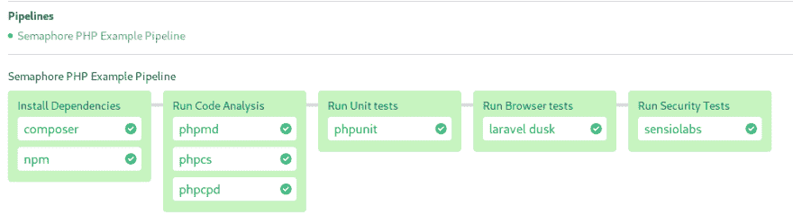

# PHP 开发人员的 7 个持续集成工具

> 原文：<https://dev.to/markoa/7-continuous-integration-tools-for-php-laravel-developers-2m28>

在本文中，我们将介绍 7 种工具，它们可以提高代码质量，减少开发时间，容易发现错误，并且通常会使 PHP 开发人员的生活更加轻松。

目标是为我们的代码设置各种测试，而不需要
提供或维护任何服务器。有了快速的反馈周期，我们将
能够及早发现错误，并在错误扩大之前修复它们。

听起来不错？让我们开始吧。

## 代码分析测试

代码分析包括扫描源代码中可能指向更深层次问题的某些结构
，比如设计缺陷和糟糕的编码
实践，通常称为代码味道。

一些代码分析工具专注于找出不好的模式:有太多参数的函数
、胖类或者嵌套太深的结构。而其他人则检查样式:缩进规则、命名约定等。

每一个分析都必须从一些标准开始。说到底，这些规则是主观的，但受到以往经验的影响。
规则一般可以配置和定制。

### PHP 垃圾检测器

PHP Mess Detector (phpmd)检查代码气味:笨拙、过度复杂或未使用的代码。它的灵感来自 [PMD](https://pmd.github.io/) 项目。

phpmd 附带了几个可以独立启用或禁用的规则集。

基本用法:

```
$ phpmd SOURCE_FILE_OR_DIR REPORT_FORMAT RULESETS 
```

Enter fullscreen mode Exit fullscreen mode

内置规则包括:

*   cleancode:强制执行干净的代码库规则。
*   codesize:复杂性规则、过长的类等。
*   有争议的:camelcase 规则，globals 等。
*   设计:禁止 eval，goto，exit。还有耦合和深度规则。
*   命名:长标识符名和短标识符名、方法名规则。
*   unusedcode:死代码和未使用的变量规则。

它看起来像什么？

```
$ phpmd src text cleancode,codesize,controversial,design,naming,unusedcode
ProvisionerCommand.php:38    The variable $myvar_id is not named in camelCase.
ProvisionerCommand.php:38    Avoid variables with short names like $io. Configured minimum length is 3.
PermissionsComponent.php:53     Avoid unused private methods such as 'checkAccount'.
PagesController.php:349   Avoid excessively long variable names like $view_registration_count. Keep variable name length under 20.
ProvisionersController.php:106    The method delete uses an else expression. Else is never necessary and you can simplify the code to work without else. 
```

Enter fullscreen mode Exit fullscreen mode

如果你以前从未对你的项目做过任何代码分析，这很可能会让你想拔毛。不要担心，要有耐心，在我们把代码整理好之后，我们的生活会变得
更容易。

我们可以创建一个可以在源代码控制中检查的 xml 文件
:
，而不是通过命令行来设置规则

```
$ phpmd src text myrules.xml 
```

Enter fullscreen mode Exit fullscreen mode

```
<?xml version="1.0"?>
<ruleset name="Basic"
         xmlns="http://pmd.sf.net/ruleset/1.0.0"
         xmlns:xsi="http://www.w3.org/2001/XMLSchema-instance"
         xsi:schemaLocation="http://pmd.sf.net/ruleset/1.0.0
                     http://pmd.sf.net/ruleset_xml_schema.xsd"
         xsi:noNamespaceSchemaLocation="
                     http://pmd.sf.net/ruleset_xml_schema.xsd">
    <description>
        First basic ruleset for code analysis...
    </description>

    <!-- Import all rule sets -->
    <rule ref="rulesets/cleancode.xml" />
    <rule ref="rulesets/codesize.xml" />
    <rule ref="rulesets/controversial.xml" />
    <rule ref="rulesets/design.xml" />

    <rule ref="rulesets/naming.xml">
        <exclude name="ShortVariable" />
        <exclude name="LongVariable" />
    </rule>

</ruleset> 
```

Enter fullscreen mode Exit fullscreen mode

### PHP 代码嗅探器

PHP 代码嗅探器 (phpcs)是一个风格检查器。如果你曾经使用过 linter (jshint、pylint、checkstyle 等),你应该已经知道它是做什么的了。可以检查缩进、遗漏的注释、命名约定等。

PHP 代码嗅探器附带了各种流行的 PHP 风格，如 PEAR、PSR2 和 Zend 等。我们也可以制定自己的规则，或者混合搭配现有的检查。

典型的调用是:

```
$ phpcs FILE_OR_DIR --standard=STANDARD_NAME 
```

Enter fullscreen mode Exit fullscreen mode

```
$ phpcs FILE_OR_DIR --report-full --standard=PEAR
FILE: app/Providers/RouteServiceProvider.php
----------------------------------------------------------------------------------------------------------
FOUND 7 ERRORS AFFECTING 7 LINES
----------------------------------------------------------------------------------------------------------
  2 | ERROR | [ ] Missing file doc comment
  8 | ERROR | [ ] Missing doc comment for class RouteServiceProvider
 55 | ERROR | [x] Object operator not indented correctly; expected 12 spaces but found 13
 56 | ERROR | [x] Object operator not indented correctly; expected 12 spaces but found 13
 69 | ERROR | [x] Object operator not indented correctly; expected 12 spaces but found 13
 70 | ERROR | [x] Object operator not indented correctly; expected 12 spaces but found 13
 71 | ERROR | [x] Object operator not indented correctly; expected 12 spaces but found 13
----------------------------------------------------------------------------------------------------------
PHPCBF CAN FIX THE 5 MARKED SNIFF VIOLATIONS AUTOMATICALLY
---------------------------------------------------------------------------------------------------------- 
```

Enter fullscreen mode Exit fullscreen mode

PHP 代码嗅探器还包括`phpcbf`，一个可以自动修复一些问题的程序。

```
$ phpcbf FILE_OR_DIR --report-full --standard=PEAR

PHPCBF RESULT SUMMARY
------------------------------------------------------------------------
FILE                                               FIXED  REMAINING
------------------------------------------------------------------------
app/Providers/RouteServiceProvider.php               5      2
app/Providers/BroadcastServiceProvider.php           3      5
app/Http/Middleware/Authenticate.php                 1      4
app/Http/Middleware/RedirectIfAuthenticated.php      3      6
app/Http/Controllers/UserController.php              10     20
app/Http/Controllers/Auth/RegisterController.php     8      9
app/Services/UserService.php                         9      22
app/Exceptions/Handler.php                           3      7
app/Console/Kernel.php                               2      4
------------------------------------------------------------------------
A TOTAL OF 44 ERRORS WERE FIXED IN 9 FILES
------------------------------------------------------------------------

Time: 201ms; Memory: 8MB 
```

Enter fullscreen mode Exit fullscreen mode

### PHP 复制粘贴检测器

PHP 复制粘贴检测器 (phpcpd)做它在 tin 上所说的:在你的项目中寻找重复的代码。

有重复的代码通常表明需要重构，重复的部分应该在共享库或组件中找到新的位置。重复也迫使开发人员进行猎枪手术:一个单一的变化必须重复多次。

基本用法:

```
$ phpcpd FILE_OR_DIR 
```

Enter fullscreen mode Exit fullscreen mode

我们可以告诉`phpcpd`必须重复多少行才能被认为是错误:

```
$ phpcpd src --min-lines=40
phpcpd 4.1.0 by Sebastian Bergmann.

Found 1 clones with 45 duplicated lines in 2 files:

  - src/Controller/PagesController.php:32-77 (45 lines)
    src/Controller/Component/PermissionsComponent.php:9-54

1.14% duplicated lines out of 3950 total lines of code.
Average size of duplication is 45 lines, largest clone has 45 of lines

Time: 39 ms, Memory: 6.00MB 
```

Enter fullscreen mode Exit fullscreen mode

## 单元测试:PHPUnit

单元测试确保我们的实现做了它被设计要做的事情。单元是最小的可测试代码片段，例如类方法、函数、API 调用。

单元测试也是一种活文档的形式，通过阅读它们所做的事情，我们可以推断出被测试的部分应该如何工作，它们需要什么输入以及它们应该提供什么输出。他们还验证了
代码在重构后仍然有效。

随着新代码的编写，我们也应该创建测试来验证它的行为。

PHPUnit 是 PHP 最流行的测试框架，用来驱动我们的测试用例。如果你正在寻找一个入门教程，这个可以帮助你:

*   [Laravel 中的 PHPUnit 入门](https://semaphoreci.com/community/tutorials/getting-started-with-phpunit-in-laravel)

在我们的测试就绪之后，我们调用`phpunit`来获得一个错误报告:

```
$ phpunit
PHPUnit 7.5.2 by Sebastian Bergmann and contributors.

..F.                                                                4 / 4 (100%)

Time: 1.04 seconds, Memory: 18.00MB

There was 1 failure:

1) Tests\Unit\UserServiceTest::testItCanUpdateUser
Failed asserting that two strings are equal.
-------- Expected
+++ Actual
@@ @@
-'updated name'
+'updatedx name'

tests/Unit/UserServiceTest.php:45

FAILURES!
Tests: 4, Assertions: 8, Failures: 1. 
```

Enter fullscreen mode Exit fullscreen mode

## 浏览器测试:Laravel 黄昏

PHPUnit 最大的问题是无法在前端测试 JavaScript。 [Dusk](https://laravel.com/docs/master/dusk) 是一个浏览器
自动化工具，它通过在实际浏览器上测试应用程序来克服这个限制。

Dusk 与一个真正的 Chrome 浏览器交互，以编程方式浏览网站、执行操作、选择元素和做断言。

为了用 Dusk 进行测试，我们需要用 Laravel 的`artisan`工具:
启动我们的应用程序

```
$ php artisan serve &
$ php artisan dusk
PHPUnit 7.5.2 by Sebastian Bergmann and contributors.

F..                                                                 3 / 3 (100%)

Time: 11.34 seconds, Memory: 20.00MB

There was 1 failure:

1) Tests\Browser\LoginTest::testUserCanLogIn
Did not see expected text [Welcome, Test Account] within element [body].
Failed asserting that false is true.

vendor/laravel/dusk/src/Concerns/MakesAssertions.php:173
vendor/laravel/dusk/src/Concerns/MakesAssertions.php:144
tests/Browser/LoginTest.php:33
vendor/laravel/dusk/src/Concerns/ProvidesBrowser.php:67
tests/Browser/LoginTest.php:34

FAILURES!
Tests: 3, Assertions: 4, Failures: 1. 
```

Enter fullscreen mode Exit fullscreen mode

## 安全测试:感官实验室

使用 [SensioLabs](https://github.com/sensiolabs/security-checker) 安全检查器，我们可以扫描我们的项目依赖关系，找出已知的漏洞。它扫描我们的 composer 文件的依赖性，并通过漏洞数据库:
运行

```
$ php security-checker security:check ../composer.lock

Symfony Security Check Report
=============================

No packages have known vulnerabilities. 
```

Enter fullscreen mode Exit fullscreen mode

## 持续集成:信号量

持续集成(CI)允许早期测试和经常测试。

我们可以建立一个 [CI 管道](https://dev.to/markoa/ci-cd-pipeline-a-gentle-introduction-2n8k)来构建每次推送的应用程序。
管道将所有工具捆绑在一个单一的工作流中，驱动测试，并可以选择性地部署应用程序。

[Semaphore](https://semaphoreci.com/) 是一个基于云的持续集成服务，它可以自动扩展以在每个`git push`运行测试。您可以从单个配置文件设置多级 CI 管道:

[](https://res.cloudinary.com/practicaldev/image/fetch/s--U9cSZy4O--/c_limit%2Cf_auto%2Cfl_progressive%2Cq_auto%2Cw_880/https://thepracticaldev.s3.amazonaws.com/i/xp9rnj6q2p5a8eo5lces.png)

将管道分成一系列步骤的目的是为了获得更快的反馈。例如，如果我们在代码中犯了一个根本性的错误，那么运行耗时的高级浏览器测试是没有意义的。

为了避免从头开始建立管道，您可以派生这个开源项目并将其添加到 Semaphore:

##  [信号量-演示](https://github.com/semaphoreci-demos) / [信号量-演示-php-laravel](https://github.com/semaphoreci-demos/semaphore-demo-php-laravel)

### 使用 PHP Laravel 的信号量演示 CI/CD 管道

<article class="markdown-body entry-content container-lg" itemprop="text">

[](https://camo.githubusercontent.com/3abeba8b1a68ec563fa10d9a180606ba734f38b79ee7fe66236b369b4f4e8e82/68747470733a2f2f73656d6170686f72652d64656d6f732e73656d6170686f726563692e636f6d2f6261646765732f73656d6170686f72652d64656d6f2d7068702d6c61726176656c2f6272616e636865732f6d61737465722e737667)

# 使用 PHP Laravel 的信号量演示 CI/CD 管道

示例应用程序和 CI/CD 管道展示了如何在 Semaphore 2.0 上运行 PHP Laravel 项目。

## 本地项目设置

要在本地设置项目，您的本地环境需要满足常见的 Laravel 开发要求，根据 [Laravel 文档](https://laravel.com/docs/5.7#server-requirements)我们建议使用 vagger 和 Homestead 进行设置，因为它是所有主要操作系统都支持的交钥匙解决方案。

设置好本地环境后，您可以运行以下命令:

```
cp .env.example .env // and enter your DB details in the newly created .env
composer install
php artisan key:generate
php artisan migrate 
```

## 信号量上的 CI/CD

派生这个存储库并使用它从 web UI 或命令行[创建一个项目](https://docs.semaphoreci.com/article/63-your-first-project):

```
curl https://storage.googleapis.com/sem-cli-releases/get.sh | bash
sem connect <semaphore-organization-link> <semaphore-id> // found in Semaphore Dashboard
cd <project directory&gt
sem init 
```

之后，推送至存储库以触发工作流…

</article>

[View on GitHub](https://github.com/semaphoreci-demos/semaphore-demo-php-laravel)

对于 CI 配置的逐步解释，[阅读 Semaphore 博客](https://semaphoreci.com/blog/7-continuous-integration-tools-for-php-laravel)上的文章。

快乐大厦！