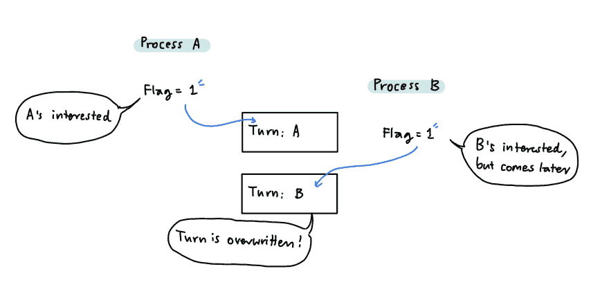
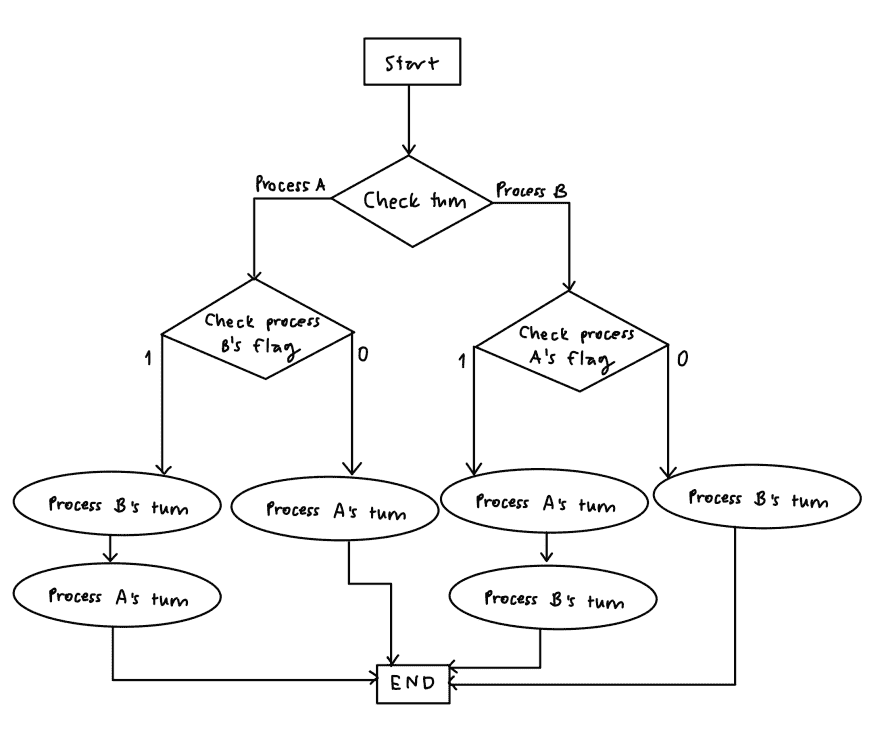

# 等待繁忙时的进程同步

> 原文：<https://dev.to/rinsama77/process-synchronization-with-busy-waiting-4gho>

你好:D 这个帖子是献给**忙碌等待的**！但是首先我们要(或者应该)先知道什么是进程同步。

## 进程同步(？？？)

进程同步意味着许多进程共享一些系统资源，对这些资源的并发访问很少或根本不会导致数据不一致。但是有时候，有些资源不能同时访问或者会有一些不一致。

> 例如，你和你的朋友想用打印机打印数百页的报告。现在，想象一下你和你的朋友同时点击打印**，你们其中一个人的报告不见了，因为打印机只拿走了一份！好吧，我知道现在的打印机很智能，但那是因为它有*惊人的进程同步*，但你得到的图片。打印机是共享资源，而你们是想要使用这些资源的进程。**

 **

## 忙着等待

这就是许多算法和技术来解决每个人都想进入**临界区域**的问题的地方；也就是不应该有多个进程的区域，所以不会有错误(比如使用共享资源)。

其中一个算法是**互斥**。名字听起来很复杂，但概念很简单；1 个进程工作在临界区，其他进程继续等待。没错，就是*那个*简单；我要用这台打印机，你等着。

这很好，但是其他进程如何知道何时可以轮到它们呢？嗯，他们只是*继续检查*,看看临界区内的进程是否完成了。他们必须不停地检查，检查，检查，检查......这让他们忙得不可开交，他们什么也做不了！

陛下，这就是我们所说的忙着等待。

没人:
随便没人:
我:*但是..啊..*听起来太容易了
还我:操你的操作系统

根据[维基百科](https://en.wikipedia.org/wiki/Busy_waiting)，

> 忙等待是一种技术，在这种技术中，进程反复检查某个条件是否为真，例如键盘输入或锁是否可用。

哦，但是我们还远没有完成。*傻笑*要是生活有上面那段那么简单就好了。问题是，有各种各样的忙着等待的版本。它们的范围从简单的愚蠢到“好吧，很好”。在这篇文章中，我将介绍其中的 5 个！
*剧透*你不会在你的操作系统中使用这些。

在我们讨论它们之前，请记住，所有这些算法都是为了在存在临界区域时使进程同步工作。所以，他们的主要目标是确保互斥现象发生。

#### 1)禁用中断

第一个是我说过的*非常愚蠢的*一个。你看，这背后的天才实际上可能是这样想的...

这是真的，但是这扼杀了进程同步的全部意义！这个算法根本不允许其他进程进入，它们可以无限期地等待，直到谁知道什么时候。里面的进程将继续工作，直到它完成，当然，我们不知道什么时候！因此，这不是理想的算法。

#### 2)锁定变量

这个看起来更好，因为现在我们有了一扇门和一把锁，而不是不做一扇门。更准确地说，是一个共享锁。当进程想要进入关键区域时，它检查门是否被锁定(测试锁),其中锁被初始设置为 0。如果 lock = 0，则门没有被锁定，进程可以进入临界区并锁定门(将其设置为 1)。但是如果 lock = 1，门就被锁住了，所以这个过程要等到它变成 0。

现在，这个*可能*听起来有希望，因为我们有一扇门和一把锁来防止其他进程同时进入，**但是**我们只是制造了另一个问题。这些进程不仅要竞争进入临界区(进入房间)，而且还要竞争锁！这被称为**竞争条件**或两个或更多进程(在这种情况下)必须竞争一个不能同时使用的资源(我知道，我引入了许多奇怪的词汇，但是请原谅我。TvT)。

 
还有，如果里面的进程结束了，但是没有放弃锁，继续使用呢？嗯，其他进程必须保持忙碌等待。更糟糕的是两个进程可以同时在里面，但是怎么做呢？当第一个进程检查并看到 lock = 0 时，它会将 lock 改为 1，对吗？但是在它变成 1 之前，进程 2 也进来检查锁，并发现锁是 0(尽管它即将变成 1！).现在，他们俩*意外地*拥有进入房间的钥匙*意外地*同时进入。有了这些，这个想法也是否定的。

#### 3) TSL

这里的下一个叫做*测试和设置锁定*。这一个就像**锁变量**，但是它更好一点，因为这个算法需要硬件的一点帮助。它解决了一个进程可以在第一个进程改变锁的值之前读取锁的值，从而两个进程同时进入临界区域的问题。但是 TSL 允许一个进程以原子的方式读取和更改锁的值；这意味着，除非它完成了锁的读写，否则没有其他进程可以干扰。然而，它仍然没有解决只有一个进程一直独占锁的问题。

#### 4)严格交替

好吧，好吧，让我们变聪明一点。如果他们必须争夺锁，那么我们将指定这是谁的锁，这样只有锁的主人才能打开门，而不必争夺它。尽管这个算法只适用于两个进程。但是现在，没有人竞争，也没有超过指定的(顺便说一句)进程可以留在内部。这听起来更好，对不对？嗯，是的，这样更好；一个*位*更好。

但是想象一下这个场景。进程 A 刚刚使用完临界区，因此进程 A 将密钥给了进程 B。然而，进程 B 还不想使用临界区，所以它不使用密钥，密钥保持不变。与此同时，进程 A 现在想要使用这个密钥，但是它是和进程 B 在一起的，除非 B 使用这个密钥，否则其他进程不能使用它。因此，这个算法也是有问题的，所以它不太管用。

#### 5)彼得森的解决方案

我们的算法越来越复杂了。我们有更多的变量是**回合**和**旗帜**。该算法也仅适用于 2 个进程。

它的工作方式是首先，假设进程 A 想要使用临界区，所以它将自己的标志设置为 1，这意味着进程 A 对进入临界区感兴趣，它将话轮改为自己的话轮(进程 A 的话轮)。然后稍晚一点来的进程 B 想进入临界区，于是也这样做；将其标志设置为 1，并将回合更改为自己的回合。因为进程 B 在进程 A 之后出现并改变了回合，这个回合不是进程 A 的，而是进程 B 的。

该算法将首先检查进程 A 和 B 的标志是否都为 1，以查看它们是否都感兴趣。然后，它会检查轮到谁了。如果他们都感兴趣并且轮到了进程 B，那么进程 A 可以首先进入临界区。这是因为它知道谁来的晚，谁就能把回合改写为自己的回合，谁先来，谁的回合就会被改写。那么后面的工序 B 可以在工序 A 完成后进入。但是，如果只有一个进程的标志为 1，那么该进程就可以进入临界区。
[T3】](https://res.cloudinary.com/practicaldev/image/fetch/s--GSd7ki_9--/c_limit%2Cf_auto%2Cfl_progressive%2Cq_auto%2Cw_880/https://thepracticaldev.s3.amazonaws.com/i/7e0vnkeb3ozqm9t3kf3h.jpg)

这个很棒，因为每个进程都有机会进入内部，并且不能有一个以上的进程同时呆在内部。一切似乎都很完美，但这就是全部吗？

## 悲伤的真相

问题是，无论这些算法多么完美，它们仍然会产生一些繁忙的等待过程。除了临界区域内的进程之外，一些进程必须等待、检查、等待、检查，直到它们能够进入。这浪费了 CPU 资源，因为*实际上没有*处理其他重要的任务，它只是无限期地等待和检查。

那么，我们能做什么呢？我们能做的是，我们必须想出其他不需要忙碌等待的算法(提示:睡眠和唤醒算法)。但是我们不会在这篇文章中讨论这个问题😬😬，那么下期再见！(也许吧😅)**