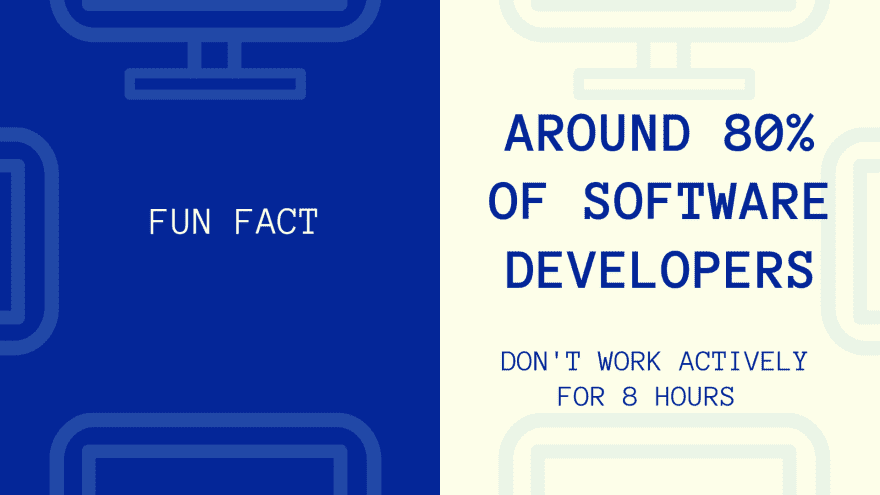
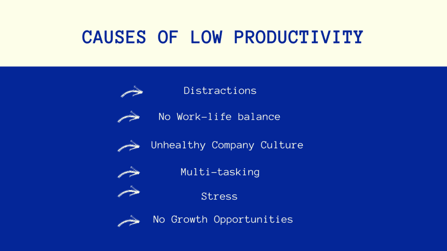
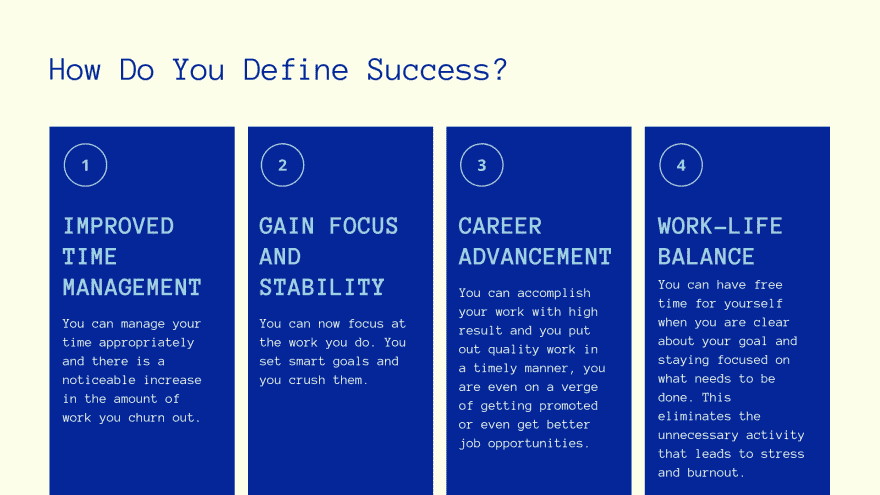

# 作为一名开发人员，如何提高你的工作效率

> 原文：<https://dev.to/lauragift21/how-to-supercharge-your-productivity-as-a-developer-4kln>

几个月前，我在尼日利亚拉各斯的 forloop 峰会上谈论过这个话题。我决定写一篇博文，所以就这样吧。

作为开发人员，我们不断地尝试大量生产工作，我们经常发现自己在做实际工作时分心。在本文中，我将分享如何作为一名开发人员保持高效的技巧，并分享帮助自动化这一过程的工具。

## 什么是生产力？

生产力是一种无需额外努力就能完成高质量工作的行为。

这是我对生产力的定义，我相信很多开发人员已经熟悉了生产力这个术语。在我们的日常生活中，我们都试图做出有意义的工作，从我们的待办事项列表中划掉这个任务，循环继续。我希望我们思考的一个严酷的事实是，由于不同的环境，世界上有多少开发人员每天都在为效率低下而挣扎。

这里有一个有趣的事实。我认为这是大多数开发人员的情况，我们不会连续工作 8 个小时，请注意，如果你这样做，那完全没问题，这只是我的观点，因为我知道为了高效地工作，你需要休息，所以请不要来找我:)。

## 生产率低下的原因

我将简短地阐述为什么我认为这些是开发人员生产力低下的一些原因。

*   分心:我们的电话通知、未读邮件和会议是导致我们在工作时间效率低下的一些最大的分心因素。我个人在工作时关闭了所有设备的通知，但仍然有在工作时拿起手机的冲动。

*   工作生活平衡度低:倦怠是真实的，当你把时间花在超出正常工作时间的工作上，或者当你应该花时间离开工作时，这最终会导致低生产率，因为你最终关心的只是工作，而你缺少的是另一部分。

*   不健康的公司文化:不健康的公司文化也会从几个方面引发低生产率。在有毒的环境中工作对开发人员有很大的影响。人们不得不在工作场所处理一些不愉快的情况，这往往会影响他们的工作质量。

*   压力:学会什么时候休息也是关键，很多开发人员都有这种行为。如果你过度劳累，你会变得有压力，最终导致工作效率低下。

*   缺乏发展机会:在一家与你的目标不一致的公司工作，或者你一直在做同样的工作，没有学到任何新东西，或者你看不到自己会很快得到提升，这都会导致你的工作效率低下。

## 提升工作效率的建议

*   最大限度地减少干扰:消除干扰的最好方法是完全限制它。这意味着你必须想办法减少你收到的通知和邮件。您可以将移动设备上的通知静音，或者确保您工作时没有将它放在身边。使用任何对你有用的东西，但目标是减少分心。一些可以帮助你的工具是[保持专注](http://www.stayfocusd.com/)、[Mac 的自我控制](https://selfcontrolapp.com/)、 [gofuckingwork](http://gofuckingwork.com/) 。
*   自动化您的过程:作为开发人员，我认为这是我们应该感兴趣的事情之一，因为当我们能够自动化时，重复一项任务会变得令人生畏，那么为什么不呢。如果你发现你每天花超过 2 分钟做同样的事情，那么你应该想办法自动完成这项任务。自动化流程的工具。[。点文件](https://dotfiles.github.io/)、 [ohmyzsh](https://ohmyz.sh/) 、 [cheatsheet](https://mediaatelier.com/CheatSheet/) 。
*   时间管理:管理你的时间是你可以用来保持高效的另一个重要技巧。当你有效地提前计划时，它将有助于提高你的生产力。一些利用[番茄定时器](https://tomato-timer.com/)的工具。
*   使用正确的工具工作:使用正确的工具很重要，这样我们就不会花很多时间去弄清楚为什么当我们使用错误的工具时，我们试图完成的任务没有按预期工作。
*   休息一下:这和我分享的其他建议一样必要。需要休息的时候就休息一下。如果说我学到了什么，那就是我和我的生活比任何工作都重要，因为最终如果你不健康，你最终将无法工作。
*   对你的工作进行优先排序:这种方法对一些人有效，事实上，我已经尝试过了，我发现有必要使用这种方法。确定我们工作的优先顺序是提高你工作效率的一种方法。你可以选择先做困难和耗时的任务，然后最后做简单的，或者反之亦然，只要对你合适，但要确保你优先考虑。
*   提前计划做笔记:我喜欢做笔记，这是我的一个习惯，我发现这是我工作的一种方式，我记下我一天想要完成的事情，在一天结束时，我可以想象我已经完成了多少工作。我必须承认，有时候这让我不寒而栗，有时候我很失望，但我不会放弃。我使用的工具[意念](https://www.notion.so/)、 [Numi](https://numi.io/) 、 [Taskade](https://www.taskade.com/) 。
*   把任务分成小块:我再怎么强调这一点也不为过，确保你把任务分成更小的块，这样你就能以小块的形式把它们形象化，而不会让你难以完成。
*   安排你的时间:最后，使用你的日历。安排本周的活动，这样你就不会跳过或忘记你应该做的事情。我个人用的是[谷歌日历](https://www.google.com/calendar)

## 你如何定义成功？

在经历了这些步骤并应用了这些技巧之后，你怎么知道你已经成功了。

*   改善时间管理:当你现在能够有效地管理你的时间并坚持下去，并且你的工作有了明显的改善，你就知道你已经成功了。
*   获得专注和稳定:你现在非常专注和稳定，因为你有专门的时间休息和休息，所以你在工作时感到神清气爽。
*   职业发展:你现在完成的有价值的工作会带来可能的晋升，包括更好的机会。
*   工作生活平衡:你现在有了适当的工作生活平衡，没有疲惫的迹象，你可以在工作之外抽出时间去度假或与家人共度时光。

我希望这些小技巧对你有所帮助，你可以开始在日常工作流程中使用它们来提高你作为开发人员的工作效率。如果你在评论区有进一步的建议，请告诉我，也不要忘记分享对你有用的建议。

[原载于我的博客](https://www.giftegwuenu.com/how-to-supercharge-your-productivity-as-a-developer)
[你可以在这里找到演讲幻灯片](https://speakerdeck.com/lauragift21/how-to-supercharge-your-productivity-as-a-developer)