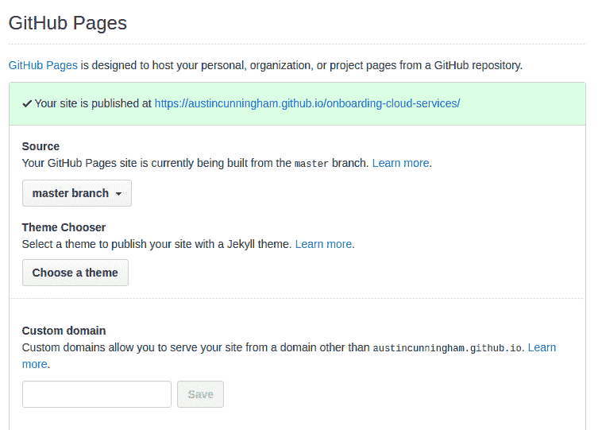

# 免费网站托管

> 原文：<https://dev.to/austincunningham/free-website-hosting-42g4>

主机有很多选择，这不是一个详尽的列表，只是我尝试过的一些选择。

## Surge.sh

用于静态网站和 SPA
安装的命令行部署工具

```
npm install --global surge 
```

用你的 index.html 文件改变目录到你的项目

```
cd project-dir
ls index.html 
```

运行激增来发布你的站点
[](https://res.cloudinary.com/practicaldev/image/fetch/s--KpY3cqc2--/c_limit%2Cf_auto%2Cfl_progressive%2Cq_66%2Cw_880/https://surge.img/help/getting-started-with-surge.gif)

默认情况下，在 surge.sh 域中给你一个 cname，但是你可以设置一个[自定义域](https://surge.sh/help/adding-a-custom-domain)，只要你有一些 [dns 托管](https://www.maketecheasier.com/best-dynamic-dns-providers/)。

我喜欢这个选项，因为它配置起来很简单，而且 Surge.sh 文档也很棒。一个问题是，如果你忘记了用户名和密码，可能就没有办法恢复对你的网站的访问。

## Github 的 gh 页

您可以从 gh-pages 托管静态网站和 SPA

您可以将 gh-page 添加到任何回购中

点击了解更多关于如何设置 github 页面的

默认情况下，您会在下面的 https://**git-user-name**. github . io/**repo-name**中获得一个域，您也可以在设置中设置一个自定义域

[](https://res.cloudinary.com/practicaldev/image/fetch/s--mkLwHWIW--/c_limit%2Cf_auto%2Cfl_progressive%2Cq_auto%2Cw_880/https://cdn-images-1.medium.com/max/800/1%2AwAVZk06bHz8lGt4pnkjdYw.png)

在提供的框中添加您的自定义域，同样，您需要 dns 托管。

我已经在许多项目中这样做了，不管是仅仅为了使一个[文档的页面](http://change-oc.ddns.net/README.html)变得更有活力，还是我主持的这个[博客](https://github.com/austincunningham/myblog)。

## Heroku

[](https://res.cloudinary.com/practicaldev/image/fetch/s--fT0_qJUA--/c_limit%2Cf_auto%2Cfl_progressive%2Cq_auto%2Cw_880/https://cdn-images-1.medium.com/max/800/1%2AwBWMeBZBLbITHT0EcsZfyA.png)

Heroku 是 PAAS 提供的托管应用程序。可以在 heroku 上部署一个[节点 app。设置一个 Express.js 应用程序来服务一个目录参见](https://devcenter.heroku.com/articles/deploying-nodejs)[第一节这里](https://austincunningham.ddns.net/2018/hostingopenshift)关于如何操作的步骤。

大学毕业后就没用过了，但是免费的效果很好。我记得配置有时可能是个棘手的问题。

## 小故障

[](https://res.cloudinary.com/practicaldev/image/fetch/s--W4Yqz5Ow--/c_limit%2Cf_auto%2Cfl_progressive%2Cq_auto%2Cw_880/https://thepracticaldev.s3.amazonaws.com/i/juvetcvfipn4m73tdcx6.png)

给你带来 stackoverflow 的好心人的小故障。它是 node.js 应用程序的托管平台，就像 heroku 一样，你需要设置一个 express 应用程序来提供静态内容。这个选项的唯一问题是，你不能决定你的域名，我还没有找到一个解决这个问题的方法。

## 在本地 PC 上自我托管

[](https://res.cloudinary.com/practicaldev/image/fetch/s--NSfhDmwM--/c_limit%2Cf_auto%2Cfl_progressive%2Cq_auto%2Cw_880/https://cdn-images-1.medium.com/max/800/1%2ArweIglsq5NH-iKE-reP1OA.jpeg)

如果你足够幸运，有一个公共 ip 地址，本地电脑的托管就像设置一样简单

[阿帕奇网络服务器](https://vitux.com/how-to-install-and-configure-apache-web-server-on-ubuntu/)

[Nginx 网络服务器](https://mediatemple.net/community/products/developer/204405534/install-nginx-on-ubuntu)

如上所述，上述示例静态 web 文件将从`/var/www/`目录提供。
但大多数人没有公共 IP，所以可能不得不寻找动态 dns 提供商。

例如,[noip.com](https://www.noip.com/support/knowledgebase/how-to-configure-ddns-in-router/),它让您可以选择在路由器上设置 dns，或者在您的 pc 上运行软件，以便在 ip 地址发生变化时更新 dns。

我从中学到了很多，甚至开始建立我自己的 dovecot 电子邮件服务器。我现在不想主持，但作为一个学习练习，值得一试。痛点断电或 ISP 中断，您的站点离线。如果你的硬件爆炸了也一样。

## 云托管

如果你走的是 Apache/Nginx 路线，你最好注册免费层云服务，其中很多提供一年免费服务

[亚马逊 EC2](https://aws.amazon.com/free/?all-free-tier.sort-by=item.additionalFields.SortRank&all-free-tier.sort-order=asc&awsf.Free%20Tier%20Types=categories%23featured)

[蔚蓝色](https://azure.microsoft.com/en-us/free/free-account-faq/)

[GCP](https://cloud.google.com/free/docs/gcp-free-tier)

使用 Apache/Nginx 的两种方法各有利弊，但是云将比自托管更具扩展性，也更可靠。痛点您必须像老鹰一样盯着账单，以防超出免费层的使用范围。