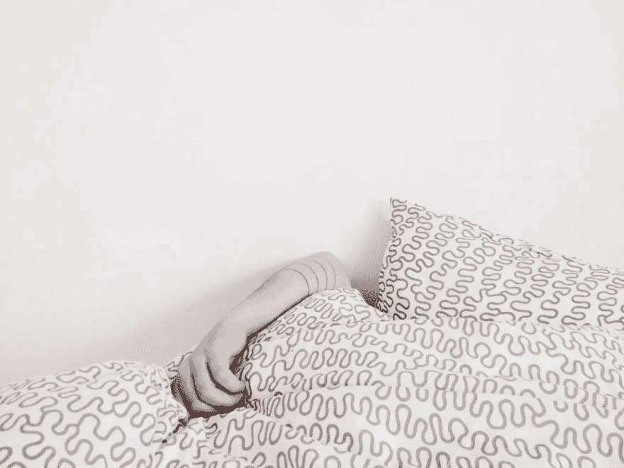
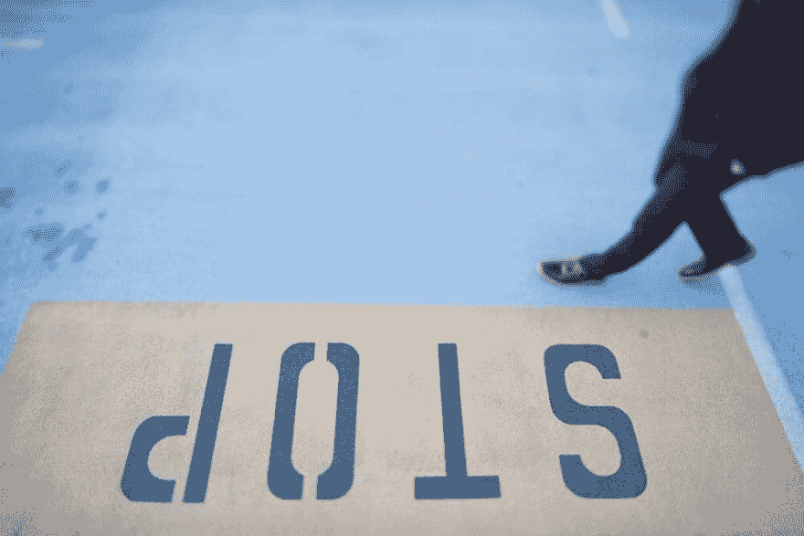

# 早晨是不一样的

> 原文：<https://dev.to/jmspace/mornings-are-not-the-same-20ij>

#### 我的早晨变成了一天中最没有效率的时刻。

在我的一生中，我不记得有哪一刻像现在这样害怕起床。我是说我喜欢，但那是我生命中的一个不同阶段。但是我从来没有如此害怕起床，以至于我甚至不起床。早餐就是午餐。早上的例行公事是中午的例行公事。

我一直躺在床上超过 12 点，但最近很难起床。我没有任何强烈的动力去起床。我刚醒来，躺在床上想做点什么，什么都行。我想做一些重要的事情，一些有效的事情。一些事情。

我思考我想做什么，但没有什么能让我立即行动起来。一百万个想法浮现在脑海里。没有我想马上做的事。没有什么能说明我的懒惰。

有时候我想写点什么，但是是什么呢？我对可以转化为涉及编码的项目的东西没有个人兴趣。其他时候，我只想做一些数码设计或者只是画画。

但是我不能。我的动力很低。我没有信心。我想要更多的生活。见鬼，我只是想要一份工作。我说这不重要。在这一点上，报酬并不重要。我只想找个理由离开这房子。

所以我想是时候来个彻底的改变了。有些东西必须付出，有些东西必须改变。

一些大事。一个会比过去更有效的改变。

总有一天，不会那么糟糕。我短期内看不到这种情况。但是我不认为这是一件严重的事情。我只是生活在地狱边缘。没有目的。没什么。

好了，现在我抱怨完了，我可以做点什么了。有时候，你必须把生活中的所有问题一吐为快，才能找到解决办法。

### 修罗

*   设定新的有效目标。
*   在定时会议中工作。
*   写下想法。把它们从我的脑袋里拿出来。
*   每周坐下来，设定任务和事件。评估我的目标。
*   而且最重要的是，**起来！**

每当我感觉那种消沉的感觉回来时，我就不得不参考我写的这篇关于高效的文章。这展示了完成任务的正确方法。

[如何为懒惰腾出时间](https://link.medium.com/svU59mGBSW)

* * *