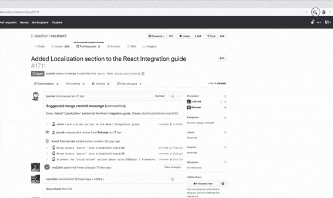
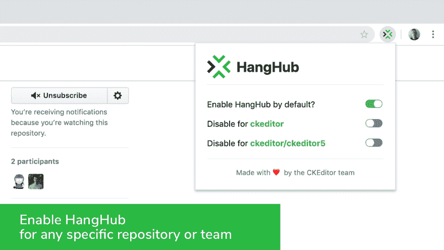

# 认识一下 HangHub，GitHub 的一个新的生产力工具

> 原文：<https://dev.to/gok9ok/meet-hanghub-a-new-productivity-tool-for-github-2864>

# 什么是 HangHub

HangHub 是一个团队生产力工具，可以让你看到和你处理相同 GitHub 问题或 pull 请求的其他用户。它们可以是评论、编辑、简单查看或合并。在你和你的队友安装了 HangHub 之后，你的团队就再也不用担心浪费时间在同一时间做完全相同的事情了。

HangHub 目前可以作为浏览器扩展下载给 [Chrome](https://chrome.google.com/webstore/detail/hanghub/egnoioofamlapfbecfkjgeobkfmfflfo) 和 [Firefox](https://addons.mozilla.org/en-US/firefox/addon/hanghub/) 你也可以[自己建造](https://github.com/ckeditor/hanghub)它(并增强)。在许可的 MIT 开源许可下，它是免费的。

# 为什么要挂 Hub

随着 CKEditor 5 及其协作特性的到来，我们展示了我们对协作的承诺。我们仍在努力使 CKEditor 5 成为你最终的协作框架，在这个持续的努力中，我们也学到了很多关于协作本身的东西。

在一年一度的 CKEditor hackathon 期间，我们的开发人员希望解决我们在使用 GitHub 时遇到的协作和沟通问题。你是否曾经为 GitHub 讨论写了一篇冗长的回答，却发现你的队友花了 30 分钟写了同样的内容？我们肯定有，这就是 HangHub 诞生的原因。

# HangHub 如何工作

为了与您的合作者通信，HangHub 使用 WebSocket 协议。HangHub 基于 Preact 和 VirtualDOM，可以快速有效地更新用户状态。得益于此，您可以准确地看到协作者(其他 HangHub 用户)何时加入、离开、评论和编辑 GitHub 问题或合并 pull 请求。

请注意，您可以为任何特定的组织或存储库禁用 HangHub。

现在就从 [Chrome 网上商店](https://chrome.google.com/webstore/detail/hanghub/egnoioofamlapfbecfkjgeobkfmfflfo)或 [Firefox 插件](https://addons.mozilla.org/en-US/firefox/addon/hanghub/)安装 HangHub，并与你的队友分享，让你的组织中的 GitHub 管理流程更加高效！

我们希望 HangHub 能让你在 GitHub 上的工作变得更容易，并很想听听你对我们新工具的想法。对于您可能有的任何问题或反馈，您可以加入产品搜索的讨论或联系我们。您也可以直接前往 [GitHub 仓库](https://github.com/ckeditor/hanghub)报告问题并提交特性请求。

别忘了在 GitHub 上开始！

这篇文章最初发布在[ckeditor.com](https://ckeditor.com/blog/Meet-HangHub-a-new-productivity-tool-for-GitHub/)