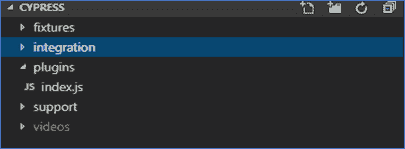
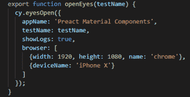
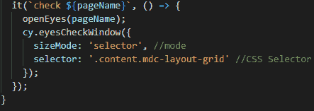
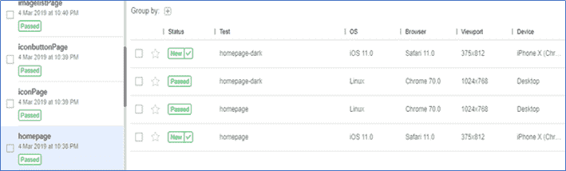

# 作为初级开发人员使用 Applitools 和 Cypress 学习视觉测试

> 原文：<https://dev.to/megsachdev/learning-visual-testing-as-a-junior-developer-with-applitools-and-cypress-h3c>

凡事都有第一次，我很幸运有机会通过一个名为 [This Dot Labs 开源学徒计划](http://thisdot.co/hirethefempire)的新项目了解前端测试。

学徒计划对我这样的人来说是一个很大的帮助，我是一个在休假一年后重返工作岗位的母亲，可以顺利地开始工作。对我来说，这个项目帮助我学到了很多新东西。

我被介绍了一个叫做 [Applitools](http://applitools.com) 的神奇工具，它可以减轻我们作为开发人员对应用程序进行可视化测试的任务。

Applitools 使用人工智能支持的图像比较技术，该技术仅报告用户可察觉的差异，并可靠地忽略不可见的渲染、大小和位置差异。它可以立即验证整个应用程序页面，检测布局问题。使用相同的基线图像，它可以跨多个浏览器和设备验证布局的任何变化、缺少的元素、重叠的元素或大小问题。

**我如何在 Preact 材料中用 Applitools 和 Cypress 制作我的第一个 PR**

我的第一次公关是介绍 Applitools 和 Cypress 来预装材料组件。

Preact-Material-Component 是 Google 官方材料组件网络库的包装器。下载量超过 50k，对于有意在应用中使用材料设计的 Preact 开发者来说，它是一个没有主见的包装器。

对于他们的下一个主要版本，维护人员正计划在谷歌的库之上添加定制代码，如手势、实验组件等。这就是为什么他们需要的不仅仅是他们当前版本中已经存在的基于像素对像素匹配的木偶。

我对添加 Applitools 有点紧张，因为测试和前端对我来说都很新，但多亏了我的这位 Dot 导师，事情变得轻而易举。

需要一些基本的安装，这样我们才能编写我们的测试。为 Applitools 安装 Cypress:appli tools 有一个用于 Cypress 的 SDK，所以很容易使用。

要安装 Cypress，请导航到终端上的文件夹路径。

运行以下命令进行安装。

```
yarn add cypress --dev 
```

这将 cypress 作为一个开发依赖项安装。
在系统上打开 cypress，您可以使用:

```
npx cypress open 
```

当我们第一次运行 cypress 时，我们的代码中添加了一个默认结构。
[T3】](https://res.cloudinary.com/practicaldev/image/fetch/s--Y1eZP1Ul--/c_limit%2Cf_auto%2Cfl_progressive%2Cq_auto%2Cw_880/https://lh4.googleusercontent.com/qm2THSCcRwW-Y8A5ZVrZY_-kTTr97_8r5V6ceL685VN9wTVeoPbY0t15buWjdeO9GfcT5Bg1vwQi9DJUK6okHGnWaKNKPetZMBC_JHI6F495qT9vRPUG23PtaIvOaVtDNfb6EtxF)

为了开始我们的测试，我们将 eyes-cypress 插件添加到我们的 cypress 项目中。
基本上增加了三个主要方法，cy.eyesOpen 开始测试，cy.eyesCheckWindow 截图(针对每个测试步骤)，cy.eyesClose 关闭测试。

```
npm install @applitools/eyes-cypress --dev 
```

我们在`plugins/index.js`和`commands/index.js`中导入 Applitools 和 Cypress 依赖项。

```
require('@applitools/eyes-cypress')(module) 
```

```
import @applitools/eyes-cypress/commands 
```

接下来，添加 cy.eyesOpen 来启动 it 块内部的测试。
**[](https://res.cloudinary.com/practicaldev/image/fetch/s--hzn9KSaL--/c_limit%2Cf_auto%2Cfl_progressive%2Cq_auto%2Cw_880/https://lh3.googleusercontent.com/oGGJoukQVX5JUsQyrEGTu9pvJfebNl9te_vHtvuMZGRt9CEpKOwf_2BUQYmPN6WE-K4ii_9ZUujWrQ3SfwpN8L3vfP-JHLedGYnNvA8LTStkILLgzeqvwaH80Ls5POxmJBuc3y11)**

为各种测试步骤添加一个或多个 eyesCheckWindow 检查点。

**[](https://res.cloudinary.com/practicaldev/image/fetch/s--UdVKWZ14--/c_limit%2Cf_auto%2Cfl_progressive%2Cq_auto%2Cw_880/https://lh5.googleusercontent.com/8PF70QgqmkxQlRMxo_rO2gPHqP0Jz_lslJU4X5hz5_DHWoHCVZXTOIQmx_vjilIaoqwoHrNXQbCg_MjNLcEHvXDlIc--6krN4pAirHaUMtR9oZCBwKz4AlqnjcC2a8zxgYxwGxaH)T4】**

在测试的最后，你加上 cy . eye close .

```
cy.eyesClose() 
```

要运行 Applitools:

1.  创建 Applitools 账户(开源库可以免费获得这个[这里](http://applitools.com/open-source))。
2.  进入右上角的菜单，点击最右边的个人资料图标。****
3.  点击“我的 API 密钥”并复制您的密钥。
4.  转到您的终端并粘贴以下内容:export appli tools _ API _ KEY = Your _ API _ KEY _ Here
5.  转到您的目录并运行:

```
yarn test:travis 
```

1.  在 Applitools 仪表板中，您应该可以看到您的测试结果。****

这个工具让我感到惊讶，因为它帮助我捕捉到了手工测试中可能忽略的最小的细节。

所以，感谢 Applitools 教会我测试，视觉测试的重要性，并带来了这样一个可怕的工具，它在许多方面对开发人员都是一个福音。

如果你想和我谈谈 [Applitools](http://twitter.com/applitools) 或者[这个 Dot Labs 学徒项目](http://thisdot.co/hirethefempire)，你可以在 Twitter [@_megsachdev](http://twitter.com/_megsachdev) 上找到我。