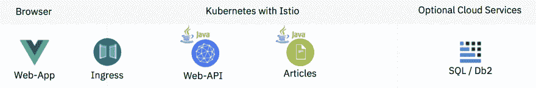
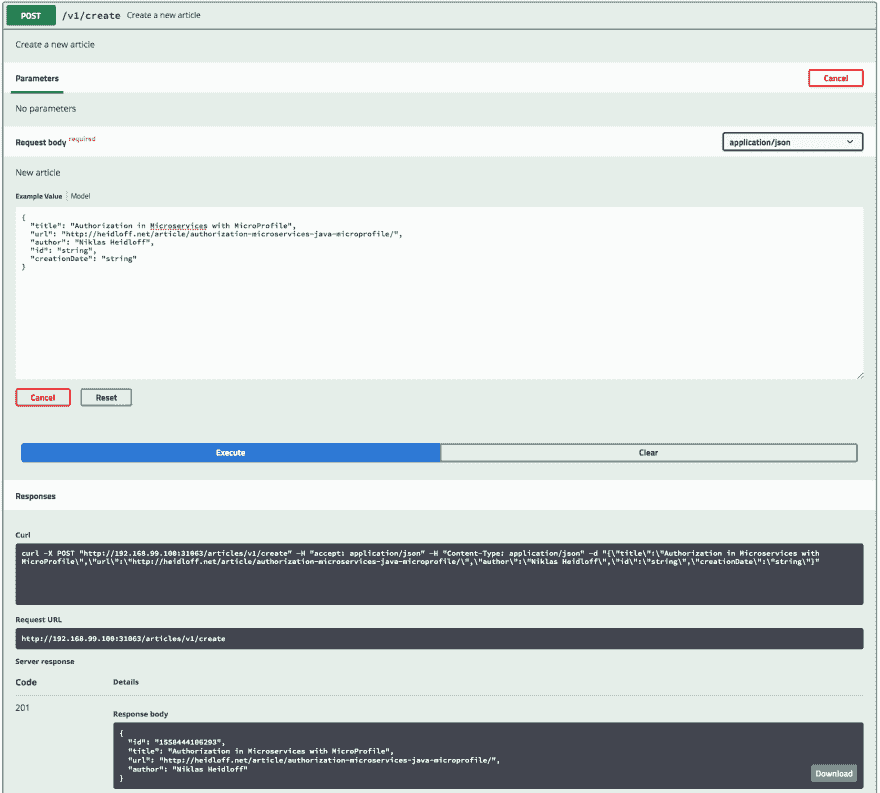
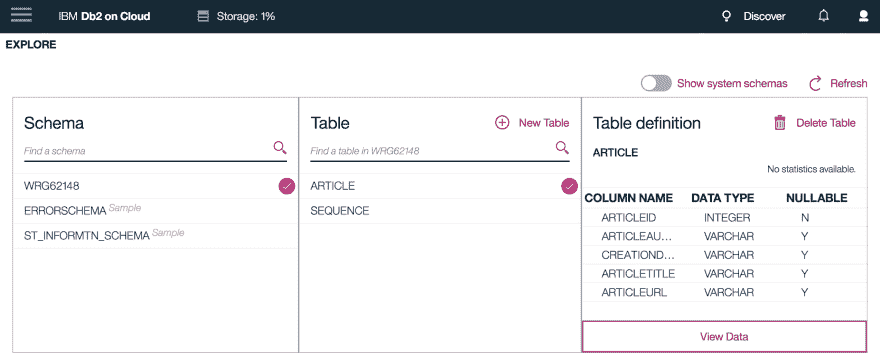
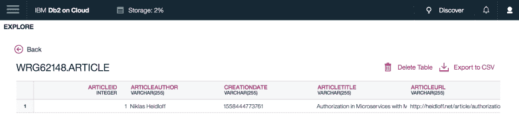

# 通过 JPA 在 Kubernetes 中实现 Java 微服务的持久性

> 原文：<https://dev.to/nheidloff/persistence-for-java-microservices-in-kubernetes-via-jpa-2pc6>

在过去的几周里，我开发了一个示例应用程序，演示 Java EE 开发人员如何开始使用微服务。该应用程序是一个完整的端到端示例，包括 web 应用程序、业务逻辑、身份验证，现在还包括持久性。它运行在 Kubernetes 和 Istio 上，有脚本可以轻松部署它。

从 GitHub 获取 [cloud-native-starter](https://github.com/nheidloff/cloud-native-starter) 代码。

**Java 持久性 API**

在这个例子中，我使用了一个完整的开源 Java 栈，包括 OpenJ9、OpenJDK、Open Liberty 和 MicroProfile。为了将微服务部署到 Kubernetes，我创建了一个图像。请阅读我的文章[dockering Java micro profile Applications](http://heidloff.net/article/dockerizing-container-java-microprofile)了解详情。

开放自由提供了一些很好的指南。有一个指南专门介绍了 JPA: [在微服务](https://openliberty.io/guides/jpa-intro.html)中访问和持久化数据。我不想在这里重复每件事，而只是强调我必须做的更改，以便在容器中运行这个功能，而不是通过本地 Open Liberty 安装。

以下是对 JPA 的简短描述:

> JPA 是一个 Java EE 规范，用于将关系数据库表数据表示为普通旧 Java 对象(POJO)。JPA 通过使用注释将 Java 对象映射到关系数据库中的表，简化了对象关系映射(ORM)。除了为执行 CRUD 操作提供高效的 API 之外，JPA 还减少了在执行数据库操作时必须编写 JDBC 和 SQL 代码的负担，并解决了特定于数据库供应商的差异。

**示例应用程序的配置**

下图显示了 cloud-native-starter 示例的简化架构。web 应用程序通过入口调用实现后端对前端模式的 Web-API 服务。Web-API 服务调用 Articles 服务，该服务将数据存储在 IBM Cloud 的 SQL 数据库中。显然，您可以使用任何其他 SQL 数据库来代替。

[](https://res.cloudinary.com/practicaldev/image/fetch/s--eTPspoNo--/c_limit%2Cf_auto%2Cfl_progressive%2Cq_auto%2Cw_880/https://thepracticaldev.s3.amazonaws.com/i/d3iupxu1818c1vib5tq8.png)

为了访问 IBM Cloud 上的 Db2，首先需要通过 [Maven](https://github.com/nheidloff/cloud-native-starter/blob/master/articles-java-jee/pom.xml) 下载驱动程序。注意驱动没有和微服务的业务逻辑一起进入 war 文件，而是需要复制到某个 [Open Liberty 目录](https://github.com/nheidloff/cloud-native-starter/blob/master/articles-java-jee/Dockerfile#L17):/opt/ol/WLP/usr/shared/resources/JCC-11 . 1 . 4 . 4 . jar 中

接下来，您需要在 [server.xml](https://github.com/nheidloff/cloud-native-starter/blob/master/articles-java-jee/liberty/server.xml) 中定义关于驱动程序和数据源的信息。

```
<server description="OpenLiberty Server">
    <featureManager>
        <feature>webProfile-8.0</feature>
        <feature>microProfile-2.1</feature>
    </featureManager>

    <httpEndpoint id="defaultHttpEndpoint" host="*" httpPort="8080" httpsPort="9443"/>

    <library id="DB2JCCLib">
        <fileset dir="${shared.resource.dir}" includes="jcc*.jar"/>
    </library>

    <dataSource id="articlejpadatasource"
              jndiName="jdbc/articlejpadatasource">
        <jdbcDriver libraryRef="DB2JCCLib" />
        <properties.db2.jcc databaseName="BLUDB"
            portNumber="50000"
            serverName="DB2-SERVER"        
            user="DB2-USER"
            password="DB2-PASSWORD" />
  </dataSource>
</server> 
```

接下来，需要在 [persistence.xml](https://github.com/nheidloff/cloud-native-starter/blob/master/articles-java-jee/src/main/resources/META-INF/persistence.xml) 中定义持久性单元。

对我来说，棘手的部分是找出这个文件的正确位置。为了让所有 Maven 版本都能正确构建它，我把它放在了“src/main/resources/META-INF/persistence . XML”中。这将生成一个内部结构为“classes/META-INF/persistence . XML”的 articles.war 文件。

```
<persistence version="2.2"

    xmlns:xsi="http://www.w3.org/2001/XMLSchema-instance"
    xsi:schemaLocation="http://xmlns.jcp.org/xml/ns/persistence 
                        http://xmlns.jcp.org/xml/ns/persistence/persistence_2_2.xsd">
    <persistence-unit name="jpa-unit" transaction-type="JTA">
        <jta-data-source>jdbc/articlejpadatasource</jta-data-source>
        <properties>
            <property name="eclipselink.ddl-generation" value="create-tables"/>
            <property name="eclipselink.ddl-generation.output-mode" value="both" />
        </properties>
    </persistence-unit>
</persistence> 
```

**Java 中 JPA 的用法**

一旦所有的配置都完成了，编写 Java 代码就简单了。

首先，您需要定义表示表中条目的 Java 类。用 id、标题、url、作者和创建日期这五列来检查 ArticleEntity.java 的代码。按照 persistence.xml 中的定义，这个表是自动创建的。

物品的 CRUD 操作在[ArticleDao.java](https://github.com/nheidloff/cloud-native-starter/blob/master/articles-java-jee/src/main/java/com/ibm/articles/data/ArticleDao.java)中定义。代码非常简单。唯一让我困惑的是，我必须为创建操作手动开始和提交事务。在 Open Liberty 示例中，这是不必要的。我想知道有什么不同。

在[JPADataAccess.java](https://github.com/nheidloff/cloud-native-starter/blob/master/articles-java-jee/src/main/java/com/ibm/articles/data/JPADataAccess.java)中，实现了添加和读取文章的逻辑。ArticleDao 被注入。同样，代码看起来很简单。我在这里学到的经验是，依赖注入似乎只有在调用这段代码的上层使用依赖注入和@ApplicationScoped 时才有效。

**如何运行示例**

我已经编写了脚本来创建 SQL 数据库和文章服务。查看[文档](https://github.com/nheidloff/cloud-native-starter/blob/master/documentation/DemoJPA.md)在 Minikube 或 [IBM Cloud Kubernetes 服务](https://cloud.ibm.com/docs/containers)上运行该示例。

安装后，OpenAPI API Explorer 可用于创建新文章。

[](https://res.cloudinary.com/practicaldev/image/fetch/s--y_THjE4h--/c_limit%2Cf_auto%2Cfl_progressive%2Cq_auto%2Cw_880/http://heidloff.net/wp-content/uploads/2019/05/jpa-demo-1.png)

该表显示在 Db2 控制台中。

[](https://res.cloudinary.com/practicaldev/image/fetch/s--X-hAO05e--/c_limit%2Cf_auto%2Cfl_progressive%2Cq_auto%2Cw_880/http://heidloff.net/wp-content/uploads/2019/05/jpa-demo-2.png)

表格中的数据也可以显示在控制台中。

[](https://res.cloudinary.com/practicaldev/image/fetch/s--x7wt0u6t--/c_limit%2Cf_auto%2Cfl_progressive%2Cq_auto%2Cw_880/http://heidloff.net/wp-content/uploads/2019/05/jpa-demo-3.png)

要了解更多关于用 Java 和 MicroProfile 构建的微服务，请查看[cloud-native-starter](https://github.com/nheidloff/cloud-native-starter)repo。