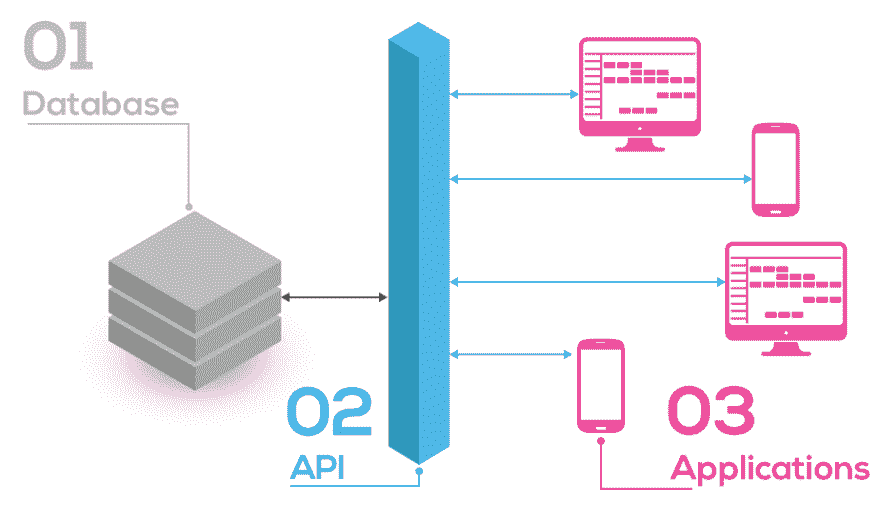

# 什么是 API？

> 原文：<https://dev.to/mercier_remi/what-is-an-api-4ao9>

对向你奶奶解释 API 感到不安👵或者非技术客户👔？让我来帮你！

开始之前，我想问你几个问题。你知道如何:

*   真实的天气知道你即将到来的敦刻尔克之旅的天气吗？
*   Trainline 知道是否有座位(即将到来的敦刻尔克之旅)？
*   Airbnb 在地图上显示可用的公寓(我还需要说“敦刻尔克”吗)？

在过去的几年里，API(也称为应用程序编程接口)已经像野火一样在创业成长游戏中蔓延开来。

引用 [@trainline_fr](https://twitter.com/trainline_fr) (前车长)后端工程师[保罗·博诺](https://twitter.com/paulrb_r):

> API，一个非常有趣和广阔的主题，不是吗？

对于非技术用户来说，理解 API 是一个挑战。什么是 API？通过 API 可以共享什么？数据？服务？如何设计一个 API？你如何编写一个 API？

因为我问了自己所有这些问题(以及更多)，所以我决定是时候更好地理解 API 到底是什么了。虽然这有点吓人——尤其是当你来自非技术背景时——但我肯定人们会觉得很有趣。我计划写各种主题:

*   什么是 API？
*   它是如何工作的？
*   谁在使用它？
*   等等…

但是让我们从头开始。

## 什么是 API？

APIs 或应用程序编程接口——被定义为一组功能(执行特定任务的编码过程),通过这些功能，两个软件可以在没有任何人工干预的情况下相互通信。API 是一个抽象的软件入口点，描述了开放接口及其行为。

让我们把这个缩写分解一下:

*   应用程序:应用程序是指开发者想要与之交互的服务。这项服务可以是气象数据流、图像共享应用程序或开放数据门户。
*   **接口**:接口是服务的入口。你必须穿过那扇门才能与服务功能交互(例如，过滤某个城市的气象数据，在 Instagram 上发布图片……)
*   **程序**:程序是开发者编写的一组编码程序。程序被设计成与应用程序交互，所以我们不必这样做。例如，程序可以提交一个邮政地址来获取坐标(想想 Airbnb 或 Google Map)。

总结一下:API 是使用特定入口点(接口，也称为端点)与应用程序(或该应用程序中的某些功能)进行交互的程序。

## 好吧，但是 API 是做什么的呢？

现在 API 覆盖的很好。你会发现很多关于“每个开发人员都需要知道的最棒的 XXX APIs”的文章但是 API 的基础知识并没有得到简明的解释，非技术用户仍然难以理解。

API 允许开发者访问服务。人们通常说 API 公开了一个服务。

我们在上面已经看到了。这项服务可以有多种形式:实时数据流(例如 Twitter)、地图(OpenStreetMap)、发布图片(Instagram)。

开发人员编写使用这些 API 的程序。

### API 可用于各种环境:

👉在封闭的环境中:

*   跨部门共享您的公司数据
*   公开由多个数据源组成的数据库的序列化
*   在公开发布 API 之前，在安全的环境中测试它

👉在开放的环境中:

*   向世界公开数据:想想开放数据门户
*   允许其他公司在你的应用程序中提供他们的服务

### 让我们试一个比喻

当涉及到技术问题时，隐喻可能会很棘手。但是使用电网作为代理，可以很容易理解 API 的要点。

让我们从一家电力供应商开始:

*   这个供应商生产和销售一种服务:电力
*   为了提供这种服务，供应商依赖于基础设施:电网(电站、输电线路、电线杆、插座)

现在，让我们拿一盏需要耗电的灯来说:

*   为了让灯工作，它需要连接到电网上
*   为了连接，这种灯出售时带有一个适合标准插座的插头

插座是一个标准化的入口点(接口)，灯通过它耗电。API 是一个标准化的入口点(接口)，程序通过它来使用应用程序。

API 允许开发人员委托他们需要消费的服务。以同样的方式，灯的所有者将她灯所需的电力委托给电力供应商。

让我们进一步挖掘。API 和电插座都指定了用户如何消费服务。记得我们的灯吗？它需要遵守使用服务的一些条件:

*   销的数量和形状
*   电压和频率
*   电流类型
*   等等…

API 会做同样的事情，并指定使用它们的条件:

*   一段时间内 API 调用的次数
*   你期望做什么:阅读和/或写作
*   等等…

由于插座的标准化，你可以毫不犹豫地在家里插上几盏灯。重要的是每个插座的功能都是相似的:它把电直接带到你的家里。

API 和套接字是它们所公开的服务的抽象。

等等，什么？抽象？🤔

他们隐藏了客户使用的服务的本质。

没有插座，你需要把灯的电线缠绕在墙上伸出来的电线上。电灯对电网的细节毫不关心。无论电力来自太阳能电池板还是风力涡轮机，它们都能工作；墙内电缆是黑色、红色还是粉色；其他灯是否插入网络。只要电力供应商提供满足其功能需求的灯(如果你住在美国，交流电和 110 伏)，供应商可以随意修改其网络。如果没有这种抽象，你就需要把灯的电线缠绕在墙上的电线上。

抽象的工作方式正好相反。电网不关心你的灯的设计。不管你的灯是宜家设计的还是威廉·瓦根菲尔德设计的，电网只关心插头是否适合插座。即使没有灯插在插座上，电也会从车站流向你的插座。

API 以同样的方式工作。

如果没有 API，真实的天气将需要 weather.com(或任何其他气象数据提供商)定期提供数据。多亏了 API,“真实天气”不关心它每秒接收到的气象数据的本质。只要数据流(可以通过 API 访问)在功能上是稳定的，真实的天气就是令人满意的(它的用户也是如此)。

抽象的工作方式正好相反。weather.com 的 API 不关心你的应用程序的配色方案。只要您的应用程序在预定义的条件下使用 API，它就是👌。

* * *

这有帮助吗？让我在评论或推特上知道！