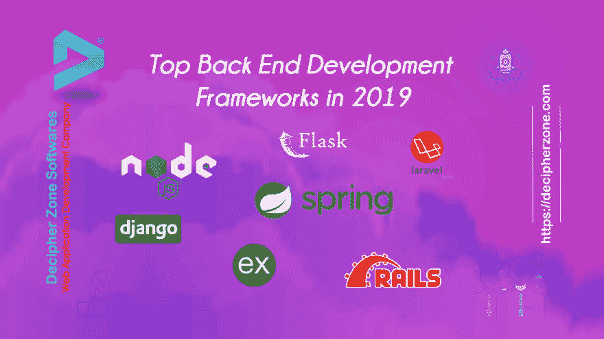

# 2019 年 7 大后端 Web 开发框架

> 原文：<https://dev.to/decipherzonesoft/top-7-backend-web-development-frameworks-in-2019-3a1j>

Web 应用程序开发的顶级后端框架。后端 web 框架包括在 web 应用程序开发条件下的服务器端编程中使用的语言和工具。web 应用程序的有效后端开发的方法是选择正确的堆栈，适应新的数据库和编程语言，并理解服务器工程。

**2019 年顶级后端 Web 开发框架**

**1。Django Framework**
Django 是一个免费的开源后端 web 开发框架，广泛用于 API 和顶级后端 web 应用程序的快速开发。Django 框架支持用更少的代码快速开发后端 web 应用程序。这个 Python web 开发框架的生产力从它被 web 上绝对最繁忙的应用程序利用的方式得到了证明。

**特性:**

高度可定制

解释文档

社区广泛的流行工具

清晰定义的 MVC 组织

**2。Ruby on Rails 框架**
这是最著名的 web 框架之一，使用 Ruby 编程语言编写，在 Linux 上执行。发布于 2004 年的 Ruby on Rails 是一个免费的开源 MVC 后端 web 开发框架。Ruby 一直被认为是最具设计风格的语言中的佼佼者，Rails 框架巩固了 Ruby 语言的能力。这个框架为设计者提供了完成枯燥任务的预设答案。它支撑着超快速开发，并提供了工程师在推进框架中搜索的几乎所有部分。它已被用来制作著名应用程序的后端，例如 GitHub、Airbnb、Shopify 和 Zendesk。

**特性:**

良好的惯例

许多可用的插件

虚拟专用网托管服务

大型社区

**3。Flask Framework**
Flask 是最著名的轻量级 Python web 应用开发微阵列，它不利用工具或库。它是通过整合小工具运行 web 应用程序的最佳 web 框架中的佼佼者。有了基于 Unicode 的帮助和广泛的文档，它减少了软件工程师和任务审查员的任务。

**特性:**

灵活性

最大资源

完整的文档

轻松构建快速原型

**4。Spring Boot 框架**:点击此处阅读全文:[https://www . decipherzone . com/blog-detail/Top-Back-end-Frameworks-for-Web-Application-Development](https://www.decipherzone.com/blog-detail/Top-Back-end-Frameworks-for-Web-Application-Development)