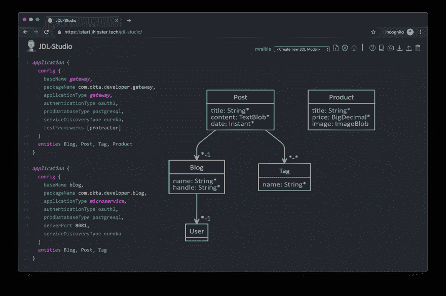
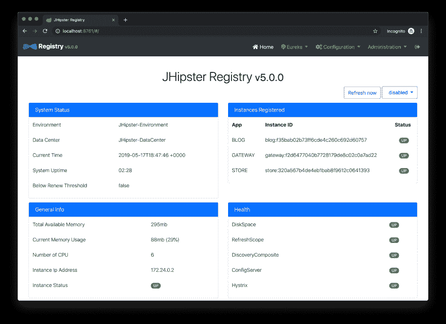
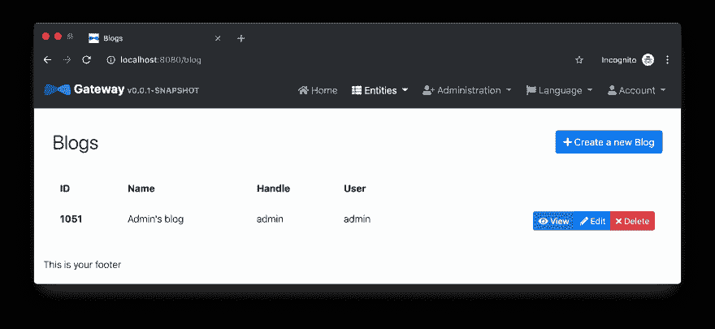
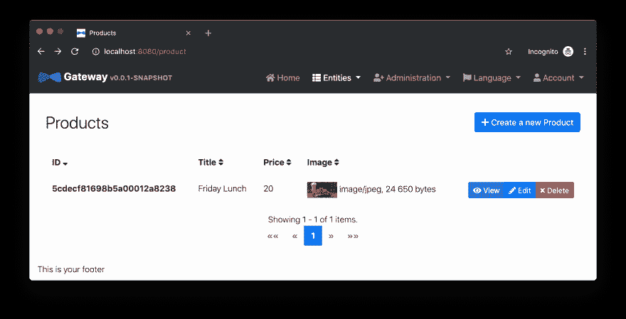
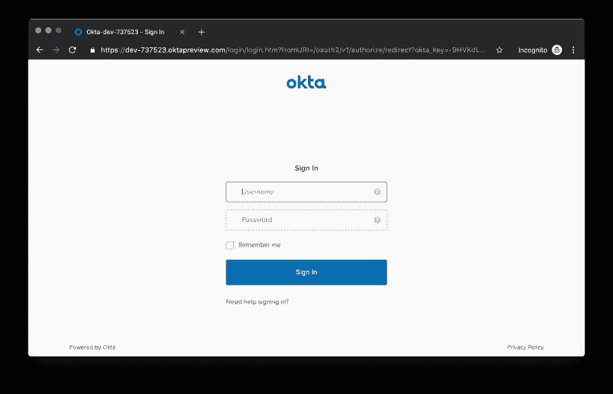
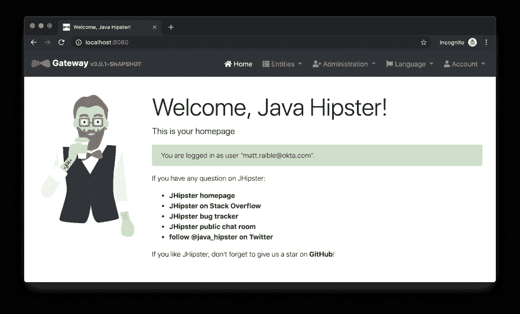

# 带有 Spring Cloud Config 和 JHipster 的 Java 微服务

> 原文：<https://dev.to/oktadev/java-microservices-with-spring-cloud-config-and-jhipster-14ji>

用 Java 和 Spring Boot 开发微服务架构现在非常流行。这绝对是 Java 生态系统中最受欢迎的组合之一。如果您需要任何证据，只需看看过去几年中出现的所有类似框架:MicroProfile、Micronaut 和 Quarkus，仅举几例。

Spring Boot 在 2014 年首次发布时，为 Spring 生态系统带来了急需的活力。它没有让 Java 开发人员配置 Spring beans 的所有方面，而是提供了“启动器”,其中包含带有默认设置的预配置 bean。这导致了更少的 Java 代码，也提供了通过一个`application.properties`文件覆盖缺省值的能力。是的，有很多方法可以修改 Spring Boot 应用程序的默认值，但是我现在就跳过这一步。

在之前关于 Spring Boot 和 Spring Cloud 的 Java 微服务的教程中，我展示了如何使用 OAuth 2.0 和 OpenID Connect 来保护一切。这个例子的一个问题是，您必须在每个应用程序中配置 OIDC 属性。如果您有数百个微服务，这可能是一个真正的痛苦。是的，你可以把它们定义为环境变量，这就解决了问题。然而，如果您有使用不同 OIDC 客户端 id 的不同微服务堆栈，这种方法将会很困难。

## 采用 Spring Cloud 配置的 Java 微服务

[Spring Cloud Config](https://spring.io/projects/spring-cloud-config) 是一个为分布式系统提供外部化配置的项目。Spring Cloud Config 有服务器和客户端组件。您可以将服务器配置为从文件系统或源代码仓库(如 Git)中读取其配置。在客户端，您在引导配置文件中进行配置，以从服务器获取配置数据。在微服务环境中，这提供了一种从中央位置配置*所有*微服务的优雅方式。

今天，我将向您展示这是如何工作的，并使用我曾经使用过的最流行的微服务解决方案之一进行演示。

## 使用 JHipster 生成一个 Java 微服务架构

JHipster 是一个开发平台，用于生成、开发和部署 Spring Boot + { Angular 或 React 或 Vue }应用。此外，它支持创建基于 Spring 的微服务架构。事实上，如果您创建微服务项目并选择 OAuth 2.0 / OIDC 进行身份验证，您将使用与上述示例非常相似的代码。

要使用 JHipster，您需要安装 [Node.js](https://nodejs.org) 。也可以使用 [start.jhipster.tech](https://start.jhipster.tech) ，类似 start.spring.io

安装 JHipster 最常见的方式是使用 npm:

```
npm install -g generator-jhipster@6.0.1 
```

**注意:**您可以不使用版本号运行上面的命令来获取 JHipster 的最新版本。如果是 6.x，这个教程*应该*能用，但我不能保证。

在终端中，创建一个目录来存放您将要创建的所有项目。比如`jhipster`。

在这个目录中创建一个`apps.jh`文件，并将下面的代码放入其中。

```
application  {  config  {  baseName  gateway,  packageName  com.okta.developer.gateway,  applicationType  gateway,  authenticationType  oauth2,  prodDatabaseType  postgresql,  serviceDiscoveryType  eureka,  testFrameworks  [protractor]  }  entities  Blog,  Post,  Tag,  Product  }  application  {  config  {  baseName  blog,  packageName  com.okta.developer.blog,  applicationType  microservice,  authenticationType  oauth2,  prodDatabaseType  postgresql,  serverPort  8081,  serviceDiscoveryType  eureka  }  entities  Blog,  Post,  Tag  }  application  {  config  {  baseName  store,  packageName  com.okta.developer.store,  applicationType  microservice,  authenticationType  oauth2,  databaseType  mongodb,  devDatabaseType  mongodb,  prodDatabaseType  mongodb,  enableHibernateCache  false,  serverPort  8082,  serviceDiscoveryType  eureka  }  entities  Product  }  entity  Blog  {  name  String  required  minlength(3),  handle  String  required  minlength(2)  }  entity  Post  {  title  String  required,  content  TextBlob  required,  date  Instant  required  }  entity  Tag  {  name  String  required  minlength(2)  }  entity  Product  {  title  String  required,  price  BigDecimal  required  min(0),  image  ImageBlob  }  relationship  ManyToOne  {  Blog{user(login)}  to  User,  Post{blog(name)}  to  Blog  }  relationship  ManyToMany  {  Post{tag(name)}  to  Tag{post}  }  paginate  Post,  Tag  with  infinite-scroll  paginate  Product  with  pagination  microservice  Product  with  store  microservice  Blog,  Post,  Tag  with  blog  //  will  be  created  under  'docker-compose'  folder  deployment  {  deploymentType  docker-compose  appsFolders  [gateway,  blog,  store]  dockerRepositoryName  "jmicro"  consoleOptions  [zipkin]  } 
```

**提示:**如果你想发布你的容器，你需要更改上面 JDL 中的`dockerRepositoryName`来使用你的 [Docker Hub](https://hub.docker.com/) 用户名。这不是完成本教程的必要步骤。

这段代码是 JDL (JHipster 领域语言)，你可以用它来定义你的应用，它的实体，甚至部署设置。你可以在捷普斯特的 JDL 文档中了解更多关于 JDL 的信息。下面是 JDL 工作室的截图，可以用来编辑 JDL，并查看实体如何相互关联。

[](https://res.cloudinary.com/practicaldev/image/fetch/s--bdO6UI6E--/c_limit%2Cf_auto%2Cfl_progressive%2Cq_auto%2Cw_880/https://developer.okta.com/assets-jekyll/blog/java-microservices-cloud-config/jdl-studio-4d7625e0d93d9c3a93979c3bf35ff46532e154401adfec2eec19b2d31f7e8930.png)

您刚刚放入`apps.jh`的 JDL 定义了三种应用:

*   **gateway** :微服务的单一入口点，包括 UI 组件。

*   **blog** :与 PostgreSQL 对话的博客服务。

*   **store** :使用 MongoDB 的商店服务。

运行以下命令在您的`jhipster`文件夹中创建这些项目。

```
jhipster import-jdl apps.jh 
```

这将并行创建所有三个项目。

### 为微服务应用创建 Docker 映像

为 Docker Compose 生成配置时，会向控制台发出警告。

```
WARNING! Docker Compose configuration generated, but no Jib cache found
If you forgot to generate the Docker image for this application, please run:
To generate the missing Docker image(s), please run:
  ./mvnw -Pprod verify jib:dockerBuild in /Users/mraible/java-microservices-examples/jhipster/gateway
  ./mvnw -Pprod verify jib:dockerBuild in /Users/mraible/java-microservices-examples/jhipster/blog
  ./mvnw -Pprod verify jib:dockerBuild in /Users/mraible/java-microservices-examples/jhipster/store 
```

为了更容易地用一个命令创建 Docker 映像，在`jhipster`根目录中创建一个聚合器`pom.xml`。

```
<?xml version="1.0" encoding="UTF-8"?>
<project xmlns="http://maven.apache.org/POM/4.0.0" xmlns:xsi="http://www.w3.org/2001/XMLSchema-instance"
    xsi:schemaLocation="http://maven.apache.org/POM/4.0.0 http://maven.apache.org/xsd/maven-4.0.0.xsd">
    <modelVersion>4.0.0</modelVersion>
    <groupId>com.okta.developer</groupId>
    <artifactId>jhipster-parent</artifactId>
    <version>1.0.0-SNAPSHOT</version>
    <packaging>pom</packaging>
    <name>jhipster-parent</name>
    <modules>
        <module>gateway</module>
        <module>blog</module>
        <module>store</module>
    </modules>
</project> 
```

然后使用[起重臂](https://github.com/GoogleContainerTools/jib)进行“起重”。

```
mvn -Pprod verify com.google.cloud.tools:jib-maven-plugin:dockerBuild 
```

**提示:**如果你没有安装 Maven，在 Mac 上使用`brew install maven`，或者查看 [Maven 的安装文档](https://maven.apache.org/install.html)。

```
[INFO] Skipping containerization because packaging is 'pom'...
[INFO] ------------------------------------------------------------------------
[INFO] Reactor Summary:
[INFO]
[INFO] Gateway 0.0.1-SNAPSHOT ............................. SUCCESS [02:44 min]
[INFO] Blog 0.0.1-SNAPSHOT ................................ SUCCESS [ 34.391 s]
[INFO] Store 0.0.1-SNAPSHOT ............................... SUCCESS [ 28.589 s]
[INFO] jhipster-parent 1.0.0-SNAPSHOT ..................... SUCCESS [  1.096 s]
[INFO] ------------------------------------------------------------------------
[INFO] BUILD SUCCESS
[INFO] ------------------------------------------------------------------------
[INFO] Total time: 03:49 min
[INFO] Finished at: 2019-05-17T07:44:39-06:00
[INFO] ------------------------------------------------------------------------
Execution time: 3 min. 50 s. 
```

### 使用 Docker Compose 运行您的 Java 微服务堆栈

一旦所有东西都构建完成，cd 进入`docker-compose`目录并启动所有的容器。

```
cd docker-compose
docker-compose up -d 
```

**提示:**如果你想查看当前终端窗口中的所有日志，请移除`-d`。

启动所有八个容器需要几分钟时间。如果你愿意，你可以使用 [Kitematic](https://kitematic.com/) 来监控它们的启动进度。

```
Creating docker-compose_gateway-app_1 ... done Creating docker-compose_gateway-postgresql_1 ... done Creating docker-compose_blog-app_1 ... done Creating docker-compose_store-mongodb_1 ... done Creating docker-compose_keycloak_1 ... done Creating docker-compose_blog-postgresql_1 ... done Creating docker-compose_jhipster-registry_1 ... done Creating docker-compose_store-app_1 ... done 
```

### JHipster Registry 通过 Java 微服务进行服务发现

这个微服务堆栈使用 Eureka 进行服务发现，就像基本的 Spring Boot + Spring Cloud 示例一样。这是由 JDL 中每个应用程序的下列行决定的。

```
serviceDiscoveryType  eureka 
```

当您选择`eureka`进行服务发现时，将使用 [JHipster Registry](https://github.com/jhipster/jhipster-registry) 。这个应用程序非常类似于 Eureka Server，除了它有一个棱角分明的用户界面，并包括 [Spring Cloud Config](https://spring.io/projects/spring-cloud-config) ，以及其他功能。

提示: JHipster 还[支持 hashi corp consult](https://www.jhipster.tech/consul/)进行服务发现。

因为您选择了 OAuth 2.0/OIDC 进行身份验证，所以您需要在您的`hosts`文件中为 Keycloak 创建一个条目(在 Linux/Mac 上为`/etc/hosts`，在 Windows 上为`C:\Windows\System32\Drivers\etc\hosts`)。

```
127.0.0.1 keycloak 
```

这是因为 Docker 网络将`keycloak`识别为注册的主机名，但它也会将您重定向到`keycloak`。如果没有`hosts`条目，您的浏览器将无法识别该主机名。

打开浏览器并导航至`http://localhost:8761`。您将被重定向到 Keycloak 进行登录。输入`admin/admin`作为凭证，您将被重定向回 JHipster 注册表。您将看到您的所有微服务实例都已注册。

[](https://res.cloudinary.com/practicaldev/image/fetch/s--LbL0SAlY--/c_limit%2Cf_auto%2Cfl_progressive%2Cq_auto%2Cw_880/https://developer.okta.com/assets-jekyll/blog/java-microservices-cloud-config/jhipster-registry-13cb0c23380b9e75a090bcab96c69709c0bd160cb4d8599549b58d8f44583a90.png)

导航到`http://localhost:8080`，点击**登录**，即可登录网关。可以去**实体** > **博客**添加博客。

[](https://res.cloudinary.com/practicaldev/image/fetch/s--OyBj2ROX--/c_limit%2Cf_auto%2Cfl_progressive%2Cq_auto%2Cw_880/https://developer.okta.com/assets-jekyll/blog/java-microservices-cloud-config/blog-list-3d1a8aa059b899664d7a397f766aef3e3e2d810c5ccb2c5910d819a3a117ade6.png)

进入**实体** > **产品**，你也可以添加一个产品。

[](https://res.cloudinary.com/practicaldev/image/fetch/s--d4b4ZRzp--/c_limit%2Cf_auto%2Cfl_progressive%2Cq_auto%2Cw_880/https://developer.okta.com/assets-jekyll/blog/java-microservices-cloud-config/product-list-de7b9ab33e34b94d5ca5c9f97c3805e0563b4af1d41f2cbf33923ff0c08625e2.png)

很巧妙，你不觉得吗？！🤓

## 配置 JHipster 微服务使用 Okta 进行身份认证

你在裸机 Spring Boot + Spring 云设置中看到的一个问题是，你必须在每个微服务中配置`okta.oauth2.*`属性。JHipster 不使用 Okta Spring Boot 起动机。它使用`oauth2-client`和`oauth2-resource-server` Spring Boot 首发代替。OAuth 2.0 的配置包含在每个应用程序的`src/main/resources/config/application.yml`文件中。

```
spring:
  ...
  security:
    oauth2:
      client:
        provider:
          oidc:
            issuer-uri: http://localhost:9080/auth/realms/jhipster
        registration:
          oidc:
            client-id: internal
            client-secret: internal 
```

### 为什么是 Okta？

你可能想知道为什么你应该使用 [Okta](https://developer.okta.com/) 而不是 Keycloak？Keycloak 非常适合开发和测试，尤其是在没有 wi-fi 的飞机上。然而，在生产中，你想要一个**总是在**上的系统。这就是 Okta 的用武之地。首先，您需要创建一个 Okta 帐户和一个应用程序。

### 在 Okta 中创建一个 Web 应用

登录你的 Okta 开发者账号(或者[注册](https://developer.okta.com/signup/)如果你没有账号的话)。

1.  从**应用**页面，选择**添加应用**。

2.  在创建新应用程序页面上，选择 **Web** 。

3.  给你的 app 起个好记的名字，添加`http://localhost:8080/login/oauth2/code/okta`作为登录重定向 URI，选择**刷新令牌**(除了**授权码**，点击**完成**。

4.  要在 JHipster 中配置注销功能，**编辑**你的应用，添加`http://localhost:8080`作为注销重定向 URI，然后点击**保存**。

## 使用 Spring Cloud Config 配置您的 OpenID Connect 设置

您可以使用 JHipster Registry 中的 Spring Cloud Config，而不是为 Okta 修改您的每个应用程序。打开`docker-compose/central-server-config/application.yml`，添加你的 Okta 设置。

客户端 ID 和密码可在您的应用程序设置页面上找到。您可以在 **API** > **授权服务器**下找到发行人。

```
spring:
  security:
    oauth2:
      client:
        provider:
          oidc:
            issuer-uri: https://{yourOktaDomain}/oauth2/default
        registration:
          oidc:
            client-id: {yourClientId}
            client-secret: {yourClientSecret} 
```

注册表、网关、博客和商店应用程序都被配置为在启动时读取该配置。

重新启动所有容器以使该配置生效。

```
docker-compose restart 
```

在您可以登录之前，您需要为 JHipster 注册表添加重定向 URIs，确保您的用户在一个`ROLE_ADMIN`组中，并且该组包含在 ID 令牌中。

登录您的 Okta 仪表板，编辑您的 OIDC 应用程序，并添加以下登录重定向 URI:

*   `http://localhost:8761/login/oauth2/code/oidc`

您还需要添加一个注销重定向 URI:

*   `http://localhost:8761`

然后，点击**保存**。

### 创建组并将它们作为声明添加到 ID 令牌中

JHipster 默认配置为与两种类型的用户一起工作:管理员和用户。Keycloak 会自动配置用户和组，但是您需要为您的 Okta 组织进行一些一次性配置。

创建一个`ROLE_ADMIN`组(**用户** > **组** > **添加组**)并将您的用户添加到其中。导航到 **API** > **授权服务器**，点击`default`服务器。点击**索赔**标签和**添加索赔**。将其命名为`groups`，并包含在 ID 令牌中。将值类型设置为`Groups`，并将过滤器设置为`.*`的正则表达式。点击**创建**。

[](https://res.cloudinary.com/practicaldev/image/fetch/s--85G8f9Ss--/c_limit%2Cf_auto%2Cfl_progressive%2Cq_auto%2Cw_880/https://developer.okta.com/assets-jekyll/blog/java-12-jhipster-6/add-claim-915f54ead19da14f9117ac982daa317f6782c0f8d9fe9fcb5de68f7beb2d6f90.png)

现在当你点击`http://localhost:8761`或者`http://localhost:8080`的时候，会提示你用 Okta 登录！

[](https://res.cloudinary.com/practicaldev/image/fetch/s--23Ith81h--/c_limit%2Cf_auto%2Cfl_progressive%2Cq_auto%2Cw_880/https://developer.okta.com/assets-jekyll/blog/java-microservices-cloud-config/jhipster-okta-login-213ac1b9cf9fa24503ccf3925fa7dd5fe6b91e304e0cfa57a83c571f6f90add3.png)

[](https://res.cloudinary.com/practicaldev/image/fetch/s--aUsdKiwk--/c_limit%2Cf_auto%2Cfl_progressive%2Cq_auto%2Cw_880/https://developer.okta.com/assets-jekyll/blog/java-microservices-cloud-config/jhipster-okta-success-1ef0c4a5c0b388c24f7b3bfed177ac174d0148a7b73162d1959bf02dd92481e7.png)

使用 Spring Cloud Config，你可以在一个地方配置你的服务注册表和所有的微服务，这是一件非常漂亮的事情，你不觉得吗？！👌

## 用 Git 配置 Spring Cloud 配置

JHipster Registry 及其 Spring Cloud Config server 支持两种配置源:`native`和`git`。使用哪一个是由一个`spring.cloud.config.server.composite`属性决定的。如果你查看`docker-compose/jhipster-registry.yml`，你会看到`native`被使能而`git`被注释掉。

```
- SPRING_CLOUD_CONFIG_SERVER_COMPOSITE_0_TYPE=native
- SPRING_CLOUD_CONFIG_SERVER_COMPOSITE_0_SEARCH_LOCATIONS=file:./central-config
# - SPRING_CLOUD_CONFIG_SERVER_COMPOSITE_0_TYPE=git
# - SPRING_CLOUD_CONFIG_SERVER_COMPOSITE_0_URI=https://github.com/jhipster/jhipster-registry/
# - SPRING_CLOUD_CONFIG_SERVER_COMPOSITE_0_SEARCH_PATHS=central-config
# For Keycloak to work, you need to add '127.0.0.1 keycloak' to your hosts file 
```

你可以在[@ jhi pster/jhi pster-registry/central-config/application . yml](https://github.com/jhipster/jhipster-registry/blob/master/central-config/application.yml)看到 Git 的默认配置。你可以在 [JHipster Registry 的文档](https://www.jhipster.tech/jhipster-registry/#-application-configuration-with-spring-cloud-config)中了解更多关于 Spring Cloud Config 的应用配置。它包括一个关于加密配置值的部分。

## kot Lin 微服务怎么样？

在本系列的第一篇文章中，我告诉过你我为什么用 Java 写这篇文章:

> “我用 Java 写了这篇文章，因为它是 Java 生态系统中最流行的语言。然而，根据 red monk 2019 年 1 月的编程语言排名， [Kotlin 正在上升](https://redmonk.com/sogrady/2019/03/20/language-rankings-1-19/)

Spring 对 Kotlin 有极好的支持，你可以在 start.spring.io 上选择它作为一种语言，JHipster 也有对 Kotlin 的支持，它的 [Kotlin 蓝图](https://github.com/jhipster/jhipster-kotlin)！上周发布了一个新版本[，允许你用`khipster`创建基于 Kotlin 的 JHipster 应用。](https://twitter.com/sendilkumarn/status/1129404782035312641)

如果你想看到我们用 Kotlin 写更多的帖子，请在评论中告诉我们！

## 了解更多关于 Spring Cloud Config、Java 微服务和 JHipster 的信息

我希望您喜欢学习如何用 JHipster 构建 Java 微服务架构，并用 Spring Cloud Config 配置它们。您了解了如何从单个 JDL 文件生成所有内容，将您的应用程序打包到 Docker 容器中，使用 Docker Compose 运行它们，以及使用 Keycloak 和 Okta 向 OIDC 认证。

你可以在 GitHub 的`jhipster`目录下找到本教程[中显示的所有代码。](https://github.com/oktadeveloper/java-microservices-examples)

在这个博客上，我们是 Spring Boot、春云和杰普斯特的忠实粉丝。以下是一些你可能会感兴趣的帖子:

*   [Java 微服务与 Spring Boot 和春云](https://developer.okta.com/blog/2019/05/21/java-microservices-spring-boot-spring-cloud)

*   [与 Spring Boot 和 Kubernetes 一起构建微服务架构](https://developer.okta.com/blog/2019/04/01/spring-boot-microservices-with-kubernetes)

*   [构建 Spring 微服务并将其用于生产](https://developer.okta.com/blog/2019/02/28/spring-microservices-docker)

*   [更好、更快、更轻便的 Java 与 Java 12 和 JHipster 6](https://developer.okta.com/blog/2019/04/04/java-11-java-12-jhipster-oidc)

请在 Twitter @oktadev 上关注我们[并订阅](https://twitter.com/oktadev)[我们的 YouTube 频道](https://www.youtube.com/c/oktadev)获取更多春季和春季安全提示。