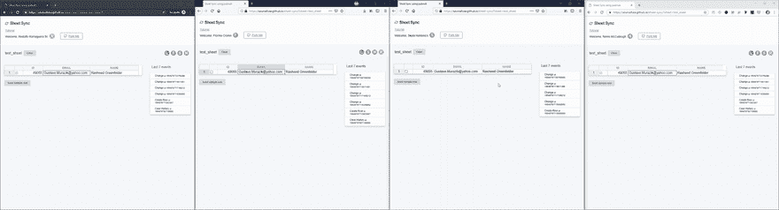

# 如何建立一个实时协作电子表格应用程序(即？谷歌工作表的克隆版)

> 原文：<https://dev.to/pubnub/how-to-build-a-realtime-collaborative-spreadsheets-app-ie-a-google-sheets-clone-2dp>

在过去的十年里，办公套件已经从笨重、笨重、占用系统宝贵空间的桌面软件转变为按需、轻量级的[协作应用](https://www.pubnub.com/solutions/collaboration/)。这开启了一个实时协作的新世界，使多个用户能够在网络浏览器中从地球上的任何地方一起工作。

这就是我们今天在本教程中要构建的内容。我们将特别关注协作电子表格，但是这些概念和设计模式可以应用于任何类型的能够增量更新的协作文档——文本文档、电子表格等。

*   完整的 GitHub repo 可从这里获得
*   点击查看[实时协作电子表格演示应用。在几个 web 浏览器中打开它，看看实时同步的效果！](https://sourcefuse.github.io/sheet-sync/?sheet=blogpostversion)

[](https://res.cloudinary.com/practicaldev/image/fetch/s--KJsEnNbg--/c_limit%2Cf_auto%2Cfl_progressive%2Cq_66%2Cw_880/https://i.imgur.com/HHoRB2m.gif)

在我们开始之前，让我们设定我们的目标。

1.  你不是一个人:显示谁在线并且正在处理同一个电子表格。
2.  你在做什么？:突出显示他们正在处理的单元格。
3.  你看到了吗？:监视更改并在各种电子表格编辑会话中同步它们。
4.  你做到了！:存储和维护关于谁做了什么的审计跟踪，并使用它获得最新的新协作者。

## 技术堆栈

### 主栈

1.  PubNub :实时 API 和基础设施，用于与其他合作者交流我们的变更和同步。
2.  [可手持](https://handsontable.com/):我们的电子表格模块选择。

### 为了补习

1.  [package](https://parceljs.org/):零配置网络捆扎机，用于快速原型制作。
2.  [Faker](https://github.com/marak/Faker.js/) :生成假数据(在这种情况下，样本信息填充单元格。

## 开发工具链

开始有三个步骤。

初始化您的`package.json:`

```
$ mkdir sync-sheet
$ cd sync-sheet
$ npm init -y 
```

安装工具链依赖项:

```
$ npm i -D parcel-bundler 
```

注意:从现在开始，我们不需要手动安装任何依赖项。当我们运行它时，packages 会处理它，但是我会注意到包和步骤。

做一个最小的`babel`和`browserlist`设置来确保我们在浏览器中获得一致性。

我们希望支持浏览器的后两个版本。将`browserlist`添加到`package.json.`

```
"browserslist": [
  "last 2 version"
] 
```

添加一个`.babelrc`到你的根目录:

```
 {
  "presets": [
    [
      "@babel/preset-env",
      {
        "useBuiltIns": "entry"
      }
] ],
  "plugins": [
    "@babel/plugin-transform-runtime"
] } 
```

*开发依赖预警:* `@babel/core`和`@babel/plugin-transform-runtime`。

## 进入点

我们需要一个可以传递给包裹的入口点。让我们创建源文件夹:

```
$ mkdir src 
```

将我们的索引文件添加到源文件夹:

```
$ touch src/index.html 
```

#### 文件 Src/Index。超文本标记语言

```
<!DOCTYPE html>
<html lang="en">
  <head>
    <meta charset="UTF-8" />
    <meta name="viewport" content="width=device-width, initial-scale=1.0" />
    <meta http-equiv="X-UA-Compatible" content="ie=edge" />
    Sheet Sync using pubnub
</head>
<body>
    <!-- our spreadsheet goes here -->
    <script src="./main.js"></script>
  </body>
</html> 
```

有一个链接到`main.js`的`script`标签，所以让我们也创建它。

```
$ touch src/main.js 
```

奉上您的`index.html`开始开发:

```
$ npx parcel src/index.html 
```

## 教程

### PubNub 附加组件

要使用 PubNub，你需要首先[注册一个 PubNub 账户。](https://dashboard.pubnub.com/signup)别担心，我们为您的所有原型开发和开发提供了慷慨的免费层。

注册后，在 [PubNub Admin Dashboard 中启用以下加载项:](https://admin.pubnub.com/)

1.  出席
2.  存储和回放

### 查看

我们的视图将包含以下部分:

1.  电子表格
2.  在线用户
3.  清除电子表格的按钮
4.  一个用假数据行植入工作表的按钮。

身体会是这个样子:

```
<body>
    <div id="online-users"></div>
    <button id="clear-data"> Clear </button>
    <div id="sheet"></div>
    <button id="seed-data"> Seed sample row </button>
    <script src="./main.js"></script>
</body> 
```

### 电子表格

接下来，让我们初始化`handsontable`并得到一个电子表格。

```
$ touch src/spreadsheet.js 
```

#### 文件 Src/电子表格。射流研究…

```
import Handsontable from 'handsontable';
import 'handsontable/dist/handsontable.full.min.css';
const hotSettings = {
  columns: [
    {
      data: 'available',
      type: 'checkbox',
}, {
data: 'id',
      type: 'numeric',
    },
    {
      data: 'email',
      type: 'text',
}, {
      data: 'fullName',
      type: 'text',
    },
  ],
  stretchH: 'all',
  autoWrapRow: true,
  rowHeaders: true,
  colHeaders: [
    '',
    'Id',
    'Email',
    'Name',
],
  columnSorting: {
    indicator: true,
  },
  autoColumnSize: {
    samplingRatio: 23,
  },
  contextMenu: true,
  licenseKey: 'non-commercial-and-evaluation',
  customBorders: true,
  colWidths: ['7%', '16%', '38%', '39%'],
  className: 'sheet',
};
export default (data, elementId) => new Handsontable(
  document.querySelector(elementId), {
  data,
  ... hotSettings
}); 
```

*依赖预警:* `handsontable`

将`src/spreadsheet.js`导入到我们的`src/main.js`中。如果你有一个存储电子表格的服务器，你应该在这里获取它并填充`sheetData`。

```
import Sheet from '~/spreadsheet'
const sheetData = [];
const sheet = Sheet('sheet', sheetData); 
```

现在，我们在按钮上添加一个监听器来播种一个样本行:

```
import faker from 'faker';
document.getElementById('seed-data').addEventListener('click', () => {
  sheet.populateFromArray(data.length, 0, [[
    faker.random.boolean(),
    faker.random.number(),
    faker.internet.email(),
    faker.name.findName(),
]]); }); 
```

*依赖性警报:* faker

### 用户会话

由于用户的会话通常在选项卡上持续，为了在选项卡间同步更改，我们需要另一种类型的会话。让我们称之为编辑会议。

您可能有自己的认证逻辑，但是对于本教程，让我们保持简单，模拟一个用户会话。

```
$ touch src/user.js 
```

#### 文件 src/user.js

```
import faker from 'faker';
const userFromLocalStorage = window.localStorage.user &&
JSON.parse(window.localStorage.user);
const user = userFromLocalStorage || {
  id: faker.random.uuid(),
  color: faker.internet.color(160, 160, 160),
  name: faker.name.findName(),
};
// editing session
user.sessionUUID = faker.random.uuid();
window.localStorage.user = JSON.stringify(user);
export default user; 
```

*依赖性警报:* faker

我们的用户会话就是这样处理的，但是正如你所看到的，我们没有从 localStorage 获取编辑会话，因为我们需要它对每个标签都是唯一的。

### PubNub 连接器

使用编辑会话，让我们初始化 PubNub 实例。

```
$ mkdir src/connectors
$ touch src/connectors/pubnub.js 
```

#### 文件 Src/Pubnub。射流研究…

```
import PubNub from 'pubnub';
import user from '../user';
const pubnub = new PubNub({
  publishKey: process.env.PUBNUB_PUBLISH_KEY,
  subscribeKey: process.env.PUBNUB_SUBSCRIBE_KEY,
  uuid: user.sessionUUID,
});
export default pubnub; 
```

*依赖预警:*发布

### 挂钩

我们需要两种钩子:

*   记录对电子表格的更改。
*   在电子表格上重放输入的更改。

#### 文件 Src/Hooks。射流研究…

```
const hooks = {
  record: {},
  replay: {},
}; 
```

### 记录挂钩

我们将利用`handsontable`提供的以下挂钩

1.  [AfterChange](https://handsontable.com/docs/7.0.0/Hooks.html#event:afterChange) 在任何单元格发生变化后触发。
2.  [AfterCreateRow](https://handsontable.com/docs/7.0.0/Hooks.html#event:afterCreateRow) 在添加一行后触发。
3.  [AfterRemoveRow](https://handsontable.com/docs/7.0.0/Hooks.html#event:afterRemoveRow) 在删除一行后触发。
4.  [AfterColumnSort](https://handsontable.com/docs/7.0.0/Hooks.html#event:afterColumnSort) 排序后触发。

触发器为我们提供一个增量，然后发布到 PubNub。

这些也会在我们重放传入的更改后被触发，所以我们需要一种方法来确保我们不会陷入无限循环。幸运的是，对于前三个触发器，我们可以查看更改的来源，以避免将其再次发布到 PubNub。对于列排序，我们需要一个替代的解决方案。

记录挂钩需要 PubNub 对象和表的名称，这将是我们的通道名称，来将增量发布到`PubNub`，因此我们的记录函数将接受`PubNub`和`sheetName`作为参数，并返回对`handsontable`的挂钩回调。

### 变化

```
hooks.record.afterChange = (pubnub, sheetName) => function recordAfterChange(
  changes,
  source,
){
if (source === 'sync' || !changes) {
return; }
  // Publish all deltas to pubnub in sequence.
  changes.reduce(async (prev, [row, prop, oldValue, newValue]) => {
    await prev;
    return pubnub.publish({
message: {
        operation: 'afterChange',
        delta: {
          row, prop, oldValue, newValue,
        },
},
      channel: sheetName,
    });
}, true); }; 
```

### 创建行

```
hooks.record.afterCreateRow = (pubnub, sheetName) => function afterCreateRow(
  index,
amount,
source, ){
  if (source === 'sync') {
    return;
}
  pubnub.publish({
    message: { operation: 'afterCreateRow', delta: { index, amount } },
    channel: sheetName,
}); }; 
```

### 删除行

```
hooks.record.afterRemoveRow = (pubnub, sheetName) => function afterRemoveRow(
  index,
amount,
source, ){
  if (source === 'sync' || source === 'ObserveChanges.change') {
    return;
  }
  pubnub.publish({
    message: { operation: 'afterRemoveRow', delta: { index, amount } },
    channel: sheetName,
  });
}; 
```

### 列排序

与前面的钩子不同，sort 不提供`source`。取而代之的是，我们将维护一个变量`lastSortFromSync`,用来存储同步到 PubNub 的最后一个排序配置。如果当前排序配置没有变化，我们跳过发布另一个增量到 PubNub。

```
let lastSortFromSync;
hooks.record.afterColumnSort = (pubnub, sheetName) => function afterColumnSort(
  [currentSortConfig],
  [destinationSortConfig],
){
if (lastSortFromSync === destinationSortConfig) {
return; }
  if (
    lastSortFromSync && destinationSortConfig
    && lastSortFromSync.column === destinationSortConfig.column
    && lastSortFromSync.sortOrder === destinationSortConfig.sortOrder
){ return;
}
  pubnub.publish({
    message: {
      operation: 'afterColumnSort',
      delta: { currentSortConfig, destinationSortConfig },
    },
    channel: sheetName,
  });
}; 
```

您可能想知道，如果我需要将这些同步到我的服务器上呢？有两种方法可以解决这个问题:

1.  使用 delta 对您的服务器进行 API 调用，然后将其发布到 PubNub。
2.  *推荐:*发布到 PubNub 然后使用 [PubNub 函数](https://www.pubnub.com/products/functions/)对服务器进行 API 调用。

### 重放钩子

别人录的东西都要重播。所以我们有了通常的嫌疑人:

1.  将使用 [setDataAtCell](https://handsontable.com/docs/7.0.0/Core.html#setDataAtCell) 重播`afterChange`
2.  `afterCreateRow`将使用[变更](https://handsontable.com/docs/7.0.0/Core.html#alter)进行重播
3.  `afterRemoveRow`也将使用 [alter](https://handsontable.com/docs/7.0.0/Core.html#alter) 重播
4.  将使用 [clearSort](https://handsontable.com/docs/7.0.0/ColumnSorting.html#clearSort) 重新设置之前的排序，使用 [sort](https://handsontable.com/docs/7.0.0/ColumnSorting.html#clearSort) 设置顺序，从而重新播放`afterColumnSort`。

这些钩子将被我们的 PubNub 监听器使用，我们将在教程中进一步讨论它。

### 变化

```
hooks.replay.afterChange = function replayAfterChange(hot, {
  row, prop, newValue,
}) {
  hot.setDataAtCell(row, hot.propToCol(prop), newValue, 'sync');
}; 
```

### 创建行

```
hooks.replay.afterCreateRow = function replayAfterCreateRow(hot, {
  index, amount,
}) {
  hot.alter('insert_row', index, amount, 'sync');
}; 
```

### 删除行

```
hooks.replay.afterRemoveRow = function replayAfterRemoveRow(hot, {
  index, amount,
}) {
  hot.alter('remove_row', index, amount, 'sync');
}; 
```

### 列排序

```
hooks.replay.afterColumnSort = function replayAfterColumnSort(hot, {
  destinationSortConfig,
}) {
  if (!destinationSortConfig) {
    hot.getPlugin('columnSorting').clearSort();
return; }
  hot.getPlugin('columnSorting').sort(destinationSortConfig);
};
export default hooks; 
```

### 状态挂钩

我们将跟踪用户活动，换句话说，用户正在哪个单元格上工作，或者用户正在高亮显示哪个单元格。这不应该是电子表格的历史或审计跟踪的一部分，所以我们将它设置为 PubNub 的状态。

为选择和取消选择后添加挂钩。

让我们把这些加到`src/main.js` :

```
hot.addHook('afterSelectionEnd', (row, col, row2, col2) => {
  pubnub.setState(
{
state: {
        selection: {
          row, col, row2, col2,
},
user, },
      channels: [sheetName],
    },
); });
hot.addHook('afterDeselect', () => {
  pubnub.setState(
{
state: {
        selection: null,
user, },
      channels: [sheetName],
    },
); }); 
```

我们将使用 [setBorders](https://handsontable.com/docs/7.0.0/CustomBorders.html#setBorders) 来显示其他人正在处理的单元格。

```
const customBordersPlugin = hot.getPlugin('customBorders');
function setBorders({
  row, col, row2, col2,
}, color) {
  customBordersPlugin.setBorders([[row, col, row, col2]], {
    top: { width: 2, color },
  });
  customBordersPlugin.setBorders([[row2, col, row2, col2]], {
    bottom: { width: 2, color },
});
  customBordersPlugin.setBorders([[row, col, row2, col]], {
    left: { width: 2, color },
});
  customBordersPlugin.setBorders([[row, col2, row2, col2]], {
    right: { width: 2, color },
}); } 
```

### 在场和状态

下面的函数从 PubNub 获取在线状态。Presence 检索当前打开电子表格的所有单个用户及其状态。然后，我们将通过调用`setBorders`使用用户的存在来填充`#online-users`并使用用户的状态来突出显示单元格。

```
 function fetchPresense() {
  pubnub.hereNow(
    {
      channels: [sheetName],
      includeUUIDs: true,
      includeState: true,
    },
    (status, { channels: { test_sheet: { occupants } } }) => {
      customBordersPlugin.clearBorders();
      const sessions = new Set();
      const html = occupants.reduce((acc, { state = {} }) => {
        if (!state.user || (state.user.uuid === user.uuid) ||
sessions.has(state.user.uuid)) {
return acc; }
        sessions.add(state.user.uuid);
        if (state.selection) {
          setBorders(state.selection, state.user.color);
}
        return `${acc} <span> ${state.user.name} is online </span> <br/>`;
}, '');
      document.getElementById('online-users').innerHTML = html;
    },
); } 
```

### 复位表

清空表格包括两个步骤:

1.  重置我们的数据集。
2.  通知其他人。

```
document.getElementById('clear-data').addEventListener('click', () => {
  data.length = 0;
  pubnub.deleteMessages({
    channel: sheetName,
  }, renderHistory);
  pubnub.publish({
    channel: sheetName,
    message: { operation: 'afterClearHistory' },
  });
}); 
```

### PubNub 监听器

要添加两个侦听器。

有人会听到这个消息。如果收到的操作是`afterClearHistory`，我们清除数据。否则，我们调用相应的重放钩子。

第二个是 presence，我们将调用前面描述的`fetchPresense`函数。

```
pubnub.addListener({
  message({ publisher, message: { operation, delta }, timetoken }) {
    if (publisher !== pubnub.getUUID()) {
      if (operation === 'afterClearHistory') {
        data.length = 0;
        hot.render();
      } else {
        hooks.replay[operation](hot, delta);
      }
} },
  presence({ uuid }) {
    if (uuid === pubnub.getUUID()) {
return; }
    fetchPresense();
  },
}); 
```

### 审计线索回放

因为我们将自己限制在 web 浏览器中，所以我们需要一种方法来让新的协作者使用电子表格的最新状态。

PubNub 的频道历史将作为我们电子表格的审计日志。然后，我们可以重放这些日志，向用户提供最新的状态。

#### Src/Main。射流研究…

```
pubnub.history({
  channel: [sheetName],
}, (status, { messages }) => {
  messages.forEach((message) => {
    hooks.replay[message.entry.operation](hot, message.entry.delta);
  });
}); 
```

### 订阅和初始化挂钩

我们想等到我们重放了历史。在我们重放完日志之后，我们订阅频道来获取新消息。此外，我们将设置用户的初始状态。最后，我们初始化所有的记录挂钩。

我们会将这些添加到历史的回调中。

#### 追加到 Src/Main。射流研究…

```
pubnub.history({
  channel: [sheetName],
}, (status, { messages }) => {
  messages.forEach((message) => {
    hooks.replay[message.entry.operation](hot, message.entry.delta);
  });
  pubnub.subscribe({
    channels: [sheetName],
    withPresence: true,
});
  pubnub.setState(
    {
      state: {
        selection: null,
        user,
},
      channels: [sheetName],
    },
);
  Object.keys(hooks.record).forEach((hook) => {
    hot.addHook(hook, hooks.record[hook](pubnub, sheetName));
});
  fetchPresense();
}); 
```

## 结果

就是这样！我们都准备好了，现在让我们开始吧。

```
$ npx parcel src/index.html 
```

在浏览器中打开 [http://localhost:1234](http://localhost:1234/) 。在另一个标签中再次打开它。然后打开一个隐姓埋名的浏览器，再来一遍。再来一个浏览器怎么样？尽可能多做。现在，在其中任何一个中进行更改，并看到它在您的选项卡、窗口和浏览器中传播。

或者点击查看[实时协作电子表格演示应用。在几个 web 浏览器中打开它，看看实时同步的效果！](https://sourcefuse.github.io/sheet-sync/?sheet=blogpostversion)

再次提醒您，完整的 GitHub repo 可以在这里找到。