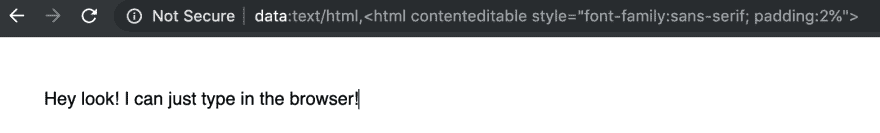
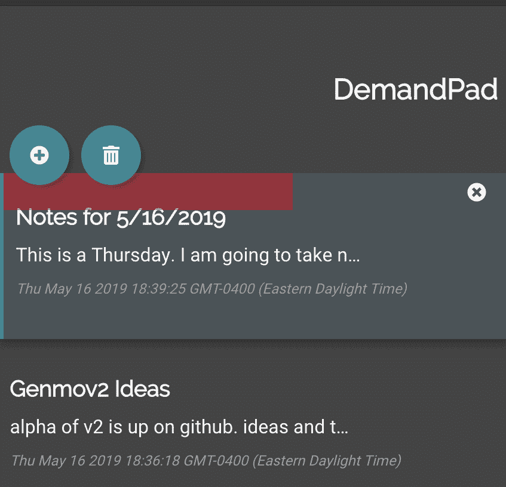
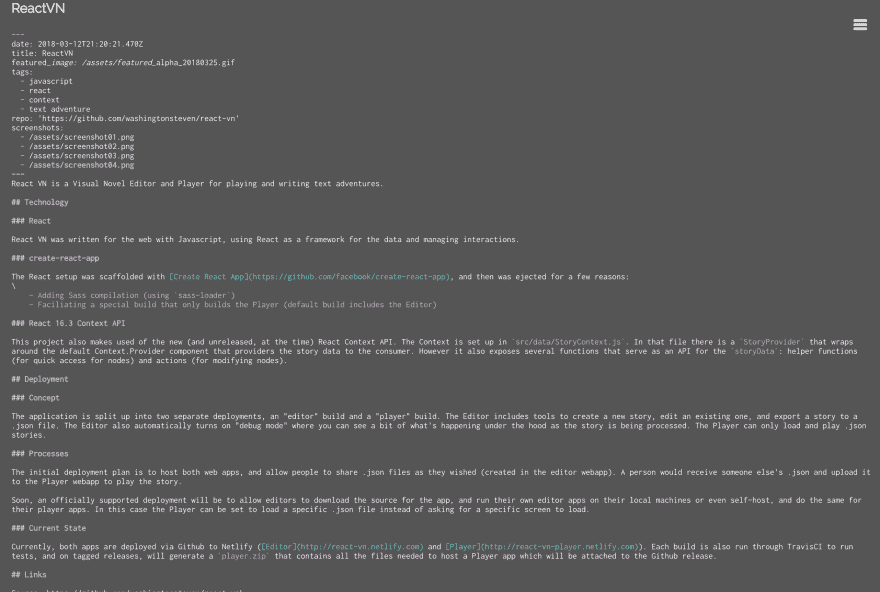

# 需求垫

> 原文：<https://dev.to/washingtonsteven/demandpad-3mal>

## 基本信息

[链接到应用程序](https://relaxed-torvalds-97ac55.netlify.com/)

[Github 回购](https://github.com/washingtonsteven/demandpad)

## 目标

这是一个个人项目，有一个个人目标:有一个快速打开和记录笔记的工具。

过去，我会用书签打开一个网址:

试试看！*它将打开一个空白网页，您可以在其中键入内容。这对于快速记笔记非常有用(就像便利贴一样)，几乎没有系统开销，不需要打开一个单独的程序，不需要找一支笔，等等。

<small>* *输入截图中的网址，遗憾的是我无法将这样的数据 URI 输入到这篇文章的正文中。在 Github 上查看[这个问题，似乎是防止 XSS 的问题。](https://github.com/thepracticaldev/dev.to/issues/2924)*</small>

然而，这种方法有一个主要的缺点，储蓄。一旦你关闭标签，笔记就永远消失了，就像扔掉便利贴一样。有时我会让这个标签页打开好几天，当我不小心把它关上时才感到绝望，或者一个过于急切的更新会重启我的电脑。我的解决方案是做一个和 dataURI 一样轻的 webapp，但是能够保存和加载以前的笔记。

## 保存/加载机制

从浏览器的`localStorage`保存/加载注释。该机制保存每次按键，将所有音符数据序列化为一个 JSON 字符串，并保存到本地存储(只能保存字符串)。

这种做法的一个很大的局限性是，笔记不会随身携带，所以我使用的任何新设备都会有自己的一套笔记。这也适用于同一台机器上不同的配置文件(至少在 Chrome 中)。我对我的个人(Google)和工作(GApps)账户使用不同的配置文件。这意味着音符不会“交叉授粉”，不管是好是坏。

## 删除备注

删除所有笔记相当容易，只需将 localStorage 键设置为空字符串。简单。

删除单个笔记要复杂一些，包括打乱一个数组，删除一个项目，并确保其余项目仍然有序。

删除单个笔记的另一个问题是确保用户真的*想要*删除它。这通常由某种确认消息来处理。[我有一个类似的反应机制](https://twitter.com/esaevian/status/975218196755173377)

这一次，我想尝试一些稍微不同的东西，灵感来自于我当时深陷其中的一个游戏:*命运 2* 。在那个游戏中，你可以通过按住一个按钮来删除物品。这时，酒吧开始满员。如果您松开按钮，条会复位，但如果您按住按钮直到条填满，则项目会被移除。这是一种有趣的互动方式来确认用户想要删除的项目，而不需要额外的拨号和额外的鼠标移动。

(他们还会通过改变条的颜色，多长时间删除一个东西来优先考虑各种项目！我可以更深入地了解它，但也许下次吧)。

基本上，我喜欢这种确认删除的交互，并在 React 中重新实现了它，使用`setTimeout`和`state`来更新驱动 CSS 属性`width`的值。出于性能原因，使用`transform:scale(x)`而不是`width`可能会更好，因为`width`会导致浏览器重新布局，这会影响性能和帧速率。现在有问题了。

[你可以在这里看到 DeleteButton 组件的底层代码](https://github.com/washingtonsteven/demandpad/blob/master/src/NoteList.js#L11)

## 流程

在这个个人项目中，我试图实现一个 Git 工作流，该工作流总是在一个单独的分支上创建特性更新，并发出一个 pull 请求，将更新和测试过的变更引入到`master`中。养成这种心流的习惯真是太好了。浏览 Github 并查看发布/提交/拉取请求历史记录，一眼就能看出某些更改发生在哪里，这也很酷。我仍然喜欢通过命令行执行 git 操作，特别是为了真正理解发生了什么，但是以这种方式使用 Github 是探索该服务所有集成特性的一种很好的方式。

此外，Netlify 将记录拉取请求，并在部署预览中自动构建它们。这使得在真实环境中测试变化变得非常好，因为来自`create-react-app`的本地服务器并不总是相同的。

## 底层技术

DemandPad 内置在 React 中。一切都在客户端，使用内置的浏览器 API。希望有一天我会更新这个来使用第三方认证服务(网络身份，有人知道吗？)这也允许将笔记保存在云中，以避免上面提到的保存问题。

在 Netlify 上主持，这是我最近把一个前端项目放到网上的首选。

## 截图

